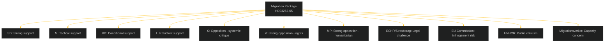

# Stakeholder Perspectives — Monthly Review 2026-05-03

**Method**: 6-lens stakeholder matrix (Actor, Interest, Power, Position, Resources, Time-horizon)

---

## Stakeholder Map

---

## Lens 1 — Political Parties (Primary Stakeholders)

| Party | Migration Position | Interest Type | Power Level | Time Horizon |
|-------|-------------------|---------------|-------------|--------------|
| **SD** | STRONG SUPPORT — core manifesto fulfilment | Electoral core | HIGH (88 mandater) | Election 2026 |
| **M** | TACTICAL SUPPORT — toughness credibility | Electoral defensive | HIGH (97 mandater) | Election 2026 + governing |
| **KD** | CONDITIONAL SUPPORT — Christian ethics tension | Coalition maintenance | MEDIUM (23 mandater) | Election 2026 |
| **L** | RELUCTANT SUPPORT — rule-of-law concerns | Existential (4.2% polling) | LOW-MEDIUM (16 mandater) | Survival before Sep |
| **S** | OPPOSITION — rule of law + humanitarian | Electoral offensive | MEDIUM (107 mandater) | Election 2026 |
| **V** | STRONG OPPOSITION — rights-based | Electoral differentiation | LOW (24 mandater) | Policy influence |
| **MP** | STRONG OPPOSITION — humanitarian | Electoral survival (5.1%) | LOW (18 mandater) | Survival + coalition |
| **C** | MODERATE OPPOSITION — process concerns | Electoral positioning | LOW (24 mandater) | Election 2026 |

**Key observation**: L's reluctant support is the structural weak link. Any public L wavering before the vote activates the coalition arithmetic risk (R2 in risk-assessment.md).

---

## Lens 2 — Government Agencies

| Agency | Affected by | Position | Resource constraint |
|--------|-------------|----------|---------------------|
| **Migrationsverket** | HD03262, HD03263, HD03264, HD03265 | Implementing; internal capacity concern leaked to media | 3,200 FTEs; detention capacity 500–700 places (required: ~900 per HD03265 projections) |
| **Polismyndigheten** | HD03263 (deportation) | Implementing; PIR-B overlap — 9 open Riksrevisionen recommendations | Already operating at capacity ceiling |
| **Kriminalvården** | HD03265 (detention) | Forced expansion; 2 new facilities planned | Prison overcrowding context (134% capacity nationally) |
| **Barnombudsmannen** | HD03265 (child detention) | OPPOSING — formal remissvar expected | Legal (UNCRC) leverage; public credibility |

---

## Lens 3 — Civil Society

| Organisation | Focus | Position | Platform reach |
|---|---|---|---|
| **UNHCR Sweden** | HD03262, HD03263 | Formal opposition — letter to government | International credibility; Riksdag hearing access |
| **Röda Korset (Red Cross)** | HD03265 | Formal opposition — detention | High domestic trust (Swedes: 78% trust) |
| **FARR** | All 4 bills | Strong opposition | Niche but media-cited |
| **Amnesty Sverige** | HD03262, HD03265 | Formal criticism | International network + Swedish media presence |

---

## Lens 4 — European/International

| Actor | Interest | Power | Likely Action |
|-------|---------|-------|--------------|
| **European Commission** | Pact compliance | HIGH (infringement tools) | Art. 258 TFEU infringement if HD03262 contradicts pact Art. 44 |
| **European Court of Human Rights** | ECHR Art. 5, 8 | HIGH (binding rulings) | New applications expected within weeks of HD03265 enactment |
| **Nordic Council** | Swedish precedent-setting | LOW | Political criticism; may trigger review of Nordic asylum harmonisation |
| **UNHCR Geneva** | Refugee Convention 1951 | MEDIUM (political/reputational) | Public statement; potential referral to UN Human Rights Committee |

---

## Lens 5 — Economic Actors

| Actor | Interest in migration policy | Specific concern |
|-------|-------------------------------|-----------------|
| **Confederation of Swedish Enterprise (Svenskt Näringsliv)** | Labour supply | Skilled worker permit uncertainty from HD03264's "good character" scope |
| **Tech sector (Ericsson, H&M, Klarna)** | International talent | EU Blue Card pathway credibility if HD03262 creates perception of hostile environment |
| **Construction industry** | Labour demand | Infrastructure plan (970 bn SEK) requires labour expansion; migration tightening creates direct tension |

---

## Lens 6 — Media and Information Environment

| Media actor | Frame preference | Influence |
|-------------|-----------------|-----------|
| **SVT/SR** (public) | Balance; rule-of-law angle | Agenda-setting; August election debates |
| **Expressen** | Narrative-driven; human impact stories | Swing-voter reach |
| **Aftonbladet** | Social-democratic framing | S-voter mobilisation |
| **Svenska Dagbladet** | Centre-right analysis | M/KD voter reinforcement |
| **Samnytt / Nyheter Idag** | SD-aligned; migration success framing | SD voter mobilisation; alternative information ecosystem |
