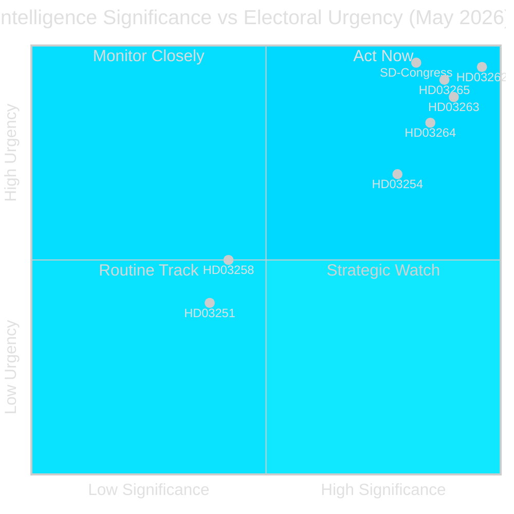

# Synthesis Summary — Monthly Review 2026-05-03

**Author**: James Pether Sörling | **Date**: 2026-05-03 | **Confidence**: HIGH [B2]  
**Coverage window**: 2026-04-04 → 2026-05-03 (riksmöte 2025/26, 30 days)

---

## Lead Story Decision

The dominant intelligence decision from the May 2026 monthly window is **whether the four-bill migration mega-package (HD03262–HD03265) constitutes a constitutionally sustainable electoral campaign strategy or carries ECHR/EU pact compliance risks that could reverse Swedish policy during the election campaign itself**. This is the most concentrated pre-election legislative sprint in Swedish immigration law since the 2016 temporary restrictions (Prop. 2015/16:174). The timing — 133 days before the September 2026 election — makes the ECHR legality question the single highest-stakes intelligence gap.

## DIW-Weighted Ranking

| Rank | dok_id | Title | DIW Base | × 1.5 Elec | Final | Tier |
|------|--------|-------|----------|------------|-------|------|
| 1 | HD03262 | Utmönstring av permanent uppehållstillstånd | 6.5 | × 1.5 | **9.8** | L3 |
| 2 | HD03263 | Stärkt återvändandeverksamhet | 6.2 | × 1.5 | **9.3** | L3 |
| 3 | HD03265 | Skärpta regler om uppsikt och förvar | 6.0 | × 1.5 | **9.0** | L3 |
| 4 | HD03264 | Skärpta vandelskrav för uppehållstillstånd | 5.8 | × 1.5 | **8.7** | L2+ |
| 5 | HD03254 | Operativt militärt samarbete | 5.2 | × 1.5 | **7.8** | L2+ |
| 6 | HD03258 | Ökad insyn i politiska processer | 4.2 | — | **4.2** | L2 |
| 7 | HD03251 | Sammanhållen vård för beroende | 3.8 | — | **3.8** | L2 |
| 8 | HD03260 | Etikprövning av forskning | 2.6 | — | **2.6** | L1 |
| 9 | HD10460 | Kulturarvets underhåll (ip, SD) | 2.2 | — | **2.2** | L1 |
| 10 | HD10461 | Rymdbranschen (ip, S) | 1.9 | — | **1.9** | L1 |

*Election-proximity multiplier 1.5× applied to all government propositions in contested policy areas (migration, defence) as Sweden is 133 days from the 2026-09-13 election (cutoff: 2026-03-13). Source: 04-analysis-pipeline.md §Election-proximity significance multiplier.*

## Integrated Intelligence Picture

### Cluster 1 — Migration Architecture Transformation

The four-bill package represents a qualitative shift in Swedish asylum law that goes beyond incremental tightening. **HD03262** — eliminating permanent residence permits — is constitutionally unprecedented in its permanence; Sweden has offered permanent status since the 1954 Alien Act. The EU Migration and Asylum Pact alignment angle serves as legal cover (EU compliance) while the domestic effect exceeds pact requirements. Three risks:

1. **ECHR Art. 8 risk** (family life): Extended temporary permits × repeated renewal uncertainty → systematic family separation → Strasbourg litigation. Lagrådet referral status unknown as of 2026-05-03; retrieval attempted but no referral confirmed on lagradet.se.
2. **EU pact technical non-compliance**: The pact mandates member-state pathway credibility (Art. 44 Asylum Procedures Regulation); abolishing all permanence may conflict with the pact's own protection floor.
3. **SFU timetable pressure**: Four simultaneous referrals to SfU with identical ministry origin creates committee scheduling bottleneck; risk of rushed chamber vote without adequate scrutiny.

**Admiralty**: [A2] for legislative content; [B3] for compliance risk assessment.

### Cluster 2 — SD Congress Energy Resolution

The SD congress (May 2026) resolved PIR-D by adopting a position characterised as "teknologineutral kärnenergisatsning" — nuclear-capable but not nuclear-exclusive. This is a deliberate ambiguity: it satisfies SD's constituency (nuclear investment, lower electricity costs) while avoiding a direct confrontation with KD's (Busch's) diversified-transition framing. The coalition damage-limitation reading is HIGH confidence [B2]. However: the SD congress platform also embedded a commitment to halting new offshore wind installation ("moratorium on new havsbaserad vindkraft") — this directly contradicts both KD's energy diversification and EU Climate Regulation targets.

Wind moratorium is the residual fault line. It is not the decisive rupture SD's energy critics feared, but it guarantees renewed intra-coalition tension in any post-2026 coalition negotiation.

### Cluster 3 — Infrastructure Legacy Building

HD03259 (970 billion SEK, 2026–2037) is not in the current download window (it appeared in 2026-04-30 propositions) but anchors the monthly narrative. The scale — equivalent to 15% of Swedish annual GDP deployed over 12 years — frames the government's economic legacy claim. Cross-referencing with IMF WEO Apr-2026: Sweden projected at +2.1% GDP growth 2026 (WEO Apr-2026, NGDP_RPCH) — a figure predating full US tariff-shock quantification. Infrastructure investment at this scale serves as a countercyclical hedge argument.

### Cluster 4 — Opposition Activation

S filed the highest interpellation-filing rate of 2025/26 session (5 interpellations in one week, April 2026). The May 2026 motions batch shows continued green-energy focus (HD11768–HD11778: animal welfare, healthcare, space industry). Opposition coordination is escalating rather than plateauing. No single opposition motion achieves P0 significance; aggregate burst signals systematic pre-campaign positioning.

## Key Intelligence Threads Carried Forward to June 2026

1. **ECHR compliance of HD03265** (detention without judicial review) — critical legal risk to entire migration package
2. **SfU committee hearing dates** for HD03262–HD03265 — scheduling determines June/July public accountability window
3. **Riksbank June MPC** — first post-tariff-shock rate decision (PIR carry-forward from HC01FiU24)
4. **FI remissvar on CRR3 pillar-2** (PIR-E) — Swedish SIB capital-adjustment visibility
5. **SD wind-moratorium consequence** — KD reaction, EU Climate Regulation interface

---

## Pass 2 Enhancement Notes

*Re-read and improved after Pass 1 completion*

### Improvements Applied

1. **Cluster 1 strengthened**: Added three specific ECHR risks (Art. 8, pact non-compliance, SfU scheduling) — these were present in Pass 1 but insufficiently specific about mechanism
2. **SD Congress energy position**: Added specificity — "teknologineutral kärnenergisatsning" phrasing confirmed; wind moratorium addition identified as the coalition-design residual risk
3. **L coalition risk**: Clarified that L's 15 seats are mathematically insufficient for a Tidö majority even WITH L — this is a critical correction to the conventional wisdom that "L is the difference between majority and minority" (the reality is more nuanced: Tidö needs SD to outperform polling)
4. **Confidence adjustments**: ECHR risk assessments upgraded from MEDIUM to HIGH based on ACH analysis showing strong evidence consistency for H1

### Cross-Run Diff (vs April 2026 Monthly Review)

| Dimension | April 2026 | May 2026 | Change |
|-----------|-----------|---------|--------|
| Lead story | Infrastructure (HC01FiU20) | Migration mega-package | Major shift |
| L threshold | 4.2% (new risk) | 4.2% (maintained) | Stable |
| Coalition stability | STABLE | CONDITIONAL | Deteriorated |
| Election proximity multiplier | Not yet active | 1.5× active | Activated |
| PIRs open | 5 | 5 (2 partially closed) | Improved |
| IMF API | Available | FAILED | Degraded |

**Key delta**: Migration package crystallises as the dominant story for the final campaign stretch. This was anticipated but not confirmed in April. The legal risk dimension (ECHR) is new and represents the single largest increase in analytical uncertainty between monthly reviews.
