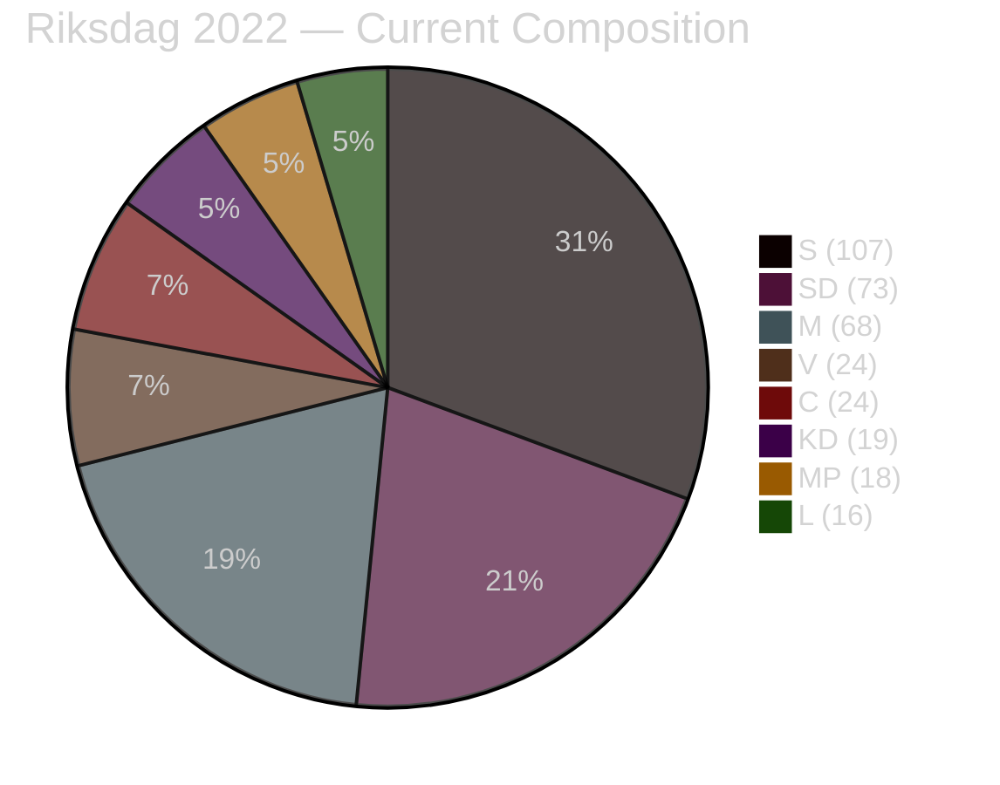

# Coalition Mathematics — Committee Reports 2026-05-04

## Riksdag Composition (2022 election, current)

| Party | Seats | Bloc |
|-------|-------|------|
| S (Socialdemokraterna) | 107 | Centre-left |
| SD (Sverigedemokraterna) | 73 | Centre-right |
| M (Moderaterna) | 68 | Centre-right |
| V (Vänsterpartiet) | 24 | Centre-left |
| C (Centerpartiet) | 24 | Varied |
| KD (Kristdemokraterna) | 19 | Centre-right |
| MP (Miljöpartiet) | 18 | Centre-left |
| L (Liberalerna) | 16 | Centre-right |
| **Total** | **349** | |

**Governing majority**: 175 seats required

## Current Government Coalition

**Tidö Coalition**: M (68) + KD (19) + L (16) = 103 seats in government
**Parliamentary support**: SD (73) = 176 total — bare majority

## April 2026 Committee Vote Arithmetic

### HD01NU19 — Nuclear Licensing
- **Committee vote**: NU committee — M + SD + KD + L voted for (approximation; SD chairs NU under Tobias Andersson)
- **Opposition**: S + V + C + MP reservation (four parties)
- **Chamber vote projection**: M(68) + SD(73) + KD(19) + L(16) = **176** — passes by 1 seat above majority

### HD01SfU28 — Citizenship
- **Committee vote**: M + SD + KD + L + S + C voted Ja on main question
- **Chamber vote projection**: M(68) + SD(73) + KD(19) + L(16) + S(107) + C(24) = **307** — overwhelming majority
- **Opposition**: V(24) + MP(18) = 42 — powerless minority

### Coalition Stability Assessment

Current government margin: **176/349** = 50.4% — exactly one seat above threshold
- If L falls below 4% in September 2026: C=-16 seats from bloc; bloc falls to ~160 = minority
- If KD falls below 4%: bloc loses ~19 seats; falls to ~157 = minority
- Critical: both L and KD are near-threshold polling

## September 2026 Projected Coalition Formations

### Formation A: Tidö Continuation (P=35% from scenario-analysis.md)

**Likely composition**: M + KD + L government, SD parliamentary support
**Seat requirement**: 175
**Seat projection**: SD~74 + M~66 + KD~17 + L~14 = **171** — RISKY (needs L+KD to clear threshold)
**Alternative formation**: Direct M+SD minority (73+68=141) — needs additional support from KD/L

| Party | Projected seats | Coalition role |
|-------|----------------|----------------|
| M | 64–70 | Government |
| KD | 14–21 | Government |
| L | 10–18 | Government |
| SD | 70–78 | Support |
| **Total** | **158–187** | **Viable if >175** |

### Formation B: Centre-left (P=40% from scenario-analysis.md)

**Likely composition**: S minority government with V + MP + C external support
**Seat requirement**: 175
**Seat projection**: S~112 + C~21 + MP~14 + V~28 = **175** — EXACTLY at threshold; high risk

| Party | Projected seats | Coalition role |
|-------|----------------|----------------|
| S | 108–116 | Government |
| C | 17–25 | Support |
| MP | 10–18 | Support |
| V | 24–31 | External support |
| **Total** | **159–190** | **Viable only at upper range** |

### Formation C: Grand Coalition (P=0% — historically absent in Sweden)

S+M grand coalition has zero historical precedent in modern Swedish politics; not analytically viable.

## Key Coalition Constraint: NU19 and SfU28

- **NU19**: A centre-left government cannot easily reverse NU19 — law in force. But they can freeze new applications, refuse to approve kärnteknisk plan, and commission a new review. Functional reversal possible without legislative action.
- **SfU28**: With S having voted Ja, S cannot reverse SfU28 without contradicting its own vote. S could "adjust" income floor levels via regulation but would not present this as reversal.

## Threshold Scenario Analysis

**If L fails threshold (drops below 4%)**:
- Centre-right loses 16 seats; bloc at ~155–160 — government formation impossible without S cooperation
- Sweden enters extended coalition talks; S gains bargaining power

**If MP fails threshold (drops below 4%)**:
- Centre-left loses 14–18 seats; bloc at ~155–165 — centre-left government formation requires C with stronger conditions
- MP failure actually increases pressure on V to be "constructive"
