# Cross-Reference Map — Committee Reports 2026-05-04

## Policy Cluster Analysis

### Cluster 1: Energy/Climate/Environment
- **HD01NU19** — Nuclear licensing new law (Prop 2025/26:171) → enables new nuclear applications
- Links to: EU Taxonomy Regulation (nuclear labelled sustainable in EU supplementary acts); Energimyndigheten energy plan; Government's "elektrifieringsplan"
- Cross-links: HD01KU36 (surveillance/oversight of energy infrastructure)

### Cluster 2: Integration/Migration/Citizenship
- **HD01SfU28** — Citizenship tightening (Prop 2025/26:175) → 8-year residency, income floor, language test
- Links to: Prop 2024/25:xxxx (migration restrictions already passed); Migrationsverkets regleringsbrev 2025/26; Nordic model comparisons (Denmark 9yr, Norway 7yr)
- Cross-links: HD01JuU9 (court processing of migration appeals)

### Cluster 3: Security/Defence/NATO
- **HD01FöU14** — Military cooperation improvements
- **HD01FöU20** — Critical infrastructure resilience (CER/NIS2)
- Links to: NATO Article 3 national resilience obligations; EU CER Directive 2022/2557; NIS2 Directive transposition; Sweden's Totalförsvar (total defence) framework
- Cross-links: HD01KU36 (surveillance technology in security context)

### Cluster 4: Justice/Courts/Rule of Law
- **HD01JuU9** — Court process reform (Prop 2025/26:155) → early interviews, removing tilltrosbestämmelserna
- Links to: "Tioårsprogrammet mot kriminalitet" (10-year crime programme); previous JuU reforms on gang crime 2023–2025; Europol joint operations
- Cross-links: HD01SfU28 (court processing of citizenship appeals), HD01KU36 (judicial oversight)

### Cluster 5: Constitutional/Oversight
- **HD01KU36** — Integrity and new technology 2020–2024 (KU scrutiny report)
- Links to: Riksdagens granskningskommitté; ICCPR/ECHR obligations; Datainspektionen (IMY) reports; FRA signals intelligence oversight
- Cross-links: All legislative clusters (constitutional oversight function)

## Cross-Committee Dependencies

```mermaid
%%{init: {"theme": "dark"}}%%
graph TD
    A[HD01NU19<br>NU — Nuclear Licensing] -->|"Energy sovereignty<br>narrative"| B[Election 2026<br>Campaign Issues]
    C[HD01SfU28<br>SfU — Citizenship] -->|"Integration<br>narrative"| B
    D[HD01JuU9<br>JuU — Court Reform] -->|"Law & order<br>narrative"| B
    E[HD01FöU14<br>FöU — Military Coop] -->|"National security<br>narrative"| B
    F[HD01FöU20<br>FöU — Critical Infra] -->|"Resilience<br>narrative"| B
    G[HD01KU36<br>KU — Oversight] -->|"Democratic<br>oversight"| H[Parliamentary<br>Accountability]
    
    A -->|"Requires SSM<br>implementation"| I[State Agency<br>Readiness]
    C -->|"Requires Migrationsverket<br>capacity"| I
    E -->|"Requires Försvarsmakten<br>agreements"| I
    F -->|"Requires MSB<br>supervision"| I

    style A fill:#ff006e,stroke:#ff006e
    style C fill:#ff8c00,stroke:#ff8c00
    style B fill:#1a3a5c,stroke:#00d9ff
```

## Temporal Cross-Reference

| Date | Event | Connected documents |
|------|-------|---------------------|
| 2026-04-28 | SfU28 betänkande published | HD01SfU28 |
| 2026-04-29 | NU19, JuU9, KU36 published | HD01NU19, HD01JuU9, HD01KU36 |
| 2026-05 (est.) | Riksdag chamber vote | All betänkanden from this cycle |
| 2026-06-06 | SfU28 enters force | HD01SfU28 |
| 2026-06-17 | NU19 enters force | HD01NU19 |
| 2026-07-01 | JuU9 enters force | HD01JuU9 |
| 2026-09-13 (est.) | General election | All: election campaign context |
