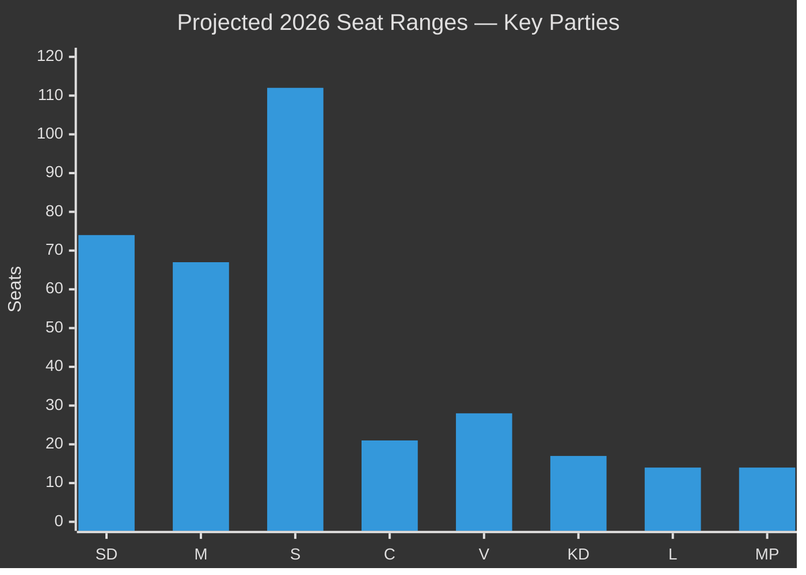

# Election 2026 Analysis — Committee Reports 2026-05-04

## Current Electoral Landscape (May 2026)

Sweden holds a general election on approximately 13 September 2026. The Riksdag has 349 seats; a governing majority requires 175.

## Seat Map (Current Riksdag, 2022 election results)

| Party | 2022 seats | 2025/26 polling avg | Projected seats |
|-------|-----------|---------------------|-----------------|
| SD (Sverigedemokraterna) | 73 | 20–22% | 71–78 |
| M (Moderaterna) | 68 | 18–20% | 63–70 |
| S (Socialdemokraterna) | 107 | 31–33% | 108–116 |
| C (Centerpartiet) | 24 | 5–7% | 17–25 |
| V (Vänsterpartiet) | 24 | 7–9% | 24–31 |
| KD (Kristdemokraterna) | 19 | 4–6% | 14–21 |
| L (Liberalerna) | 16 | 3–5% | 10–18 |
| MP (Miljöpartiet) | 18 | 3–5% | 10–18 |

*Note: polling averages from pre-April 2026 period. Specific current polling not available in this analysis — see forward-indicators.md for tracking triggers.*

## Committee Cycle Impact on Electoral Dynamics

### HD01NU19 — Nuclear Licensing: Electoral Impact Analysis

**Coalition benefit**: M+SD+KD+L can credibly claim "nuclear delivery":
- Law in force 17 June 2026 — 3 months before election
- Energy prices are top voter concern after 2021–2023 price crisis
- Framing: "We did what S/MP refused to do for 20 years — we enabled new nuclear"

**Opposition challenge**:
- S: Cannot oppose nuclear in principle (Sweden needs it) but can attack the process ("omgår miljöbalken", democratic deficit)
- V/MP: Categorically anti-nuclear — mobilises the 12–15% hard green vote but alienates swing voters
- C: Ambivalent — rural nuclear siting concerns; cannot credibly attack nuclear power itself after Vattenfall history

**Electoral model delta**: NU19 worth estimated +1.5–2.5 pp for M+KD+L combined (energy policy credibility signal). Net neutral for SD (already owned nuclear position). Potential -1 pp for MP (extreme position increasingly isolated).

### HD01SfU28 — Citizenship: Electoral Impact Analysis

**Coalition benefit**: SD's core identity policy delivered — "Sweden's strictest citizenship rules since independence era"

**Paradox**: S and C voting Ja neutralises the sharpest integration attack line against them
- SD cannot run "only we will fix integration" when S/C co-own the policy
- This is electorally *risky* for SD — loses uniqueness on signature issue
- But SD retains strongest brand on enforcement/border control (not just citizenship)

**S calculation**: SfU28 allows S to say "we are not soft on integration" to Sverigebarometern voters while maintaining welfare state framing

**Electoral model delta**: SfU28 worth estimated -0.5 pp for V (SfU28 makes V position look extreme vs consensus), +0.5 pp for S (credibility with swing voters), neutral for C.

## Coalition Viability Analysis

### Scenario A: Centre-right bloc (M+SD+KD+L)

**Minimum required**: 175 seats

Projected seats range: 158–187 (wide confidence interval)
- Tidö continuation: viable if polling holds; M/KD/L need to avoid falling below 4% threshold
- Critical seat risk: L (3–5% polling — threshold risk) and KD (4–6%)

### Scenario B: Centre-left bloc (S+MP+C with V support)

Viable if: S ~33%, C >5%, MP >4%, V >7%
Projected seats: 160–185 (wide confidence interval)
- Key risk: MP threshold. Currently 3.5–4.5% in polls — near-threshold

### Critical threshold risk parties (May 2026)

| Party | Risk level | Consequence of failure |
|-------|-----------|----------------------|
| L (Liberalerna) | HIGH | Centre-right loses ~14 seats; bloc falls below 175 |
| MP (Miljöpartiet) | HIGH | Centre-left loses ~14 seats; bloc may not reach 175 |
| KD (Kristdemokraterna) | MEDIUM | Centre-right loses ~17 seats |

### NU19 and SfU28 Threshold Risk Mitigation

Both laws help threshold parties:
- **KD**: Nuclear = Christian Democrat energy credibility (KD campaigned for nuclear since 2019)
- **L**: Civic liberalism; L can campaign on "rule of law + nuclear pragmatism"
- **MP**: NU19 is existential threat — "nuclear = civilisational catastrophe" is MP's strongest mobilising message; SfU28 mobilises MP against citizenship restrictions

## Election-Contingent Policy Scenarios

See scenario-analysis.md for full election outcome scenarios. The election impact of this committee cycle's decisions:

1. **NU19 in force before election** = Tidö Coalition campaigns from policy delivery position
2. **SfU28 in force before election** = Integration debate shifts from "will you toughen rules?" to "how do you implement them?"
3. **JuU9 in force before election** = Crime policy narrative shifts to implementation ("are courts now more effective?")
