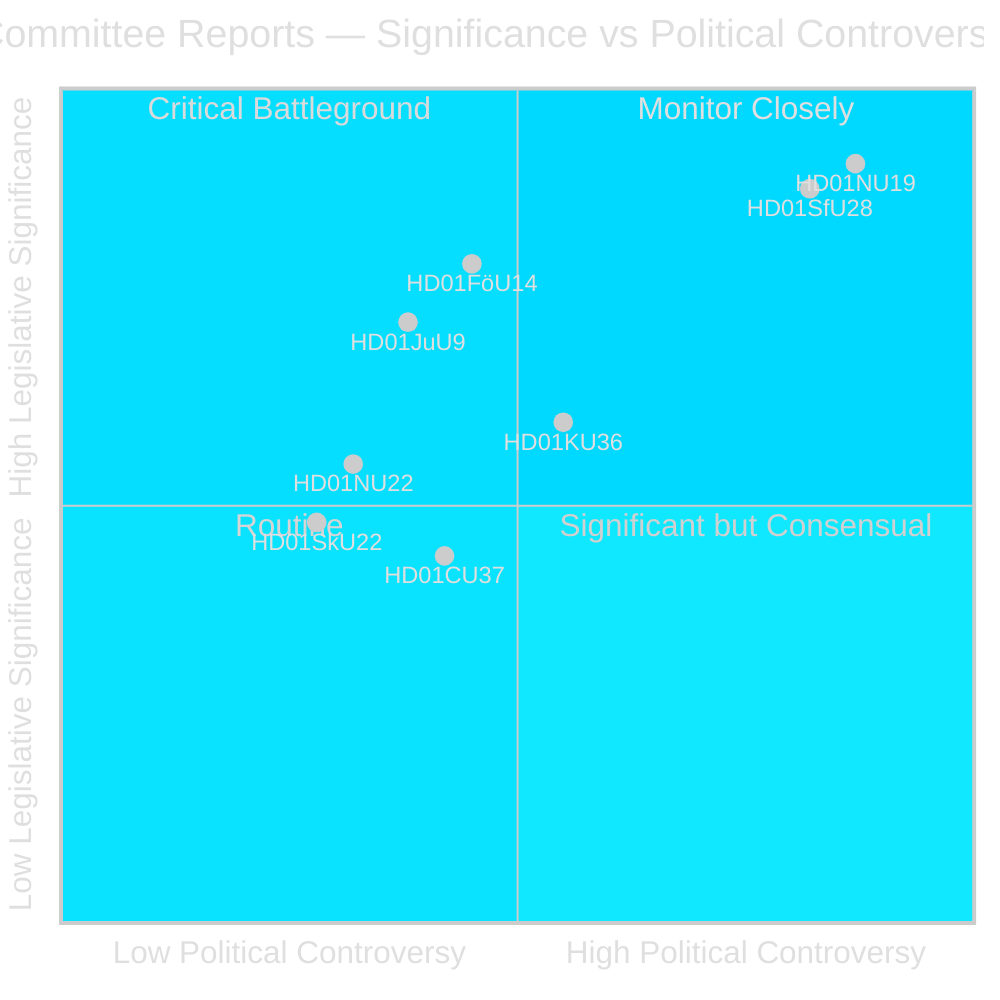
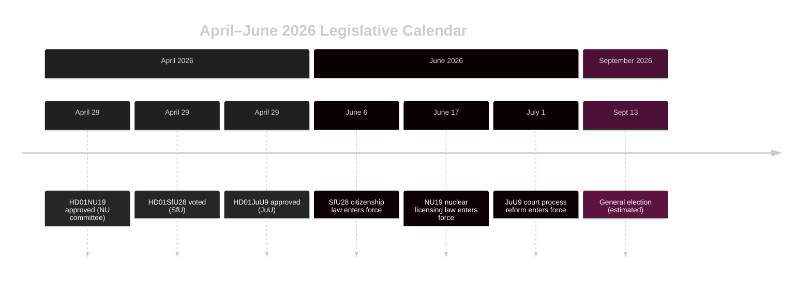

# Swedish Riksdag Advances Nuclear Licensing Reform and Citizenship Tightening

## BLUF

The Riksdag's committee phase of riksmöte 2025/26 delivers two politically seismic betänkanden in the final week of April 2026: the Enterprise Committee (NU) approves a new law enabling direct government licensing of nuclear installations (HD01NU19), and the Social Insurance Committee (SfU) greenlights sharply tightened citizenship criteria including an 8-year residency requirement, language testing, and income floors (HD01SfU28). Both measures define the Tidö Coalition's pre-election policy legacy and will enter force before the September 2026 election, dramatically reshaping Sweden's energy and integration landscape and the electoral debate.

## Decisions This Brief Supports

1. **Editorial judgment**: Lead with NU19 nuclear licensing and SfU28 citizenship as the dual defining legislative events of the April 2026 committee cycle; contextualise within the September 2026 election campaign.
2. **Coalition analysis**: Assess whether SfU28's cross-party S/C/M/SD support signals a permanent centre-right shift on integration policy or a tactical accommodation before the election.
3. **Policy tracking**: Monitor Migrationsverket and SSM implementation readiness for the June 6 and June 17, 2026 entry-into-force dates.
4. **Intelligence assessment**: Evaluate risk of legal challenges to nuclear licensing bypassing standard miljöbalken procedures and whether constitutional review concerns will materialise.

## 60-Second Read

- 🔵 **Nuclear licensing** (HD01NU19): New law (Prop 2025/26:171) lets nuclear developers apply directly to the government for approval, bypassing the standard miljöbalken Chapter 17 process. Lagrådet reviewed and was followed. Takes effect 17 June 2026. Opposition (S, V, C, MP) issued two formal reservations. **Election significance: HIGH** — nuclear is the defining energy policy cleavage of 2026.
- 🔴 **Citizenship tightening** (HD01SfU28): Prop 2025/26:175 raises residency requirement from 5 to 8 years, adds language and civics test, introduces income floor (≥3 inkomstbasbelopp), tightens conduct standards. Cross-party vote: M, SD, KD, L + S and C voted Ja. V and MP strongly opposed, with 10 reservations. Takes effect 6 June 2026 (language test component deferred to October 2027 or earlier). **Election significance: HIGH** — integration has been the dominant voter salience issue since 2022.
- 🟡 **Court process reform** (HD01JuU9): Prop 2025/26:155 expands admissibility of early interview recordings and removes tilltrosbestämmelserna in appeals courts. One V reservation. Takes effect 1 July 2026. Strengthens gang-crime prosecutions.
- 🔵 **Military cooperation** (HD01FöU14): Committee approved improved conditions for operational military cooperation. Not yet published — high strategic significance in NATO context.
- ⚪ **Critical infrastructure** (HD01FöU20): New law for CER/NIS2 resilience at critical operators planned; betänkande scheduled for publication June 2026.

## Top Forward Trigger

**Monitor**: If NU19 nuclear licensing law generates constitutional complaint or Supreme Administrative Court referral before July 2026, the entire nuclear expansion programme faces delay into next parliamentary term. Watch for V or MP applications to Lagrådet or HD/HFD for guidance.

## Confidence Assessment

**Confidence: HIGH** — All three published betänkanden contain full text and clear committee positions. Voting data for SfU28 confirmed. DIW significance scoring rests on primary source evidence (dok_id, committee records, Lagrådet references).

## Pass-2 Additions: Key Named Actors

| Actor | Role | Action/Position |
|-------|------|----------------|
| Tobias Andersson (SD) | NU Committee Chair | Chaired HD01NU19 approval — SD's most significant energy policy victory |
| Viktor Wärnick (M) | SfU Committee Chair | Presided over HD01SfU28 cross-party vote |
| Kenneth G Forslund (S) | SfU member | S spokesperson who voted Ja on SfU28 — confirms S strategic pivot |
| Julia Kronlid (SD) | SfU member | SD representative confirming SD-S alignment on citizenship |
| Kerstin Lundgren (C) | SfU member | C representative — voted Ja, breaking with traditional liberal immigration stance |
| Gudrun Nordborg (V) | JuU member | Sole dissenter on JuU9 — ECHR fair trial reservation |
| SSM (Strålsäkerhetsmyndigheten) | Nuclear regulator | Must issue kärnteknisk plan regulations by Q3 2026 for NU19 to function |
| Migrationsverket | Migration agency | Must implement SfU28 income/residency verification by 6 June 2026 |

## Key Dates Crystallised

- **6 June 2026**: SfU28 citizenship tightening enters force — days before Riksdag summer recess
- **17 June 2026**: NU19 nuclear licensing law enters force — Sweden's most significant energy law in 30 years
- **1 July 2026**: JuU9 court process reform enters force
- **~13 September 2026**: General election — all three laws form election backdrop
