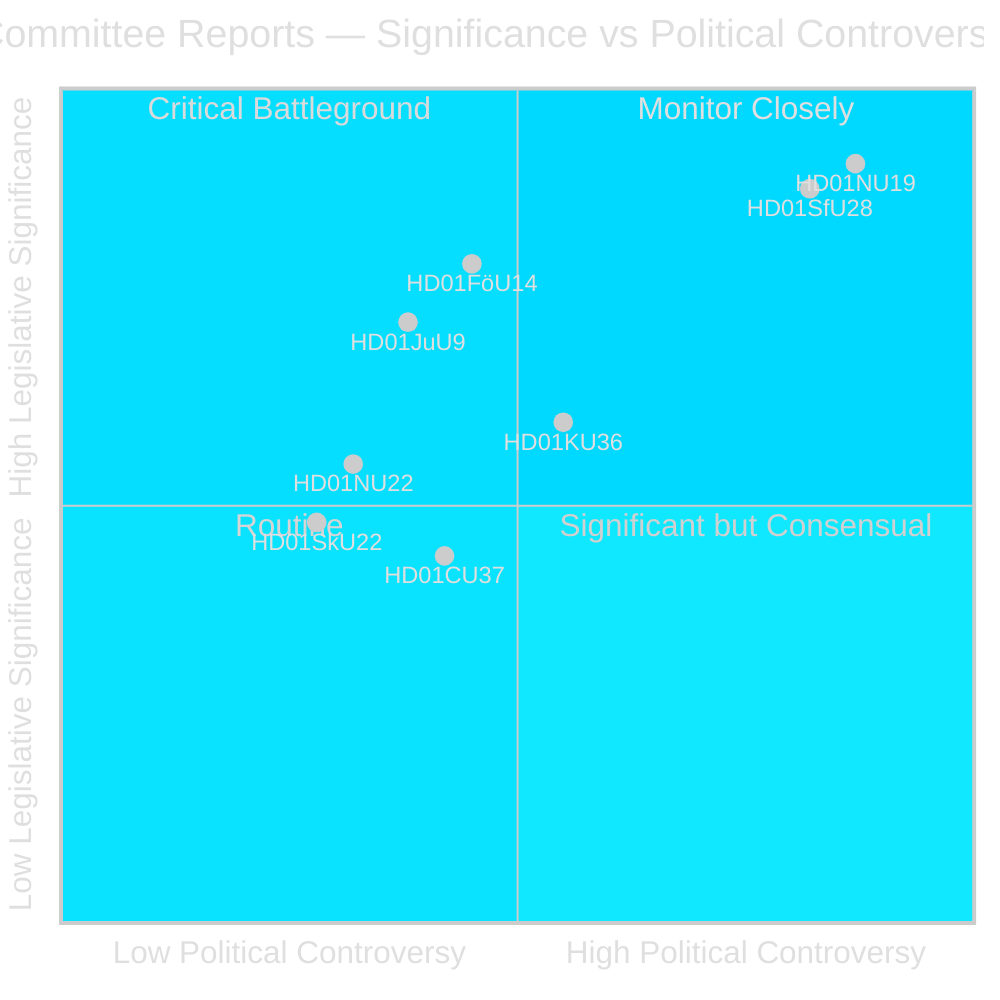
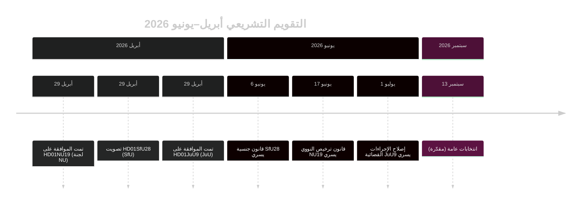

# البرلمان السويدي يُقدّم إصلاح ترخيص الطاقة النووية وتشديد الجنسية

## الخلاصة

تُقدّم مرحلة اللجان في Riksdag خلال دورة riksmötet 2025/26 تقريرَين يهزّان المشهد السياسي في الأسبوع الأخير من أبريل 2026: تُوافق لجنة الأعمال (NU) على قانون جديد يُتيح الترخيص الحكومي المباشر لمنشآت الطاقة النووية (HD01NU19)، وتُقرّ لجنة التأمين الاجتماعي (SfU) معايير جنسيةً مشدَّدةً تشمل متطلب إقامة مدته 8 سنوات واختبار لغوي وحدًّا أدنى للدخل (HD01SfU28). يُحدِّد كلا الإجراءين إرث تحالف Tidö ويدخلان حيز التنفيذ قبل انتخابات سبتمبر 2026.

## القرارات السياسية التي يدعمها هذا الموجز

1. **الحكم التحريري**: التصدير بترخيص HD01NU19 النووي وجنسية HD01SfU28 بوصفهما الحدثين التشريعيين المحوريين لدورة لجان أبريل 2026.
2. **تحليل الائتلاف**: تقييم ما إذا كان دعم SfU28 بين أحزاب S/C/M/SD يُشير إلى تحول دائم نحو وسط اليمين في سياسة الاندماج.
3. **تتبع السياسات**: رصد استعداد Migrationsverket وSSM لتطبيق القانونين في تواريخ نفاذهما 6 و17 يونيو 2026.
4. **التقييم الاستخباراتي**: تقييم مخاطر الطعون القانونية في ترخيص الطاقة النووية الذي يتجاوز الإجراءات البيئية المعيارية.

## قراءة في 60 ثانية

- 🔵 **ترخيص الطاقة النووية** (HD01NU19): قانون جديد (Prop 2025/26:171) يُتيح لمطوّري الطاقة النووية التقدم مباشرةً للحكومة للحصول على الموافقة، متجاوزًا إجراءات الفصل السابع عشر من القانون البيئي المعياري. راجع Lagrådet وتبعته الحكومة. يسري اعتبارًا من 17 يونيو 2026. قدّمت المعارضة (S, V, C, MP) تحفظين رسميين. **الأهمية الانتخابية: عالية** — الطاقة النووية هي محور الانقسام السياسي الطاقوي في 2026.
- 🔴 **تشديد الجنسية** (HD01SfU28): ترفع Prop 2025/26:175 متطلب الإقامة من 5 إلى 8 سنوات، وتُضيف اختبار اللغة والمدنيات، وتُدخل حدًّا أدنى للدخل (≥3 inkomstbasbelopp)، وتُشدّد معايير السلوك. تصويت متعدد الأحزاب: M وSD وKD وL + S وC صوّتوا بنعم. عارض V وMP بشدة مع 10 تحفظات. يسري اعتبارًا من 6 يونيو 2026. **الأهمية الانتخابية: عالية** — يُعدّ الاندماج القضيةَ الأبرز لدى الناخبين منذ 2022.
- 🟡 **إصلاح الإجراءات القضائية** (HD01JuU9): تُوسّع Prop 2025/26:155 قبول تسجيلات المقابلات المبكرة. يسري اعتبارًا من 1 يوليو 2026. يُعزّز ملاحقات جرائم العصابات.
- 🔵 **التعاون العسكري** (HD01FöU14): وافقت اللجنة على شروط محسّنة للتعاون العسكري التشغيلي. أهمية استراتيجية عالية في سياق الناتو.
- ⚪ **البنية التحتية الحيوية** (HD01FöU20): قانون جديد لمرونة CER/NIS2 مخطط؛ التقرير مقرر في يونيو 2026.

## المحفّز الاستشرافي الرئيسي

**راقب**: إذا أفضى قانون ترخيص الطاقة النووية NU19 إلى شكوى دستورية أو إحالة لمحكمة إدارية قبل يوليو 2026، فقد يتأخر برنامج توسيع الطاقة النووية بأكمله.

## تقييم الثقة

**الثقة: عالية** — جميع التقارير الثلاثة المنشورة تحتوي على النص الكامل ومواقف اللجان بوضوح.

## الجهات الفاعلة الرئيسية

| الجهة الفاعلة | الدور | الإجراء/الموقف |
|---------------|-------|----------------|
| Tobias Andersson (SD) | رئيس لجنة NU | ترأّس الموافقة على HD01NU19 — أكبر انتصار طاقوي لـ SD |
| Viktor Wärnick (M) | رئيس لجنة SfU | ترأّس التصويت متعدد الأحزاب HD01SfU28 |
| Kenneth G Forslund (S) | عضو SfU | المتحدث باسم S صوّت بنعم على SfU28 — يُؤكّد التحوّل الاستراتيجي لـ S |
| Julia Kronlid (SD) | عضو SfU | ممثلة SD تُؤكّد التوافق بين SD وS في الجنسية |
| Kerstin Lundgren (C) | عضو SfU | ممثلة C — صوّتت بنعم، كاسرةً الموقف الليبرالي التقليدي للهجرة |
| Gudrun Nordborg (V) | عضو JuU | المتحفّظة الوحيدة على JuU9 — تحفّظ محاكمة عادلة وفق ECHR |
| SSM (Strålsäkerhetsmyndigheten) | المنظّم النووي | يجب إصدار لوائح الخطة النووية بحلول Q3 2026 كي يعمل NU19 |
| Migrationsverket | هيئة الهجرة | يجب تطبيق التحقق من الدخل/الإقامة لـ SfU28 قبل 6 يونيو 2026 |

## التواريخ الرئيسية

- **6 يونيو 2026**: تشديد جنسية SfU28 يدخل حيز التنفيذ
- **17 يونيو 2026**: قانون ترخيص النووي NU19 يسري — أهم قانون طاقة سويدي منذ 30 عامًا
- **1 يوليو 2026**: إصلاح الإجراءات القضائية JuU9 يسري
- **~13 سبتمبر 2026**: انتخابات عامة

<!-- source-sha: 69fae8c5b56fa37d6a281e5e15d5acb956d405aa -->

