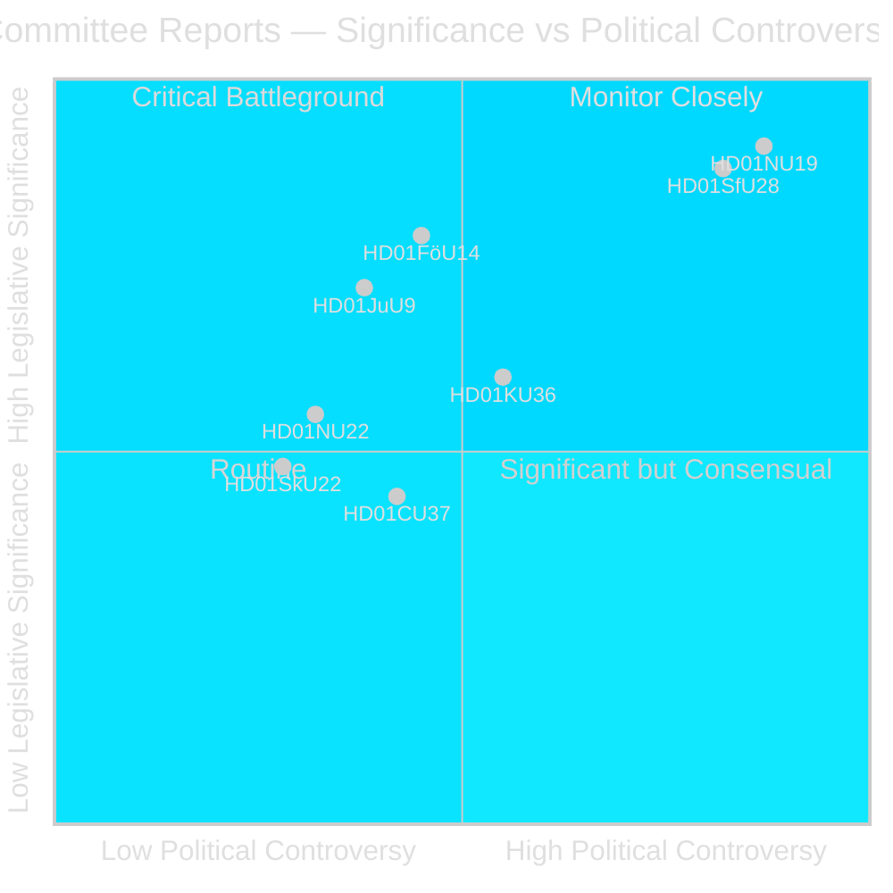
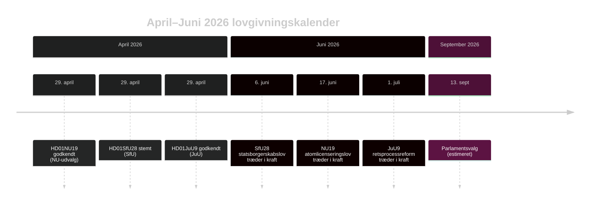

# Folketing godkender atomlicensreform og stramning af statsborgerskab

## Sammenfatning

Riksdagens udvalgsfase i riksmötet 2025/26 leverer to politisk jordrystende betænkninger i den sidste uge af april 2026: Erhvervsudvalget (NU) godkender en ny lov, der muliggør direkte regeringstilladelse til kernekraftinstallationer (HD01NU19), og Socialforsikringsudvalget (SfU) godkender kraftigt skærpede statsborgerskabskriterier inklusiv et 8-årigt bopælskrav, sprogtest og indkomstgrænse (HD01SfU28). Begge foranstaltninger definerer Tidö-koalitionens arvs inden valet og træder i kraft inden valget i september 2026.

## Politiske afgørelser dette briefing understøtter

1. **Redaktionel vurdering**: Led med NU19 kernekraftslicensering og SfU28 statsborgerskab som de to definerende lovgivningshændelser i april 2026-udvalgsperioden.
2. **Koalitionsanalyse**: Vurder om SfU28's tværpartistøtte S/C/M/SD signalerer en permanent center-højreforskydning i integrationspolitikken.
3. **Politisk sporbarhed**: Overvåg Migrationsverkets og SSM's implementeringsberedskab for ikrafttrædelsesdatoerne 6. juni og 17. juni 2026.
4. **Efterretningsvurdering**: Evaluer risikoen for juridiske udfordringer mod atomlicensering, der omgår standardmiljøprocedurer.

## 60-sekunders læsning

- 🔵 **Atomlicensering** (HD01NU19): Ny lov (Prop 2025/26:171) lader kerneenergiudviklere ansøge direkte til regeringen om godkendelse, omgår standardmæssig miljøbalken kap. 17-proces. Lagrådet gennemgik og blev fulgt. Træder i kraft 17. juni 2026. Oppositionen (S, V, C, MP) afgav to formelle reservationer. **Valgbetydning: HØJ** — kernekraft er den definerende energipolitiske skillelinje i 2026.
- 🔴 **Statsborgerskabsstramning** (HD01SfU28): Prop 2025/26:175 hæver bopælskravet fra 5 til 8 år, tilføjer sprog- og samfundstest, indfører indkomstgulv (≥3 inkomstbasbelopp), stramme adfærdsstandarder. Tværpartiafstemning: M, SD, KD, L + S og C stemte Ja. V og MP var stærkt imod med 10 reservationer. Træder i kraft 6. juni 2026 (sprogtestkomponenten udsat til oktober 2027). **Valgbetydning: HØJ** — integration har været det dominerende vælgerspørgsmål siden 2022.
- 🟡 **Retsproces reform** (HD01JuU9): Prop 2025/26:155 udvider tilladelsen af tidlige afhørsoptagelser. Træder i kraft 1. juli 2026. Styrker bandeforbrydelsesretsforfølgninger.
- 🔵 **Militært samarbejde** (HD01FöU14): Udvalget godkendte forbedrede vilkår for operativt militært samarbejde. Høj strategisk betydning i NATO-kontekst.
- ⚪ **Kritisk infrastruktur** (HD01FöU20): Ny lov for CER/NIS2-resiliens planlagt; betænkning planlagt til juni 2026.

## Vigtigste fremadrettede udløser

**Overvåg**: Hvis NU19's atomlicenseringslov genererer forfatningsklage eller forvaltningsdomstolshenvisning inden juli 2026, risikerer hele kernekraftudvidelsesprogrammet forsinkelse.

## Tillidsgrad

**Tillid: HØJ** — Alle tre publicerede betænkninger indeholder fuldtekst og klare udvalgsstillinger.

## Nøgleaktører

| Aktør | Rolle | Handling/Holdning |
|-------|-------|-------------------|
| Tobias Andersson (SD) | NU-udvalgsformand | Ledede HD01NU19-godkendelse — SD's vigtigste energipolitiske sejr |
| Viktor Wärnick (M) | SfU-udvalgsformand | Forsad over HD01SfU28 tværpartiafstemning |
| Kenneth G Forslund (S) | SfU-udvalgsmedlem | S-ordfører der stemte Ja på SfU28 — bekræfter S strategisk drejning |
| Julia Kronlid (SD) | SfU-udvalgsmedlem | SD-repræsentant der bekræfter SD-S-alignment på statsborgerskab |
| Kerstin Lundgren (C) | SfU-udvalgsmedlem | C-repræsentant — stemte Ja, bryder med traditionel liberal immigrationsholdning |
| Gudrun Nordborg (V) | JuU-udvalgsmedlem | Eneste reservant til JuU9 — EMRK retfærdig rettergang-reservation |
| SSM (Strålsäkerhetsmyndigheten) | Atomregulator | Skal udstede kärnteknisk plan-regler senest Q3 2026 for at NU19 fungerer |
| Migrationsverket | Migrationsagentur | Skal implementere SfU28 indkomst/bopælsverifikation inden 6. juni 2026 |

## Nøgledatoer

- **6. juni 2026**: SfU28 statsborgerskabsstramning træder i kraft
- **17. juni 2026**: NU19 atomlicenseringslov træder i kraft — Sveriges vigtigste energilov i 30 år
- **1. juli 2026**: JuU9 retsprocessreform træder i kraft
- **~13. september 2026**: Parlamentsvalg

<!-- source-sha: 69fae8c5b56fa37d6a281e5e15d5acb956d405aa -->
