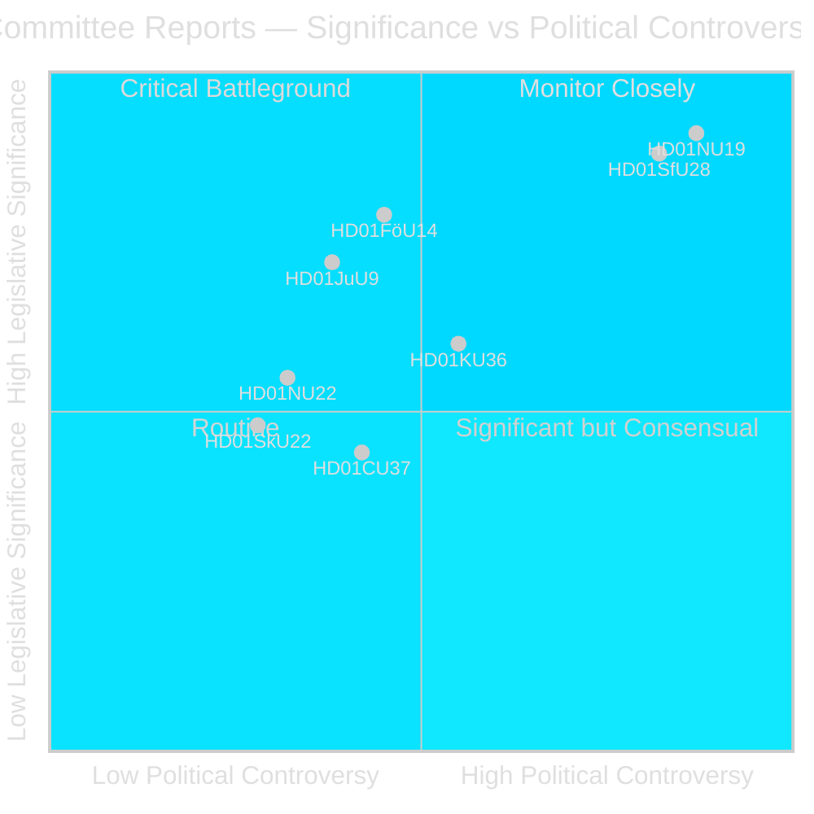
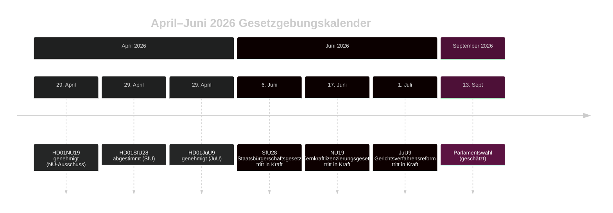

# Schwedischer Reichstag beschleunigt Kernkraftlizenzreform und Staatsbürgerschaftsverschärfung

## Zusammenfassung

Die Ausschussphase des Riksdag im Riksmöte 2025/26 liefert zwei politisch erschütternde Betänkanden in der letzten Aprilwoche 2026: Der Wirtschaftsausschuss (NU) genehmigt ein neues Gesetz zur direkten Regierungsgenehmigung von Kernkraftanlagen (HD01NU19), und der Sozialversicherungsausschuss (SfU) genehmigt stark verschärfte Staatsbürgerschaftskriterien einschließlich eines 8-jährigen Wohnsitzerfordernisses, Sprachprüfung und Einkommensgrenze (HD01SfU28). Beide Maßnahmen definieren das Erbe der Tidö-Koalition und treten vor der Wahl im September 2026 in Kraft.

## Politische Entscheidungen, die dieses Briefing unterstützt

1. **Redaktionelle Beurteilung**: Führen Sie mit NU19 Kernkraftlizensierung und SfU28 Staatsbürgerschaft als den zwei definierenden Gesetzgebungsereignissen des Ausschusszyklus April 2026.
2. **Koalitionsanalyse**: Beurteilen Sie, ob die parteienübergreifende S/C/M/SD-Unterstützung für SfU28 eine dauerhafte Mitte-rechts-Verlagerung in der Integrationspolitik signalisiert.
3. **Politikverfolgung**: Überwachen Sie die Implementierungsbereitschaft von Migrationsverket und SSM für die Inkrafttreten-Termine 6. Juni und 17. Juni 2026.
4. **Nachrichtenbewertung**: Bewerten Sie das Risiko rechtlicher Herausforderungen gegen Kernkraftlizenzierung, die Standardumweltverfahren umgeht.

## 60-Sekunden-Lektüre

- 🔵 **Kernkraftlizenzierung** (HD01NU19): Neues Gesetz (Prop 2025/26:171) ermöglicht Kernkraftentwicklern, direkt bei der Regierung eine Genehmigung zu beantragen, unter Umgehung des Standard-Miljöbalken-Kap.-17-Verfahrens. Lagrådet prüfte und wurde befolgt. Tritt am 17. Juni 2026 in Kraft. Die Opposition (S, V, C, MP) legte zwei formelle Vorbehalte ein. **Wahlbedeutung: HOCH** — Kernkraft ist die definierende energiepolitische Konfliktlinie 2026.
- 🔴 **Staatsbürgerschaftsverschärfung** (HD01SfU28): Prop 2025/26:175 erhöht das Wohnsitzerfordernis von 5 auf 8 Jahre, fügt Sprach- und Staatskunde-Test hinzu, führt Einkommensboden ein (≥3 inkomstbasbelopp), verschärft Verhaltensstandards. Parteienübergreifende Abstimmung: M, SD, KD, L + S und C stimmten Ja. V und MP waren mit 10 Vorbehalten stark dagegen. Tritt am 6. Juni 2026 in Kraft. **Wahlbedeutung: HOCH** — Integration ist seit 2022 das dominierende Wählerthema.
- 🟡 **Gerichtsverfahrensreform** (HD01JuU9): Prop 2025/26:155 erweitert die Zulässigkeit früher Vernehmungsaufnahmen. Tritt am 1. Juli 2026 in Kraft. Stärkt Bandenkriminalitätsverfolgungen.
- 🔵 **Militärische Zusammenarbeit** (HD01FöU14): Ausschuss genehmigte verbesserte Bedingungen für operative militärische Zusammenarbeit. Hohe strategische Bedeutung im NATO-Kontext.
- ⚪ **Kritische Infrastruktur** (HD01FöU20): Neues Gesetz für CER/NIS2-Resilienz geplant; Betänkande zur Veröffentlichung Juni 2026 geplant.

## Wichtigster Vorwärtsauslöser

**Überwachen**: Wenn NU19's Kernkraftlizenzierungsgesetz vor Juli 2026 eine Verfassungsbeschwerde oder Verwaltungsgerichtsvorlage erzeugt, riskiert das gesamte Kernkrafterweiterungsprogramm eine Verzögerung.

## Vertrauensbewertung

**Vertrauen: HOCH** — Alle drei veröffentlichten Betänkanden enthalten Volltext und klare Ausschusspositionen.

## Wichtige Akteure

| Akteur | Rolle | Maßnahme/Standpunkt |
|--------|-------|---------------------|
| Tobias Andersson (SD) | NU-Ausschussvorsitzender | Leitete HD01NU19-Genehmigung — SDs wichtigster energiepolitischer Sieg |
| Viktor Wärnick (M) | SfU-Ausschussvorsitzender | Vorsitz bei HD01SfU28 parteienübergreifender Abstimmung |
| Kenneth G Forslund (S) | SfU-Mitglied | S-Sprecher, der Ja zu SfU28 stimmte — bestätigt S strategischen Schwenk |
| Julia Kronlid (SD) | SfU-Mitglied | SD-Vertreterin bestätigt SD-S-Übereinstimmung bei Staatsbürgerschaft |
| Kerstin Lundgren (C) | SfU-Mitglied | C-Vertreterin — stimmte Ja, bricht mit traditionell liberaler Einwanderungshaltung |
| Gudrun Nordborg (V) | JuU-Mitglied | Alleinige Vorbehaltende bei JuU9 — EMRK fairer Prozess-Vorbehalt |
| SSM (Strålsäkerhetsmyndigheten) | Kernkraftregulator | Muss kärnteknisk plan-Vorschriften bis Q3 2026 erlassen damit NU19 funktioniert |
| Migrationsverket | Migrationsbehörde | Muss SfU28 Einkommens-/Wohnsitzverifikation bis 6. Juni 2026 implementieren |

## Wichtige Daten

- **6. Juni 2026**: SfU28 Staatsbürgerschaftsverschärfung tritt in Kraft
- **17. Juni 2026**: NU19 Kernkraftlizenzierungsgesetz tritt in Kraft — Schwedens wichtigstes Energiegesetz seit 30 Jahren
- **1. Juli 2026**: JuU9 Gerichtsverfahrensreform tritt in Kraft
- **~13. September 2026**: Parlamentswahl

<!-- source-sha: 69fae8c5b56fa37d6a281e5e15d5acb956d405aa -->
