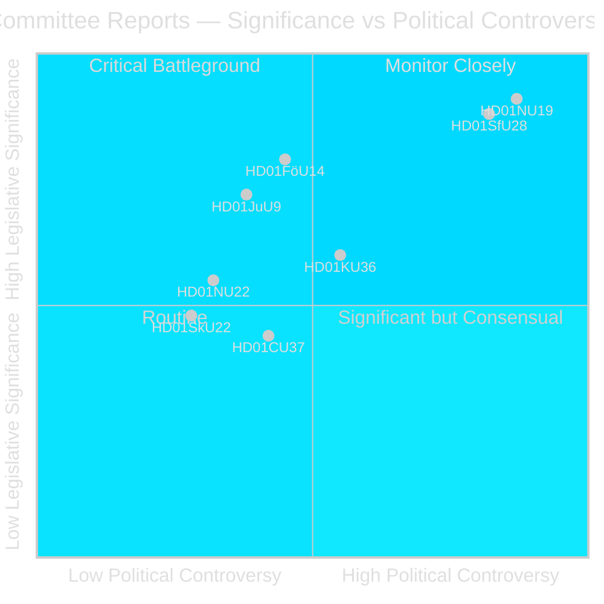
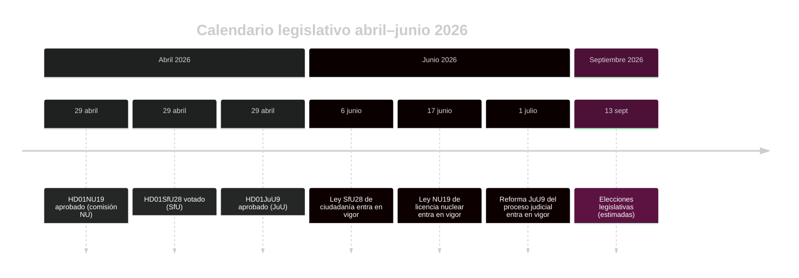

# El Riksdag sueco avanza la reforma de licencias nucleares y el endurecimiento de la ciudadanía

## Resumen

La fase en comisión del Riksdag en el riksmöte 2025/26 entrega dos betänkanden políticamente sísmicos en la última semana de abril de 2026: la Comisión de Empresa (NU) aprueba una nueva ley que permite la autorización directa del gobierno para instalaciones nucleares (HD01NU19), y la Comisión del Seguro Social (SfU) da luz verde a criterios de ciudadanía fuertemente endurecidos incluyendo un requisito de residencia de 8 años, prueba de idioma y suelo de ingresos (HD01SfU28). Ambas medidas definen el legado de la coalición Tidö y entrarán en vigor antes de las elecciones de septiembre de 2026.

## Decisiones políticas que apoya este informe

1. **Juicio editorial**: Liderar con la licencia nuclear NU19 y la ciudadanía SfU28 como los dos eventos legislativos definitorios del ciclo de comisiones de abril de 2026.
2. **Análisis de coalición**: Evaluar si el apoyo transpartidista S/C/M/SD a SfU28 señala un cambio permanente hacia el centro-derecha en política de integración.
3. **Seguimiento de políticas**: Supervisar la preparación de implementación de Migrationsverket y SSM para las fechas de entrada en vigor del 6 y 17 de junio de 2026.
4. **Evaluación de inteligencia**: Evaluar el riesgo de desafíos legales contra la licencia nuclear que elude procedimientos ambientales estándar.

## Lectura de 60 segundos

- 🔵 **Licencia nuclear** (HD01NU19): Nueva ley (Prop 2025/26:171) permite a los desarrolladores nucleares solicitar directamente al gobierno la aprobación, eludiendo el proceso estándar del Capítulo 17 del miljöbalken. Lagrådet revisó y fue seguido. Entra en vigor el 17 de junio de 2026. La oposición (S, V, C, MP) emitió dos reservas formales. **Relevancia electoral: ALTA** — la energía nuclear es la línea divisoria política energética definidora de 2026.
- 🔴 **Endurecimiento de la ciudadanía** (HD01SfU28): Prop 2025/26:175 eleva el requisito de residencia de 5 a 8 años, añade prueba de idioma y educación cívica, introduce suelo de ingresos (≥3 inkomstbasbelopp), endurece estándares de conducta. Votación transpartidista: M, SD, KD, L + S y C votaron Sí. V y MP se opusieron firmemente con 10 reservas. Entra en vigor el 6 de junio de 2026. **Relevancia electoral: ALTA** — la integración ha sido el tema de mayor relevancia electoral desde 2022.
- 🟡 **Reforma del proceso judicial** (HD01JuU9): Prop 2025/26:155 amplía la admisibilidad de grabaciones de entrevistas tempranas. Entra en vigor el 1 de julio de 2026. Fortalece los procesamientos por crimen organizado.
- 🔵 **Cooperación militar** (HD01FöU14): La comisión aprobó condiciones mejoradas para la cooperación militar operativa. Alta relevancia estratégica en contexto OTAN.
- ⚪ **Infraestructura crítica** (HD01FöU20): Nueva ley para resiliencia CER/NIS2 planificada; informe programado para junio de 2026.

## Principal desencadenante prospectivo

**Supervisar**: Si la ley de licencia nuclear NU19 genera una queja constitucional o remisión a tribunal administrativo antes de julio de 2026, todo el programa de expansión nuclear corre riesgo de retraso.

## Evaluación de confianza

**Confianza: ALTA** — Los tres betänkanden publicados contienen texto completo y posiciones claras de la comisión.

## Actores clave

| Actor | Rol | Acción/Posición |
|-------|-----|----------------|
| Tobias Andersson (SD) | Presidente comisión NU | Presidió aprobación HD01NU19 — la mayor victoria energética de SD |
| Viktor Wärnick (M) | Presidente comisión SfU | Presidió votación transpartidista HD01SfU28 |
| Kenneth G Forslund (S) | Miembro SfU | Portavoz de S que votó Sí en SfU28 — confirma giro estratégico de S |
| Julia Kronlid (SD) | Miembro SfU | Representante SD que confirma alineación SD-S en ciudadanía |
| Kerstin Lundgren (C) | Miembro SfU | Representante C — votó Sí, rompiendo con posición liberal tradicional de inmigración |
| Gudrun Nordborg (V) | Miembro JuU | Única reservante en JuU9 — reserva de juicio justo del CEDH |
| SSM (Strålsäkerhetsmyndigheten) | Regulador nuclear | Debe emitir reglamentos del plan kärnteknisk para Q3 2026 para que NU19 funcione |
| Migrationsverket | Agencia de migración | Debe implementar verificación de ingresos/residencia SfU28 antes del 6 de junio de 2026 |

## Fechas clave

- **6 junio 2026**: Endurecimiento de ciudadanía SfU28 entra en vigor
- **17 junio 2026**: Ley NU19 de licencia nuclear entra en vigor — la ley energética más importante de Suecia en 30 años
- **1 julio 2026**: Reforma JuU9 del proceso judicial entra en vigor
- **~13 septiembre 2026**: Elecciones legislativas

<!-- source-sha: 69fae8c5b56fa37d6a281e5e15d5acb956d405aa -->
