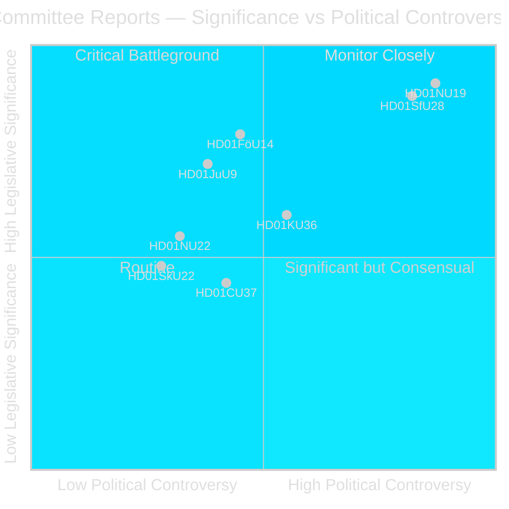
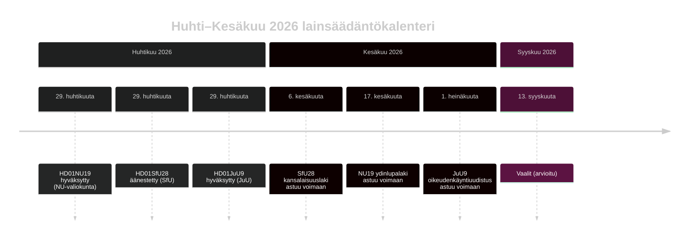

# Ruotsin Riksdag edistää ydinlupauudistusta ja kansalaisuuden tiukentamista

## Tiivistelmä

Riksdagenin valiokuntavaihe riksmötet 2025/26 -istuntokaudella tuottaa kaksi poliittisesti maanjäristyksenomaista mietintöä huhtikuun 2026 viimeisellä viikolla: Elinkeinovaliokunta (NU) hyväksyy uuden lain, joka mahdollistaa suoran hallituksen luvan ydinvoimalaitoksille (HD01NU19), ja Sosiaalivakuutusvaliokunta (SfU) hyväksyy voimakkaasti tiukennetut kansalaisuuskriteerit, mukaan lukien 8 vuoden asumisvaatimus, kielitesti ja tulovaatimus (HD01SfU28). Molemmat toimenpiteet määrittelevät Tidö-koalition perinnön ja astuvat voimaan ennen syyskuun 2026 vaaleja.

## Politiikkapäätökset, joita tämä tiedote tukee

1. **Toimituksellinen arvio**: Johda NU19 ydinluvan ja SfU28 kansalaisuuden kanssa huhtikuun 2026 valiokuntakauden kahtena määrittävänä lainsäädäntötapahtumana.
2. **Koalitioanalyysi**: Arvioi, merkitseekö SfU28:n puoluerajat ylittävä S/C/M/SD-tuki pysyvää keskustaoikeistolaista siirtymää integraatiopolitiikassa.
3. **Politiikan seuranta**: Tarkkaile Migrationsverketin ja SSM:n toimeenpanovalmiutta 6. kesäkuuta ja 17. kesäkuuta 2026 voimaantulopäivien osalta.
4. **Tiedusteluarvio**: Arvioi oikeudellisten haasteiden riskiä ydinlupauksia vastaan, jotka ohittavat standardimittaiset ympäristöprosessit.

## 60 sekunnin lukeminen

- 🔵 **Ydinvoimaohjelma** (HD01NU19): Uusi laki (Prop 2025/26:171) antaa ydinvoimakehittäjille mahdollisuuden hakea suoraan hallitukselta hyväksyntää, ohittaen standardimittainen miljöbalken luku 17 -prosessi. Lagrådet tarkisti ja sitä seurattiin. Astuu voimaan 17. kesäkuuta 2026. Oppositio (S, V, C, MP) jätti kaksi virallista varausta. **Vaalikansainvälisyys: KORKEA** — ydinvoima on vuoden 2026 määrittävä energiapolitiikan jakolinja.
- 🔴 **Kansalaisuuden tiukentaminen** (HD01SfU28): Prop 2025/26:175 nostaa asumisvaatimuksen 5:stä 8 vuoteen, lisää kieli- ja yhteiskuntatiedon testin, ottaa käyttöön tulolattiaan (≥3 inkomstbasbelopp), tiukentaa käyttäytymisstandardeja. Puoluerajat ylittävä äänestys: M, SD, KD, L + S ja C äänestivät Kyllä. V ja MP vastustivat voimakkaasti 10 varauksella. Astuu voimaan 6. kesäkuuta 2026. **Vaalikansainvälisyys: KORKEA** — integraatio on ollut hallitseva äänestäjäaihe vuodesta 2022.
- 🟡 **Oikeudenkäyntiuudistus** (HD01JuU9): Prop 2025/26:155 laajentaa varhaisten kuulustelunauhoitusten hyväksyttävyyttä. Astuu voimaan 1. heinäkuuta 2026. Vahvistaa jengirikossyytteitä.
- 🔵 **Sotilasyhteistyö** (HD01FöU14): Valiokunta hyväksyi parantuneet edellytykset operatiiviselle sotilasyhteistyölle. Korkea strateginen merkitys NATO-kontekstissa.
- ⚪ **Kriittinen infrastruktuuri** (HD01FöU20): Uusi laki CER/NIS2-resilienssiä varten suunniteltu; mietintö ajoitettu julkaistavaksi kesäkuussa 2026.

## Tärkein eteenpäin suuntautuva laukaisija

**Tarkkaile**: Jos NU19:n ydinlupauslaki synnyttää perustuslaillisen valituksen ennen heinäkuuta 2026, koko ydinvoimaohjelman laajennus saattaa viivästyä seuraavalle vaalikaudelle.

## Luottamusarvio

**Luottamus: KORKEA** — Kaikki kolme julkaistua mietintöä sisältävät koko tekstin ja selkeät valiokunnan kannanotot.

## Avaintoimijat

| Toimija | Rooli | Toiminta/Kanta |
|---------|-------|----------------|
| Tobias Andersson (SD) | NU-valiokunnan puheenjohtaja | Johti HD01NU19-hyväksyntää — SD:n tärkein energiapoliittinen voitto |
| Viktor Wärnick (M) | SfU-valiokunnan puheenjohtaja | Johti HD01SfU28 puoluerajat ylittävää äänestystä |
| Kenneth G Forslund (S) | SfU-jäsen | S-edustajana äänesti Kyllä SfU28:lle — vahvistaa S:n strategisen suunnanmuutoksen |
| Julia Kronlid (SD) | SfU-jäsen | SD-edustaja vahvistaa SD-S-linjauksen kansalaisuudessa |
| Kerstin Lundgren (C) | SfU-jäsen | C-edustaja — äänesti Kyllä, rikkoo perinteisen liberaalin maahanmuuttokannan |
| Gudrun Nordborg (V) | JuU-jäsen | Ainoa JuU9:n vastustaja — EIS oikeusturvavaraus |
| SSM (Strålsäkerhetsmyndigheten) | Ydinvoimavalvoja | Täytyy antaa kärnteknisk plan -määräykset Q3 2026 mennessä jotta NU19 toimii |
| Migrationsverket | Maahanmuuttovirasto | Täytyy toteuttaa SfU28 tulo/asuinpaikkaverifikaatio 6. kesäkuuta 2026 mennessä |

## Avainpäivämäärät

- **6. kesäkuuta 2026**: SfU28 kansalaisuuden tiukentaminen astuu voimaan
- **17. kesäkuuta 2026**: NU19 ydinlupalaki astuu voimaan — Ruotsin tärkein energialaki 30 vuoteen
- **1. heinäkuuta 2026**: JuU9 oikeudenkäyntiuudistus astuu voimaan
- **~13. syyskuuta 2026**: Vaalit

<!-- source-sha: 69fae8c5b56fa37d6a281e5e15d5acb956d405aa -->
