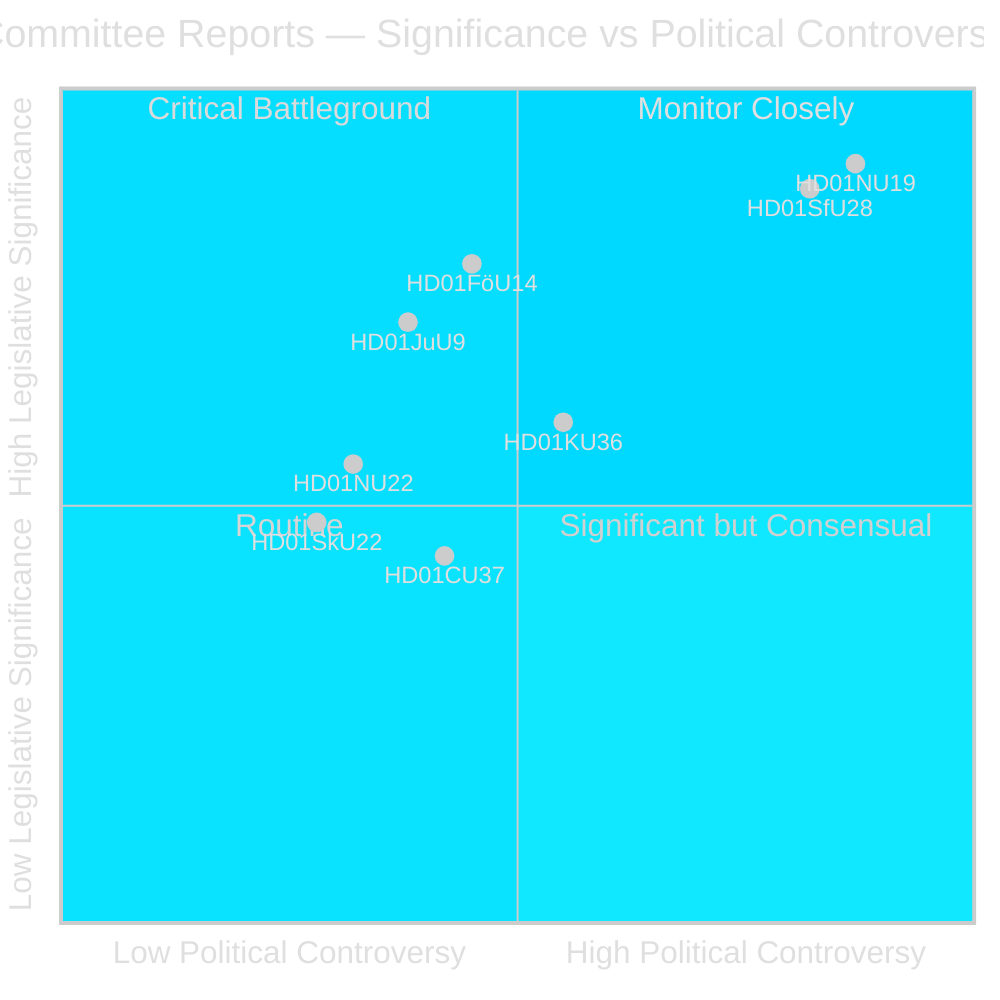
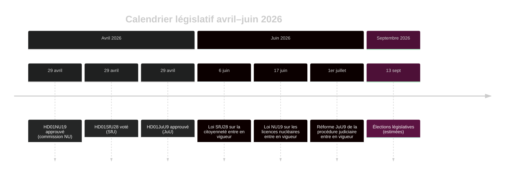

# Le Riksdag suédois avance la réforme de la licence nucléaire et le durcissement de la citoyenneté

## Résumé

La phase en commission du Riksdag lors du riksmöte 2025/26 livre deux rapports politiquement sismiques dans la dernière semaine d'avril 2026 : la Commission des entreprises (NU) approuve une nouvelle loi permettant l'autorisation directe du gouvernement pour les installations nucléaires (HD01NU19), et la Commission des assurances sociales (SfU) donne le feu vert à des critères de citoyenneté fortement durcis incluant une exigence de résidence de 8 ans, un test de langue et un plancher de revenus (HD01SfU28). Les deux mesures définissent l'héritage de la coalition Tidö et entreront en vigueur avant les élections de septembre 2026.

## Décisions politiques que ce briefing soutient

1. **Jugement éditorial** : Mettre en avant la licence nucléaire NU19 et la citoyenneté SfU28 comme les deux événements législatifs définissants du cycle en commission d'avril 2026.
2. **Analyse de coalition** : Évaluer si le soutien transpartisan S/C/M/SD à SfU28 signale un glissement permanent vers la droite modérée dans la politique d'intégration.
3. **Suivi des politiques** : Surveiller la préparation à la mise en œuvre de Migrationsverket et SSM pour les dates d'entrée en vigueur du 6 juin et du 17 juin 2026.
4. **Évaluation du renseignement** : Évaluer le risque de contestations juridiques contre les licences nucléaires contournant les procédures environnementales standard.

## Lecture en 60 secondes

- 🔵 **Licence nucléaire** (HD01NU19) : La nouvelle loi (Prop 2025/26:171) permet aux développeurs nucléaires de demander directement au gouvernement une approbation, contournant le processus standard du Chapitre 17 du miljöbalken. Lagrådet a examiné et a été suivi. Entre en vigueur le 17 juin 2026. L'opposition (S, V, C, MP) a émis deux réserves formelles. **Signification électorale : ÉLEVÉE** — le nucléaire est la ligne de partage définissant la politique énergétique de 2026.
- 🔴 **Durcissement de la citoyenneté** (HD01SfU28) : La Prop 2025/26:175 relève l'exigence de résidence de 5 à 8 ans, ajoute un test de langue et de culture civique, instaure un plancher de revenus (≥3 inkomstbasbelopp), durcit les normes de conduite. Vote transpartisan : M, SD, KD, L + S et C ont voté Oui. V et MP étaient fortement opposés avec 10 réserves. Entre en vigueur le 6 juin 2026. **Signification électorale : ÉLEVÉE** — l'intégration est le sujet de préoccupation dominant des électeurs depuis 2022.
- 🟡 **Réforme de la procédure judiciaire** (HD01JuU9) : La Prop 2025/26:155 élargit la recevabilité des enregistrements d'auditions précoces. Entre en vigueur le 1er juillet 2026. Renforce les poursuites pour crimes de gangs.
- 🔵 **Coopération militaire** (HD01FöU14) : La commission a approuvé des conditions améliorées pour la coopération militaire opérationnelle. Haute signification stratégique dans le contexte OTAN.
- ⚪ **Infrastructures critiques** (HD01FöU20) : Nouvelle loi pour la résilience CER/NIS2 prévue ; rapport prévu pour juin 2026.

## Principal déclencheur prospectif

**Surveiller** : Si la loi de licence nucléaire NU19 génère une plainte constitutionnelle ou un renvoi au tribunal administratif avant juillet 2026, l'ensemble du programme d'expansion nucléaire risque d'être retardé.

## Évaluation de la confiance

**Confiance : ÉLEVÉE** — Les trois rapports publiés contiennent le texte intégral et des positions claires de la commission.

## Acteurs clés

| Acteur | Rôle | Action/Position |
|--------|------|----------------|
| Tobias Andersson (SD) | Président de la commission NU | A présidé l'approbation HD01NU19 — la plus grande victoire énergétique de SD |
| Viktor Wärnick (M) | Président de la commission SfU | A présidé le vote transpartisan HD01SfU28 |
| Kenneth G Forslund (S) | Membre SfU | Porte-parole S ayant voté Oui sur SfU28 — confirme le pivot stratégique de S |
| Julia Kronlid (SD) | Membre SfU | Représentante SD confirmant l'alignement SD-S sur la citoyenneté |
| Kerstin Lundgren (C) | Membre SfU | Représentante C — a voté Oui, rompant avec la position libérale traditionnelle |
| Gudrun Nordborg (V) | Membre JuU | Seule réservante sur JuU9 — réserve CEDH procès équitable |
| SSM (Strålsäkerhetsmyndigheten) | Régulateur nucléaire | Doit émettre les réglementations du plan kärnteknisk avant Q3 2026 pour que NU19 fonctionne |
| Migrationsverket | Agence de migration | Doit mettre en œuvre la vérification revenus/résidence SfU28 avant le 6 juin 2026 |

## Dates clés

- **6 juin 2026** : Durcissement de la citoyenneté SfU28 entre en vigueur
- **17 juin 2026** : Loi NU19 sur les licences nucléaires entre en vigueur — la loi énergétique la plus importante de la Suède depuis 30 ans
- **1er juillet 2026** : Réforme JuU9 de la procédure judiciaire entre en vigueur
- **~13 septembre 2026** : Élections législatives

<!-- source-sha: 69fae8c5b56fa37d6a281e5e15d5acb956d405aa -->
