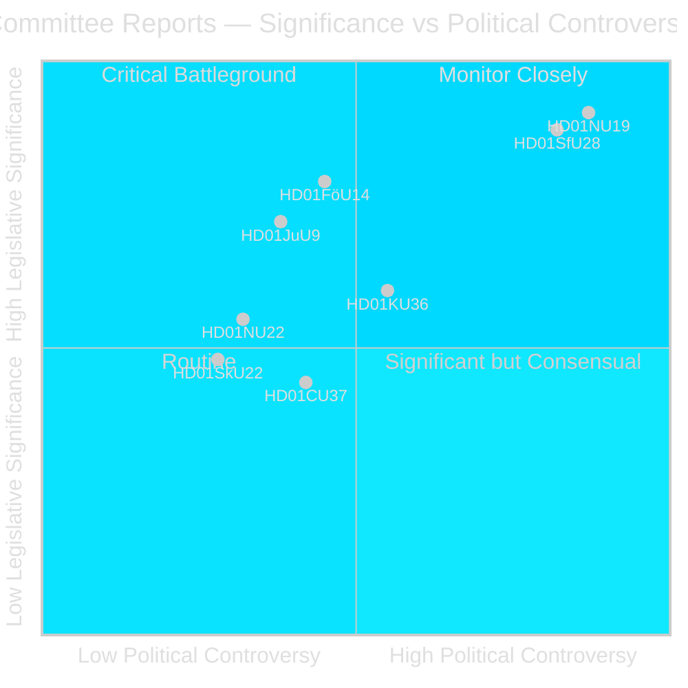
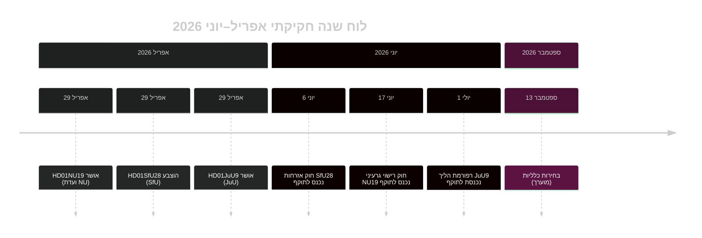

# הריקסדאג השוודי מקדם רפורמת רישוי גרעיני והידוק אזרחות

## תמצית

שלב הוועדות של הריקסדאג בדיון riksmötet 2025/26 מספק שני betänkanden רועשים פוליטית בשבוע האחרון של אפריל 2026: ועדת העסקים (NU) מאשרת חוק חדש המאפשר רישוי ממשלתי ישיר למתקני גרעין (HD01NU19), וועדת ביטוח לאומי (SfU) מאשרת קריטריוני אזרחות מהודקים מאוד כולל דרישת מגורים של 8 שנים, מבחן שפה ורצפת הכנסה (HD01SfU28). שני הצעדים מגדירים את מורשת קואליציית Tidö ויכנסו לתוקף לפני בחירות ספטמבר 2026.

## החלטות מדיניות שמסמך זה תומך בהן

1. **שיקול עריכתי**: הובלה עם רישוי NU19 גרעיני ואזרחות SfU28 כשני האירועים החקיקתיים המגדירים של מחזור ועדות אפריל 2026.
2. **ניתוח קואליציה**: הערכה האם תמיכת S/C/M/SD מעבר למפלגות ב-SfU28 מאותתת שינוי קבוע ימינה במרכז במדיניות שילוב.
3. **מעקב מדיניות**: מעקב אחר מוכנות היישום של Migrationsverket ו-SSM לתאריכי הכניסה לתוקף 6 ו-17 ביוני 2026.
4. **הערכת מודיעין**: הערכת הסיכון לאתגרים משפטיים כנגד רישוי גרעיני שעוקף נהלי סביבה סטנדרטיים.

## קריאה בת 60 שניות

- 🔵 **רישוי גרעיני** (HD01NU19): חוק חדש (Prop 2025/26:171) מאפשר למפתחי גרעין לפנות ישירות לממשלה לאישור, תוך עקיפת תהליך סטנדרטי של פרק 17 במילנובלקן. Lagrådet סקר ונעקב. נכנס לתוקף ב-17 יוני 2026. האופוזיציה (S, V, C, MP) הגישה שני הסתייגויות רשמיות. **חשיבות בחירותית: גבוהה** — גרעין הוא קו השסע המגדיר במדיניות אנרגיה 2026.
- 🔴 **הידוק אזרחות** (HD01SfU28): Prop 2025/26:175 מעלה דרישת מגורים מ-5 ל-8 שנים, מוסיפה מבחן שפה ואזרחות, מציגה רצפת הכנסה (≥3 inkomstbasbelopp), מחמירה סטנדרטים של התנהגות. הצבעה רב-מפלגתית: M, SD, KD, L + S ו-C הצביעו כן. V ו-MP התנגדו בחריפות עם 10 הסתייגויות. נכנס לתוקף 6 יוני 2026. **חשיבות בחירותית: גבוהה** — שילוב היה נושא בוחרים דומיננטי מאז 2022.
- 🟡 **רפורמת הליך משפטי** (HD01JuU9): Prop 2025/26:155 מרחיבה קבילות הקלטות חקירות מוקדמות. נכנס לתוקף 1 יולי 2026. מחזק תביעות פשעי כנופיות.
- 🔵 **שיתוף פעולה צבאי** (HD01FöU14): הוועדה אישרה תנאים משופרים לשיתוף פעולה צבאי מבצעי. חשיבות אסטרטגית גבוהה בהקשר נאט"ו.
- ⚪ **תשתית קריטית** (HD01FöU20): חוק חדש לחוסן CER/NIS2 מתוכנן; betänkande מתוכנן לפרסום יוני 2026.

## הגורם המפעיל המרכזי

**מעקב**: אם חוק רישוי גרעיני NU19 יוצר תלונה חוקתית או הפניה לבית משפט מנהלי לפני יולי 2026, כל תוכנית הרחבת הגרעין עלולה להתעכב.

## הערכת ביטחון

**ביטחון: גבוה** — שלושת ה-betänkanden המפורסמים מכילים טקסט מלא ועמדות ברורות של הוועדה.

## שחקנים מרכזיים

| שחקן | תפקיד | פעולה/עמדה |
|------|--------|------------|
| Tobias Andersson (SD) | יו"ר ועדת NU | הוביל אישור HD01NU19 — הניצחון האנרגטי החשוב ביותר של SD |
| Viktor Wärnick (M) | יו"ר ועדת SfU | יישב הצבעה רב-מפלגתית HD01SfU28 |
| Kenneth G Forslund (S) | חבר SfU | דובר S שהצביע כן ל-SfU28 — מאשש ציר אסטרטגי של S |
| Julia Kronlid (SD) | חבר SfU | נציגת SD מאששת יישור SD-S על אזרחות |
| Kerstin Lundgren (C) | חבר SfU | נציגת C — הצביעה כן, שוברת עמדה ליברלית מסורתית |
| Gudrun Nordborg (V) | חבר JuU | הסתייגות יחידה ל-JuU9 — הסתייגות משפט הוגן ECHR |
| SSM (Strålsäkerhetsmyndigheten) | רגולטור גרעיני | חייב להוציא תקנות תוכנית גרעינית ב-Q3 2026 כדי ש-NU19 יפעל |
| Migrationsverket | סוכנות הגירה | חייב ליישם אימות הכנסה/מגורים SfU28 לפני 6 יוני 2026 |

## תאריכים מרכזיים

- **6 יוני 2026**: הידוק אזרחות SfU28 נכנס לתוקף
- **17 יוני 2026**: חוק רישוי גרעיני NU19 נכנס לתוקף — חוק האנרגיה החשוב ביותר בשוודיה ב-30 שנה
- **1 יולי 2026**: רפורמת הליך JuU9 נכנסת לתוקף
- **~13 ספטמבר 2026**: בחירות כלליות

<!-- source-sha: 69fae8c5b56fa37d6a281e5e15d5acb956d405aa -->

