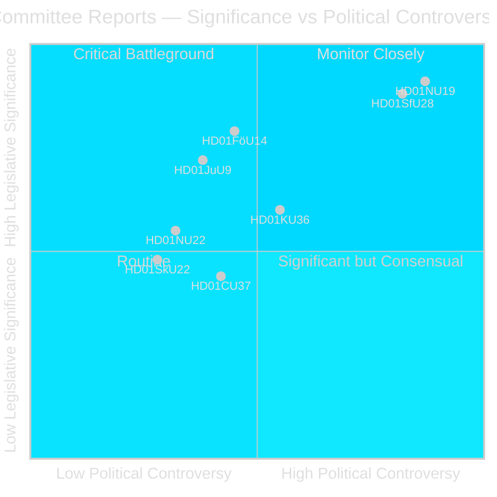
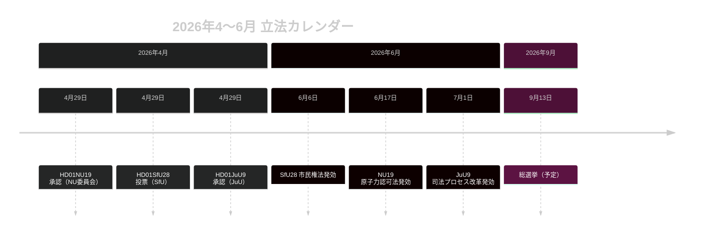

# スウェーデン議会、原子力認可改革と市民権厳格化を推進

## 要旨

Riksdag の委員会フェーズ（riksmötet 2025/26）は、2026年4月最終週に政治的に衝撃的な2本の betänkanden を提出した。企業委員会（NU）が原子力施設への政府直接許可を可能にする新法（HD01NU19）を承認し、社会保険委員会（SfU）が8年居住要件・語学試験・最低所得要件を含む大幅に厳格化された市民権基準（HD01SfU28）を承認した。両措置は Tidö 連立政権の政策遺産を規定し、2026年9月の選挙前に発効する。

## このブリーフィングが支援する政策決定

1. **編集上の判断**: NU19 原子力認可と SfU28 市民権を、2026年4月委員会サイクルの2つの画期的立法事案として前面に出す。
2. **連立分析**: SfU28 への S/C/M/SD の超党派支持が、統合政策における恒久的な中道右派シフトを示すかどうかを評価する。
3. **政策追跡**: 2026年6月6日と17日の施行日に向けた Migrationsverket および SSM の実施準備状況を監視する。
4. **情報評価**: 標準環境手続きを回避する原子力認可に対する法的異議のリスクを評価する。

## 60秒読み

- 🔵 **原子力認可** (HD01NU19): 新法（Prop 2025/26:171）により、原子力開発者が標準的な miljöbalken 第17章プロセスを回避して政府に直接承認申請できるようになる。Lagrådet が審査し従われた。2026年6月17日発効。野党（S, V, C, MP）が2件の公式留保を提出。**選挙的重要性: 高** — 原子力は2026年の定義的なエネルギー政策断層線。
- 🔴 **市民権厳格化** (HD01SfU28): Prop 2025/26:175 は居住要件を5年から8年に引き上げ、語学・公民テストを追加し、最低所得（≥3 inkomstbasbelopp）を導入、行動基準を厳格化。超党派投票: M, SD, KD, L + S および C が賛成。V と MP は10件の留保で強く反対。2026年6月6日発効（語学テスト部分は2027年10月以降）。**選挙的重要性: 高** — 統合は2022年以来の有権者の主要関心事項。
- 🟡 **司法プロセス改革** (HD01JuU9): Prop 2025/26:155 は早期面接録音の許容性を拡大。2026年7月1日発効。組織犯罪訴追を強化。
- 🔵 **軍事協力** (HD01FöU14): 委員会が作戦的軍事協力の条件改善を承認。NATO 文脈での高い戦略的重要性。
- ⚪ **重要インフラ** (HD01FöU20): CER/NIS2 レジリエンスのための新法計画; betänkande は2026年6月公開予定。

## 主要フォワードトリガー

**監視**: NU19 原子力認可法が2026年7月前に憲法訴訟や行政裁判所付託を生成すると、原子力拡張プログラム全体が遅延リスクに直面する。

## 信頼性評価

**信頼度: 高** — 公表された3本すべての betänkanden が全文と明確な委員会見解を含む。

## 主要人物

| 人物 | 役割 | 行動/立場 |
|------|------|----------|
| Tobias Andersson (SD) | NU委員会委員長 | HD01NU19 承認を主導 — SD 最大のエネルギー政策勝利 |
| Viktor Wärnick (M) | SfU委員会委員長 | HD01SfU28 超党派投票を主宰 |
| Kenneth G Forslund (S) | SfU委員 | SfU28 に賛成投票したS政策広報 — S の戦略的転換を確認 |
| Julia Kronlid (SD) | SfU委員 | SD代表が SD-S の市民権における整合を確認 |
| Kerstin Lundgren (C) | SfU委員 | C代表 — 賛成投票、伝統的リベラル移民立場を破る |
| Gudrun Nordborg (V) | JuU委員 | JuU9 唯一の留保者 — ECHR公正裁判留保 |
| SSM (Strålsäkerhetsmyndigheten) | 原子力規制機関 | NU19 が機能するため2026年Q3までに核技術計画規則を発行要 |
| Migrationsverket | 移民局 | 2026年6月6日までに SfU28 所得/居住確認を実施要 |

## 主要日程

- **2026年6月6日**: SfU28 市民権厳格化発効
- **2026年6月17日**: NU19 原子力認可法発効 — スウェーデン30年最重要エネルギー法
- **2026年7月1日**: JuU9 司法プロセス改革発効
- **~2026年9月13日**: 総選挙

<!-- source-sha: 69fae8c5b56fa37d6a281e5e15d5acb956d405aa -->
