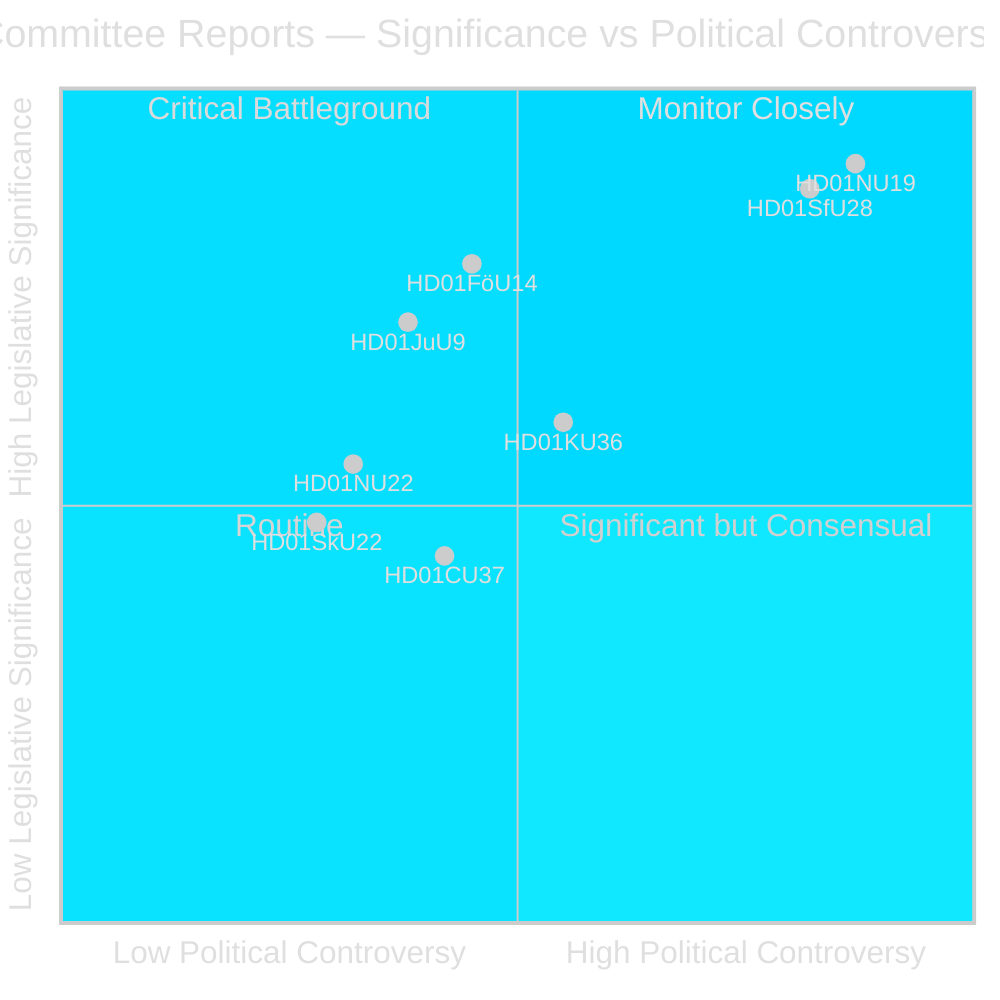
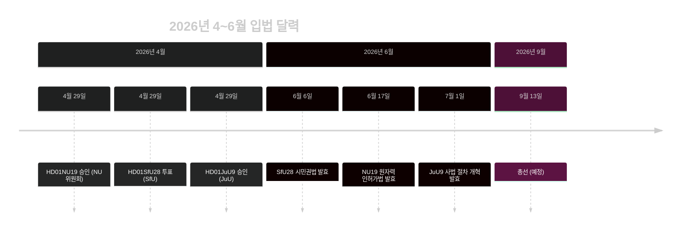

# 스웨덴 리크스다그, 원자력 인허가 개혁과 시민권 강화 추진

## 요약

Riksdag의 위원회 단계(riksmötet 2025/26)가 2026년 4월 마지막 주에 정치적으로 지진 같은 두 개의 betänkanden을 제출했다: 기업위원회(NU)가 원자력 시설에 대한 정부 직접 허가를 가능하게 하는 새로운 법안(HD01NU19)을 승인하고, 사회보험위원회(SfU)가 8년 거주 요건, 언어 시험 및 소득 하한을 포함한 대폭 강화된 시민권 기준(HD01SfU28)을 승인했다. 두 조치 모두 Tidö 연립정부의 정책 유산을 규정하며 2026년 9월 선거 전에 시행된다.

## 이 브리핑이 지원하는 정책 결정

1. **편집 판단**: NU19 원자력 인허가와 SfU28 시민권을 2026년 4월 위원회 사이클의 두 가지 결정적 입법 사건으로 전면에 제시한다.
2. **연립 분석**: SfU28에 대한 S/C/M/SD의 초당파적 지지가 통합 정책에서 영구적인 중도우파 전환을 시사하는지 평가한다.
3. **정책 추적**: 2026년 6월 6일과 17일 시행 날짜에 대한 Migrationsverket 및 SSM의 시행 준비 상태를 모니터링한다.
4. **정보 평가**: 표준 환경 절차를 우회하는 원자력 인허가에 대한 법적 도전 위험을 평가한다.

## 60초 읽기

- 🔵 **원자력 인허가** (HD01NU19): 새로운 법률(Prop 2025/26:171)로 원자력 개발자들이 표준 miljöbalken 17장 절차를 우회해 정부에 직접 승인을 신청할 수 있다. Lagrådet이 검토하고 따랐다. 2026년 6월 17일 발효. 야당(S, V, C, MP)이 두 가지 공식 유보를 제출했다. **선거적 중요성: 높음** — 원자력은 2026년 결정적 에너지 정책 분열선.
- 🔴 **시민권 강화** (HD01SfU28): Prop 2025/26:175가 거주 요건을 5년에서 8년으로 높이고 언어·시민 시험 추가, 소득 하한 도입(≥3 inkomstbasbelopp), 행동 기준 강화. 초당파 투표: M, SD, KD, L + S 및 C가 찬성. V와 MP는 10개의 유보로 강력 반대. 2026년 6월 6일 발효. **선거적 중요성: 높음** — 통합은 2022년 이후 주요 유권자 관심사.
- 🟡 **사법 절차 개혁** (HD01JuU9): Prop 2025/26:155가 초기 면접 녹음의 허용성을 확대. 2026년 7월 1일 발효. 조직범죄 기소 강화.
- 🔵 **군사 협력** (HD01FöU14): 위원회가 작전적 군사 협력을 위한 개선된 조건 승인. NATO 맥락에서 높은 전략적 중요성.
- ⚪ **중요 인프라** (HD01FöU20): CER/NIS2 회복력을 위한 새 법률 계획; betänkande는 2026년 6월 발행 예정.

## 주요 전향적 트리거

**모니터링**: NU19 원자력 인허가법이 2026년 7월 전에 헌법 소원이나 행정법원 회부를 생성한다면, 전체 원자력 확장 프로그램은 지연될 위험이 있다.

## 신뢰도 평가

**신뢰도: 높음** — 발행된 세 개의 betänkanden 모두 전체 텍스트와 명확한 위원회 입장을 포함.

## 주요 인물

| 인물 | 역할 | 행동/입장 |
|------|------|----------|
| Tobias Andersson (SD) | NU 위원회 위원장 | HD01NU19 승인 주도 — SD의 가장 중요한 에너지 정책 승리 |
| Viktor Wärnick (M) | SfU 위원회 위원장 | HD01SfU28 초당파 투표 주관 |
| Kenneth G Forslund (S) | SfU 위원 | SfU28에 찬성 투표한 S 대변인 — S의 전략적 전환 확인 |
| Julia Kronlid (SD) | SfU 위원 | 시민권에서 SD-S 정렬 확인하는 SD 대표 |
| Kerstin Lundgren (C) | SfU 위원 | C 대표 — 찬성 투표, 전통적 자유주의 이민 입장 탈피 |
| Gudrun Nordborg (V) | JuU 위원 | JuU9 유일한 유보자 — ECHR 공정한 재판 유보 |
| SSM (Strålsäkerhetsmyndigheten) | 원자력 규제기관 | NU19 기능을 위해 2026년 Q3까지 핵기술 계획 규정 발행 필요 |
| Migrationsverket | 이민청 | 2026년 6월 6일 전까지 SfU28 소득/거주 검증 시행 필요 |

## 주요 날짜

- **2026년 6월 6일**: SfU28 시민권 강화 발효
- **2026년 6월 17일**: NU19 원자력 인허가법 발효 — 스웨덴 30년 가장 중요한 에너지 법률
- **2026년 7월 1일**: JuU9 사법 절차 개혁 발효
- **~2026년 9월 13일**: 총선

<!-- source-sha: 69fae8c5b56fa37d6a281e5e15d5acb956d405aa -->
