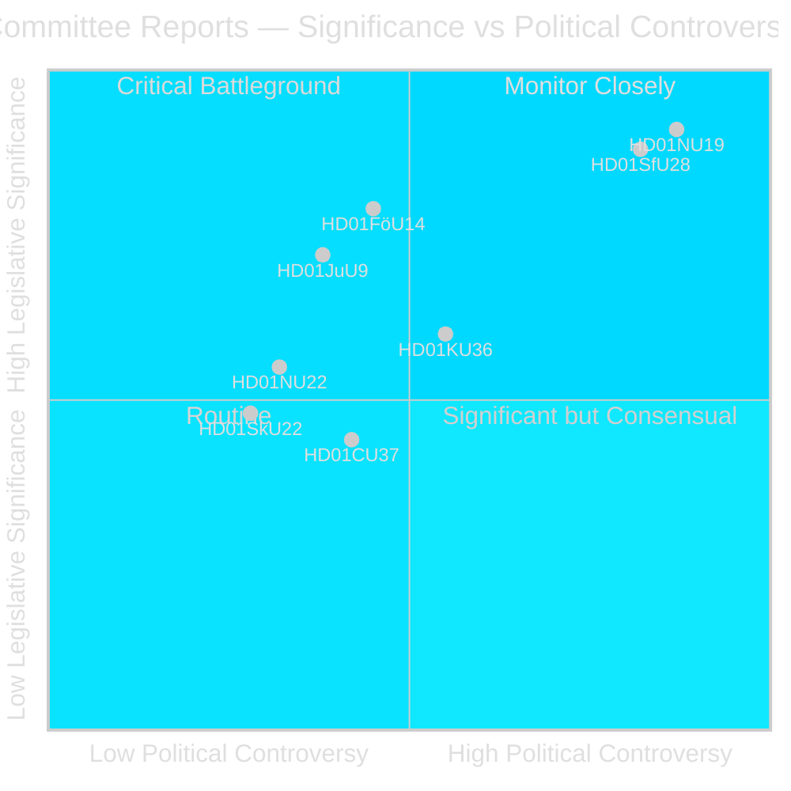
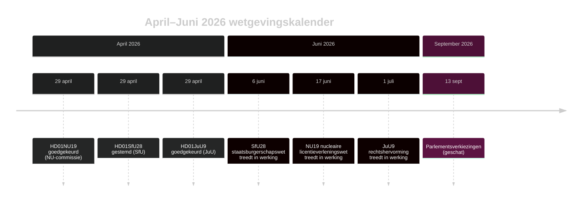

# Zweedse Riksdag vordert nucleaire licentiehervorming en aanscherping staatsburgerschap

## Samenvatting

De commissiefase van de Riksdag in riksmöte 2025/26 levert twee politiek aardbeving-achtige betänkanden in de laatste week van april 2026: de Ondernemingscommissie (NU) keurt een nieuwe wet goed die directe regeringsvergunning voor kerninstallaties mogelijk maakt (HD01NU19), en de Sociale Verzekeringscommissie (SfU) keurt sterk aangescherpte burgerschap criteria goed inclusief een 8-jarige verblijfseis, taaltest en inkomensbodem (HD01SfU28). Beide maatregelen definiëren de erfenis van de Tidö-coalitie en treden in werking vóór de verkiezingen van september 2026.

## Politieke beslissingen die dit briefing ondersteunt

1. **Redactioneel oordeel**: Leiden met NU19 nucleaire licentieverlening en SfU28 staatsburgerschap als de twee bepalende wetgevende gebeurtenissen van de commissiecyclus april 2026.
2. **Coalitieanalyse**: Beoordeel of de partijoverschrijdende S/C/M/SD-steun voor SfU28 een permanente centrumrechtse verschuiving in integratiebeleid signaleert.
3. **Beleidsmonitoring**: Houd de implementatiebereidheid van Migrationsverket en SSM bij voor de inwerkingtredingsdata 6 juni en 17 juni 2026.
4. **Inlichtingenbeoordeling**: Evalueer het risico op juridische uitdagingen tegen nucleaire licentieverlening die standaard milieuprocedures omzeilt.

## 60-seconden lezing

- 🔵 **Nucleaire licentieverlening** (HD01NU19): Nieuwe wet (Prop 2025/26:171) stelt nucleaire ontwikkelaars in staat direct bij de regering goedkeuring aan te vragen, omzeilend de standaard miljöbalken Hfst. 17-procedure. Lagrådet beoordeelde en werd gevolgd. Treedt in werking op 17 juni 2026. Oppositie (S, V, C, MP) diende twee formele voorbehouden in. **Verkiezingsbetekenis: HOOG** — kernenergie is de bepalende energiepolitieke scheidslijn van 2026.
- 🔴 **Aanscherping staatsburgerschap** (HD01SfU28): Prop 2025/26:175 verhoogt verblijfseis van 5 naar 8 jaar, voegt taal- en burgerschapstest toe, introduceert inkomensbodem (≥3 inkomstbasbelopp), verscherpt gedragsnormen. Partijoverschrijdende stemming: M, SD, KD, L + S en C stemden Ja. V en MP waren sterk tegen met 10 voorbehouden. Treedt in werking op 6 juni 2026. **Verkiezingsbetekenis: HOOG** — integratie is het dominante kiezersonderwerp geweest sinds 2022.
- 🟡 **Rechtshervorming** (HD01JuU9): Prop 2025/26:155 breidt toelaatbaarheid van vroege verhooropnames uit. Treedt in werking op 1 juli 2026. Versterkt bendecrimeprocessen.
- 🔵 **Militaire samenwerking** (HD01FöU14): Commissie keurde verbeterde voorwaarden voor operationele militaire samenwerking goed. Hoge strategische betekenis in NAVO-context.
- ⚪ **Kritieke infrastructuur** (HD01FöU20): Nieuwe wet voor CER/NIS2-veerkracht gepland; betänkande gepland voor publicatie juni 2026.

## Belangrijkste voorwaartse trigger

**Houd in de gaten**: Als NU19's wet nucleaire licentieverlening vóór juli 2026 een grondwettelijke klacht of bestuursrechterlijke verwijzing genereert, riskeert het volledige kernuitbreidingsprogramma vertraging.

## Vertrouwensbeoordeling

**Vertrouwen: HOOG** — Alle drie gepubliceerde betänkanden bevatten volledige tekst en duidelijke commissiestandpunten.

## Belangrijke actoren

| Actor | Rol | Actie/Standpunt |
|-------|-----|----------------|
| Tobias Andersson (SD) | NU-commissievoorzitter | Leidde HD01NU19-goedkeuring — SD's belangrijkste energiepolitieke overwinning |
| Viktor Wärnick (M) | SfU-commissievoorzitter | Voorzat partijoverschrijdende HD01SfU28-stemming |
| Kenneth G Forslund (S) | SfU-lid | S-woordvoerder die Ja stemde op SfU28 — bevestigt S strategische koerswijziging |
| Julia Kronlid (SD) | SfU-lid | SD-vertegenwoordigster bevestigt SD-S-afstemming op staatsburgerschap |
| Kerstin Lundgren (C) | SfU-lid | C-vertegenwoordigster — stemde Ja, brekend met traditioneel liberale immigratieopvatting |
| Gudrun Nordborg (V) | JuU-lid | Enige voorbehoudende bij JuU9 — EVRM eerlijk proces-voorbehoud |
| SSM (Strålsäkerhetsmyndigheten) | Nucleaire toezichthouder | Moet kärnteknisk plan-regelgeving uitvaardigen voor Q3 2026 zodat NU19 werkt |
| Migrationsverket | Migratiedienst | Moet SfU28 inkomen/verblijfsverificatie implementeren vóór 6 juni 2026 |

## Sleuteldata

- **6 juni 2026**: SfU28 aanscherping staatsburgerschap treedt in werking
- **17 juni 2026**: NU19 nucleaire licentieverleningswet treedt in werking — Zwedens belangrijkste energiewet in 30 jaar
- **1 juli 2026**: JuU9 rechtshervorming treedt in werking
- **~13 september 2026**: Parlementsverkiezingen

<!-- source-sha: 69fae8c5b56fa37d6a281e5e15d5acb956d405aa -->
