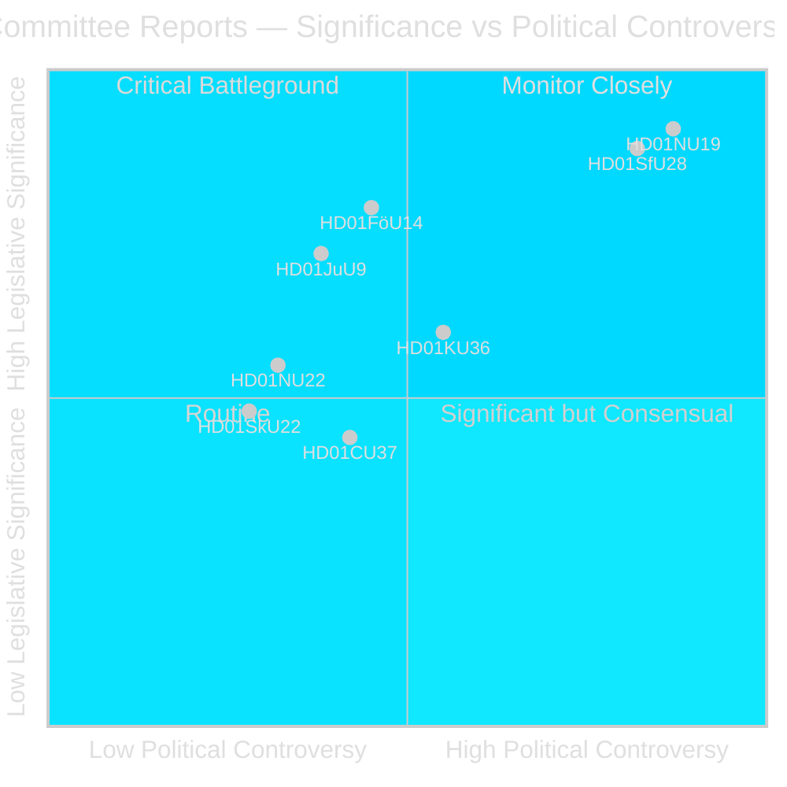
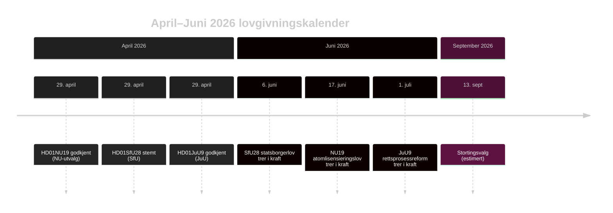

# Riksdagen fremmer atomlisensreform og statsborgerskap-innstramming

## Sammendrag

Riksdagens komitéfase i riksmøtet 2025/26 leverer to politisk jordskjelvende betenkning i den siste uken av april 2026: Næringsutvalget (NU) godkjenner en ny lov som muliggjør direkte regjeringstillatelse til kjernekraftinstallasjoner (HD01NU19), og Trygdekomitéen (SfU) godkjenner kraftig innskjerpede statsborgerskapskriterier inklusiv et 8-årig botidskrav, språktest og inntektsgulv (HD01SfU28). Begge tiltak definerer Tidö-koalisjonens arv og trer i kraft før valget i september 2026.

## Politiske vurderinger dette briefet støtter

1. **Redaksjonell vurdering**: Led med NU19 kjernekraftlisensering og SfU28 statsborgerskap som de to definerende lovgivningshendelsene i april 2026-komitéperioden.
2. **Koalisjonsanalyse**: Vurder om SfU28's tverrpartistøtte S/C/M/SD signaliserer et permanent sentrum-høyre-skifte i integrasjonspolitikken.
3. **Politisk sporing**: Overvåk Migrationsverkets og SSM's implementeringsberedskap for ikrafttredelsesdatoene 6. juni og 17. juni 2026.
4. **Etterretningsvurdering**: Evaluer risikoen for juridiske utfordringer mot atomlisensering som omgår standardmiljøprosedyrer.

## 60-sekunders lesning

- 🔵 **Atomlisensering** (HD01NU19): Ny lov (Prop 2025/26:171) lar kjernekraftsutviklere søke direkte til regjeringen om godkjenning, omgår standardmessig miljøbalken kap. 17-prosess. Lagrådet gjennomgikk og ble fulgt. Trer i kraft 17. juni 2026. Opposisjonen (S, V, C, MP) avga to formelle reservasjoner. **Valgbetydning: HØY** — kjernekraft er den definerende energipolitiske skillelinjen i 2026.
- 🔴 **Statsborgerskap-innstramming** (HD01SfU28): Prop 2025/26:175 hever botidskravet fra 5 til 8 år, legger til språk- og samfunnstest, innfører inntektsgulv (≥3 inkomstbasbelopp), strammer adferdsstandarden. Tverrpartiavstemning: M, SD, KD, L + S og C stemte Ja. V og MP var sterkt imot med 10 reservasjoner. Trer i kraft 6. juni 2026. **Valgbetydning: HØY** — integrering har vært det dominerende velgerspørsmålet siden 2022.
- 🟡 **Rettsprosessreform** (HD01JuU9): Prop 2025/26:155 utvider tillatelsen av tidlige avhørsopptak. Trer i kraft 1. juli 2026. Styrker bandekriminalitetsprosesser.
- 🔵 **Militært samarbeid** (HD01FöU14): Komitéen godkjente forbedrede vilkår for operativt militært samarbeid. Høy strategisk betydning i NATO-kontekst.
- ⚪ **Kritisk infrastruktur** (HD01FöU20): Ny lov for CER/NIS2-resiliens planlagt; betenkning planlagt til juni 2026.

## Viktigste fremadrettede utløser

**Overvåk**: Hvis NU19's atomlisensieringslov genererer konstitusjonell klage eller forvaltningsdomstolhenvisning før juli 2026, risikerer hele kjernekraftutvidelsesprogrammet forsinkelse.

## Tillitsvurdering

**Tillit: HØY** — Alle tre publiserte betenkning inneholder fulltekst og tydelige komitéposisjoner.

## Nøkkelaktører

| Aktør | Rolle | Handling/Holdning |
|-------|-------|-------------------|
| Tobias Andersson (SD) | NU-komitéformann | Ledet HD01NU19-godkjenning — SD's viktigste energipolitiske seier |
| Viktor Wärnick (M) | SfU-komitéformann | Presiderte over HD01SfU28 tverrpartiavstemning |
| Kenneth G Forslund (S) | SfU-komitémedlem | S-talsmann som stemte Ja på SfU28 — bekrefter S strategisk dreining |
| Julia Kronlid (SD) | SfU-komitémedlem | SD-representant bekrefter SD-S-tilpasning på statsborgerskap |
| Kerstin Lundgren (C) | SfU-komitémedlem | C-representant — stemte Ja, bryter med tradisjonell liberal innvandringsholdning |
| Gudrun Nordborg (V) | JuU-komitémedlem | Eneste reservant mot JuU9 — EMK rettferdig rettergang-reservasjon |
| SSM (Strålsäkerhetsmyndigheten) | Atomregulator | Må utstede kjerneteknisk plan-regler innen Q3 2026 for at NU19 skal fungere |
| Migrationsverket | Migrasjonsetat | Må implementere SfU28 inntekts/botidsverifisering innen 6. juni 2026 |

## Nøkkeldatoer

- **6. juni 2026**: SfU28 statsborgerskap-innstramming trer i kraft
- **17. juni 2026**: NU19 atomlisensieringslov trer i kraft — Sveriges viktigste energilov på 30 år
- **1. juli 2026**: JuU9 rettsprosessreform trer i kraft
- **~13. september 2026**: Stortingsvalg

<!-- source-sha: 69fae8c5b56fa37d6a281e5e15d5acb956d405aa -->
