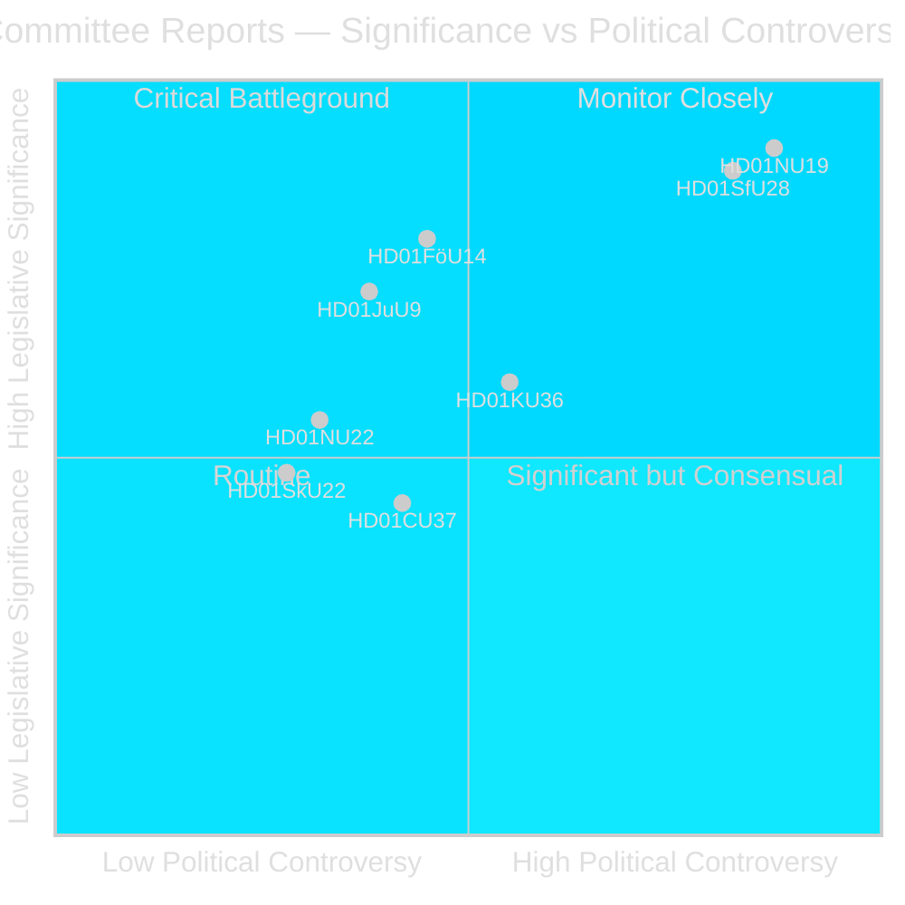
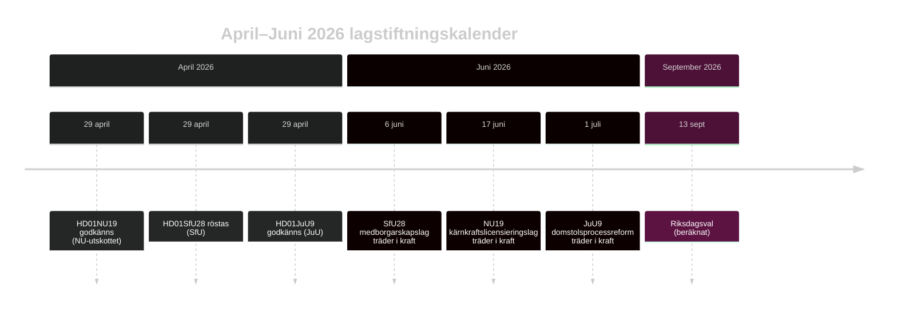

# Riksdagen godkänner kärnkraftslicensiering och skärpta medborgarskapsregler

## Sammanfattning

Riksdagens utskottsfas under riksmötet 2025/26 levererar två politiskt skakande betänkanden under sista veckan i april 2026: Näringsutskottet (NU) godkänner en ny lag som möjliggör direkt regeringstillstånd för kärnkraftsinstallationer (HD01NU19), och Socialförsäkringsutskottet (SfU) godkänner kraftigt skärpta medborgarskapskriterier inklusive ett 8-årigt bosättningskrav, språktest och inkomstkrav (HD01SfU28). Båda åtgärderna definierar Tidökoalitionens valrörelsearvets och träder i kraft innan valet i september 2026, vilket dramatiskt omformar Sveriges energi- och integrationsdebatt.

## Politiska bedömningar detta briefing stöder

1. **Redaktionell bedömning**: Led med NU19 kärnkraftslicensiering och SfU28 medborgarskap som de två definierande lagstiftningshändelserna i april 2026; kontextualisera inom valrörelsen inför september 2026.
2. **Koalitionsanalys**: Bedöm om SfU28:s tvärpartiliga S/C/M/SD-stöd signalerar en permanent center-höger-förändring i integrationspolitiken eller en taktisk anpassning inför valet.
3. **Policybevakningsspårning**: Övervaka Migrationsverkets och SSM:s implementeringsberedskap för ikraftträdandedatumen 6 juni och 17 juni 2026.
4. **Underrättelsebedömning**: Utvärdera risken för rättsliga utmaningar mot kärnkraftslicensieringen som kringgår standardmässiga miljöbalkensprocesser.

## 60-sekunders läsning

- 🔵 **Kärnkraftslicensiering** (HD01NU19): Ny lag (Prop 2025/26:171) låter kärnkraftsutvecklare ansöka direkt till regeringen om godkännande, kringgår standardmässig miljöbalken kap 17-process. Lagrådet granskade och följdes. Träder i kraft 17 juni 2026. Oppositionen (S, V, C, MP) lämnade två formella reservationer. **Valbetydelse: HÖG** — kärnkraft är den definierande energipolitiska skiljelinjen 2026.
- 🔴 **Medborgarskapsskärpning** (HD01SfU28): Prop 2025/26:175 höjer bosättningskravet från 5 till 8 år, tillför språk- och samhällskunskapstest, inför inkomstgolv (≥3 inkomstbasbelopp), skärper vandelsreglerna. Tvärpartilig omröstning: M, SD, KD, L + S och C röstade Ja. V och MP var starkt emot med 10 reservationer. Träder i kraft 6 juni 2026 (språktestkomponenten uppskjuten till oktober 2027 eller tidigare). **Valbetydelse: HÖG** — integration har varit den dominerande väljarfrågan sedan 2022.
- 🟡 **Processreform i domstol** (HD01JuU9): Prop 2025/26:155 utvidgar tillåtligheten av tidiga förhörsinspelningar och tar bort tilltrosbestämmelserna i hovrätterna. En V-reservation. Träder i kraft 1 juli 2026. Stärker åtal i gängbrottmål.
- 🔵 **Militärt samarbete** (HD01FöU14): Utskottet godkände förbättrade villkor för operativt militärt samarbete. Ännu ej publicerat — hög strategisk betydelse i NATO-kontext.
- ⚪ **Kritisk infrastruktur** (HD01FöU20): Ny lag för CER/NIS2-resiliens planerad; betänkande schemalagt för publicering juni 2026.

## Viktigaste framåtriktat utlösare

**Bevaka**: Om NU19:s lag om kärnkraftslicensiering genererar konstitutionellt klagomål eller remiss till Högsta förvaltningsdomstolen före juli 2026, riskerar hela kärnkraftsexpansionsprogrammet att försenas till nästa mandatperiod.

## Konfidensbedömning

**Konfidensgrad: HÖG** — Alla tre publicerade betänkandena innehåller fulltext och tydliga utskottspositioner. Röstdata för SfU28 bekräftade. DIW-signifikansbedömning vilar på primärkällebevis (dok_id, utskottsprotokoll, Lagrådsreferenser).

## Nyckelaktörer

| Aktör | Roll | Åtgärd/Ståndpunkt |
|-------|------|-------------------|
| Tobias Andersson (SD) | NU-utskottsordförande | Ledde HD01NU19-godkännandet — SD:s viktigaste energipolitiska seger |
| Viktor Wärnick (M) | SfU-utskottsordförande | Presiderade över HD01SfU28 tvärpartilig omröstning |
| Kenneth G Forslund (S) | SfU-ledamot | S-talesperson som röstade Ja på SfU28 — bekräftar S strategisk pivot |
| Julia Kronlid (SD) | SfU-ledamot | SD-representant bekräftar SD-S-samstämmighet i medborgarskap |
| Kerstin Lundgren (C) | SfU-ledamot | C-representant — röstade Ja, bryter med traditionell liberal migrationshållning |
| Gudrun Nordborg (V) | JuU-ledamot | Ensam reservant mot JuU9 — EMRK rättvis rättegång-reservation |
| SSM (Strålsäkerhetsmyndigheten) | Kärnkraftsregulator | Måste utfärda kärntekniska planregler senast Q3 2026 för att NU19 ska fungera |
| Migrationsverket | Migrationsverksamhet | Måste implementera SfU28 inkomst-/bosättningsverifiering senast 6 juni 2026 |

## Viktiga datum

- **6 juni 2026**: SfU28 medborgarskapsskärpning träder i kraft — dagar före Riksdagens sommarrecess
- **17 juni 2026**: NU19 kärnkraftslicensieringslag träder i kraft — Sveriges viktigaste energilag på 30 år
- **1 juli 2026**: JuU9 domstolsprocessreform träder i kraft
- **~13 september 2026**: Riksdagsval — alla tre lagarna utgör valets bakgrund

<!-- source-sha: 69fae8c5b56fa37d6a281e5e15d5acb956d405aa -->
