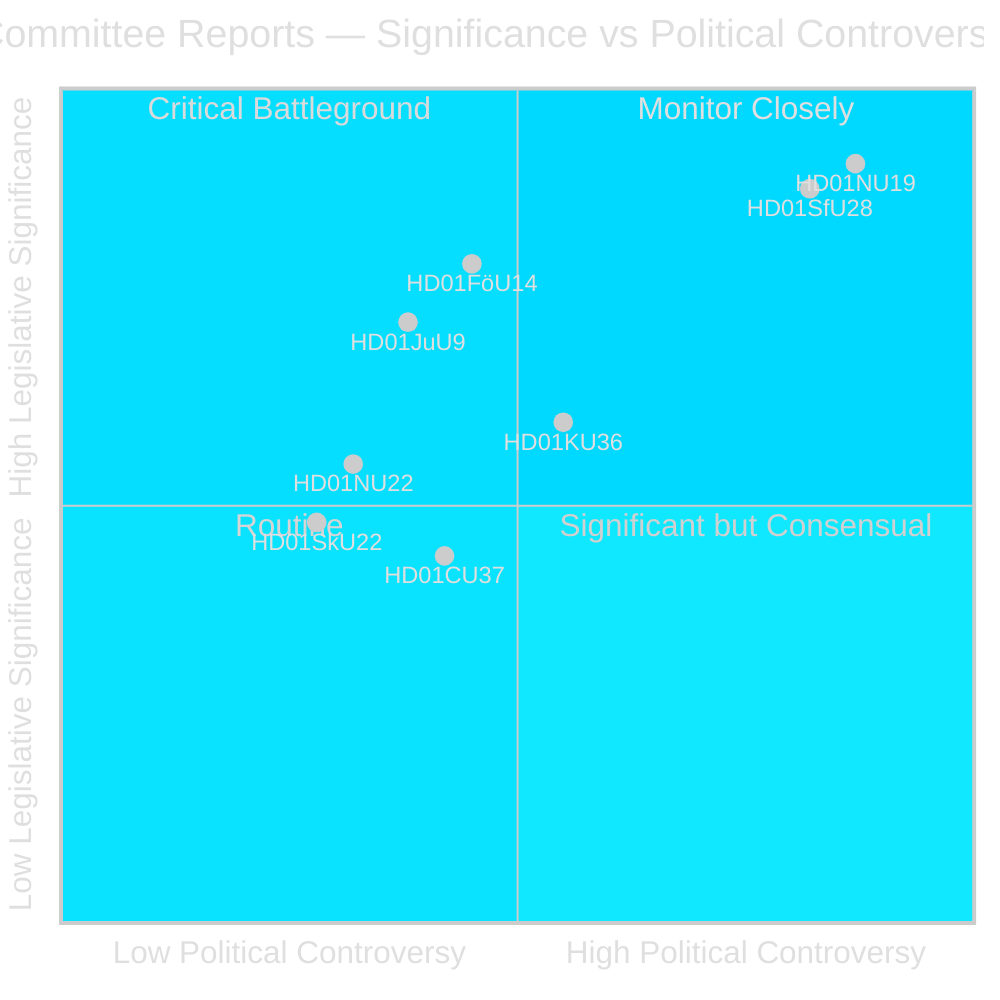
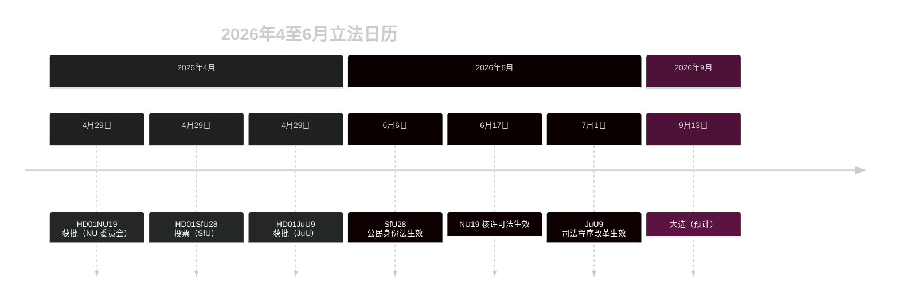

# 瑞典议会推进核许可改革和公民身份收紧

## 摘要

Riksdag 委员会阶段（riksmötet 2025/26）在2026年4月最后一周提交两份在政治上震撼人心的 betänkanden：企业委员会（NU）批准一项允许政府直接许可核设施的新法律（HD01NU19），社会保险委员会（SfU）批准大幅收紧的公民身份标准，包括8年居住要求、语言测试和最低收入要求（HD01SfU28）。两项措施都界定了 Tidö 联合政府的政策遗产，并将在2026年9月选举前生效。

## 本简报支持的政策决定

1. **编辑判断**：以 NU19 核许可和 SfU28 公民身份作为2026年4月委员会周期两大决定性立法事件进行前置报道。
2. **联合分析**：评估 SfU28 获得 S/C/M/SD 跨党支持是否预示着移民融合政策上的永久性中间偏右转变。
3. **政策追踪**：监测 Migrationsverket 和 SSM 为2026年6月6日和6月17日生效日期的实施准备情况。
4. **情报评估**：评估绕过标准环境程序的核许可面临法律挑战的风险。

## 60秒阅读

- 🔵 **核许可**（HD01NU19）：新法律（Prop 2025/26:171）允许核能开发商直接向政府申请批准，绕过 miljöbalken 第17章标准程序。Lagrådet 审查后被遵循。2026年6月17日生效。反对派（S, V, C, MP）提交两项正式保留意见。**选举重要性：高** ——核能是2026年界定性能源政策分歧线。
- 🔴 **公民身份收紧**（HD01SfU28）：Prop 2025/26:175 将居住要求从5年提高到8年，增加语言和公民测试，引入最低收入（≥3 inkomstbasbelopp），收紧行为标准。跨党投票：M、SD、KD、L + S 和 C 投票赞成。V 和 MP 强烈反对，提出10项保留意见。2026年6月6日生效。**选举重要性：高** ——融合一直是2022年以来选民最关注的议题。
- 🟡 **司法程序改革**（HD01JuU9）：Prop 2025/26:155 扩大了早期访谈录音的可采性。2026年7月1日生效。加强团伙犯罪起诉。
- 🔵 **军事合作**（HD01FöU14）：委员会批准了改善作战军事合作条件的提案。在北约背景下具有高度战略意义。
- ⚪ **关键基础设施**（HD01FöU20）：CER/NIS2 弹性新法律已计划；betänkande 预定2026年6月发布。

## 主要前瞻性触发因素

**监测**：如果 NU19 核许可法在2026年7月前引发宪法诉讼或行政法院转介，整个核扩张计划面临延期风险。

## 可信度评估

**可信度：高** ——已发布的三份 betänkanden 均包含完整文本和清晰的委员会立场。

## 主要行动者

| 行动者 | 角色 | 行动/立场 |
|--------|------|----------|
| Tobias Andersson (SD) | NU 委员会主席 | 主持 HD01NU19 批准 — SD 最重要的能源政策胜利 |
| Viktor Wärnick (M) | SfU 委员会主席 | 主持 HD01SfU28 跨党投票 |
| Kenneth G Forslund (S) | SfU 成员 | 赞成 SfU28 的 S 发言人 — 确认 S 的战略转向 |
| Julia Kronlid (SD) | SfU 成员 | SD 代表确认 SD-S 在公民身份上的一致立场 |
| Kerstin Lundgren (C) | SfU 成员 | C 代表 — 投票赞成，打破传统自由主义移民立场 |
| Gudrun Nordborg (V) | JuU 成员 | JuU9 唯一持保留意见者 — ECHR 公正审判保留 |
| SSM（Strålsäkerhetsmyndigheten） | 核能监管机构 | 须于2026年Q3前发布核技术计划法规，NU19 方可运作 |
| Migrationsverket | 移民局 | 须于2026年6月6日前实施 SfU28 收入/居住核查 |

## 关键日期

- **2026年6月6日**：SfU28 公民身份收紧生效
- **2026年6月17日**：NU19 核许可法生效 — 瑞典30年来最重要能源法律
- **2026年7月1日**：JuU9 司法程序改革生效
- **约2026年9月13日**：大选

<!-- source-sha: 69fae8c5b56fa37d6a281e5e15d5acb956d405aa -->
