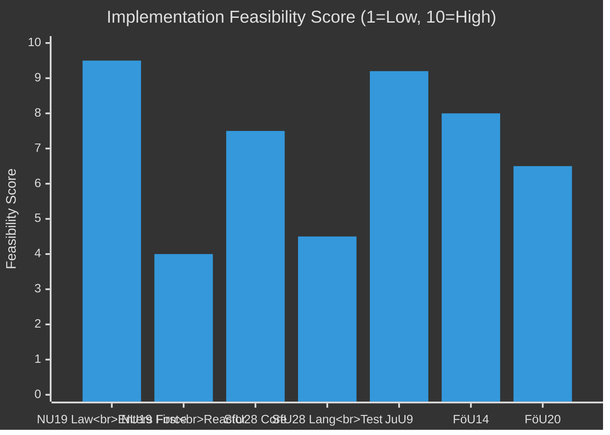

# Implementation Feasibility — Committee Reports 2026-05-04

## Feasibility Assessment Framework

Analysis of realistic implementation prospects for each major betänkande, including Statskontoret relevance assessment.

## HD01NU19 — Nuclear Licensing New Law

| Dimension | Assessment | Risk | Notes |
|-----------|-----------|------|-------|
| Legal readiness | HIGH | LOW | Lagrådet reviewed; law drafting complete |
| Regulatory readiness (SSM) | MEDIUM | MEDIUM | SSM must issue implementation regulations; timeline Q3–Q4 2026 |
| Industry readiness | MEDIUM-LOW | HIGH | No applications ready; kärnteknisk plan must be approved first |
| Municipal/political readiness | MEDIUM | MEDIUM | Municipal consent requirement creates local politics dimension |
| Timeline to first application | 18–36 months | MEDIUM | SSM regulations needed; plan approval needed |
| Timeline to first operating reactor | 12–17 years | N/A | Long-term project; this law is enabling step only |

**Overall implementation feasibility**: HIGH for law itself entering force; MEDIUM for achieving operational nuclear capacity within next government term.

**Statskontoret relevance**: YES
- The new licensing process involves a novel regulatory arrangement between government (permitting authority), SSM (technical review), and municipalities (consent). Statskontoret evaluation of the process design would be appropriate within 3 years of implementation.
- Statskontoret has previously evaluated nuclear safety regulation (SSM) — this new permitting track is analytically adjacent.
- **Recommendation**: Commission Statskontoret evaluation of the kärnteknisk plan approval process no later than 2029.

## HD01SfU28 — Citizenship Requirements

| Dimension | Assessment | Risk | Notes |
|-----------|-----------|------|-------|
| Legal readiness | HIGH | LOW | Law complete; takes force 6 June 2026 |
| Migrationsverket IT capacity | LOW-MEDIUM | HIGH | New income verification and residency calculation requires IT system updates |
| Language/civics test infrastructure | LOW | HIGH | Test system must be built; deferred to October 2027 at earliest |
| Income verification procedures | MEDIUM | MEDIUM | Skatteverket cooperation needed; data sharing protocols |
| Staff training | MEDIUM | MEDIUM | Case handlers must apply new 8-year rule + income floor calculations |
| Appeals system readiness | MEDIUM | MEDIUM | Förvaltningsrätten + Migrationsöverdomstolen case law will develop 2026–2027 |

**Overall implementation feasibility**: MEDIUM — law enters force on time but full implementation (including language test) will take 12–18 months beyond entry-into-force date.

**Statskontoret relevance**: YES
- Migrationsverket is a frequent subject of Statskontoret evaluation.
- The combined effect of the 2022–2026 migration reform package (including SfU28) warrants a comprehensive Statskontoret process evaluation within 2 years of SfU28 implementation.
- **Recommendation**: Commission Statskontoret evaluation of Migrationsverket's SfU28 implementation capacity by Q1 2027.

## HD01JuU9 — Court Process Reform

| Dimension | Assessment | Risk | Notes |
|-----------|-----------|------|-------|
| Legal readiness | HIGH | LOW | Law complete; takes force 1 July 2026 |
| Court system readiness | HIGH | LOW | Domstolsverket already has digital case management |
| Åklagarmyndigheten readiness | HIGH | LOW | Prosecutors already record early interviews in gang cases |
| Judiciary training | MEDIUM-HIGH | LOW | Judicial council (Domstolsakademin) will issue guidance |
| Public defender adjustment | MEDIUM | LOW | Advokatsamfundet will issue practice guidance |
| Appeals procedure adjustment | HIGH | LOW | Hovrätten removes tilltrosbestämmelserna — cleaner case processing |

**Overall implementation feasibility**: HIGH — this reform is operational-level change that courts and prosecutors can absorb quickly.

**Statskontoret relevance**: LIMITED
- JuU9 is an operational court procedure change. Statskontoret typically does not evaluate individual court procedure reforms unless there are cross-agency efficiency implications.
- **Recommendation**: Monitor through Domstolsverkets annual report 2026–2027; Riksrevisionen audit if efficiency targets not met by 2028.

## HD01FöU14 — Military Cooperation

| Dimension | Assessment | Risk | Notes |
|-----------|-----------|------|-------|
| Legal readiness | HIGH (assumed) | LOW | Committee approved; details classified |
| Försvarsmakten operational readiness | MEDIUM-HIGH | LOW | NATO integration proceeds |
| International agreements | HIGH | LOW | Cooperation treaties are policy-driven |
| Implementation timeline | ONGOING | LOW | Military cooperation is continuous, not one-time |

**Statskontoret relevance**: LIMITED
- Defence policy implementation is primarily within Försvarsmakten and Totalförsvar framework; Statskontoret does not typically evaluate classified military cooperation agreements.
- **Recommendation**: FOI (Totalförsvarets forskningsinstitut) assessment would be more appropriate.

## HD01FöU20 — Critical Infrastructure Resilience

| Dimension | Assessment | Risk | Notes |
|-----------|-----------|------|-------|
| Legal readiness | MEDIUM (not yet published) | MEDIUM | Betänkande scheduled; EU CER directive compliance obligation |
| MSB supervision capacity | MEDIUM | MEDIUM | MSB needs resources to supervise ~100 designated operators |
| Operator compliance readiness | MEDIUM-LOW | MEDIUM | Many operators will need new risk and resilience plans |
| EU Commission alignment | HIGH | LOW | CER Directive compliance — Sweden following EU framework |

**Statskontoret relevance**: YES — HIGH PRIORITY
- Critical infrastructure resilience across sectors (energy, water, transport, health) is exactly the cross-cutting policy area Statskontoret evaluates.
- Sweden is ~2 years late on EU CER Directive transposition. A Statskontoret evaluation of MSB's implementation of the new supervision regime would be valuable.
- **Recommendation**: Commission Statskontoret evaluation of CER/NIS2 supervision arrangements at MSB within 18 months of FöU20 law entering force.

## Delivery Risk Summary

