# Media Framing Analysis — Committee Reports 2026-05-04

## v2.1 Full Frame Analysis

### Frame 1: Nuclear Energy as Energy Security vs Environmental Threat (HD01NU19)

**Frame A (Government/M+SD+KD+L)**: "Energy independence and stable electricity prices"
- Key phrases expected: "historisk satsning på kärnkraft", "energisäkerhet för Sverige", "stabila elpriser", "elbrist förebyggs"
- Media likely to amplify: Aftonbladet (conditional), Svenska Dagbladet, Expressen
- Argument logic: Sweden faces electricity supply gap → nuclear fills it → NU19 enables this → government delivers

**Frame B (Opposition/V+MP+S-left)**: "Bypassing democracy and environmental protection"
- Key phrases expected: "omgår miljöbalken", "demokratiskt underskott", "kärnkraftsrisker", "rättsosäkert"
- Media likely to amplify: DN (nuanced), Sydsvenskan, Aftonbladet opinion
- Argument logic: New law bypasses environmental review → less democratic process → risks to future generations

**Frame C (Technical)**: "Licensing efficiency — does it work?"
- Industry media (Ny Teknik, EnergiNyheterna): Will this actually work? SSM capacity? Permitting timeline realistic?
- Most important for long-term policy: technical frame will dominate post-election regardless of who wins

**Expected dominant frame in campaign**: 
- Frame A dominates in pro-government media
- Frame B dominates on social media and in opposition campaign materials
- Frame C will emerge if/when first nuclear application is filed

### Frame 2: Citizenship — Integration Success vs Barrier to Belonging (HD01SfU28)

**Frame A (Government/SD+M)**: "High bar for Swedish citizenship — protecting what citizenship means"
- Key phrases: "medborgarskapets värde", "självförsörjning", "integration ska löna sig", "svenska värderingar"
- SD will frame it as: "We finally achieved what we promised since 2005"
- M will frame it as: "Responsible integration policy"

**Frame B (Cross-party civic)**: "Sweden aligning with European norms — pragmatic update"
- S framing: "We updated rules to match modern expectations — language and self-sufficiency are reasonable"
- C framing: "Danish model worked — we adopted it pragmatically"
- This frame neutralises SD's uniqueness claim

**Frame C (Civil society/V+MP)**: "Discriminatory barriers to full civic participation"
- Key phrases: "utanförskap", "rättsosäkerhet för flyktingar", "ekonomisk diskriminering", "ECHR-strid"
- Expected amplification: Expo, Arena Idé, Göteborgs-Posten opinion section, SR (public radio)

**Frame D (Implementation)**: "Will Migrationsverket cope?"
- Expected in: SVT Nyheter, TT, Aftonbladet reporting (distinct from opinion)
- "Backlog already exists — new tests add to queue" — implementation journalism

**Expected dominant frame**:
- Frame A dominates in SD media ecosystem
- Frame B dominates in government and S party communications
- Frame C mobilises V/MP base but alienates swing voters
- Frame D will dominate in autumn 2026 implementation journalism

### Frame 3: Court Reform — Crime Fighting vs Fair Trials (HD01JuU9)

**Frame A (Government)**: "More effective justice against gang criminals"
- Links to Tioårsprogrammet; early interview recordings protect fearful witnesses
- Expected amplification: Expressen, Aftonbladet news section, SVT

**Frame B (V + legal profession)**: "Fair trial rights eroded"
- ECHR Article 6; witness credibility; wrongful conviction risk
- Expected amplification: Legal academics, Advokatsamfundet press releases, SR Ekot

**Expected dominant frame**: Frame A — crime is top voter issue; Frame B is a specialist argument

### Frame 4: Defence — Sweden Completes NATO Integration

**Frame A (Bipartisan)**: "Sweden fully operational in NATO — military cooperation normalised"
- Near-consensus framing; S reluctant but not opposing
- Media: All major news outlets will report as factual progression

**Frame B (V+MP niche)**: "Military cooperation overreaches sovereignty"
- Marginal framing; will not achieve mainstream amplification

## Media Outlet Alignment Map

```mermaid
%%{init: {"theme": "dark"}}%%
graph TD
    A[NU19 Nuclear Law] --> B[SvD, Expressen<br>Frame A: Energy security]
    A --> C[DN, SR, SVT<br>Frame B+C: Nuanced review]
    A --> D[Social media, Klimatnyheterna<br>Frame B: Environmental threat]
    
    E[SfU28 Citizenship] --> F[SD media, Samhällsnytt<br>Frame A: Integration success]
    E --> G[DN, Aftonbladet, SVT<br>Frame B+D: Pragmatic + implementation]
    E --> H[Arena Idé, Expo, V/MP channels<br>Frame C: Civil society critique]
    
    style A fill:#ff006e,stroke:#ff006e
    style E fill:#ff8c00,stroke:#ff8c00
    style B fill:#1a3a5c,stroke:#00d9ff
    style F fill:#4a1a1a,stroke:#f6c90e
```

## Disinformation Risk Assessment

**NU19**: 
- Risk: Exaggerated radiation/accident claims — MEDIUM. Chernobyl/Fukushima comparisons likely to resurface.
- Monitor: Russian disinformation ecosystem may amplify anti-nuclear messaging — documented pattern in Nordic countries.

**SfU28**:
- Risk: Exaggerated claims about who is affected — MEDIUM. Both directions: "only asylum seekers affected" (false) and "all immigrants lose rights" (false).
- Monitor: Both far-right (over-claiming achievement) and far-left (over-claiming harm) distortion vectors.
