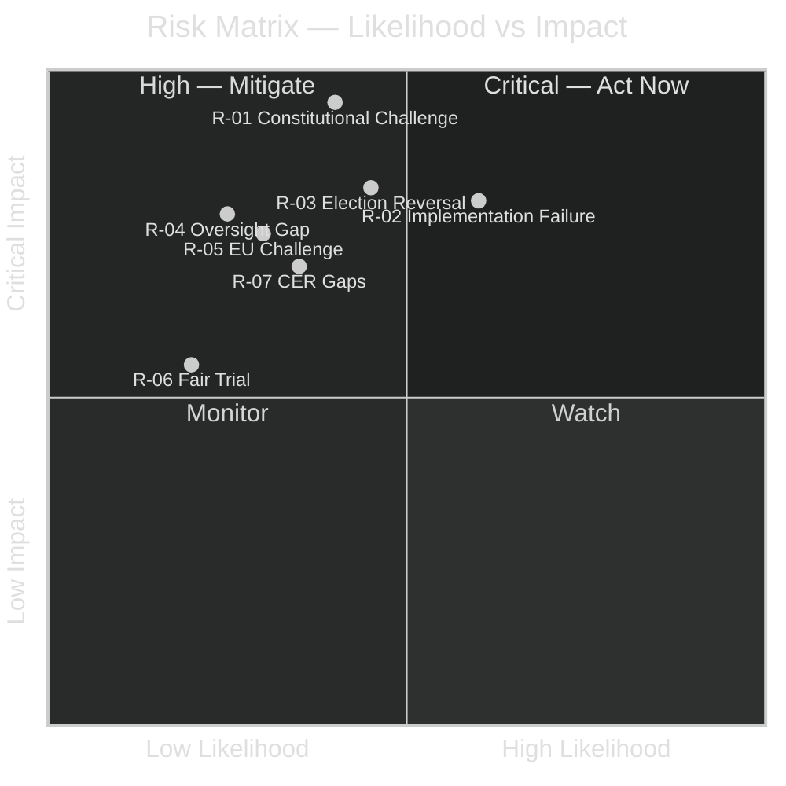

# Risk Assessment — Committee Reports 2026-05-04

## Risk Register (5-Dimension)

| Risk ID | Risk Description | Likelihood | Impact | Severity | Owner | Mitigation |
|---------|-----------------|------------|--------|----------|-------|-----------|
| R-01 | Constitutional/legal challenge to NU19 nuclear licensing process mounted by opposition parties or environmental groups before July 2026 | MEDIUM (40%) | CRITICAL | HIGH | SSM/Energimyndigheten | Lagrådet review completed; government followed advice; monitor HFD/VR applications |
| R-02 | SfU28 implementation failure — Migrationsverket unable to operationalise language/income tests by June 6, 2026 deadline | HIGH (60%) | HIGH | HIGH | Migrationsverket | Phased approach; language test deferred to Oct 2027; income/residency checks from day one |
| R-03 | September 2026 election delivers centre-left government that reverses NU19 nuclear licensing law | MEDIUM-HIGH (45%) | HIGH | HIGH | Riksdagen (next term) | Law already in force; reversal requires new legislation — not automatic |
| R-04 | NATO operational agreements within FöU14 scope classified — parliamentary oversight gap | LOW-MEDIUM (25%) | HIGH | MEDIUM | FöU (defence committee) | Parliamentary oversight through KU; Riksrevisionen audit possible |
| R-05 | EU challenge to NU19 under Euratom/State Aid rules — delays permitting for new nuclear applications | LOW-MEDIUM (30%) | HIGH | MEDIUM | Klimat- och näringslivsdepartementet | Euratom notification review underway; government confident of compliance |
| R-06 | JuU9 early interview admissibility abused — fair trial concerns in appellate proceedings | LOW (20%) | MEDIUM | LOW-MEDIUM | Hovrätten/HD | Judicial guidelines expected; V reservation on this point noted |
| R-07 | HD01FöU20 critical infrastructure law implementation leaves gaps in operator compliance | MEDIUM (35%) | HIGH | MEDIUM | MSB (Myndigheten för samhällsskydd och beredskap) | Phased compliance schedule expected; MSB supervising |

## Aggregate Risk Profile

- **Critical risks (mitigate immediately)**: R-01, R-02
- **High risks (active monitoring)**: R-03, R-04
- **Medium risks (periodic review)**: R-05, R-07
- **Low risks (watchlist)**: R-06

## Risk Evolution Triggers

| Trigger | Risk affected | Direction |
|---------|--------------|-----------|
| Opposition party files HFD application re NU19 constitutionality | R-01 | ↑ to HIGH |
| Migrationsverket publishes implementation plan for SfU28 | R-02 | ↓ if plan credible |
| September 2026 election poll: centre-left coalition leads by >5pp | R-03 | ↑ |
| FöU14 betänkande published with full text | R-04 | ↓ if transparent |
| EC Commission issues formal inquiry on NU19 state aid | R-05 | ↑ |

