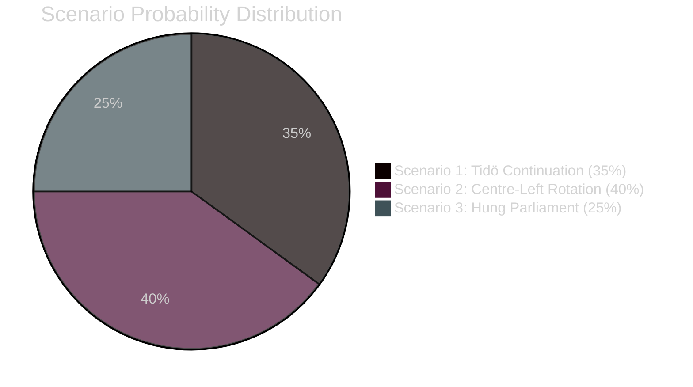

# Scenario Analysis — Committee Reports 2026-05-04

## Scenario Framework

Analysing three forward scenarios based on the April 2026 committee cycle decisions and September 2026 election trajectory. Probabilities sum to 100%.

## Scenario 1: Tidö Continuation — Nuclear & Integration Legacy Entrenched (P=35%)

**Description**: Tidö Coalition (M+SD+KD+L) wins September 2026 election with majority or forms minority government. NU19 nuclear licensing law remains; first applications under new process submitted Q4 2026. SfU28 fully implemented. JuU9 court reforms operational.

**Enabling conditions**:
- Economic improvement (inflation <3%, real wage growth +2%) boosts government approval
- No major NU19 legal challenge before election
- Crime statistics improve under Tioårsprogrammet
- SD remains in parliamentary support role

**Political dynamics**:
- M campaign: "We delivered nuclear, stable energy prices incoming"
- SD campaign: "We delivered citizenship tightening, Sweden first"
- S forced to defend SfU28 cross-party vote in debates with V/MP

**Policy outcomes (T+18 months)**:
- 2–3 nuclear site applications filed under NU19 by end 2027
- Migrationsverket implementing language tests by October 2027
- JuU9 producing measurable increase in gang-crime conviction rates

**Probability**: 35% — Coalition governing competently but narrow margins; economic headwinds possible

---

## Scenario 2: Centre-Left Rotation — Policy Review (P=40%)

**Description**: S+C+MP (possibly with V external support) forms government after September 2026. NU19 nuclear licensing law placed under "parlamentarisk utredning"; SfU28 language test deferred further; JuU9 largely retained.

**Enabling conditions**:
- S recovers in polls to 30%+ by August 2026
- C breaks from M/SD orbit definitively
- MP survives 4% threshold (currently polling 3.5–4.5%)
- V agrees to parliamentary support without portfolio

**Political dynamics**:
- S must balance SfU28 own-goal (voted for tougher citizenship) with left coalition
- C can claim "nuclear process reform" while not necessarily reversing nuclear power
- MP demands coal/nuclear conditions before offering support

**Policy outcomes (T+18 months)**:
- NU19 suspended pending review commission (not reversed — too costly)
- SfU28 income floor potentially adjusted downward
- Military cooperation agreements (FöU14) retained — NATO commitments bind
- Court reform (JuU9) retained — crime remains voter priority

**Probability**: 40% — Largest single scenario given current polling trends suggesting tight race

---

## Scenario 3: Hung Parliament — Caretaker + Extended Negotiations (P=25%)

**Description**: September 2026 election produces hung parliament within margin of error. Neither bloc reaches 175 seats. Extended coalition formation talks. Caretaker government (NU19 enters force under current government, SfU28 also operational).

**Enabling conditions**:
- No bloc reaches 175-seat majority
- SD refuses to join formal government; KD/L demand conditions M cannot meet
- S refuses C coalition without concessions on nuclear

**Political dynamics**:
- All laws from April 2026 remain in force during negotiations
- First nuclear applications possibly filed in legal uncertainty
- Migrationsverket implements SfU28 under caretaker mandate

**Probability**: 25% — Historically uncommon in Swedish politics but 2026 polling is unusually close

---

## Probability Summary

## Scenario Matrix: Policy Impact by Outcome

| Policy | Scenario 1 | Scenario 2 | Scenario 3 |
|--------|-----------|-----------|-----------|
| NU19 Nuclear Licensing | Full implementation | Review commission | In force; applications in limbo |
| SfU28 Citizenship | Full implementation | Income floor review | In force; implementation proceeds |
| JuU9 Court Reform | Full implementation | Retained | Retained |
| FöU14 Military Cooperation | Full implementation | Retained (NATO) | Retained |
| FöU20 Critical Infrastructure | Full implementation | Full implementation (EU obligation) | Full implementation |
