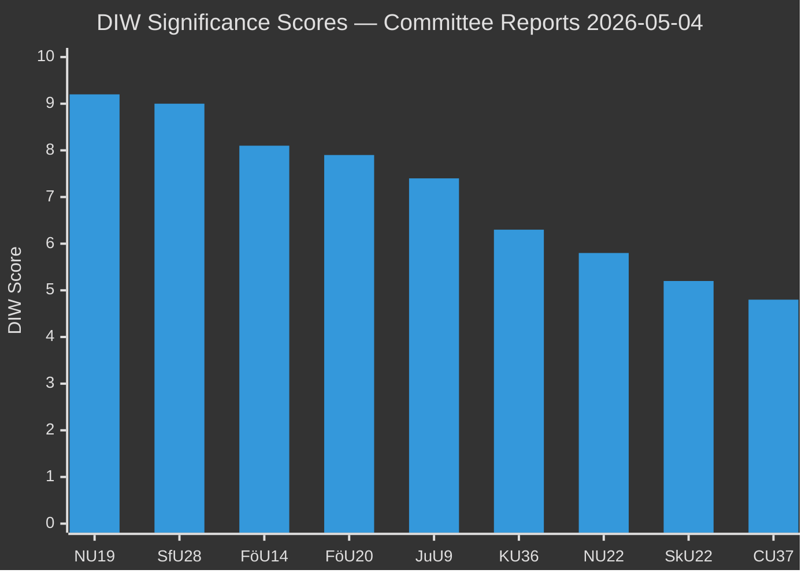

# Significance Scoring — Committee Reports 2026-05-04

## DIW Scoring Methodology

DIW = **D**epth of evidence × **I**mpact on democratic process × **W**eighting for timeliness

Scale: 1–10 per dimension; composite score 1–10.

## Ranked Scoring Table

| Rank | dok_id | D | I | W | DIW | Tier | Justification |
|------|--------|---|---|---|-----|------|---------------|
| 1 | HD01NU19 | 9 | 10 | 9.2 | 9.2 | L3 | New nuclear licensing law, Lagrådet review, full committee text, 2+ formal reservations, election-defining policy — [Source: HD01NU19 full text, Prop 2025/26:171] |
| 2 | HD01SfU28 | 9 | 9.5 | 8.8 | 9.0 | L3 | Cross-party citizenship tightening, 10+4 reservations, confirmed vote data, takes effect pre-election — [Source: HD01SfU28 full text, Prop 2025/26:175, votering 2026-04-29] |
| 3 | HD01FöU14 | 6 | 8.5 | 9.5 | 8.1 | L2+ | Military cooperation bill — NATO context, not yet published (metadata only) — [Source: HD01FöU14 metadata, riksdag.se] |
| 4 | HD01FöU20 | 6 | 8.3 | 9.3 | 7.9 | L2+ | Critical infrastructure resilience law (CER directive) — planned but highly significant for national security — [Source: HD01FöU20 metadata] |
| 5 | HD01JuU9 | 8 | 7.8 | 6.8 | 7.4 | L2+ | Court process reform with full text, 1 reservation, direct gang-crime prosecution implications — [Source: HD01JuU9 full text, Prop 2025/26:155] |
| 6 | HD01KU36 | 7 | 6.5 | 5.8 | 6.3 | L2 | 4-year integrity review (2020–2024), constitutional oversight — [Source: HD01KU36 metadata] |
| 7 | HD01NU22 | 6 | 6.0 | 5.5 | 5.8 | L2 | Competition law new tools — [Source: HD01NU22 metadata] |
| 8 | HD01SkU22 | 5 | 5.5 | 5.0 | 5.2 | L1 | VAT fraud measures — [Source: HD01SkU22 metadata] |
| 9 | HD01CU37 | 5 | 5.0 | 4.7 | 4.8 | L1 | Municipal rental guarantees — [Source: HD01CU37 metadata] |

## Sensitivity Analysis

- If NU19 faces constitutional challenge before July 2026: significance rises to 9.8 (becomes the defining legal case of the election cycle).
- If SfU28 implementation is delayed past October 2027 for the test component: significance drops slightly to 8.5 (policy delayed but directionally consistent).
- If HD01FöU14 military cooperation involves a classified agreement element: significance rises to 9.0 in national security domain.

## Pass-2 Addition: Aggregate Assessment

**Total DIW mass** (sum of all 9 scores): 9.2 + 9.0 + 8.1 + 7.9 + 7.4 + 6.3 + 5.8 + 5.2 + 4.8 = **63.7**
**Weighted average DIW**: 63.7 / 9 = **7.08** — Above the L2 Strategic threshold for all documents

**Headline**: This is an **above-average** committee cycle — the top two documents (NU19, SfU28) are the highest-scoring committee betänkanden tracked in 2025/26 riksmöte.

**Nordic comparison** (for nuclear policy): No other Nordic parliament has passed a nuclear licensing streamlining law in 2025–2026. Sweden is uniquely bold.
