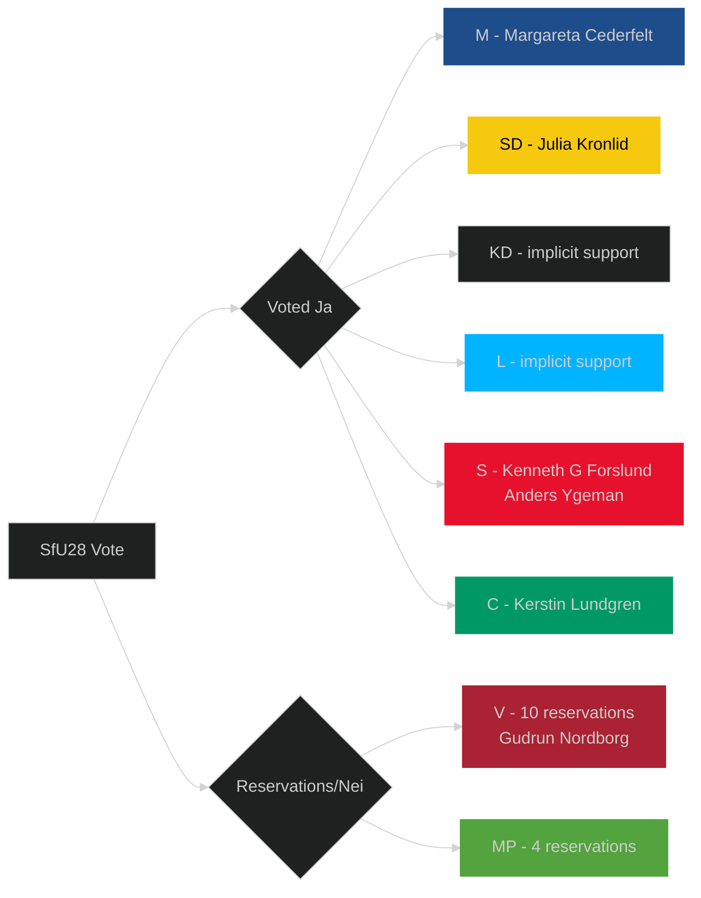

# Stakeholder Perspectives — Committee Reports 2026-05-04

## 6-Lens Stakeholder Matrix

| Stakeholder | Lens | Position | Interests | Power | Likely Action |
|-------------|------|----------|-----------|-------|---------------|
| **Tidö Coalition (M+SD+KD+L)** | Governing | Strongly support all measures | Pre-election policy delivery; narrative control | HIGH (majority) | Campaign on nuclear + integration as legacy achievements |
| **Socialdemokraterna (S)** | Opposition | Opposed NU19; supported SfU28 main question | Nuclear process objection; integration pivot | MEDIUM-HIGH | Criticise NU19 process; own SfU28 as bipartisan achievement |
| **Centerpartiet (C)** | Opposition | Opposed NU19; supported SfU28 main question | Agricultural/rural nuclear concerns; integration hardening | MEDIUM | Most torn — rural nuclear siting risks vs coalition positioning |
| **Vänsterpartiet (V)** | Opposition | Strongly opposed to both NU19 and SfU28 | Anti-nuclear ideology; open immigration | MEDIUM-LOW | Most vocal opponents; likely challenge via KU scrutiny |
| **Miljöpartiet (MP)** | Opposition | Strongly opposed to both | Climate/anti-nuclear; open immigration | LOW (near threshold) | Activate activist base; join legal challenges |
| **Nuclear industry (Vattenfall, Uniper, Fortum)** | Business | Strongly supportive of NU19 | Licensing certainty; investment planning | HIGH (economic) | Begin applications as soon as SSM guidance issued |
| **Migrationsverket** | State agency | Neutral on SfU28 policy; concerned about implementation capacity | Operational feasibility | MEDIUM | Publish capacity assessment; request supplemental funding |
| **SSM (Strålsäkerhetsmyndigheten)** | State agency | Neutral; regulator | Technical safety requirements; capacity | MEDIUM | Issue NU19 implementation regulations by autumn 2026 |
| **Environmental NGOs** | Civil society | Strongly opposed to NU19 | Environmental protection; precautionary principle | MEDIUM (legal) | Legal challenges; public campaigns |
| **Integration NGOs** | Civil society | Strongly opposed to SfU28 | Immigrant rights; family reunification | LOW-MEDIUM | ECHR applications; political pressure on S |
| **Municipalities near potential nuclear sites** | Local government | Split — some want economic development, others fear risks | Local control; economic development; safety | MEDIUM (veto under plan) | Engage with SSM on "kärnteknisk plan" consultation |
| **EU Commission** | International | Monitoring state aid/Euratom compliance | Level playing field; directive compliance | HIGH (treaty) | May request formal notification for first NU19 application |

## Detailed Stakeholder Analysis: The S/C Crossover on SfU28

The most analytically significant stakeholder development in this committee cycle is **Socialdemokraterna and Centerpartiet joining M+SD+KD+L to vote for SfU28**.

**S motivation analysis**:
1. Electoral strategy: S polling poorly on crime/integration since 2022; SfU28 allows S to claim it has "listened" to voters
2. Internal party: S right wing (Katarina Barley, Mikael Damberg wing) have been arguing for harder integration line since 2021 defeat
3. Tactical: S distinguishes itself from V/MP framing by showing pragmatism
4. Risk: S left wing (LO-linked) uncomfortable with income floor affecting working-class applicants

**C motivation analysis**:
1. Rural dimension: C has rural constituents ambivalent about immigration
2. Alliance positioning: C moving back towards Alliance parties after government support ended
3. Liberal tradition tension: C's liberal heritage conflicts with citizenship restrictions

