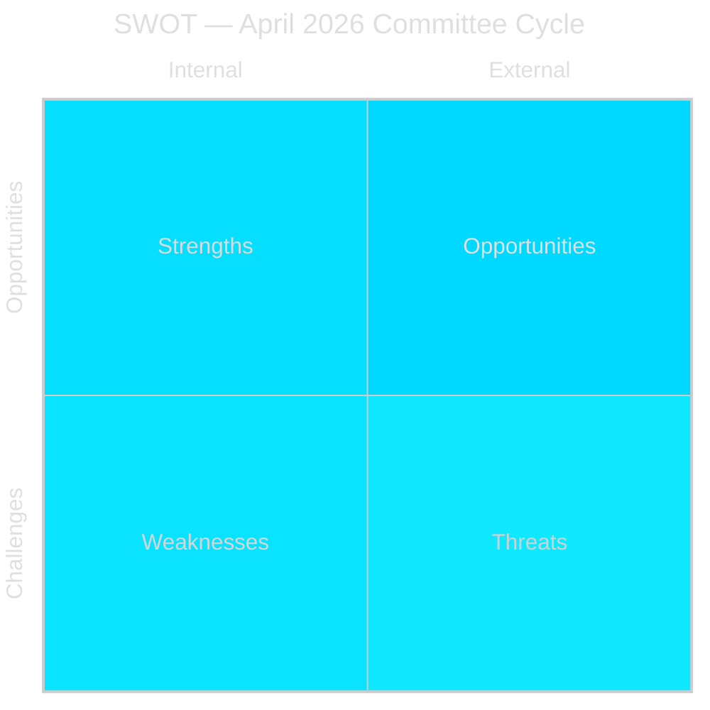

# SWOT Analysis — Committee Reports 2026-05-04

## Framework Note
SWOT assesses Sweden's policy position as represented by this committee cycle, with specific evidence from betänkande texts.

## Strengths

| Factor | Evidence | dok_id |
|--------|----------|--------|
| Legislative momentum — three laws entering force before election | NU19 (17 June), SfU28 (6 June), JuU9 (1 July) — all set to enter force within one parliamentary term | HD01NU19, HD01SfU28, HD01JuU9 |
| Lagrådet compliance — government followed advisory opinion on nuclear law | Lagrådet reviewed Prop 2025/26:171 (Feb 2026); government accepted recommendations | HD01NU19 |
| Cross-party consensus on integration reforms | S, M, SD, KD, L, and C all voted Ja on SfU28 punto 1 — broadest coalition since 2016 | HD01SfU28 |
| Court reform strengthens gang-crime prosecution | JuU9 early interview admissibility directly supports "Tioårsprogrammet" anti-gang strategy | HD01JuU9 |
| Sweden's NATO context strengthens defence committee work | FöU14 military cooperation improvements align with NATO Article 3 commitments | HD01FöU14 |

## Weaknesses

| Factor | Evidence | dok_id |
|--------|----------|--------|
| Nuclear licensing bypasses normal environmental review — legal vulnerability | NU19 creates parallel licensing track outside Ch.17 miljöbalken — novel constitutional arrangement | HD01NU19 |
| Opposition bloc (S+V+C+MP) unified against nuclear law — democratic legitimacy question | Two formal reservations from all four opposition parties | HD01NU19 |
| SfU28 language test deferred to October 2027 — implementation uncertainty | Full language test component not operative until Oct 2027 at earliest | HD01SfU28 |
| Several betänkanden not yet published — information gaps | FöU14, FöU20 still listed as "planerat" | HD01FöU14, HD01FöU20 |

## Opportunities

| Factor | Assessment |
|--------|-----------|
| Energy policy election mandate — NU19 locks in nuclear as election battleground on M+SD+KD+L terms | Coalition controls the framing: "Sweden needs nuclear, we delivered the law" |
| Integration hardliner consensus — SfU28's cross-party support makes reversal politically costly for S | S is now co-owner of tougher integration rules; reversal would require rejecting own votes |
| Court system modernisation — JuU9 creates efficiency gains that benefit all future governments | Non-partisan operational improvement |
| EU CER/NIS2 compliance via FöU20 — Sweden ahead of deadline curve | FöU20 positions Sweden as EU compliance leader in critical infrastructure |

## Threats

| Factor | Assessment |
|--------|-----------|
| Constitutional challenge to NU19 — if V/MP mount HFD/ECJ challenge, nuclear programme stalls | "Omgår miljöbalken" reservation (S/V/C/MP) suggests future legal challenge template |
| SfU28 implementation capacity — Migrationsverket backlog — policy enters force but may not be deliverable | Migrationsverket already has 12+ month processing times; new income/language tests add load |
| September 2026 election reversal risk — if centre-left coalition wins, NU19 licensing process may be reviewed | S/C have reservations on the nuclear licensing process even if they accept nuclear power in principle |
| International legal exposure — NU19 may need Euratom notification | Large nuclear facilities may trigger EU state aid/Euratom formal procedures |
