# Synthesis Summary — Committee Reports 2026-05-04

## Lead Story

The April 2026 committee cycle is the **last major legislative window before Sweden's September 2026 general election**. Two landmark betänkanden — nuclear plant licensing (HD01NU19) and citizenship tightening (HD01SfU28) — define the Tidö Coalition's policy legacy and set the election battleground. The Riksdag will likely vote on both before the summer recess, making late May the critical inflection point.

## DIW-Weighted Significance Ranking

| Rank | dok_id | Document | DIW Score | Tier |
|------|--------|----------|-----------|------|
| 1 | HD01NU19 | Nuclear licensing new law | 9.2 | L3 Intelligence-grade |
| 2 | HD01SfU28 | Citizenship tightening | 9.0 | L3 Intelligence-grade |
| 3 | HD01FöU14 | Military cooperation | 8.1 | L2+ Priority |
| 4 | HD01JuU9 | Court process reform | 7.4 | L2+ Priority |
| 5 | HD01KU36 | Integrity and technology | 6.3 | L2 Strategic |
| 6 | HD01NU22 | Competition tools | 5.8 | L2 Strategic |
| 7 | HD01FöU20 | Critical infrastructure resilience | 7.9 | L2+ Priority (planned) |
| 8 | HD01SkU22 | VAT fraud measures | 5.2 | L1 Surface |
| 9 | HD01CU37 | Municipal rental guarantees | 4.8 | L1 Surface |

*DIW = Depth × Impact × Weighting — Source: primary betänkande texts and committee positions*

## Integrated Intelligence Picture

**Nuclear power (HD01NU19)**: The NU committee adopted Prop 2025/26:171 creating a parallel licensing track for nuclear installations. Applicants can bypass the standard Chapter 17 miljöbalken review by applying directly to government; a "kärnteknisk plan" must first be approved; municipalities in the plan area must consent *unless* the facility is a certain category. The new law takes effect 17 June 2026. This is constitutionally novel — the government assumes permitting authority previously held by Mark- och miljödomstol. Opposition bloc (S, V, C, MP) issued two formal reservations rejecting the proposal; S and C split on the municipal veto angle. V and MP categorically oppose nuclear expansion. **Election implication**: Energy and electricity prices will dominate the September 2026 campaign; M+SD+KD+L own nuclear expansion as signature policy; opposition faces divided front with S now less anti-nuclear than historical position but opposing this specific process.

**Citizenship (HD01SfU28)**: The SfU committee endorsed Prop 2025/26:175 enacting the most significant restriction of Swedish citizenship access since the 2001 medborgarskapslagen. Residency floor rises 5→8 years (aligned with other Nordic countries). Income floor = 3 × inkomstbasbelopp (~SEK 210,000 gross/year). Language and civics test becomes mandatory (test component phased in to October 2027). Conduct standard becomes "skötsamt och hederligt levnadssätt" — codified in statute for the first time. **Cross-party vote**: S, M, SD, KD, L, and C parliamentarians all voted Ja on the main question. V (10 reservations) and MP (4 reservations) opposed. This is **analytically extraordinary** — S/C supporting tougher citizenship rules represents a strategic pivot, not a protest vote. 

**Court reform (HD01JuU9)**: Prop 2025/26:155 expands admissibility of police interview recordings in trials, removes the "tilltrosbestämmelserna" obligation to re-hear witnesses in appeals, and adds secrecy protection for coercive-measure statistics at Domstolsverket. Takes effect 1 July 2026. One V reservation. This reform directly supports the government's strategy to prosecute gang violence more effectively by allowing early interview recordings (e.g. from fearful witnesses) as evidence.

**Military cooperation (HD01FöU14)**: Defence committee betänkande on improved conditions for operational military cooperation — not yet published but listed as "debatt om förslag." High significance in context of Sweden's new NATO membership and ongoing cooperation agreements with Finland, US, Norway, and Denmark.

## Overarching Narrative Clusters

1. **Tidö Legacy Sprint**: M+SD+KD+L racing to deliver signature policies before September election.
2. **Opposition Fracture**: S/C positioning as "responsible" centre-left/centre by accepting tougher integration rules, while V/MP hold ideological lines.
3. **Energy Sovereignty vs Environmental Protection**: The deepest value cleavage in the 2026 election.

```mermaid
%%{init: {"theme": "dark", "themeVariables": {"primaryColor": "#00d9ff"}}}%%
graph LR
    A[Tidö Coalition<br>M+SD+KD+L] -->|"Prop 2025/26:171<br>Nuclear licensing"| B[NU Committee<br>HD01NU19]
    A -->|"Prop 2025/26:175<br>Citizenship tightening"| C[SfU Committee<br>HD01SfU28]
    A -->|"Prop 2025/26:155<br>Court reform"| D[JuU Committee<br>HD01JuU9]
    B -->|"Reservation 1+2"| E[S+V+C+MP<br>Opposition bloc]
    C -->|"10 res. V + 4 res. MP"| F[V+MP<br>Hard opposition]
    C -->|"S/C voted Ja"| G[S+C<br>Cross-party support]
    D -->|"1 reservation V"| F

    style A fill:#1a3a5c,stroke:#00d9ff
    style B fill:#2a1a5c,stroke:#ff006e
    style C fill:#2a1a5c,stroke:#ff006e
    style D fill:#1a3a2c,stroke:#00d9ff
    style E fill:#3a2a1a,stroke:#ffbe0b
    style F fill:#3a1a1a,stroke:#ff006e
    style G fill:#1a3a1a,stroke:#00ff88
```

