# Threat Analysis — Committee Reports 2026-05-04

## Threat Taxonomy

### T-1: Legal/Constitutional Threats

**T-1A: NU19 Constitutional Bypass Challenge**
- Threat: Environmental organisations (Naturskyddsföreningen, Greenpeace Sverige) or V/MP file applications challenging the constitutionality of bypassing Ch.17 miljöbalken
- Actor: V/MP + civil society legal actors
- Mechanism: Application to Högsta förvaltningsdomstolen or European Court of Justice
- Timeline: Most likely if Vattenfall/Uniper files first nuclear application under new law (Q4 2026–Q1 2027)
- Evidence basis: S, V, C, MP reservation text in HD01NU19 explicitly cites "omgår miljöbalken"
- Probability: MEDIUM (40%) — Lagrådet review reduces but does not eliminate risk

**T-1B: SfU28 ECHR Article 8 Challenge**
- Threat: Applicants denied citizenship under new 8-year/income rules mount ECHR family reunification challenge
- Actor: Individual applicants + legal aid organisations
- Mechanism: Domestic administrative appeal → ECHR Article 8 (private/family life)
- Timeline: First cases 2026–2027
- Evidence basis: 10 reservations from V and 4 from MP specifically cite ECHR risks — [Source: HD01SfU28]
- Probability: MEDIUM (45%) — income floor and 8-year bar are strict but fall within ECHR margin of appreciation

### T-2: Political Threats

**T-2A: September 2026 Election Policy Reversal**
- Threat: Centre-left coalition (S+MP+C+possibly V) wins election and commissions review of NU19 nuclear licensing law
- Actor: Socialdemokraterna, Centerpartiet, Miljöpartiet
- Mechanism: New government commission (utredning) — law stays in force but new applications frozen pending review
- Timeline: October 2026 if centre-left wins
- Evidence basis: S/C/V/MP all issued NU19 reservations; S/C reservations more procedural (could support amended version)
- Probability: MEDIUM-HIGH (45%)

**T-2B: SfU28 Implementation Becomes Election Liability**
- Threat: If integration test backlog develops and citizens see delays, SfU28 becomes symbol of government incompetence rather than policy achievement
- Actor: Opposition parties, media framing
- Mechanism: Investigative journalism + parliamentary questions to migration minister
- Evidence basis: Language test deferred to October 2027 already signals implementation concerns
- Probability: MEDIUM (40%)

### T-3: Operational/Implementation Threats

**T-3A: Migrationsverket Capacity Crisis**
- Threat: SfU28 enters force 6 June 2026 but Migrationsverket cannot operationalise new income verification and residency tracking at scale
- Timeline: June–December 2026
- Evidence basis: Verket already operates with substantial application backlogs; new data requirements (income, language) add processing complexity

**T-3B: Nuclear Permitting Queue Blockage**
- Threat: Even with NU19 in force, new nuclear applications stall due to lack of SSM guidance on "kärnteknisk plan" requirements
- Timeline: 2026–2027
- Evidence basis: Law enables application process but SSM regulations must follow — regulatory gap risk

### T-4: International/EU Threats

**T-4A: EU State Aid Review of Nuclear Subsidies**
- If Sweden provides financial guarantees or subsidies to nuclear operators approved under NU19, EU state aid rules (TFEU Art 107) could trigger formal investigation
- Timeline: Triggered by first state-support instrument post-approval
- Evidence basis: EU taxonomy debate; state aid precedents (UK Hinkley Point C)

```mermaid
%%{init: {"theme": "dark"}}%%
graph TD
    A[April 2026 Committee Decisions] --> B{Legal Threats}
    A --> C{Political Threats}
    A --> D{Operational Threats}
    A --> E{International Threats}
    
    B --> B1[T-1A: NU19 Constitutional Challenge<br>P=40%]
    B --> B2[T-1B: SfU28 ECHR Art.8<br>P=45%]
    C --> C1[T-2A: Election Reversal NU19<br>P=45%]
    C --> C2[T-2B: SfU28 Liability<br>P=40%]
    D --> D1[T-3A: Migrationsverket Capacity<br>P=60%]
    D --> D2[T-3B: Nuclear SSM Gap<br>P=35%]
    E --> E1[T-4A: EU State Aid<br>P=25%]
    
    style B1 fill:#ff006e,stroke:#ff006e
    style B2 fill:#ff8c00,stroke:#ff8c00
    style C1 fill:#ff006e,stroke:#ff006e
    style D1 fill:#ff006e,stroke:#ff006e
    style E1 fill:#2a3a4a,stroke:#00d9ff
```

