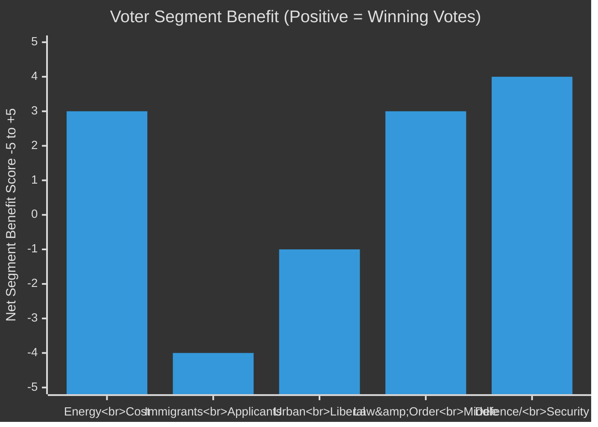

# Voter Segmentation — Committee Reports 2026-05-04

## Segmentation Framework

Analysis of which voter segments are most directly affected by the April 2026 committee cycle decisions, with implications for electoral impact.

## Segment 1: Energy Cost-Sensitive Households (HD01NU19)

**Size**: Estimated 2.0–2.5 million Swedish households with high electricity cost exposure
**Geographic concentration**: Northern Sweden (cold climate, higher kWh consumption), rural areas, manufacturing regions
**Electoral significance**: Disproportionately in SD and C heartlands; M suburban strongholds
**NU19 impact**:
- Direct: No immediate electricity price effect (new nuclear is 10+ years away)
- Narrative: "Government is building towards energy independence" — positive signal for energy-anxious voters
- Risk: Opposition can say "this law doesn't help your electricity bill today"

**Targeting party**: M (suburban energy cost) + SD (northern Sweden energy cost) + C (rural energy cost)

## Segment 2: Foreign-Born Citizens and Permanent Residents (HD01SfU28)

**Size**: ~500,000 permanent residents eligible for citizenship; ~40,000 annual citizenship applicants
**Geographic concentration**: Stockholm, Göteborg, Malmö metropolitan areas
**Electoral significance**: Resident non-citizens cannot vote (except local elections); naturalised citizens are a growing voting bloc
**SfU28 impact**:
- Direct: ~40,000 applicants/year affected by new 8-year requirement, income floor, language test
- Those who entered Sweden 2018–2020 will now wait until 2026–2028 for citizenship (previously 2023–2025 under 5-year rule)
- Disproportionate impact on: women (income floor harder to meet on parental leave), asylum-seekers (longer effective wait), integration programme participants (language test as barrier)

**Targeting party**: V and MP (opposing the law); S soft opposition voters (income floor hardship framing)

## Segment 3: Urban-Liberal Professional Class (HD01NU19 + HD01SfU28)

**Size**: Estimated 800,000–1.2 million urban professionals aged 25–45
**Geographic concentration**: Stockholm inner city, Göteborg Centrum, Malmö Centrum, university towns
**Electoral significance**: Core L, MP, S-liberal vote; high media engagement
**Committee cycle impact**:
- NU19: Split — some pragmatically accept nuclear (climate realists); others oppose (environmental idealists)
- SfU28: Predominantly negative reaction — income floor seen as economically unjust; language test acceptable but 8-year bar seen as excessive
- JuU9: Broadly positive — court efficiency seen as neutral/good reform

**Targeting party**: L (nuclear pragmatism + rule of law) vs MP (nuclear rejection + open immigration)

## Segment 4: Law-and-Order Middle Sweden (HD01JuU9)

**Size**: Estimated 2.5–3 million voters for whom crime is a top-3 issue
**Geographic concentration**: Spread nationally; suburban Stockholm, Göteborg ring suburbs, Malmö
**Electoral significance**: Critical SD + M swing voter segment; most volatile voters
**JuU9 impact**:
- Early interview recordings directly support gang-crime prosecution
- "More legally certain courts" — messaging alignment with "tougher on crime" narrative
- Effect on this segment: positive for M+SD government narrative; not electorally decisive but consolidates core supporters

## Segment 5: Defence/Security Voters (HD01FöU14 + HD01FöU20)

**Size**: Estimated 1.5 million voters for whom defence/national security is top concern
**Post-NATO context**: Security voters have grown as a segment since Russian invasion of Ukraine 2022
**Committee cycle impact**:
- FöU14 military cooperation: Signals continued NATO integration — positive for security-oriented voters across party spectrum
- FöU20 critical infrastructure: Less publicly salient but demonstrates governance competence
- Electoral significance: M+KD+SD can claim "we completed Sweden's military integration" — delivers on NATO promise

## Segment Impact Summary

*Note: Positive scores = net benefit for governing coalition (M+SD+KD+L) on this segment. Negative = net benefit for opposition.*
