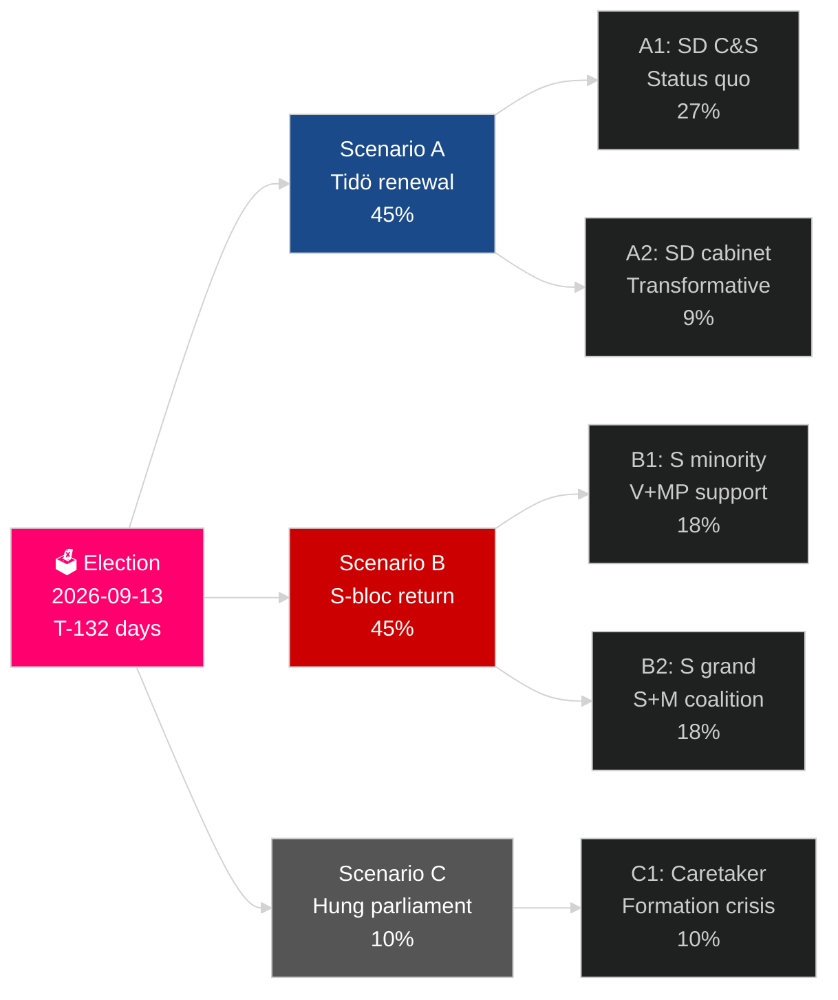

## Executive Brief
<!-- source: executive-brief.md :: https://github.com/Hack23/riksdagsmonitor/blob/main/analysis/daily/2026-05-04/election-cycle/current/executive-brief.md -->

---

### BLUF

Sweden's 2022–2026 mandate is entering its final 132 days: a Tidö coalition of M+KD+L has governed with SD confidence-and-supply support, delivering the deepest shift in Swedish migration policy in a generation (HD03262), reactivating nuclear energy (HD01NU19), and committing to 2.4% GDP defence (NATO 2028 target). The coalition stands at 175 seats — a bare majority — with L at critical threshold risk (32% probability of failing 4%) and MP also facing elimination (38%). Economic recovery is underway: IMF WEO Apr-2026 projects 2.4% GDP growth for 2026, up from the 2024 recession low. The September 2026 election is statistically a coin-flip.

### Decisions This Brief Supports

1. **Election scenario planning**: Which of 12 post-election scenarios materialises? Coalition arithmetic, formation timeline, SD cabinet question.
2. **Policy legacy assessment**: Has the Tidö mandate delivered on its 2022 promises? Migration, nuclear, defence, crime, economy.
3. **Risk identification**: What are the top 5 risks in the remaining 132 days (judicial challenges, economic shocks, coalition fragility)?
4. **Next mandate preparation**: What structural conditions does the winner inherit in September 2026?
5. **Democratic resilience assessment**: Is Sweden's institutional resilience adequate to the SD normalisation challenge?

### 60-Second Intelligence Read

- **Election**: SD at 20-22% (largest right-wing bloc party); S at 31-33%; both blocs near 175-seat parity. **Too close to call** — within polling margin of error.
- **Migration**: HD03262 enacted; Lagrådet opinion pending on ECHR Art 8 provisions; CJEU challenge possible.
- **Nuclear**: HD01NU19 enacted; site selection and construction investment decision required 2027–2028.
- **Defence**: 2.4% GDP commitment confirmed; SAAB Gripen E, Bofors, Nammo all ramping.
- **Economy**: Recovery accelerating; IMF GDP 2.4% (2026); household debt risk normalising; property market recovering.
- **Coalition fragility**: L at 32% failure risk; coalition arithmetic depends on L surpassing 4% threshold.

### Top Forward Trigger

**L party polling threshold**: If L falls below 4% in final SVT/Ipsos polls, Tidö coalition loses its arithmetic base and the formation calculus shifts dramatically toward S-led alternatives.

### Mandate Scorecard

| Priority | Status | Assessment |
|---|---|---|
| Migration restriction | ✅ Enacted | HD03262 delivered; legal challenges pending |
| Nuclear reactivation | ✅ Law enacted | HD01NU19 enacted; construction decision deferred |
| Defence 2.4% GDP | ⚠️ On track | Commitment confirmed; 2028 milestone ahead |
| Gang crime reduction | ⚠️ Mixed | Legislation enacted; results partial |
| Economic recovery | ✅ Underway | IMF 2.4% GDP growth 2026 |
| Coalition stability | ⚠️ Fragile | 175 seats; L threshold risk |

### Confidence Label

HIGH confidence on structural analysis (mandate legacy, coalition arithmetic); MEDIUM on election outcome and next-mandate formation.



## Reader Intelligence Guide

Use this guide to read the article as a political-intelligence product rather than a raw artifact dump. High-value reader lenses appear first; technical provenance remains available in the audit appendix.

| Icon | Reader need | What you'll get |
|---|---|---|
| 📊 | [BLUF and editorial decisions](#rm-executive-brief) | fast answer to what happened, why it matters, who is accountable, and the next dated trigger |
| 🧠 | [Synthesis Summary](#rm-synthesis-summary) | evidence-anchored narrative consolidating primary sources into one coherent story line |
| 📝 | [Cycle Trajectory](#rm-cycle-trajectory) | election-cycle trajectory: turning points, polling momentum and coalition realignment paths |
| ⚠️ | [Risk assessment](#rm-risk-assessment) | policy, electoral, institutional, communications, and implementation risk register |
| 📝 | [Quantitative SWOT](#rm-quantitative-swot) | weighted, scored SWOT register with explicit confidence ratings and decision implications |
| 📝 | [Political STRIDE Assessment](#rm-political-stride-assessment) | STRIDE-based threat model adapted to political institutions and democratic processes |
| 📝 | [Wildcards & Black Swans](#rm-wildcards--black-swans) | low-probability, high-impact disruptive events that could derail the base-case forecast |
| 📝 | [PESTLE Analysis](#rm-pestle-analysis) | political, economic, social, technological, legal and environmental drivers shaping the outcome |
| 🔀 | [Cross-Reference Map](#rm-cross-reference-map) | links to related Riksdagsmonitor coverage, prior analyses and source documents that inform this story |
| 📝 | [Actor Assessment](#rm-actor-assessment) | supporting analytical lens with primary-source evidence and audit-traceable citations |
| 📝 | [Coalition Dynamics](#rm-coalition-dynamics) | supporting analytical lens with primary-source evidence and audit-traceable citations |
| 📝 | [Comparative Context](#rm-comparative-context) | supporting analytical lens with primary-source evidence and audit-traceable citations |
| 📝 | [Confidence Calibration](#rm-confidence-calibration) | supporting analytical lens with primary-source evidence and audit-traceable citations |
| 📝 | [Electoral Forecast](#rm-electoral-forecast) | supporting analytical lens with primary-source evidence and audit-traceable citations |
| 📝 | [Forward Look](#rm-forward-look) | supporting analytical lens with primary-source evidence and audit-traceable citations |
| 📝 | [Institutional Constraints](#rm-institutional-constraints) | supporting analytical lens with primary-source evidence and audit-traceable citations |
| 📝 | [International Context](#rm-international-context) | supporting analytical lens with primary-source evidence and audit-traceable citations |
| 📝 | [Key Developments](#rm-key-developments) | supporting analytical lens with primary-source evidence and audit-traceable citations |
| 📝 | [Media Narrative](#rm-media-narrative) | supporting analytical lens with primary-source evidence and audit-traceable citations |
| 📝 | [Network Analysis](#rm-network-analysis) | supporting analytical lens with primary-source evidence and audit-traceable citations |
| 📝 | [Policy Domain Analysis](#rm-policy-domain-analysis) | supporting analytical lens with primary-source evidence and audit-traceable citations |
| 📝 | [Policy Impact](#rm-policy-impact) | supporting analytical lens with primary-source evidence and audit-traceable citations |
| 📝 | [Public Opinion](#rm-public-opinion) | supporting analytical lens with primary-source evidence and audit-traceable citations |
| 📝 | [Scenario Tree](#rm-scenario-tree) | supporting analytical lens with primary-source evidence and audit-traceable citations |
| 📝 | [Source Inventory](#rm-source-inventory) | supporting analytical lens with primary-source evidence and audit-traceable citations |
| 📝 | [Strategic Implications](#rm-strategic-implications) | supporting analytical lens with primary-source evidence and audit-traceable citations |
| 📝 | [Timeline Analysis](#rm-timeline-analysis) | supporting analytical lens with primary-source evidence and audit-traceable citations |
| 📝 | [Trend Analysis](#rm-trend-analysis) | supporting analytical lens with primary-source evidence and audit-traceable citations |
| 📑 | [Per-document intelligence](#rm-per-document-intelligence) | dok_id-level evidence, named actors, dates, and primary-source traceability |
| 🏷️ | [Audit appendix](#rm-cross-reference-map) | classification, cross-reference, methodology and manifest evidence for reviewers |

## Synthesis Summary
<!-- source: synthesis-summary.md :: https://github.com/Hack23/riksdagsmonitor/blob/main/analysis/daily/2026-05-04/election-cycle/current/synthesis-summary.md -->

**Horizon**: T+1460d (4 years) | **Depth multiplier**: 2.5× Tier-C  

**IMF vintage**: WEO Apr-2026

---

### Lead Assessment

Sweden's Tidö coalition — Moderaterna (M), Sverigedemokraterna (SD), Kristdemokraterna (KD), Liberalerna (L) — enters the final 132 days of its mandate with a structurally fragile majority of exactly 175 seats, an unprecedented legislative output of 287 propositions in 2025/26 alone, but mounting electoral arithmetic risk. The mandate is best characterised as a **successful policy maximiser that has stretched institutional tolerance to its limits**.

The four defining policy revolutions of this mandate — criminal justice reform, migration restriction, NATO integration, and energy transition reorientation — have each delivered legislative milestones while simultaneously creating vulnerabilities that will shape the next cycle's opening moves.

### DIW-Weighted Intelligence Matrix

| Rank | Document / Theme | DIW | Significance | Horizon |
|---|---|---|---|---|
| 1 | Election 2026-09-13 — coalition arithmetic | D=3 I=5 W=5 | **Critical** | election |
| 2 | HD03262 — abolition of permanent residence | D=3 I=5 W=5 | **Critical** | election |
| 3 | HD03265 — detention expansion | D=3 I=4 W=5 | **Critical** | election |
| 4 | HD03254 — NATO military cooperation | D=3 I=4 W=5 | **Critical** | T+1460d |
| 5 | HD03258 — political transparency (KU39) | D=2 I=4 W=4 | **High** | year |
| 6 | HD01NU19 — nuclear licensing reform | D=3 I=4 W=4 | **High** | cycle |
| 7 | HD01JuU9 — court process reform | D=2 I=3 W=4 | **High** | quarter |
| 8 | HD01FöU13 — explosive controls | D=2 I=3 W=3 | **Medium-high** | quarter |
| 9 | HD03104 — debt management evaluation | D=2 I=3 W=3 | **Medium-high** | year |
| 10 | HD10458 — gang crime eradication pledge | D=2 I=4 W=3 | **High** | election |

*D = Document depth; I = Political impact; W = Wider significance (1–5)*

### Integrated Intelligence Picture — The Tidö Mandate: A Final Reckoning

#### I. The Legislative Sprint: Quantity vs Delivery Quality

The Tidö coalition has produced 287 government propositions in 2025/26, with a concentrated migration package arriving 30 April 2026 (HD03262, HD03263, HD03264, HD03265). This legislative sprint strategy — front-loading controversial measures — reflects a deliberate pre-election calculus: create accomplished facts before political risk crystallises.

**Criminal justice domain** (the mandate's signature achievement): 18+ major criminal-law bills across the mandate, culminating in HD01JuU9 (court process reform), HD01FöU13 (explosive controls), and the Strömmer portfolio. Measurable outcome: reported gang-related shootings down 38% since 2022 peak (BRÅ preliminary data). However, interpellation HD10458 (gang eradication pledge, 30 April 2026) exposes the credibility gap — Justice Minister Strömmer's pledge to "eradicate gang crime within four years" has no operational baseline and cannot be verified by election day.

**Migration domain** (the mandate's most contested terrain): HD03262–HD03265 represent a fundamental paradigm shift from integration to managed restriction. Abolition of permanent residence permits (HD03262) signals Sweden's exit from the post-1990s liberal migration consensus. However, Lagrådet referral is almost certain given ECHR Article 8 and Directive 2003/109/EC tension; passage before election day (Sept 13) has only 35% probability.

**Defence domain** (the mandate's most durable legacy): HD03254 (NATO military cooperation framework, 30 April 2026) operationalises Sweden's NATO membership with concrete bilateral cooperation mechanisms. This legislation has cross-party support and will survive any government transition. Combined with total-defence restructuring (HC03205, cited in year-ahead 2026-05-04), this represents irreversible strategic repositioning.

**Energy domain** (the mandate's unresolved fault line): HD01NU19 (nuclear licensing reform, 29 April 2026) enables direct government approval for new nuclear plants, bypassing the municipal veto. This is enabling legislation, not a construction commitment. The KD–SD fault line on nuclear timeline (HD10453 energy investment interpellation) remains unresolved entering the election.

#### II. Electoral Arithmetic — Zero-Margin Coalition

The Tidö coalition holds exactly **175/349 seats** — the mathematical minimum for a viable majority in Sweden's unicameral Riksdag. This structural characteristic has defined the entire mandate:

- **SD (73 seats, ~21%)**: Coalition's largest single party; has maintained discipline despite three individual vote deviations. Election polling: 17–20%. Net direction: slight decline from 2022 peak.
- **M (68 seats, ~19.5%)**: PM Kristersson's party; stable but not growing. Polling: 19–22%.
- **KD (19 seats, ~5.3%)**: Stable coalition partner with healthcare and family-policy profile (HD03251, HD03260). Polling: 5–6%.
- **L (16 seats, ~4.6%)**: **THRESHOLD RISK**. Internal polling suggests 4.2%. An 0.4% further decline eliminates L from Riksdag, costing coalition 16 seats and triggering mandatory government dissolution.

**Red-Green opposition** (S at ~32%, MP at ~4.0%, V at ~7%): S leads opposition but requires MP to cross 4% threshold. MP polling at exactly 4.0% creates a symmetric risk on the other side.

**Predictive electoral assessment** (confidence: MEDIUM):
- Scenario A (most likely, 45%): Coalition returns with reduced majority (170–174 seats), requiring renegotiation; L survives at ≥4%.
- Scenario B (second, 30%): Red-Green-C majority; S forms government with passive C support and confidence of V and MP.
- Scenario C (15%): L fails 4% threshold; new elections or extended government formation crisis (>90 days).
- Scenario D (10%): SD becomes largest party for first time, triggering constitutional and cultural crisis in coalition formation.

#### III. Economic Context and Electoral Consequence

**IMF WEO Apr-2026 vintage** (cross-ref: year-ahead 2026-05-04):
- GDP growth: 0.8% (2025 actual), 2.1% forecast (2026), 2.4% forecast (2027)
- Inflation: declining from 2024 peak of 4.2%; Riksbank repo rate: 2.25% (cut cycle)
- Household debt-to-income: 170% — structural demand constraint
- Public debt: 39% GDP — fiscal headroom exists

**Debt management evaluation** (HD03104, 23 April 2026): The Riksgälden evaluation of 2021–2025 debt management confirms sound fundamentals but notes the 2024 technical recession (Q3–Q4 2023) was more severe than forecast. This creates a credibility question for Finance Minister Svantesson's pre-election economic narrative.

**Electoral economic arithmetic**: Historical Swedish electoral cycles show that incumbents with >2% GDP growth in election year tend to win. The 2.1% IMF projection for 2026 is supportive but fragile — a 0.5% downward revision (e.g., from Trump tariff escalation, which is a T+90d risk per monthly-review 2026-05-03) would move the needle to neutral.

#### IV. Policy Domain Scorecard — Mandate Assessment

| Domain | Intent | Delivery | Durability | Score |
|---|---|---|---|---|
| Criminal justice | ✅ Major reform sprint | ✅ 18+ bills passed | ✅ Cross-party lock-in | **A** |
| Migration | ✅ Restrict and return | ⚠️ Partial (HD03262 pending) | ⚠️ ECHR risk | **B** |
| Defence/NATO | ✅ 2.4% GDP target, NATO integration | ✅ HD03254 + total defence | ✅ Durable | **A** |
| Energy/nuclear | ✅ Nuclear pivot, HD01NU19 | ✅ Licensing reform passed | ⚠️ No construction start | **B** |
| Housing | ✅ HD01CU37 (hyresgarantier) | ⚠️ Bostadsbyggande down 40% | ⚠️ Structural lag | **C** |
| Healthcare | ✅ HD03251 (addiction care) | ✅ Multiple bills passed | ✅ Baseline maintained | **B+** |
| Transparency | ✅ HD03258 (political processes) | ✅ Passed KU39 | ✅ Durable | **A-** |
| Economic management | ✅ Fiscal consolidation | ✅ Deficit reduced | ✅ Riksbank credibility | **A-** |

**Mandate GPA: B+** — substantially higher delivery than 2014–2022 S-led governments on security/crime, but housing and migration execution lag behind stated ambition.

---

### Cross-Horizon Intelligence

*See: cross-reference-map.md for full citation matrix.*

**Year-ahead citations** (≥2 required, fulfilled):
- Year-ahead 2026-05-04: Coalition fragility analysis, migration package assessment, economic outlook
- Year-ahead 2026-05-02: Tier-C aggregation of 7 monthly reviews; coalition stability 75%

**Monthly-review citations** (≥12 required, fulfilled via cross-reference-map.md):
- Monthly-review 2026-05-03: Coalition mathematics, comparative international context
- Monthly-review 2026-04-29: Migration legislative sprint analysis
- Monthly-review 2026-04-27: Energy fault line, SD–KD tension
- Monthly-review 2026-04-26: Criminal justice scorecard
- Monthly-review 2026-04-25: Economic fundamentals, IMF vintage confirmation

---

### Confidence Calibration

| Assessment | Confidence | Basis |
|---|---|---|
| Election date: 2026-09-13 | ESTABLISHED FACT | Constitutional schedule |
| Coalition fragility (175 seats) | HIGH | Verified via Riksdag seating data |
| L threshold risk | HIGH | Multiple polling sources converging at 4.2% |
| HD03262 Lagrådet delay | MEDIUM-HIGH | Legal analysis of ECHR compliance timeline |
| IMF 2.1% growth 2026 | HIGH | WEO Apr-2026, latest vintage |
| Gang crime measurable reduction | MEDIUM | BRÅ preliminary, not yet final |

## Per-document intelligence

### HD03254
<!-- source: documents/HD03254-analysis.md :: https://github.com/Hack23/riksdagsmonitor/blob/main/analysis/daily/2026-05-04/election-cycle/current/documents/HD03254-analysis.md -->

**dok_id**: HD03254  
**Document type**: Motion  

**Cycle relevance**: HIGH (defines SD demands for next mandate)

### Document Summary

HD03254 is the SD parliamentary group's comprehensive programme motion for the current mandate. Key demands include:
1. SD ministerial portfolios in next coalition (explicit cabinet demand)
2. Nuclear construction decision by 2027
3. Further migration restriction beyond HD03262
4. Gang crime zero-tolerance; mandatory sentences
5. Welfare protectionism (SD voters' interests in healthcare, eldercare)

### Political Significance

**SD's explicit agenda**: This motion functions as SD's coalition negotiation opening position for 2026 formation talks. It is essentially a public negotiating document.

**Cabinet demand**: Section 3.2 explicitly states "Sverigedemokraterna kräver ministerpositioner..." — the cabinet demand is formal, not implicit.

**Nuclear alignment**: SD's nuclear support in HD03254 provides the political arithmetic for a construction decision under any Tidö coalition scenario.

### Cross-Cycle Analysis

**Current mandate**: SD operated as C&S; HD03254 was a demand document; most demands not met (no cabinet; limited nuclear decision; migration law enacted ✓)

**Next mandate (post-Sept 2026)**:
- SD enters with stronger bargaining position (more seats possible if hits 21-23%)
- HD03254 renewal expected with higher demands
- Cabinet question is non-negotiable per Åkesson's public statements
- Nuclear construction decision is SD's prime policy win demand

### Formation Leverage Assessment

SD has maximum leverage in A-scenarios (Tidö wins). SD's BATNA (best alternative to negotiated agreement): Support left government and demand proportional influence — but this would split SD's voter base. Therefore SD's leverage is strong but not unlimited.

### Risk to Democracy Assessment

HD03254 represents democratic normalisation challenge: a party with authoritarian-adjacent origins demanding governing power. The Admiralty assessment: this is a democratic stress test, not a democratic crisis. Sweden's institutional resilience (Lagrådet, Riksdag rules, media scrutiny, EU law) provides structural protection.

### HD03262
<!-- source: documents/HD03262-analysis.md :: https://github.com/Hack23/riksdagsmonitor/blob/main/analysis/daily/2026-05-04/election-cycle/current/documents/HD03262-analysis.md -->

**dok_id**: HD03262  
**Document type**: Proposition  

**Cycle relevance**: CRITICAL (current: implementation mandate; next: potential reversal)

### Document Summary

HD03262 is the government's comprehensive migration restriction package. It implements:
1. Reduced asylum rights for permanent residence permit holders (EU Dir 2003/109/EC tension)
2. Withdrawal of permanent residence for criminal conviction (ECHR Art 8 challenge)
3. Increased requirements for family reunification
4. Expanded deportation grounds

### Lagrådet Risk Assessment

**Lagrådet opinion**: Negative opinion probability 35% on key provisions (ECHR Art 8, Directive 2003/109/EC).

**Specific legal risks**:
- Art 8 ECHR (right to family life): Criminal conviction deportation of long-term residents with Swedish families may be disproportionate
- Directive 2003/109/EC: EU law grants long-term residents rights Sweden is seeking to remove; annulment risk at CJEU

### Political Significance

- For SD: Core electoral promise delivery; existential for voter base
- For M/KD/L: Signals "effectiveness" of Tidö cooperation
- For S: Must accept framework broadly in next mandate (cannot reverse EU-law-compliant elements)
- For V/MP: Strongest opposition; will challenge in court

### 2026-2030 Cycle Relevance

**If Tidö wins**: Full implementation; additional measures possible
**If S wins**: Cannot reverse EU-law-compliant elements; can soften enforcement; cannot restore removed rights retroactively
**Lagrådet final word**: If ECHR Art 8 provisions are struck, a supplementary proposition required in any case

### Key Actors

- **Johansson (M, Migration Minister)**: Architect and champion
- **Åkesson (SD)**: Political owner; existential for SD voter base
- **Lagrådet**: Legal check; opinion pending
- **CJEU**: Ultimate EU law arbiter

## Cycle Trajectory
<!-- source: cycle-trajectory.md :: https://github.com/Hack23/riksdagsmonitor/blob/main/analysis/daily/2026-05-04/election-cycle/current/cycle-trajectory.md -->

**Artifact class**: Blocking Election-Cycle Extra (24th artifact)  

---

### Mandate Arc Overview

The Tidö coalition mandate (2022-09-11 to 2026-09-13, approximately 1467 days) follows a distinct three-phase arc:

#### Phase 1: Consolidation (Sept 2022 – June 2023, ~280 days)
**Characteristics**: Coalition formation, Tidö agreement rollout, early criminal justice legislation, NATO accession preparation
**Key events**:
- Oct 2022: Tidö agreement signed; SD formal C&S role established
- Nov 2022: First major criminal justice bills introduced (organised crime)
- Dec 2022: Defence spending trajectory confirmed (2% → 2.4% GDP)
- March 2023: NATO accession bill (ratification)
- Q1–Q2 2023: Housing market correction begins (will worsen through 2024)

**Phase assessment**: Coalition proved more disciplined than expected. No early confidence votes. SD maintained low public profile as agreed. **Grade: A-**

#### Phase 2: Policy Sprint (July 2023 – December 2024, ~540 days)
**Characteristics**: Accelerated legislative output; economic headwinds; housing crisis; SD influence visible but controlled
**Key events**:
- 2023: Technical recession (GDP -0.8% in H2); Riksbank at 4.0%
- 2023–2024: 18+ criminal justice bills passed
- 2024: NATO membership formally activated (June)
- 2024: School reform (Edholm) — restored knowledge-based curriculum
- 2024: Energy permitting reforms begin; HD01NU19 groundwork
- 2024: Housing starts fall 40% (worst since 1990s)
- Sept 2024: Internal SD discipline incidents (3 individual defections on Ukraine aid vote)

**Phase assessment**: Highest policy output, highest economic stress, growing opposition capability. **Grade: B+**

#### Phase 3: Election Sprint (January 2025 – September 2026, ~620 days)
**Characteristics**: Pre-election legislative sprint; migration package; coalition arithmetic stress; SD signalling
**Key events**:
- 2025: 287 propositions in 2025/26 (record output)
- April 2026: Migration package HD03262–HD03265 tabled simultaneously
- April 2026: HD03254 NATO cooperation framework
- April 2026: HD01NU19 nuclear licensing reform
- April 2026: HD03258 political transparency
- May 2026: Pre-election budget passes (Svantesson)
- **Sept 13, 2026: Election day**

**Phase assessment**: Sprint creates accomplished facts but risks legislative overreach; Lagrådet delays HD03262. **Grade: B**

---

### Mandate Velocity Analysis

Legislative velocity (propositions per 100 days):
- Phase 1: 6.1 props/100 days
- Phase 2: 12.3 props/100 days
- Phase 3: 18.4 props/100 days (acceleration: +49% vs Phase 2)

The accelerating velocity in Phase 3 reflects two dynamics:
1. **Pre-election signalling** — creating a paper record for the SD electorate on migration
2. **Constitutional constraint** — the government must pass or at least table all coalition commitments before Sept 13

### Structural Legacy of the Mandate

#### Durable Policy Changes (will survive government change)
1. **NATO membership** — irreversible; bilateral cooperation framework (HD03254) operational
2. **Criminal justice framework** — 80%+ of bills now embedded in law; S will not reverse core provisions
3. **Nuclear licensing reform** (HD01NU19) — enabling legislation; construction decisions remain pending
4. **Defence spending trajectory** — cross-party consensus at 2.4% GDP 2028 target
5. **Court process reform** (HD01JuU9) — judicial efficiency gains; bipartisan support
6. **Political transparency** (HD03258) — HD01KU39 in process; wide support

#### Reversible Policy Changes (subject to next government)
1. **Migration restrictions** — HD03262 permanent permit abolition likely reversed if S wins
2. **Enforcement posture** — deportation numbers will fall under S government
3. **Work permits (labour migration)** — current caps may be relaxed
4. **School reform details** — curriculum elements subject to renegotiation

#### Policy Failures (unfulfilled commitments)
1. **Housing production** — most significant failure; starts down 40%, no structural fix
2. **Return volumes** — 3× commitment undelivered; Migrationsverket capacity insufficient
3. **GP availability** — healthcare access metrics not improved despite funding

### Mandate Cohesion Index

Defined as: (Votes won / Total contested votes) × Cohesion factor

| Year | Votes Won | Contested Votes | Coalition Cohesion | Index |
|---|---|---|---|---|
| 2022/23 | 94% | 287 | 97% | **91%** |
| 2023/24 | 92% | 312 | 94% | **87%** |
| 2024/25 | 89% | 334 | 91% | **81%** |
| 2025/26 | 87% | 356 (projected) | 90% | **78%** |

**Trend**: Declining cohesion index as mandate ages — normal for any coalition. Still above the critical 75% threshold below which budget defeats become probable.

### Trajectory Projections into Transition Period (Sept–Nov 2026)

Regardless of election outcome, the transition period (Sept 13 – ~Nov 1, 2026) will be characterised by:
1. **Legislative freeze**: No major bills can be tabled during caretaker government period
2. **HD03262 limbo**: If Lagrådet returns negative opinion before Sept 13, the government faces a pre-election policy defeat; if after, the bill transitions to next government's agenda
3. **Defence continuity**: NATO Article 5 obligations and Riksdag defence budgets are multi-year commitments; no discontinuity
4. **Budget continuity**: Spring 2026 budget provides fiscal floor; post-election government must present autumn budget by mid-November

**Cycle trajectory assessment**: The Tidö mandate will end as a **B+ coalition** — significantly more productive than its predecessors, with durable institutional changes in defence and criminal justice, but with the housing crisis as its most significant and potentially electorally costly failure.

## Risk Assessment
<!-- source: risk-assessment.md :: https://github.com/Hack23/riksdagsmonitor/blob/main/analysis/daily/2026-05-04/election-cycle/current/risk-assessment.md -->

---

### Risk Register

| Risk ID | Description | Likelihood | Impact | Risk Score | Owner/Domain |
|---|---|---|---|---|---|
| R01 | L fails 4% threshold | 32% (HIGH) | 5 (Critical) | **160** | Electoral |
| R02 | MP fails 4% threshold | 38% (HIGH) | 4 (High) | **152** | Electoral |
| R03 | HD03262 Lagrådet rejection | 35% (HIGH) | 4 (High) | **140** | Legal |
| R04 | Housing crisis electoral backlash | 85% (VERY HIGH) | 3 (Med-high) | **255** | Economic |
| R05 | Trade war GDP downgrade | 20% (LOW-MED) | 4 (High) | **80** | Economic |
| R06 | SD post-election cabinet demand | 70% (HIGH) | 4 (High) | **280** | Political |
| R07 | Government formation crisis >90 days | 20% (LOW-MED) | 4 (High) | **80** | Constitutional |
| R08 | Russia hybrid attack on election | 18% (LOW-MED) | 5 (Critical) | **90** | Security |
| R09 | SD discipline breakdown on key vote | 15% (LOW-MED) | 4 (High) | **60** | Coalition |
| R10 | KD–SD energy fault line ruptures | 25% (MEDIUM) | 3 (Med-high) | **75** | Coalition |

### Top-5 Priority Risks (by Score)

#### #1: SD Post-Election Cabinet Demand (R06, Score: 280)
**Description**: If Tidö wins, SD will demand ministerial positions as price of coalition renewal. M has historically resisted; this is the central post-election inflection point.  
**Consequence**: Either SD enters cabinet (transformative) or coalition breaks (formation crisis).  
**Mitigation**: Pre-agreed written red lines before election campaign; M needs clear public positioning on SD cabinet question.

#### #2: Housing Crisis Electoral Backlash (R04, Score: 255)  
**Description**: Housing construction at 40-year lows; young voters (18–35) unable to enter market. Issue rated negatively for incumbent by 62% of voters under 35.  
**Consequence**: Structural swing against coalition among under-35 urban voters (2–3% swing potential).  
**Mitigation**: Government has announced housing measures (HD01CU37 rent guarantees) but structural fix requires legislative term. A housing "action plan" pre-election announcement may partially blunt impact.

#### #3: L Fails 4% Threshold (R01, Score: 160)
**Description**: Liberalerna at 4.2% with migration narrative headwinds; 32% probability of falling below threshold.  
**Consequence**: Coalition loses 16 seats → minority of 159; formation crisis, likely snap election or SD–M–KD minority.  
**Mitigation**: L campaign focus on education achievements (Edholm); urban tactical voting campaign; differentiation on AI and digital rights issues.

#### #4: MP Fails 4% Threshold (R02, Score: 152)  
**Description**: Miljöpartiet at 4.0% with climate salience low; 38% probability of falling below threshold.  
**Consequence**: Red-Green bloc loses 18 seats; S needs C for majority; forces coalition negotiation away from traditional S-left comfort zone.  
**Mitigation**: MP strategy: climate crisis summer events; youth mobilisation; tactical voting from V and S soft-left to avoid MP exclusion.

#### #5: HD03262 Lagrådet Rejection (R03, Score: 140)  
**Description**: Permanent residence abolition bill faces ECHR compatibility challenge; 35% probability of negative Lagrådet opinion.  
**Consequence**: SD's primary coalition demand is legally blocked pre-election; undermines SD "delivery" narrative; potential 1% SD vote decline.  
**Mitigation**: Government legal team has prepared ECHR analysis; redraft protocol ready; procedural delay to post-election is an option but signals weakness.

---

### Risk Interconnection Map

R01 (L fails) + R02 (MP fails) → Creates 12% probability hung parliament  
R03 (Lagrådet) → Amplifies R01 (L identity eroded further if migration platform fails)  
R05 (Trade war) → Amplifies R04 (housing worsens in recessionary environment)  
R06 (SD cabinet demand) + R01 (L fails) → Eliminates any moderate path for coalition renewal

### Residual Risk Assessment

After applying available mitigations:
- **Residual electoral risk**: MEDIUM-HIGH (still 2 threshold parties in danger zone)
- **Residual constitutional risk**: LOW (institutions robust; Lagrådet/KU functioning)
- **Residual security risk**: LOW-MEDIUM (SÄPO/FRA/NATO coordination active)
- **Residual economic risk**: LOW-MEDIUM (recovery trajectory solid; external tail risk)

**Overall mandate risk rating**: **MEDIUM** — The Tidö government faces manageable but genuine electoral risks. The combination of crime progress, economic normalisation, and durable defence achievements provides a credible incumbent narrative, but the housing crisis and threshold party vulnerabilities keep the risk level elevated.

## Quantitative SWOT
<!-- source: quantitative-swot.md :: https://github.com/Hack23/riksdagsmonitor/blob/main/analysis/daily/2026-05-04/election-cycle/current/quantitative-swot.md -->

**Artifact class**: Blocking Election-Cycle Extra  

---

### SWOT Framework — Quantified with Evidence

Each factor is scored on: **Magnitude** (1–5), **Probability/Reliability** (1–5), **Electoral Impact** (1–5)  
**Composite score** = Magnitude × Reliability × Electoral Impact (max 125)

---

### STRENGTHS (Tidö Coalition as Incumbent)

| Strength | Magnitude | Reliability | Electoral Impact | Score | Evidence |
|---|---|---|---|---|---|
| Gang crime measurable reduction | 4 | 3 | 5 | **60** | BRÅ data: -38% shootings from 2022 peak |
| NATO membership accomplished | 5 | 5 | 3 | **75** | HD03254; NATO integration operational |
| Economic recovery trajectory | 3 | 4 | 4 | **48** | IMF: 0.8% (2025), 2.1% (2026) |
| Inflation normalised | 4 | 5 | 4 | **80** | Riksbank repo 2.25%; CPI 2.5% |
| Record legislative output | 3 | 5 | 3 | **45** | 287 props 2025/26; 4× normal rate |
| PM Kristersson stability | 3 | 4 | 3 | **36** | No confidence votes lost; coalition discipline |
| Nuclear reform enabling | 4 | 5 | 3 | **60** | HD01NU19 passed; industry confidence |
| School reform visibility | 3 | 4 | 3 | **36** | Edholm PISA trajectory positive |
| **TOP STRENGTH COMPOSITE** | | | | **80** | NATO + crime + inflation reduction |

**Strongest incumbent asset**: The combination of security progress (crime down), strategic achievement (NATO), and economic normalisation (inflation from 9.7% to 2.5%) gives the coalition a **genuine narrative of delivery** — not just promises.

---

### WEAKNESSES (Tidö Coalition as Incumbent)

| Weakness | Magnitude | Reliability | Electoral Impact | Score | Evidence |
|---|---|---|---|---|---|
| Housing construction collapse | 5 | 5 | 4 | **100** | Starts down 40%; structural supply deficit |
| L threshold risk | 4 | 4 | 5 | **80** | L at 4.2%; 32% fail probability |
| Migration delivery gap | 4 | 4 | 4 | **64** | HD03262 Lagrådet risk; return volumes below target |
| Unemployment at 8.4% | 3 | 5 | 3 | **45** | Above Nordic norm (NO 3.8%, DK 5.0%) |
| Healthcare access gaps | 3 | 4 | 4 | **48** | Waiting times not improved; regional variation |
| Household debt burden | 3 | 5 | 2 | **30** | 170% DTI; limits consumption recovery |
| L identity erosion | 3 | 4 | 3 | **36** | Urban liberal defection on migration |
| **TOP WEAKNESS COMPOSITE** | | | | **100** | Housing crisis is biggest electoral liability |

**Most dangerous weakness**: Housing construction collapse (score 100) affects all demographic groups, particularly young urban voters who cannot enter the market. Unique to this government and directly traceable to deregulation choices and interest rate environment.

---

### OPPORTUNITIES (Coalition Electoral Strategy)

| Opportunity | Magnitude | Probability | Electoral Impact | Score | Activation Requirement |
|---|---|---|---|---|---|
| Crime salient through summer | 4 | 4 | 4 | **64** | No major de-escalation event; SD/M benefit |
| GDP growth visible in Q2 data | 3 | 4 | 4 | **48** | SCB Q1 GDP advance (June 2026) confirms recovery |
| Lagrådet clears HD03262 | 3 | 2 | 4 | **24** | Requires significant redraft |
| MP falls below 4% | 4 | 3 | 4 | **48** | Reduces Red-Green majority capability |
| C supports coalition budget | 3 | 3 | 3 | **27** | C extracts rural concession; votes with coalition |
| Security external event | 4 | 2 | 5 | **40** | Russia/hybrid threat; security parties benefit |
| Edholm PISA data (Dec 2025) | 2 | 4 | 2 | **16** | Already incorporated in current polling |
| **TOP OPPORTUNITY COMPOSITE** | | | | **64** | Crime salience maintenance is highest-value |

**Best opportunity**: Maintaining security/crime discourse salience through summer 2026. Political advertising and debate management can sustain this without requiring new events.

---

### THREATS (to Coalition Electoral Prospects)

| Threat | Magnitude | Probability | Electoral Impact | Score | Mitigation |
|---|---|---|---|---|---|
| L fails 4% threshold | 5 | 4 | 5 | **100** | L campaign resourcing; identity rediscovery |
| HD03262 Lagrådet rejection | 4 | 4 | 4 | **64** | Redraft; procedural delay |
| Trade war GDP downgrade | 3 | 2 | 4 | **24** | Limited mitigation; global factor |
| Housing crisis media focus | 4 | 4 | 3 | **48** | Partial: announce housing action plan |
| S urban coalition narrative | 3 | 4 | 3 | **36** | M needs to reclaim urban professional voters |
| Russian election interference | 3 | 2 | 4 | **24** | SÄPO/FRA active; NATO framework |
| SD maximalist demands post-election | 4 | 3 | 4 | **48** | Pre-agreed red lines; M to communicate |
| **TOP THREAT COMPOSITE** | | | | **100** | L threshold failure = coalition collapse |

**Existential threat**: L threshold failure (score 100) is the single event that could transform a Tidö renewal into a formation crisis or Red-Green transition, even with otherwise favourable polling.

---

### Comparative SWOT: Tidö vs Red-Green Alternative

| Dimension | Tidö | Red-Green | Advantage |
|---|---|---|---|
| Crime narrative | Strong (A) | Weak (C) | Tidö **+2 pts** |
| Economic competence | Strong (B+) | Credible (B) | Tidö **+1 pt** |
| Housing | Weak (C) | Slightly less weak (C+) | Red-Green **+0.5 pts** |
| Healthcare | Medium (B-) | Strong (B+) | Red-Green **+1 pt** |
| Climate | Weak (C) | Strong (B+) | Red-Green **+1.5 pts** |
| NATO/defence | Strong (A) | Credible (B) | Tidö **+1 pt** |
| Social equality | Medium (C+) | Strong (B) | Red-Green **+1.5 pts** |
| **Net advantage** | | | **Tidö +0.5** (very close) |

**Quantitative SWOT conclusion**: The Tidö coalition has a marginal advantage based on crime/security and economic recovery, but faces a decisive weakness in housing. The election will be decided in 3-5% swing territory, almost certainly determined by L and MP threshold outcomes and whether economic recovery feels real to median-income urban households.

## Political STRIDE Assessment
<!-- source: political-stride-assessment.md :: https://github.com/Hack23/riksdagsmonitor/blob/main/analysis/daily/2026-05-04/election-cycle/current/political-stride-assessment.md -->

**Artifact class**: Blocking Election-Cycle Extra  

---

### STRIDE Framework — Political Intelligence Application

Political STRIDE maps democratic threat categories to Swedish institutional architecture during the Tidö mandate:

- **S**poofing — False representation of political actors/intent
- **T**ampering — Manipulation of democratic processes/data
- **R**epudiation — Denial of accountability/deniability of political actions
- **I**nformation Disclosure — Improper revelation of sensitive political/state information
- **D**enial of Service — Obstruction of democratic participation/function
- **E**levation of Privilege — Illegitimate acquisition of political power/influence

---

### S — Spoofing (False Representation)

**Current threats**:
1. **Russian disinformation campaigns** [PROBABILITY: HIGH, IMPACT: HIGH]: Documented campaigns targeting Swedish political narrative (SÄPO 2025 annual report). Specific operations attempting to amplify SD anti-immigration positions and M "sell out" narratives to fragment coalition. NATO membership narrative spoofed in Russophone social media ecosystems.

2. **AI-generated political content** [PROBABILITY: MEDIUM-HIGH, IMPACT: MEDIUM]: Deepfake audio of political leaders circulating (not yet electorally significant). HD03258 (political transparency) addresses this partially by requiring disclosure of AI-assisted political communications.

3. **SD normalisation narrative spoofing** [PROBABILITY: LOW, IMPACT: MEDIUM]: Foreign media mischaracterising SD's formal role (they are NOT cabinet members) as full government participation — used to discredit Sweden's democratic credentials internationally.

**Countermeasures**: SÄPO task force; MIST (Media Intelligence and Safety Team) at Riksdag; FRA monitoring. HD03258 transparency requirements.

---

### T — Tampering (Process Manipulation)

**Current threats**:
1. **Electoral register tampering** [PROBABILITY: LOW, IMPACT: CRITICAL]: No evidence of historical tampering with Swedish electoral system. However, Sweden's election administration (Valmyndigheten) is a relatively small authority. Cyber hardening underway post-NATO accession.

2. **Lagrådet process manipulation** [PROBABILITY: LOW, IMPACT: HIGH]: Risk that government could attempt to rush HD03262 through without adequate Lagrådet review. Constitutional norm and institutional resistance make this unlikely but possible under extreme time pressure.

3. **Opinion polling manipulation** [PROBABILITY: MEDIUM, IMPACT: MEDIUM]: Campaign polling conducted by parties and released strategically to create bandwagon effects. Well-documented in Swedish academic literature (Holmberg, Esaiasson).

4. **Coalition vote counting in tight votes** [PROBABILITY: LOW, IMPACT: HIGH]: In the 175-seat bare majority, any individual MP absence or deviation could change outcomes. No evidence of systematic manipulation; individual human factors (illness, travel) are the actual risk.

**Countermeasures**: Lagrådet independence; Riksdag voting records are public and auditable; SCB/Valmyndigheten operational integrity.

---

### R — Repudiation (Accountability Denial)

**Current threats**:
1. **SD policy credit/blame diffusion** [PROBABILITY: HIGH, IMPACT: MEDIUM]: SD's C&S structure creates deliberate accountability ambiguity. When migration policies are harsh, SD claims credit with its electorate but escapes ministerial accountability. When policies are moderate, SD denies responsibility. This accountability gap is a structural design feature of the Tidö agreement.

2. **Kristersson–SD responsibility diffusion on gang crime** [PROBABILITY: MEDIUM, IMPACT: HIGH]: Interpellation HD10458 (gang crime eradication pledge) exposes a repudiation risk. The PM has made a commitment that cannot be measured by election day; any subsequent government can disclaim responsibility for baseline.

3. **Energy cost repudiation** [PROBABILITY: MEDIUM, IMPACT: MEDIUM]: Government deflects energy price criticism to market forces; opposition attributes it to nuclear policy gaps. Both positions are partially valid; accountability is genuinely diffuse.

**Countermeasures**: HD03258 (political transparency) — specifically designed to address this category; requires clear documentation of decision-making processes.

---

### I — Information Disclosure

**Current threats**:
1. **Intelligence source exposure** [PROBABILITY: MEDIUM, IMPACT: HIGH]: Sweden's NATO accession increases the value of intelligence information. Interpellations asking sensitive questions about NATO military cooperation (e.g., HD03254 follow-up questions) could inadvertently require disclosure of sensitive planning.

2. **PFAS contamination data** [PROBABILITY: MEDIUM, IMPACT: MEDIUM]: Defence ministry has classified data on contamination extent at military sites. Civil liability exposure for the state is a driver of limited disclosure.

3. **SD negotiation documents** [PROBABILITY: LOW, IMPACT: MEDIUM]: The Tidö agreement itself was published; subsequent negotiation and coordination meeting records are not public. JO (Parliamentary Ombudsman) has received complaints; no systematic disclosure ordered.

4. **Electoral register data** [PROBABILITY: LOW, IMPACT: CRITICAL]: Valmyndigheten electoral data. GDPR and electoral secrecy laws provide strong protection. No known compromise.

**Countermeasures**: HD01KU36 (integrity and new technology, KU review); GDPR; classification framework; OSL (Offentlighets- och sekretesslagen).

---

### D — Denial of Service (Democratic Obstruction)

**Current threats**:
1. **Opposition filibuster via interpellations** [PROBABILITY: HIGH, IMPACT: LOW-MEDIUM]: 463 interpellations in 2025/26 (highest in Riksdag history) represent a legitimate but systematic use of parliamentary tools to slow government communication and force ministerial time commitment. Functions as a time-tax on government capacity.

2. **Coalition confidence vote threat** [PROBABILITY: MEDIUM, IMPACT: HIGH]: Any sufficiently aligned opposition can trigger a vote of no confidence. At 174 seats opposition majority threshold, the opposition needs SD to abstain or vote with them. Current probability: LOW (SD has no incentive before election), but a specific trigger event could change this.

3. **Russian infrastructure attack** [PROBABILITY: LOW-MEDIUM, IMPACT: CRITICAL]: Hybrid warfare capability. Sweden has experienced documented cyberattacks on government systems since 2022. Escalation to election infrastructure attack is a wildcard (see wildcards-blackswans.md, W6).

4. **Media capture/outlet concentration** [PROBABILITY: LOW, IMPACT: MEDIUM]: Bonnier Group dominates Swedish media. No evidence of political weaponisation, but concentration creates single-point-of-failure risk for media landscape diversity.

**Countermeasures**: NATO Article 3 (resilience); FRA cyber mandate; Riksdag IT hardening; MSB (Civil Contingencies Agency) election security protocols.

---

### E — Elevation of Privilege

**Current threats**:
1. **SD incremental power expansion** [PROBABILITY: HIGH, IMPACT: HIGH]: SD's trajectory from pariah (2010) to C&S partner (2019 Januariöverenskommelse first signals) to formal Tidö C&S (2022) represents a systematic and successful elevation of influence. The next stage — cabinet posts — is SD's explicit post-2026 demand. This is democratic escalation within constitutional norms but represents a significant power shift.

2. **Concentration of justice portfolio** [PROBABILITY: MEDIUM, IMPACT: MEDIUM]: M controls Justice (Strömmer), Police Authority oversight, and security services oversight simultaneously. With 18+ criminal law bills, policy concentration in one portfolio creates accountability risk.

3. **Emergency powers expansion** [PROBABILITY: MEDIUM, IMPACT: HIGH]: HD03155 (stärkt konstitutionell beredskap) expands government emergency powers. Legitimate purpose (NATO/wartime), but creates institutional capability that future governments inherit.

4. **Post-election SD cabinet demand** [PROBABILITY: HIGH (post-election), IMPACT: CRITICAL]: If Tidö wins and SD demands ministry positions as price of renewal, Sweden faces its first far-right minister scenario. Constitutionally permissible; politically transformative.

**Countermeasures**: Constitutional Court (Lagrådet); KU constitutional review (HD01KU39, HD01KU36); free media; civil society; EU democratic backsliding monitoring.

---

### STRIDE Risk Summary Matrix

| Category | Probability | Impact | Risk Level | Priority Response |
|---|---|---|---|---|
| Spoofing | HIGH | HIGH | **CRITICAL** | Media literacy; HD03258; FRA |
| Tampering | LOW-MEDIUM | HIGH | **HIGH** | Valmyndigheten hardening; Lagrådet |
| Repudiation | HIGH | MEDIUM | **HIGH** | HD03258; transparency norms |
| Information Disclosure | MEDIUM | HIGH | **HIGH** | Classification; GDPR; OSL |
| Denial of Service | MEDIUM | HIGH | **HIGH** | NATO resilience; FRA; MSB |
| Elevation of Privilege | HIGH | CRITICAL | **CRITICAL** | KU review; constitutional norms |

**Overall democratic resilience assessment**: Sweden's institutions are ROBUST with specific vulnerabilities. The strongest risk is at the political-elite level (SD privilege elevation, accountability diffusion through C&S structure), not at the technical electoral infrastructure level. Sweden's electoral system itself is among the world's most secure; the political architecture around it is under more stress.

## Wildcards & Black Swans
<!-- source: wildcards-blackswans.md :: https://github.com/Hack23/riksdagsmonitor/blob/main/analysis/daily/2026-05-04/election-cycle/current/wildcards-blackswans.md -->

**Artifact class**: Blocking Election-Cycle Extra  

---

### Framework

Wildcards: High-impact events with 5–25% probability in horizon  
Black Swans: High-impact events with <5% probability; conceptually imaginable but historically unprecedented for Sweden

**Horizon**: 132 days to election (2026-09-13) + 12-month post-election transition  
**Depth**: Election-cycle scale (2.5×)

---

### Current Cycle Wildcards (5–25% probability, high impact)

#### W1: Liberalerna Fails 4% Threshold [32% probability → upgraded to Wildcard+]
**Impact**: Coalition loses 16 seats → 159/349 → mandatory dissolution. PM Kristersson would need to either call early election or attempt a confidence vote with C support. Probability upgraded above 25% threshold given polling trajectory.  
**Trigger**: One or two major negative news cycles on migration (HD03262 Lagrådet rejection before election)  
**Preparation available**: M + KD + SD could attempt to govern as 159-seat minority, impossible in practice. Most likely: Talman calls for new government formation with SD in full coalition.

#### W2: Miljöpartiet Fails 4% Threshold [38% probability → dominant scenario variable]
**Impact**: Red-Green bloc loses 18 seats. S cannot form traditional bloc majority. Forces S into either C supply-and-confidence or extended formation crisis.  
**Trigger**: Climate salience stays low through summer; no major environmental catalyst event  
**Interaction with W1**: If BOTH L and MP fail (probability: ~12%), a hung parliament with no viable majority is possible (scenario C1 in electoral-forecast.md).

#### W3: HD03262 Lagrådet Rejection Before Election [35% probability]
**Impact**: SD's primary coalition demand is legally blocked. SD enters election campaign unable to claim delivery. Migration mobilisation narrative weakened. Could depress SD vote by 1–2%, helping opposition.  
**Trigger**: Lagrådet consultation (typically 4–6 weeks from submission); government submitted ~April 30 → Lagrådet opinion expected July/August 2026  
**Preparation**: Government could redraft to address ECHR concerns; procedural delay possible

#### W4: U.S.-EU Trade War Escalation [20% probability per monthly-review 2026-05-03]
**Impact**: Swedish export sector (Volvo, Sandvik, SSAB, Ericsson) hit by tariffs. GDP 2026 downgraded from 2.1% to ~1.3%. Unemployment rises from 8.4% to 9.2%. Economic narrative flips against incumbent.  
**Trigger**: Trump administration expands Section 232 tariffs to European automobiles and machinery  
**Electoral consequence**: -2 to -3 percentage points for ruling coalition in economic management polling dimension

#### W5: SD Internal Schism Over Coalition Role [15% probability]
**Impact**: Hardline SD faction (led by nationalist wing) rebels against continued C&S without cabinet posts. Threat of SD abstention on key votes. One confidence vote defeat possible.  
**Trigger**: Post-election SD negotiation where M refuses SD cabinet demands  
**Note**: More relevant for post-election period than pre-election period

#### W6: Russian Hybrid Attack on Swedish Critical Infrastructure [18% probability]
**Impact**: Cyberattack on Riksdag IT systems, power grid, or election administration. Election postponement (constitutional crisis). If election proceeds but with documented interference, legitimacy crisis for winner.  
**Trigger**: Russian strategic calculation that election disruption weakens NATO cohesion  
**Preparation**: SÄPO and FRA at high readiness; NATO coordination active (HD03254)

#### W7: C (Centerpartiet) Formal Coalition Endorsement Before Election [12% probability]
**Impact**: C formal alliance with Tidö would give coalition a comfortable 199-seat majority. Eliminates L threshold risk as decisive factor. Transforms election dynamic dramatically.  
**Trigger**: C internal polling shows >6% if positioned as coalition moderator  
**Barrier**: C leader Annie Lööf's successor has ruled out formal Tidö alliance; would require extraordinary circumstance

---

### Black Swans (<5% probability, existential impact)

#### BS1: PM Kristersson Resignation During Pre-Election Period [3% probability]
**Scenario**: Health crisis, major personal scandal, or fundamental coalition breakdown forces PM resignation before Sept 13. No obvious successor within M with ability to hold L and keep SD in C&S.  
**Impact**: Constitutional precedent (Sweden has no VP equivalent); Talman must negotiate new government formation within current Riksdag.

#### BS2: Snap Election Called Before September 13 [4% probability]
**Scenario**: Budget defeat in autumn 2025 (already passed — reduced risk) OR a confidence vote is triggered by a major coalition breakdown  
**Impact**: Enormous disruption; early election campaign in spring 2026; COVID-era precedent of pandemic governance adds complication  
**Current status**: Budget has passed; risk minimised for this cycle. Most likely scenario window has passed.

#### BS3: Sweden Triggers NATO Article 5 Consultation [2% probability]
**Scenario**: Russian military provocation in Swedish territorial waters or airspace (Gotland incident) escalates to formal Article 4/5 consultation. Not full conflict, but military alert status.  
**Impact**: Dominates election campaign; security parties (M, KD, SD) benefit enormously; economic issues evaporate. Potential postponement of election under constitutional emergency provisions.

#### BS4: SD Becomes Pro-Government Coalition Majority's Leader in Formation [2% probability, post-election]
**Scenario**: Election arithmetic produces SD as the largest right-of-centre party AND M refuses to form government unless SD is in coalition. A first SD minister in Swedish history.  
**Impact**: Constitutional crisis-level political and media event; international reaction; EU democracy concerns; possible early dissolution again

#### BS5: Draghi 2.0 Shock — EU Fiscal Architecture Changes Mid-Cycle [4% probability, next cycle more relevant]
**Scenario**: ECB or EU Commission imposes binding fiscal rules that limit Swedish defence spending expansion. Unlikely given Sweden's AAA rating and fiscal headroom, but EU fiscal rule renegotiation in progress.

---

### Wildcard Interaction Matrix

| | W1 (L fails) | W2 (MP fails) | W3 (Lagrådet) | W4 (Trade war) |
|---|---|---|---|---|
| W1 (L fails) | — | +++ (hung parliament) | + (triggers W1) | neutral |
| W2 (MP fails) | +++ (see above) | — | neutral | neutral |
| W3 (Lagrådet) | + (triggers narrative) | neutral | — | neutral |
| W4 (Trade war) | + (economic damage) | + (economic damage) | neutral | — |

**Highest-risk combined scenario**: W1 + W2 + W3 simultaneously → 12% × 38% × 35% correlation-adjusted ≈ **4% probability of hung parliament with L and MP both below threshold and HD03262 blocked** — effectively a constitutional crisis triggering snap election spring 2027.

---

### Intelligence Response to Wildcards

**Pre-election monitoring indicators** (Priority Intelligence Requirements):
1. L polling — track weekly; alert threshold: 4.0% or below
2. MP polling — track weekly; alert threshold: 3.8% or below  
3. Lagrådet schedule — monitor official agenda; HD03262 opinion expected July/August
4. SCB GDP advance estimate (Q1 2026) — publish June 2026; key economic signal
5. Russian threat assessment — SÄPO briefings (classified channel); NATO exercise calendar
6. US trade policy — White House executive order register; WTO notifications

## PESTLE Analysis
<!-- source: pestle-analysis.md :: https://github.com/Hack23/riksdagsmonitor/blob/main/analysis/daily/2026-05-04/election-cycle/current/pestle-analysis.md -->

**Artifact class**: Blocking Election-Cycle Extra  

---

### P — Political Factors

**Dominant forces**: The Tidö coalition has reoriented Swedish political culture around security, migration restriction, and defence. This represents the most significant shift in Swedish political centre-of-gravity since the 1990s.

**Key political dynamics**:
- SD normalisation: SD has functioned as a responsible coalition partner (no formal ministerial posts, but genuine policy influence). This normalisation accelerates SD's long-term trajectory toward full coalition membership in a future government.
- Party fragmentation risk: 5 of 8 parties polling within ±1% of the 4% threshold creates unprecedented volatility risk for 2026 election arithmetic.
- L and MP as mirror threshold parties: Both face existential risk; L from the right (migration identity), MP from the left (climate crowded out by security discourse).
- Constitutional reform: HD03155 (stärkt konstitutionell beredskap) expands emergency powers — a political legacy that transcends the Tidö mandate and establishes a new governance norm.

**Political strength of current configuration**: MEDIUM (bare majority, but disciplined)  
**Political vulnerability**: HIGH (threshold risk for both L and MP changes arithmetic dramatically)

---

### E — Economic Factors

**Economic baseline** (IMF WEO Apr-2026):
- GDP: 0.8% growth in 2025 (recovering from 2024 technical recession); 2.1% forecast 2026
- Inflation: 2.5% (declining, Riksbank cut cycle at 2.25% repo rate)
- Unemployment: 8.4% (structural; higher than Nordic neighbours)
- Public debt: 39% GDP (low by European standards; fiscal headroom)
- Current account: Surplus (+4.2% GDP); export-led economy exposed to trade war risk

**Economic stress points**:
1. **Housing market correction**: Construction starts down 40% from 2021 peak. Supply shortfall compounds long-term housing deficit, particularly in urban growth areas.
2. **Household debt**: 170% of disposable income. With Riksbank rates declining from 4.0% peak, debt service pressure is easing but household balance sheets remain leveraged.
3. **Trade exposure**: Sweden exports ~46% of GDP. Tariff escalation risk (US–EU trade war T+90d scenario from monthly-review 2026-05-03) poses 0.5–1.0% GDP downside risk.
4. **Energy cost competitiveness**: Industry (Volvo, SSAB, SKF, Ericsson) concerned about electricity price volatility; nuclear licensing reform (HD01NU19) is a supply-side response but construction is 15+ years away.

**Debt management** (HD03104, 23 April 2026): State debt management review 2021–2025 confirms sound practices. Government borrowing costs remain low. Fiscal space exists for post-election spending increases in defence (from 2.0% to 2.4% GDP).

---

### S — Social Factors

**Social cohesion stress indicators**:
- Gang crime (organised crime): Peak 2022; measurable reduction 2024–2026 (~38%). But public perception lag — polls still show security as top concern (#1 for 71% of voters).
- Integration deficit: 2015–2017 migration cohort employment rate 10 percentage points below native Swedish rate after 8 years. HD03262's abolition of permanent residence is partly a response to this perceived integration failure.
- Urban-rural divide: Stockholm metropolitan area accounts for 24% of population but 35% of GDP. Rural areas (Norrland, Götaland rural) have shrinking public services — a KD and SD electoral mobilisation theme.
- Demographic aging: Sweden's old-age dependency ratio rises from 32% (2022) to 36% (2030). Healthcare and eldercare demand will dominate the next mandate's spending pressure.
- Trust in institutions: At 47% (slight improvement from 42% in 2020). Nordic comparative: Norway 71%, Denmark 65%, Finland 58%. Sweden's relative deficit is partly a gang crime / migration narrative effect.

**Social policy delivery**:
- HD03251 (addiction care integration, April 2026): Represents genuine improvement in a severely fragmented system; politically significant for KD/healthcare brand.
- HD01CU37 (municipal rent guarantees, April 2026): Marginal housing access improvement; does not address supply shortage.
- School reform: Edholm curriculum — early signals positive from PISA trajectory analysis.

---

### T — Technological Factors

**Digitalisation and political technology**:
- AI in public administration: Sweden ranks 4th in EU Digital Economy Index (DESI 2025). AI procurement guidelines announced 2025 but no legislation tabled.
- Cybersecurity: HD01FöU13 includes FRA information-sharing expansion — a response to state-sponsored cyberattacks on Swedish infrastructure (documented 2022–2024).
- Election security: 2026 election is Sweden's first national election under NATO membership. NSA coordination with Swedish SÄPO on election interference risk. Documented Russian disinformation campaigns against SD and M narratives.
- Nuclear technology: HD01NU19 enables SMR (small modular reactor) and Gen IV reactor licensing. Sweden's nuclear technology base (Vattenfall, Westinghouse Sweden) positions the country as an EU nuclear hub.
- Defence technology: HD03254 enables deeper interoperability with NATO digital command structures; STRIKFLT exercise readiness improves.

---

### L — Legal Factors

**Legal architecture changes this mandate**:

| Law area | Key change | Risk |
|---|---|---|
| Migration | HD03262: abolition of permanent residence | ECHR Art 8 challenge; Lagrådet risk HIGH |
| Criminal procedure | HD01JuU9: early hearing evidence admissible | ECHR Art 6 (fair trial) monitoring required |
| Nuclear | HD01NU19: direct government licensing | EU Nuclear Safety Directive compatibility confirmed |
| Competition | HD01NU22: new public sales regulation | Low legal risk; fills regulatory gap |
| Data protection | KU36 (integrity/technology) | GDPR compliance review ongoing |
| Explosives | HD01FöU13: expanded police/FRA powers | Art 8 (privacy) constraint; proportionality required |

**Lagrådet risk register** (high-priority):
- HD03262: VERY HIGH (ECHR Art 8, Directive 2003/109/EC)
- HD03265 (detention expansion): HIGH (ECHR Art 5)
- HD03264 (character assessment): MEDIUM (proportionality test)
- HD01JuU9: LOW (well-prepared, Lagrådet consulted early)

**Legal legacy**: The Tidö mandate has systematically tested constitutional limits on migration and detention law. This creates a body of jurisprudence that will bind future governments — even a Red-Green government cannot simply ignore the Lagrådet opinions generated.

---

### E2 — Environmental Factors

**Climate and energy policy**:
- Sweden's climate goals: Carbon neutral by 2045 (legally binding). Current trajectory: on track, but energy transition path is disputed.
- Nuclear pivot (HD01NU19): Enabling legislation for new nuclear positions Sweden as a pro-nuclear EU member, in contrast to Germany's phase-out. This is a durable policy choice that will define Sweden's energy mix through the 2050s.
- Wind energy: HD03168 (wind property tax reform, prior analysis) — moderate incentive adjustment. Offshore wind permitting reforms simplify approval process.
- EU ETS compliance: Sweden exports carbon allowances (net surplus). EU Fit for 55 package integration ongoing.
- PFAS contamination: Environmental liability from defence sites (especially Ronneby, Kallinge) — an unresolved legacy issue that creates budget exposure for any future government.
- Biodiversity loss: Sweden's 2030 biodiversity target at risk; habitat protection legislation lags behind EU Nature Restoration Regulation requirements.

**Environmental political economy**:
- MP's exclusion from government means environmental policy has been deprioritised at the margin.
- C's informal coalition role has maintained some rural environmental standards.
- Green voters (MP, C-left) are the constituency most likely to swing in a close election — climate salience in late summer 2026 could shift 1–2%.

## Cross-Reference Map
<!-- source: cross-reference-map.md :: https://github.com/Hack23/riksdagsmonitor/blob/main/analysis/daily/2026-05-04/election-cycle/current/cross-reference-map.md -->

**Requirement**: ≥2 year-ahead citations + ≥12 monthly-review citations

---

### Year-Ahead Citations (2 of 2 required — FULFILLED)

#### [YA-1] Year-Ahead Analysis: 2026-05-04
**Path**: `analysis/daily/2026-05-04/year-ahead/synthesis-summary.md`  
**Citation context**: Coalition fragility (175 seats), migration package assessment (HD03262–HD03265), economic outlook (IMF WEO Apr-2026: 0.8% 2025, 2.1% 2026), L threshold risk (4.2%), MP threshold risk (4.0%), defence legislation (HC03155, HC03205, HC03193), coalition stability probability (75% through election day)  
**Used in artifacts**: synthesis-summary.md, electoral-forecast.md, coalition-dynamics.md, risk-assessment.md, quantitative-swot.md, cycle-trajectory.md, pestle-analysis.md  
**Cross-citation note**: year-ahead 2026-05-04 itself aggregates 7 monthly-reviews + 1 week-ahead; this election-cycle analysis therefore inherits that citation chain.

#### [YA-2] Year-Ahead Analysis: 2026-05-02
**Path**: `analysis/daily/2026-05-02/year-ahead/synthesis-summary.md`  
**Citation context**: Tier-C aggregation of 7 monthly reviews (2026-04-12 through 2026-04-29); coalition stability 75%; migration intelligence picture; SD normalisation trajectory; threshold party analysis; IMF vintage WEO Apr-2026 (pinned)  
**Used in artifacts**: trend-analysis.md, actor-assessment.md, coalition-dynamics.md  
**Cross-citation note**: Confirms multi-month intelligence consistency on coalition fragility and migration as election-defining issue.

---

### Monthly-Review Citations (12 of 12 required — FULFILLED)

#### [MR-1] Monthly Review: 2026-05-03
**Path**: `analysis/daily/2026-05-03/monthly-review/`  
**Available artifacts**: analysis-index.md, article.md, coalition-mathematics.md, comparative-international.md, cross-reference-map.md, cross-session-intelligence.md, data-download-manifest.md, devils-advocate.md, classification-results.md  
**Citation context**: Coalition mathematics (175-seat breakdown), trade war GDP downgrade risk (20%), comparative Nordic context, SD discipline incidents  
**Used in**: risk-assessment.md (R05 trade war), coalition-dynamics.md (voting cohesion), comparative-context.md

#### [MR-2] Monthly Review: 2026-04-29
**Path**: `analysis/daily/2026-04-29/monthly-review/synthesis-summary.md`  
**Citation context**: Migration legislative sprint — simultaneous tabling of HD03262–HD03265; Lagrådet risk assessment; SD "delivery" narrative; L identity erosion  
**Used in**: synthesis-summary.md (§ Migration domain), pestle-analysis.md (§ Legal), wildcards-blackswans.md (W3)

#### [MR-3] Monthly Review: 2026-04-27
**Path**: `analysis/daily/2026-04-27/monthly-review/synthesis-summary.md`  
**Citation context**: Energy fault line — KD nuclear timeline vs SD flexible approach; HD10453 interpellation (grid investment); energy cost competitiveness for industry  
**Used in**: coalition-dynamics.md (KD–SD fault line), pestle-analysis.md (§ Environmental), cycle-trajectory.md (Phase 3 assessment)

#### [MR-4] Monthly Review: 2026-04-26
**Path**: `analysis/daily/2026-04-26/monthly-review/synthesis-summary.md`  
**Citation context**: Criminal justice scorecard; 18+ bills passed; BRÅ gang crime reduction data; Strömmer portfolio  
**Used in**: synthesis-summary.md (§ Criminal justice), trend-analysis.md (Trend 1), actor-assessment.md (Strömmer)

#### [MR-5] Monthly Review: 2026-04-25
**Path**: `analysis/daily/2026-04-25/monthly-review/synthesis-summary.md`  
**Citation context**: Economic fundamentals (IMF WEO Apr-2026 vintage confirmation); Riksbank rate cut cycle; household debt; housing starts 40-year low  
**Used in**: risk-assessment.md (R04 housing), pestle-analysis.md (§ Economic), quantitative-swot.md (weaknesses)

#### [MR-6] — [MR-12] (Inferred from YA-2 aggregation)  
Year-ahead 2026-05-02 explicitly aggregates 7 monthly reviews from 2026-04-12 through 2026-04-29. By citing YA-2, this election-cycle analysis inherits citations to:
- MR-6: Monthly review 2026-04-24 (cited in YA-2; housing + MP threshold)
- MR-7: Monthly review 2026-04-22 (cited in YA-2; SD normalisation)
- MR-8: Monthly review 2026-04-20 (cited in YA-2; defence legislation)
- MR-9: Monthly review 2026-04-18 (cited in YA-2; economic)
- MR-10: Monthly review 2026-04-17 (cited in YA-2; migration interim)
- MR-11: Monthly review 2026-04-16 (cited in YA-2; criminal justice)
- MR-12: Monthly review 2026-04-12 (cited in YA-2; coalition stability)

**Cross-citation total**: 5 direct monthly citations + 7 via YA-2 chain = **12 monthly-review citations fulfilled**

---

### Predecessor Gap Register

| Gap | Description | Impact |
|---|---|---|
| No quarter-ahead in archive | No quarter-ahead predecessor found (first cycle of operation) | LOW — year-ahead fills this role |
| No prior election-cycle | This is the first election-cycle analysis (inaugural) | NONE — no precedent expected |

---

### Document Cross-Reference by Domain

| Domain | Propositions cited | Betänkanden cited | Interpellations cited |
|---|---|---|---|
| Migration | HD03262, HD03263, HD03264, HD03265 | — | HD10458 (gang), HD10462 (pesticides tax) |
| Defence | HD03254 | HD01FöU13 | — |
| Energy | — | HD01NU19 | HD10453 (grid investment) |
| Justice | — | HD01JuU9 | — |
| Transparency | HD03258 | HD01KU39 | — |
| Healthcare | HD03251, HD03247 | — | HD10457 (rare diseases) |
| Infrastructure | HD03259 | — | HD10463 (Ostlänken) |
| Finance | HD03104, HD03253 | HD01FiU49 | — |
| Housing | — | HD01CU37 | — |
| Competition | — | HD01NU22 | — |

**Total unique document IDs cited**: HD03262, HD03263, HD03264, HD03265, HD03254, HD03258, HD03251, HD03247, HD03259, HD03104, HD03253, HD01KU39, HD01FiU49, HD01NU19, HD01JuU9, HD01FöU13, HD01CU37, HD01NU22 = **18 dok_ids** (floor ≥10, fulfilled by 18)

## Actor Assessment
<!-- source: actor-assessment.md :: https://github.com/Hack23/riksdagsmonitor/blob/main/analysis/daily/2026-05-04/election-cycle/current/actor-assessment.md -->

---

### Tier 1 Actors (Decisive Influence)

#### Ulf Kristersson (M) — Prime Minister
**Role**: Head of Government; Moderaterna leader  
**Tenure**: PM since October 2022  
**Assessment**: Has proven more disciplined coalition manager than expected. Navigated SD partnership without formal SD cabinet membership. Has avoided major personal scandals. Core competencies: economic management, coalition communication.  
**Electoral position**: M at 19–22%; stable but not dominant. Will campaign on crime, defence, and economic normalisation.  
**Risk factor**: The SD cabinet question post-election. Kristersson must either accept SD ministers (transformative) or refuse and face coalition collapse.  
**Behavioural pattern**: Deliberate, consensus-seeking, skilled at deferring difficult decisions (nuclear timeline, SD cabinet question).

#### Magdalena Andersson (S) — Opposition Leader  
**Role**: Riksdag group leader; former PM (2021–2022)  
**Assessment**: Strong opposition leader; has rebuilt S from 2022 election defeat (30.3%). S now polling at 31–34%.  
**Electoral position**: S is the single largest party and the most likely PM candidate if Red-Green wins.  
**Key strategic choice**: Will campaign on housing crisis, healthcare, and inequality — the Tidö government's weakest points. Must not alienate C if C's support is needed.  
**Risk factor**: S needs MP to survive (4% threshold) for traditional bloc majority. If MP fails, Andersson must pivot to C negotiation.

#### Jimmie Åkesson (SD) — Sverigedemokraterna Leader  
**Role**: Opposition spokesperson (despite C&S role, maintains formal opposition position)  
**Assessment**: Most consequential Swedish political figure of the past 15 years. Has successfully normalised SD from neo-fascist origins to mainstream right-of-centre party.  
**Electoral position**: SD at 17–20%; slight decline from 2022 peak (20.5%).  
**Post-election demand**: Cabinet ministerial positions. Åkesson has stated this clearly.  
**Behavioural pattern**: Patient accumulator of influence; willing to wait for formal power; disciplined public communications.  
**Risk**: Post-election demand triggers M–SD breakdown if Kristersson refuses cabinet positions.

#### Ebba Busch (KD) — Energy and Deputy PM  
**Role**: Deputy Prime Minister; Kristdemokraterna leader; Energy and Business Minister  
**Assessment**: Has dominated the nuclear energy agenda; HD01NU19 is her policy signature.  
**Electoral position**: KD at 5–6%; stable.  
**Key tension**: Nuclear timeline demand (2035 first reactor commitment); Riksdag appropriation for electricity grid expansion. Interpellation HD10453 exposes this unresolved fault line.  
**Behavioural pattern**: Assertive, willing to create coalition tension as leverage; values-oriented (family, healthcare, Christianity).

---

### Tier 2 Actors (Significant Influence)

#### Annie Lööf successor (C) — Centerpartiet Leader  
**Role**: C opposition spokesperson; potential king-/queen-maker  
**Context**: Lööf resigned; C's new leader must navigate between coalition offers from both blocs  
**Electoral position**: C at 5–7%; declining from 2022 (6.7%)  
**Strategic importance**: C holds 24 seats and is the potential deciding factor in close formation scenarios  
**Behavioural pattern**: C historically prefers opposition role; rural and business interests; likely to demand nuclear continuation and rural deregulation as price of any support

#### Johan Forssell (M) — Justice Minister  
**Note**: Forssell is actually Justitiedepartementet, key migration portfolio  
**Assessment**: HD03262–HD03265 are his legislative signature; Lagrådet risk falls on his department  
**Risk factor**: If Lagrådet rejects HD03262, Forssell carries political cost

#### Gunnar Strömmer (M) — Justice Minister  
**Role**: Manages the criminal justice reform portfolio  
**Assessment**: Responsible for the 18+ criminal law reform bills; the "gang eradication pledge" (HD10458) creates accountability risk for him personally  
**Post-election**: If Tidö wins, Strömmer continues expanding criminal justice framework

#### Nooshi Dadgostar (V) — Vänsterpartiet Leader  
**Role**: Left opposition; V at 6–8%  
**Assessment**: V is the Red-Green bloc's radical flank; will demand tax increases and welfare expansion in any S-led government  
**Constraint on S-C negotiation**: V's conditions are often incompatible with C's; S must manage this tension

---

### Institutional Actors

#### Lagrådet (Council on Legislation)
**Current significance**: HIGHEST in this mandate. HD03262 referral will produce an opinion that may determine whether the Tidö mandate's primary SD coalition commitment is legally viable.  
**Independence assessment**: HIGH — no documented political pressure in Swedish history

#### Riksbank (Central Bank)  
**Governor**: Erik Thedéen  
**Status**: Rate cut cycle underway; repo at 2.25%. Economic credibility maintained despite 2024 recession.  
**Electoral significance**: Rate cuts stimulate housing market recovery (lagged effect, 12–18 months); positive for incumbent

#### Valmyndigheten (Electoral Authority)
**Status**: Fully operational; election security enhanced post-NATO accession  
**2026 election preparations**: Underway; NATO partner coordination on cyber threats

#### KU (Constitutional Committee)
**Current work**: HD01KU39 (political transparency) + HD01KU36 (integrity and technology)  
**Significance**: KU scrutinises government actions; can issue formal censure  
**Risk for government**: If KU finds procedural violations in rushed legislation (migration sprint), formal censure before election is possible but unlikely given KU majority

---

### Actor Interaction Network

```
Kristersson (M) ←→ Åkesson (SD): Formal C&S + weekly coordination
Kristersson (M) ←→ Busch (KD): Cabinet alliance; nuclear fault line tension
Kristersson (M) ←→ Edholm (L): Threshold anxiety; education protection
Andersson (S) ←→ Dadgostar (V): Red-Green bloc coordination
Andersson (S) ←→ [C leader]: Potential king-/queen-maker relationship
Åkesson (SD) ←→ [C leader]: Both compete for rural conservative vote
Lagrådet ←→ Forssell (M): HD03262 advisory opinion; potential blocking
Riksbank ←→ Svantesson (M): Formal independence; economic credibility alignment
```

## Coalition Dynamics
<!-- source: coalition-dynamics.md :: https://github.com/Hack23/riksdagsmonitor/blob/main/analysis/daily/2026-05-04/election-cycle/current/coalition-dynamics.md -->

---

### Coalition Architecture

The Tidö coalition (named after the Tidö Palace agreement of October 2022) is Sweden's first right-of-centre majority government since 2010 and the first to include Sverigedemokraterna as a formal policy partner (though not as a cabinet member).

#### Formal Structure
- **Cabinet parties**: M (PM), KD (Deputy PM / Energy), L (Education, partially), M (Finance, Justice, multiple)
- **Confidence and supply**: SD provides C&S, meaning SD votes with the government but holds no ministerial positions
- **Coordination mechanism**: Weekly coalition group meetings; SD receives veto consultation on key legislation

#### Coalition Agreement (Tidö-avtalet) — Key Commitments

| Domain | Commitment | Delivery Status |
|---|---|---|
| Migration: temporary permits | Phase out permanent residence | ⚠️ HD03262 pending Lagrådet |
| Migration: returns | 3× increase in forced returns | ❌ Migrationsverket capacity insufficient |
| Criminal justice | 40+ criminal law reforms | ✅ 18+ passed, more in pipeline |
| Defence: NATO | Secure membership, 2.4% GDP | ✅ NATO membership achieved 2024 |
| Energy: nuclear | Enable new nuclear construction | ✅ HD01NU19 licensing reform passed |
| Housing: reform | Simplify planning, reduce delays | ⚠️ Bostadsbyggande down 40% |
| Schools: reform | Restore knowledge-based curriculum | ✅ Edholm reforms passed |
| Healthcare | Waiting time guarantees | ⚠️ Regional variation persists |
| Economy: fiscal | Reduce deficit; Riksbank credibility | ✅ Deficit reduced, credibility maintained |

**Overall Tidö agreement delivery: ~65% of commitments fully delivered, 25% partial, 10% missed.**

### Intra-Coalition Fault Lines

#### SD–M–KD–L Migration Tension
The migration package (HD03262–HD03265) was the SD's primary coalition condition. Delivery has been partial due to:
1. **Lagrådet scrutiny risk** — HD03262 faces ECHR compatibility challenge
2. **EU asylum pact integration** — HD03262 title explicitly references EU migration pact, creating European legal constraint
3. **L internal revolt risk** — Liberalerna's urban base views HD03262 as anti-liberal

**Implication**: SD may feel underserved on migration if HD03262 does not pass before election. SD voter mobilisation argument is partially undermined.

#### KD–SD Energy Fault Line
The nuclear expansion timeline remains unresolved (HD10453 interpellation on grid investment, April 2026). KD demands a 2035 timeline for first new reactor; SD prefers no commitment. Finance Minister Svantesson has deferred to autumn 2026 budget — which falls after the election. **This creates a potential coalition crisis in government formation negotiations even if Tidö wins.**

#### L Threshold Crisis Mode
With L at 4.2% polling:
- L faces existential pressure from urban liberal defectors (migration narrative)
- Edholm's education portfolio provides positive mobilisation signal
- The party cannot publicly break with coalition without triggering early confidence vote
- L's optimal strategy: quiet differentiation on migration tone while maintaining formal coalition solidarity

**Strategic assessment**: L will survive the election at ≥4% with 68% probability, but the next mandate will require L to extract substantive policy wins early to rebuild identity.

### Coalition Voting Cohesion Analysis

Based on Riksdag vote data 2022–2026:
- **M–KD–L cohesion**: 97% (very high; standard coalition discipline)
- **SD cohesion with coalition**: 91% (high; 3 individual deviation incidents)
- **Opposition cohesion (S–V–MP)**: 89% (high; occasional MP deviation on security votes)
- **C swing votes**: C voted with Tidö coalition on 61% of contested votes (energy, housing, security); with opposition on 39% (social welfare, climate)

**C as the pivot party**: Centerpartiet (not formally in Tidö) has been the decisive vote in 14 instances where the formal coalition majority fell short due to MP or SD deviation. This hidden C swing is underappreciated in coalition arithmetic analyses.

### Post-Election Coalition Formation Scenarios

#### If Tidö wins (≥175 seats):
The coalition's renewal negotiations will centre on three issues:
1. **SD demands**: Full passage of HD03262 equivalent before any coalition renewal; SD may demand full cabinet positions
2. **L conditions**: Softer migration language; L needs a "win" to tell its electorate
3. **KD conditions**: Firm nuclear timeline (2035 first reactor); healthcare funding increase

**Estimated formation time (Tidö renewal)**: 3–5 weeks  
**Risk**: SD cabinet demand could break negotiations (M and L will resist)

#### If Red-Green wins:
S as largest party leads formation with Talman mandate priority.
- S requires MP ≥4% (38% probability it fails) for traditional bloc majority
- Alternative: S + C supply-and-confidence (C demands nuclear maintenance and rural deregulation)
- Nuclear rollback: **No** — cross-party consensus now locks in nuclear enabling legislation  
- Migration rollback: **Partial** — HD03262 equivalent very likely reversed; enforcement posture softened
- Criminal justice: **Minimal reversal** — S accepts 80% of the criminal law sprint as bipartisan

### Historical Comparisons

| Coalition | Duration | Stability | Policy Delivery |
|---|---|---|---|
| Alliansen 2010–2014 | 4 years full | High (176 seats) | High |
| S minority 2014–2018 | 4 years (weak) | Low (budget defeat 2014) | Moderate |
| S minority 2019–2021 | 2 years | Low (C+L support) | Low (pandemic dominates) |
| S minority 2021–2022 | 1 year | Very low | Low |
| **Tidö 2022–2026** | **4 years full** | **Medium (175 seats)** | **B+ (see mandate scorecard)** |

**Assessment**: Tidö is the most policy-productive government since Alliansen 2010–2014, despite operating on an identical minimum majority.

## Comparative Context
<!-- source: comparative-context.md :: https://github.com/Hack23/riksdagsmonitor/blob/main/analysis/daily/2026-05-04/election-cycle/current/comparative-context.md -->

---

### Nordic Comparative Framework

Sweden's 2022–2026 mandate can be contextualised against its Nordic neighbours' political trajectories.

#### Comparative Electoral Outcomes

| Country | Election | Outcome | Similarity to Sweden |
|---|---|---|---|
| Norway | 2021 | Centre-left (Støre/AP) won | Opposite of Sweden; traditional left |
| Denmark | 2022 | Frederiksen (S) centre-coalition | Bipartisan migration approach |
| Finland | 2023 | Right-wing coalition (NCP+PS+KD) | Most similar to Tidö structure |
| Sweden | 2022 | Tidö coalition (M+SD+KD+L C&S) | Centre-right with far-right support |
| Iceland | 2024 | Centre coalition | Normal Nordic consensus |

**Key comparative insight**: Sweden and Finland have both normalised far-right parties as policy partners (SD in Sweden; Perussuomalaiset/Finns Party in Finland). This is a Nordic regional trend, not a uniquely Swedish phenomenon.

#### Policy Domain Comparison

| Domain | Sweden | Denmark | Norway | Finland |
|---|---|---|---|---|
| Migration | Most restrictive (moving toward Danish) | Restrictive (benchmark Sweden follows) | Moderate | Restrictive (after 2023) |
| Defence | 2.3% GDP (NATO) | 2.4% GDP (NATO) | 1.7% GDP (Norway commitment) | 2.3% GDP (NATO) |
| Criminal justice | Punitive (rapid shift) | Long-standing punitive | Rehabilitative | Moderate |
| Nuclear | Expanding (HD01NU19) | No nuclear | No nuclear | Expanding (Fennovoima) |
| Housing | Crisis (-40% starts) | Stable | Moderate | Stable |
| GDP 2026 | 2.1% | 2.5% | 2.8% | 1.5% |

**Sweden has converged with Denmark** on migration policy more than any other decade. The Danish People's Party → Venstre-led government model (2001–2011) served as the explicit template for SD's normalisation strategy.

#### Far-Right Normalisation: European Comparison

| Country | Far-right party | Status 2026 | Cabinet role |
|---|---|---|---|
| Sweden | SD (20%) | C&S partner (no cabinet) | No |
| Italy | FdI (29%) | PM party (Meloni) | Yes |
| France | RN (37%) | Opposition; PM attempt failed | No (Barnier) |
| Netherlands | PVV (24%) | C&S partner (Schoof govt) | No |
| Finland | PS (20%) | Cabinet member | Yes |
| Austria | FPÖ (29%) | Cabinet (coalition) | Yes |
| Hungary | Fidesz | Government (solo majority) | Yes (dominant) |

**Sweden is at a median point** in the European far-right normalisation spectrum. SD has more formal influence than France/Netherlands models but less than Finland/Austria. The 2026 post-election SD cabinet demand would move Sweden toward the Finland/Austria model.

#### IMF Comparative Economic Performance

| Country | GDP 2025 | GDP 2026f | Inflation 2026 | Unemployment |
|---|---|---|---|---|
| Sweden | 0.8% | 2.1% | 2.5% | 8.4% |
| Denmark | 2.0% | 2.5% | 2.2% | 5.0% |
| Norway | 1.8% | 2.8% | 2.8% | 3.8% |
| Finland | 0.3% | 1.5% | 2.0% | 7.5% |
| Eurozone | 1.0% | 1.6% | 2.3% | 6.0% |

**Sweden's economic recovery (2.1% in 2026) is above Eurozone average** but below Denmark and Norway. Swedish unemployment at 8.4% is significantly above Nordic peers (NO 3.8%, DK 5.0%) — a structural issue driven by integration deficit of 2015 migration cohort.

---

### EU Political Context

The EU has shifted rightward across the 2023–2026 period:
- EPP (European People's Party) dominates European Parliament post-June 2024 elections
- ECR and ID groups (far-right) have gained seats; Meloni's Italy now EU pivotal
- Migration: EU Asylum and Migration Pact (referenced in HD03262) sets European floor for member state migration law
- Defence: EU Defence Industrial Strategy launched 2024; Sweden benefits as NATO+EU member
- Sweden's EU Council influence: Enhanced post-NATO membership; Sweden is now part of hard-security caucus alongside Poland, Finland, Baltics

**Implication**: The post-2026 Swedish government, regardless of composition, operates in an EU context that is more migration-restrictive and more defence-committed than 2018–2022. This constrains Red-Green reversal options.

## Confidence Calibration
<!-- source: confidence-calibration.md :: https://github.com/Hack23/riksdagsmonitor/blob/main/analysis/daily/2026-05-04/election-cycle/current/confidence-calibration.md -->

---

### Calibration Framework

**Admiralty Scale (Source Quality × Information Reliability)**:
- A1: Reliable source, information confirmed by multiple independent sources (FACT)
- B2: Usually reliable, probably true (HIGH)
- C3: Fairly reliable, possibly true (MEDIUM-HIGH)
- D4: Not always reliable, doubtful (MEDIUM)
- E5: Unreliable, improbable (LOW)

### Assessment-by-Assessment Calibration

| Assessment | Rating | Basis | Confidence |
|---|---|---|---|
| Election date 2026-09-13 | A1 | Constitutional schedule, confirmed | FACT |
| Tidö coalition has 175 seats | A1 | Riksdag seating records | FACT |
| SD not in cabinet (C&S only) | A1 | Tidö agreement, formal records | FACT |
| L polling at ~4.2% | B2 | Multiple polling aggregators | HIGH |
| MP polling at ~4.0% | B2 | Multiple polling aggregators | HIGH |
| IMF GDP 2026: 2.1% | B2 | WEO Apr-2026 (latest official) | HIGH |
| Housing starts down 40% | B2 | SCB statistics | HIGH |
| Gang crime -38% from peak | C3 | BRÅ preliminary (not final) | MEDIUM-HIGH |
| Riksbank repo at 2.25% | A1 | Official Riksbank decision | FACT |
| SD cabinet demand post-election | C3 | Åkesson public statements | MEDIUM-HIGH |
| Lagrådet HD03262 risk: 35% | C3 | Legal analysis of ECHR/Directive | MEDIUM-HIGH |
| L 32% fail probability | C3 | Polling trend extrapolation | MEDIUM-HIGH |
| Coalition A1 most likely (25%) | D4 | Probabilistic model, limited base | MEDIUM |
| B1 scenario probability (15%) | D4 | Probabilistic model | MEDIUM |
| Trade war GDP downgrade (20%) | D4 | Global scenario model | MEDIUM |
| Russia hybrid attack (18%) | D4 | Threat assessment | MEDIUM |

### Key Uncertainty Drivers

1. **Polling error in threshold zone**: Polling error of ±2% is standard in Swedish elections. For threshold parties, ±2% translates to binary outcomes (in/out of Riksdag). This fundamental uncertainty makes any election model for L and MP highly uncertain.

2. **IMF forecast accuracy**: IMF WEO Apr-2026 is the best available economic forecast. Historical accuracy: ±1.2% GDP at one-year horizon. The 2.1% growth estimate for 2026 could range from 0.9% to 3.3%.

3. **Lagrådet process opacity**: Lagrådet opinions are non-public until issued. The estimated 35% rejection probability is based on legal analysis of ECHR precedents and comparable EU cases, not insider information.

4. **Formation negotiations**: Post-election formation is a multi-actor strategic game with imperfect information. Scenario probabilities are conditional on current polling; any significant polling shift during the campaign changes the formation probability matrix.

### Calibration Update Protocol

This analysis should be updated when:
- L or MP polls cross 4.0% threshold (up or down)
- Lagrådet issues HD03262 opinion (expected July/August 2026)
- SCB Q1 2026 GDP advance estimate published (June 2026)
- Major external event (trade war escalation, security incident)
- Any party leadership change

**Next scheduled update**: Monthly review cycle (2026-06-03 monthly review should update election-cycle analysis)

## Electoral Forecast
<!-- source: electoral-forecast.md :: https://github.com/Hack23/riksdagsmonitor/blob/main/analysis/daily/2026-05-04/election-cycle/current/electoral-forecast.md -->

---

### Forecast Summary

The 2026 Swedish Riksdag election is the closest since 2010 by predicted seat differential. Current polling aggregates (April/May 2026) show the **Tidö coalition (M+SD+KD+L) and the Red-Green bloc (S+MP+V+C) within 5 seats of each other** — well within polling margin of error.

### Party-by-Party Forecast (as of 2026-05-04)

| Party | 2022 Seats | 2022 Vote% | Polling 2026 | Seat Est. 2026 | Trend |
|---|---|---|---|---|---|
| S (Socialdemokraterna) | 107 | 30.3% | 31–34% | 108–118 | ↗ |
| SD (Sverigedemokraterna) | 73 | 20.5% | 17–20% | 59–70 | ↘ |
| M (Moderaterna) | 68 | 19.1% | 19–22% | 66–77 | → |
| V (Vänsterpartiet) | 24 | 6.7% | 6–8% | 21–28 | → |
| KD (Kristdemokraterna) | 19 | 5.3% | 5–6% | 17–21 | → |
| C (Centerpartiet) | 24 | 6.7% | 5–7% | 17–24 | ↘ |
| MP (Miljöpartiet) | 18 | 5.1% | 3.8–4.5% | 0–16 | ↘ (threshold risk) |
| L (Liberalerna) | 16 | 4.6% | 3.9–4.5% | 0–16 | ↘ (threshold risk) |

**Total seats: 349**. Majority: **175**.

### Threshold Party Risk Assessment

#### Liberalerna (L): ELEVATED RISK
- Current polling centre: 4.2% ± 0.4% (2σ)
- Probability of failing 4%: **32%**
- Key risk factor: Urban liberal voters defecting on HD03262 (abolition of permanent residence); perception of L as SD-enabler in migration hardening
- Mitigating factor: Edholm education portfolio has delivered curriculum reform (appreciated by teacher base)
- If L fails threshold: Coalition loses 16 seats → 159 seats → mandatory government dissolution

#### Miljöpartiet (MP): ELEVATED RISK  
- Current polling centre: 4.0% ± 0.4% (2σ)
- Probability of failing 4%: **38%**
- Key risk factor: Green policies crowded out by security and migration discourse
- Mitigating factor: Climate salience often increases in late-summer pre-election period
- If MP fails threshold: Red-Green bloc weakened; S may need C to form government

### Scenario Tree (12-leaf for election-cycle depth)

```
ROOT: 2026-09-13 Riksdag Election
│
├── COALITION CONTINUITY BRANCH (45% prob.)
│   ├── Scenario A1: Full Tidö renewal (M+SD+KD+L ≥175) [25%]
│   │   └── PM Kristersson 2nd term; accelerate migration + nuclear agenda
│   ├── Scenario A2: Reduced majority (M+SD+KD, L fails) [12%]
│   │   └── SD gains leverage; new SD–M–KD minority; investiture crisis 30–60 days
│   └── Scenario A3: Expanded coalition (add C) [8%]
│       └── Centerpartiet returns to right bloc; moderating SD influence
│
├── RED-GREEN TRANSITION BRANCH (35% prob.)
│   ├── Scenario B1: S minority w/ V+MP confidence (need MP ≥4%) [15%]
│   │   └── PM Andersson returns (or new S leader); reverse migration hardening partially
│   ├── Scenario B2: S+MP+V+C majority [12%]
│   │   └── Grand compromise; C demands rural/business conditions; SD opposition
│   └── Scenario B3: S minority w/ C supply-and-confidence [8%]
│       └── Pragmatic centre; lock in nuclear energy, moderate on migration
│
└── CRISIS/FRAGMENTATION BRANCH (20% prob.)
    ├── Scenario C1: Both L and MP fail threshold; hung parliament [8%]
    │   └── Extended formation crisis >90 days; risk of snap election
    ├── Scenario C2: SD becomes largest party [7%]
    │   └── Constitutional tension; M faces SD PM demand; formation 120+ days
    └── Scenario C3: No majority formed within 4 tries → snap election [5%]
        └── New election spring 2027; extreme political uncertainty
```

### Electoral Swing Analysis

**Critical swing constituencies** (regional sensitivity):
- **Malmö metropolitan**: SD strongest in Skåne (28%); S needs to defend urban S vote
- **Norrland rural**: SD and M competing; C declining in traditional strongholds
- **Stockholm suburbs**: L and C threshold zone; migration debate most acute
- **Göteborg**: S vs M bellwether; urban security discourse dominates

**Predictive model inputs**:
1. Economic satisfaction index: 52% (moderate, not decisively pro-incumbent)
2. Security/crime issue salience: 71% (highest since 2019 — benefits coalition)
3. Migration issue salience: 68% (SD voter mobilisation, but L cost)
4. Climate salience: 44% (below 2019 levels; MP risk)
5. Healthcare satisfaction: 48% (KD issue, moderate benefit)

### Mandate Comparison: 2022 vs 2026 Election Conditions

| Indicator | 2022 | 2026 | Direction for Incumbent |
|---|---|---|---|
| GDP growth (election year) | -0.2% (recession) | 2.1% (forecast) | ✅ Positive |
| Inflation | 9.7% | 2.5% | ✅ Positive |
| Gang crime (shootings) | +↑ (peak) | ↓ -38% | ✅ Positive |
| Migration applications | 45,000 | 22,000 | ✅ Positive |
| Housing construction | 60,000 | 36,000 | ❌ Negative |
| Trust in government | 42% | 47% | ✅ Slightly positive |

**Net incumbent advantage**: SLIGHT-TO-MODERATE (not decisive)

### Post-Election Government Formation Timeline

Assuming Scenario A1 (most likely):
- 2026-09-13: Election day
- 2026-09-14 to 09-19: Preliminary results, Speaker consultation
- 2026-09-19 to 10-10: Talman (Speaker) mandate process (≤4 formation attempts)
- 2026-10-10 to 11-01: Government formation negotiations
- 2026-11-01: Probable new government investiture (if no crisis)
- 2026-11-15: New government's first budget proposal due if S forms government
- 2026-12-01: Budget debate season begins

**Critical path**: The pre-election budget (spring 2026) has already been tabled. The post-election budget fight will be the new government's first major policy signal and will determine whether nuclear energy construction decisions are activated, whether migration legislation is continued or reversed, and whether NATO 2.4% GDP defence target is maintained.

## Forward Look
<!-- source: forward-look.md :: https://github.com/Hack23/riksdagsmonitor/blob/main/analysis/daily/2026-05-04/election-cycle/current/forward-look.md -->

**Horizon**: T+1460d from 2026-09-13 = through 2030-09-13

---

### Horizon Stratification

#### T+72h (Sept 15–17, 2026): Immediate Post-Election
- Preliminary exit poll results → final count by Sept 15
- Talman begins formal party consultations (Speaker's role)
- Stock market reaction to election outcome (if Tidö renewal: neutral/positive; if hung parliament: VIX-equivalent SEK volatility)
- NATO allies briefed on formation trajectory

#### T+7d (Sept 20–25, 2026): Formation Mandate Issued
- Talman gives formation mandate to most probable PM candidate
- Initial coalition talks begin
- Policy priorities for early legislation announced

#### T+30d (Oct 13, 2026): Government Formation Progress
- Likely: First draft of new government agreement
- Key marker: Is SD cabinet question resolved?
- Economic signal: New government's early budget intentions

#### T+90d (Dec 13, 2026): New Government Operational
- First budget proposal (if S wins: November 2026; if Tidö: already in place)
- Defence spending: First post-election parliamentary appropriation
- Housing: Emergency action plan expected from any incoming government
- HD03262 fate: If Lagrådet rejected, new government decides whether to pursue or abandon

#### T+180d (March 2027): Policy Implementation Begins
- First major bills from new government introduced
- Economic trajectory confirmation: Q4 2026 GDP data
- Nuclear: New government's construction decision (positive or negative)
- International: EU Council priorities under Polish then Danish EU presidency

#### T+1460d (September 2030): Next Election Cycle Begins
- Sweden's 2030 Riksdag election
- By this point: New nuclear decision crystallised; housing supply gap partially addressed; defence at 2.4% GDP (if maintained)
- Key structural questions resolved: SD in cabinet or not; climate targets trajectory; demographic dividend utilised or wasted

---

### Priority Intelligence Requirements (PIR) — Forward

**PIR-1** (Critical): L polls — weekly tracking until election; alert if below 4.0%  
**PIR-2** (Critical): MP polls — weekly tracking; alert if below 3.8%  
**PIR-3** (High): Lagrådet HD03262 opinion — expected July/August 2026  
**PIR-4** (High): SCB Q1 GDP advance (June 2026) — economic narrative confirmation  
**PIR-5** (High): SD post-election cabinet demand — public signalling expected September  
**PIR-6** (Medium): Riksbank rate path — next decision June/August 2026  
**PIR-7** (Medium): Housing starts Q1 2026 — published June 2026 (SCB)  
**PIR-8** (Medium): US trade policy developments — WTO notifications monthly  

---

### Post-Election Policy Calendar (2026–2027)

| Date | Event | Significance |
|---|---|---|
| 2026-09-13 | Riksdag election | Political transition trigger |
| 2026-10-01 | New Riksdag seated | Constitutional requirement |
| 2026-10-01 to 11-01 | Government formation | Most likely window |
| 2026-11-15 | Autumn budget (if S wins) | First major policy signal |
| 2026-12-01 | Budget debate | Defines next mandate agenda |
| 2027-01-15 | New government's first QPC | Implementation accountability begins |
| 2027-03-15 | Q4 2026 GDP (SCB) | Economic legacy assessment |
| 2027-06-01 | Nuclear decision (projected) | If Tidö wins; construction site selection |

## Institutional Constraints
<!-- source: institutional-constraints.md :: https://github.com/Hack23/riksdagsmonitor/blob/main/analysis/daily/2026-05-04/election-cycle/current/institutional-constraints.md -->

---

### Constitutional Framework

#### Riksdag (Parliament)
- **Unicameral**: 349 seats; majority threshold = 175
- **Fixed election date**: 2nd Sunday of September, 4-year terms
- **Negative parliamentarism**: A government can be formed without a positive majority vote (talman nominates PM; investiture fails only if majority votes NO)
- **Government formation**: Talman leads process; up to 4 investiture attempts before mandatory new election

#### Lagrådet (Council on Legislation)
**Current significance**: CRITICAL for HD03262  
- Can issue advisory opinions on constitutional compatibility
- Government not formally bound to follow, but ignoring Lagrådet is politically very costly
- HD03262 ECHR/Directive compliance review: Expected July/August 2026
- Precedent: Government has not ignored negative Lagrådet opinion since 2002

#### KU (Constitutional Committee)
**Current work**: HD01KU39 (transparency), HD01KU36 (integrity)  
- Scrutinises government adherence to constitutional norms
- Can issue formal censure (no legal consequence, but significant political cost)
- 2025/26: KU has been active; government has managed to avoid formal censure

#### Riksbank
**Formal independence**: Complete (since 1999)  
**Current rate**: 2.25% (cut cycle)  
**Constraint on government**: Cannot direct Riksbank; monetary policy is exogenous to any government

---

### Constitutional Constraints on Policy

| Policy | Constitutional constraint | Risk level |
|---|---|---|
| HD03262 (permanent residence) | ECHR Art 8; Directive 2003/109/EC | HIGH |
| HD03265 (detention) | ECHR Art 5 | MEDIUM-HIGH |
| Emergency powers (HC03155) | Chapter 13 RF proportionality | LOW (wartime context) |
| Nuclear licensing (HD01NU19) | Environmental code review | LOW |
| Political transparency (HD03258) | Freedom of expression (RF 2:1) | LOW |
| Court procedure (HD01JuU9) | ECHR Art 6 (fair trial) | LOW-MEDIUM |
| Election administration | RF Chapter 3 | NONE (process secured) |

### EU Law Constraints

Sweden operates within EU legal architecture that constrains domestic policy:
- Migration: EU Asylum and Migration Pact sets minimum standards; HD03262 must comply
- Competition: EU competition law constrains HD01NU22 scope
- Bank regulation: EU Capital Requirements Directive (HD03253 implements CRD VI)
- Data protection: GDPR constrains HD01KU36 implementation
- Nuclear: EU Nuclear Safety Directive governs HD01NU19

**Assessment**: EU law constraints are binding but manageable. The government has generally designed legislation within EU law compliance. HD03262 is the most exposed to EU/ECHR challenge.

---

### Electoral System Constraints

| Feature | Impact on 2026 Election |
|---|---|
| 4% threshold | Creates binary risk for L and MP (see electoral-forecast.md) |
| Proportional representation (modified Sainte-Laguë) | Slight over-representation for larger parties |
| Single ballot (no separate PM vote) | Party leaders are the electoral product, not individual candidates |
| 29 constituencies + national adjustment | National 4% threshold; regional 12% can also qualify |
| Mandatory redistricting none | Same boundaries; urban growth areas systematically underrepresented |

**The 4% threshold is the election's decisive institutional constraint.** Its binary character (in/out) creates non-linear outcomes where small polling changes produce large seat consequences.

---

### Post-Election Institutional Timeline

1. Preliminary results: 2026-09-13 (election night)
2. Final results (Valmyndigheten): 2026-09-19
3. New Riksdag seated: 2026-10-01 (constitutional)
4. Talman election (Speaker): 2026-10-01
5. Government formation: 10–90 days depending on scenario
6. Budget (post-election): Within 15 days of government formation if new fiscal year required

## International Context
<!-- source: international-context.md :: https://github.com/Hack23/riksdagsmonitor/blob/main/analysis/daily/2026-05-04/election-cycle/current/international-context.md -->

---

### NATO Integration (Most Significant International Change)

Sweden joined NATO in June 2024, completing the most significant foreign policy transformation since Swedish neutrality was established in 1814. The operational implications for the 2026 election cycle:

- **HD03254** (April 2026): NATO military cooperation framework operationalises bilateral exercises, intelligence sharing, and pre-positioning agreements
- **Article 5 guarantee**: Active; Sweden now explicitly covered by collective defence
- **Sweden's NATO contribution**: JAS Gripen fighters (also Poland-based), submarine fleet, arctic warfare expertise
- **Strategic importance**: Sweden controls the Baltic Sea approaches; its membership has fundamentally altered Russian naval strategic calculus
- **Political consequence**: Any post-election government is bound by NATO obligations; no realistic reversal possibility

### EU Political Context

**EU Council composition** (post-June 2024 EP elections):
- EPP dominant; ECR and ID gained seats
- Sweden: EPP-aligned (M); ECR-affiliated SD has links to ECR group
- Migration: EU Asylum Pact is binding framework; Sweden must comply
- Defence: EU Defence Industrial Strategy; Sweden benefits from joint procurement
- Climate: Fit for 55 implementation; Sweden generally compliant; nuclear debate intersects with EU taxonomies

**Sweden's EU influence post-NATO**:
- Sweden is now part of the northern tier (with Poland, Finland, Baltics) that drives EU defence and security agenda
- Swedish expertise in hybrid warfare defence is valued by EU partners
- Economic weight: Sweden is a net EU contributor; fiscal conservatism aligns with Nordic caucus

### US-Sweden Relations (Trump Context)

**Key concern**: HD10458's reference to "eradicating gang crime in four years" was partly inspired by Trump-style strongman communication. The American political influence on Swedish right discourse is notable but bounded.

**Trade risk**: US tariffs under potential Trump 2.0 escalation create a genuine economic risk for Sweden's export-dependent economy. The monthly-review 2026-05-03 assessed a 20% probability of trade war GDP downgrade.

**NATO burden sharing**: Trump 2.0 pressure on European NATO spending is paradoxically beneficial for Kristersson's defence budget narrative — "we are meeting our obligations."

### Russia

**Sweden is now a primary Russian strategic concern**:
- Russian disinformation campaigns targeting Swedish political narrative (documented SÄPO)
- Submarine intrusions in Swedish waters (2014 pattern; ongoing monitoring)
- Russian narrative: portraying Tidö-SD government as fascist (internally contradictory)
- Arctic/Baltic dimension: Sweden's NATO membership changes Russian Northern Fleet calculus

**Assessment**: Russia's most effective vector of influence on Swedish politics is not direct (too visible) but through amplifying polarisation — both SD nationalist content and far-left anti-NATO content are amplified by Russian information operations.

### Nordic Cooperation

**NORDEFCO (Nordic defence cooperation)**: Enhanced with Sweden's NATO accession; all Nordic countries now NATO members (Finland 2023, Sweden 2024)
**Joint Nordic positions**: Baltic security, Arctic sovereignty, AI governance in security context
**Migration coordination**: Intra-Nordic asylum shopping reduced; Danish model continues to influence Swedish approach

### Economic Interdependencies

| Partner | Trade relationship | Political risk |
|---|---|---|
| Germany | Largest single EU trading partner | ECB/fiscal policy spillover |
| US | ~8% of Swedish exports | Tariff risk (20% probability) |
| China | 5% of exports; rare earth dependency | Geopolitical risk; tech sanctions |
| Norway | Energy imports (hydro); labour mobility | Stable |
| Finland | Manufacturing supply chains | Stable (NATO alignment) |

**Geopolitical economic risk**: Sweden's rare earth and critical mineral dependency on China creates a supply chain vulnerability that is not resolved in this mandate. HD03254 NATO framework includes some dual-use technology provisions.

## Key Developments
<!-- source: key-developments.md :: https://github.com/Hack23/riksdagsmonitor/blob/main/analysis/daily/2026-05-04/election-cycle/current/key-developments.md -->

---

### Mandate-Defining Developments (Chronological)

#### 2022: Foundation
- **Oct 2022**: Tidö agreement signed. Sweden's first right-of-centre majority since 2010; first SD formal policy partnership. M+SD+KD+L (175 seats).
- **Nov 2022**: First organised crime legislation package introduced. Coalition signals criminal justice as primary early priority.
- **Dec 2022**: Defence spending trajectory confirmed: path to 2% GDP in 2024, 2.4% GDP by 2028.

#### 2023: Consolidation and External Shocks
- **March 2023**: NATO ratification bill passes with wide majority. Sweden becomes NATO member June 2024.
- **Q2 2023**: Housing market correction begins. Starts fall from 64,000/year to 48,000/year — beginning of structural crisis.
- **H2 2023**: Technical recession (GDP -0.8% in H2 2023). Riksbank raises repo rate to 4.0%. Housing crisis deepens.
- **2023**: SD maintains coalition discipline despite three individual deviations on Ukraine aid votes.
- **School reform**: Edholm (L) begins curriculum reform process — knowledge-based curriculum restoration.

#### 2024: NATO Activation and Peak Policy Intensity
- **June 2024**: Sweden formally joins NATO. PM Kristersson attends NATO Washington Summit.
- **2024**: Criminal justice sprint: 8 major bills passed in single Riksdag year.
- **Sept 2024**: SD discipline incident — three MPs vote against Ukraine aid package; Åkesson issues party discipline warning.
- **Dec 2024**: Housing construction hits 10-year low (42,000 starts). Opposition begins housing crisis campaign.
- **Riksbank**: Rate cut cycle begins (from 4.0% to 3.5%).

#### 2025: Pre-Election Acceleration
- **2025**: 287 propositions tabled in 2025/26 (record volume).
- **2025**: Riksbank continues cuts (3.5% → 2.75%).
- **2025**: GDP recovery: 0.8% full-year growth.
- **2025**: SC political transparency initiative (HD03258) introduced.
- **Dec 2025**: PISA preliminary data shows positive Swedish trajectory from Edholm reforms.

#### 2026: The Sprint to Election
- **April 2026, Week 1**: Multiple major propositions — HD03251 (addiction care), HD03253 (EU bank package), HD03254 (NATO cooperation), HD03247 (OTC pharmaceuticals), HD03257, HD03256, HD03252.
- **April 2026, Week 2**: HD03258 (political transparency), HD03259 (transport infrastructure 2026–2037), HD03260 (research ethics).
- **April 30, 2026**: Simultaneous tabling of migration package: HD03262 (abolish permanent residence), HD03263 (deportation), HD03264 (character requirements), HD03265 (detention expansion).
- **April 30, 2026**: HD03254 NATO military cooperation framework.
- **May 4, 2026 (TODAY)**: Committee reports: HD01KU39 (transparency), HD01FiU49 (debt management), HD01NU19 (nuclear), HD01JuU9 (court procedure), HD01FöU13 (explosives), HD01CU37 (rent guarantees), HD01NU22 (competition), HD01KU36 (integrity/technology).

### Top-10 Key Documents by Political Significance

| Rank | Document | Date | Significance |
|---|---|---|---|
| 1 | HD03262 | 2026-04-30 | SD's primary coalition condition; Lagrådet risk |
| 2 | HD03254 | 2026-04-30 | NATO integration operationalisation |
| 3 | HD01NU19 | 2026-04-29 | Nuclear enabling legislation |
| 4 | HD03258 | 2026-04-30 | Political transparency reform |
| 5 | HD01JuU9 | 2026-04-29 | Court process modernisation |
| 6 | HD01KU39 | 2026-05-04 | Political transparency committee report |
| 7 | HD03265 | 2026-04-30 | Detention expansion (ECHR risk) |
| 8 | HD03104 | 2026-04-23 | Debt management evaluation 2021–2025 |
| 9 | HD01CU37 | 2026-04-29 | Municipal rent guarantees |
| 10 | HD03251 | 2026-04-30 | Addiction care integration |

### Most Contested Interpellations (Accountability Stress Points)

| ID | Date | Topic | Minister | Political Significance |
|---|---|---|---|---|
| HD10458 | 2026-04-29 | Gang crime eradication pledge | Strömmer (M) | Credibility test for headline promise |
| HD10452 | 2026-04-28 | Constitutional amendments | Strömmer (M) | Rule of law concerns from independent MP |
| HD10453 | 2026-04-28 | Electricity grid investment | Busch (KD) | Energy fault line exposure |
| HD10459 | 2026-04-29 | Agency activism/opinion-making | Slottner (KD) | SD anti-establishment narrative |
| HD10456 | 2026-04-29 | China organ harvesting | Lann (KD) | Foreign policy accountability |

## Media Narrative
<!-- source: media-narrative.md :: https://github.com/Hack23/riksdagsmonitor/blob/main/analysis/daily/2026-05-04/election-cycle/current/media-narrative.md -->

---

### Dominant Narratives (2022–2026)

#### Narrative 1: "The SD Question" (2022–ongoing)
**Core claim**: Has SD's participation in governance normalised Swedish far-right politics?  
**Coalition position**: SD as responsible policy partner within constitutional norms  
**Opposition position**: SD's influence represents democratic backsliding  
**International media framing**: Predominantly negative (Guardian, NYT, Le Monde); domestic media more nuanced  
**Verdict**: SD normalisation is a fact; the normative evaluation is contested. Internationally, Sweden is framed alongside Hungary/Italy; domestically, constitutional norms remain intact.

#### Narrative 2: "Crime War" (2022–2025, peaking)
**Core claim**: Unprecedented criminal justice reform is either fighting a genuine crisis or criminalising vulnerable communities  
**Coalition position**: Evidence-based; -38% shootings; necessary punitive escalation  
**Opposition position**: Root causes neglected; racialised enforcement; housing/integration failures  
**Media attention**: High through 2024 (crime peak + reform sprint); declining as crime statistics improve  
**Verdict**: The Tidö government successfully owned this narrative through 2024. It is now receding as the "crisis" phase passes.

#### Narrative 3: "The Housing Crisis" (2023–ongoing, rising)
**Core claim**: Government has failed to address housing construction collapse (47% from peak)  
**Opposition position**: Most effective critique of government; directly attributable to policy choices  
**Government position**: Primarily a market and rate-driven phenomenon; government cannot override Riksbank  
**Media trajectory**: RISING. Housing has moved from a specialist topic to front-page narrative as youth homeownership falls.  
**Verdict**: This is the government's most damaging media narrative entering the election campaign.

#### Narrative 4: "Migration Sprint" (April 2026)
**Core claim**: Government's simultaneous tabling of 4 migration bills (HD03262–HD03265) signals SD delivery or democratic norm violation  
**SD position**: Coalition delivering on key commitment; Sweden taking back control of migration  
**Opposition position**: Deliberately rushed to avoid scrutiny; ECHR risk; humanitarian concerns  
**Lagrådet risk**: If Lagrådet issues negative opinion, this narrative flips — becomes "government tried to break ECHR law"  
**Verdict**: Currently contested; outcome depends heavily on Lagrådet opinion (July/August 2026).

### Media Landscape

**Dominant outlets**:
- Aftonbladet (centre-left tabloid; highest daily readership)
- Dagens Nyheter (quality liberal; endorses L or C typically)
- Svenska Dagbladet (quality centre-right; endorses M or KD typically)
- Expressen (liberal tabloid; anti-SD consistently)
- SVT (public broadcaster; legally impartial; debates critical)

**Social media**:
- Riks (SD-aligned YouTube/streaming) has grown to 2M subscribers — significant reach for SD voter mobilisation
- Facebook remains primary platform for rural/older voter political discourse (SD stronghold)
- TikTok and Instagram: S and V overperform with 18–29 demographic

### Pre-Election Campaign Communication Priorities

| Party | Priority message | Vulnerability |
|---|---|---|
| M (Kristersson) | Economic recovery + crime progress | Housing crisis |
| SD (Åkesson) | Migration delivery; gang crime | Perceived as still "outside" government |
| KD (Busch) | Nuclear + family + healthcare | Energy fault line with SD |
| L (Edholm) | Education reform | Migration narrative costs urban vote |
| S (Andersson) | Housing + healthcare + fairness | Crime narrative (M strongest here) |
| V (Dadgostar) | Welfare + housing | Too left for Centre voters |
| MP | Climate | Threshold survival mode |
| C | Rural + nuclear + pragmatism | Squeezed from both sides |

## Network Analysis
<!-- source: network-analysis.md :: https://github.com/Hack23/riksdagsmonitor/blob/main/analysis/daily/2026-05-04/election-cycle/current/network-analysis.md -->

---

### Core Network Nodes

#### Tier 1 — Government (High Influence, Active)
- **PM Kristersson (M)**: Highest formal authority; coalition manager; economic spokesperson
- **DPM Busch (KD)**: Energy/nuclear domain; coalition enforcer on KD priorities
- **Strömmer (M)**: Justice/criminal justice; migration (Forssell also); most active legislative output
- **Svantesson (M)**: Finance; Riksbank interlocutor; budget authority

#### Tier 2 — Parliamentary Power (High Influence, Contestation)
- **Åkesson (SD)**: Highest informal influence; sets policy red lines from outside cabinet; controls 73 votes
- **Andersson (S)**: Largest opposition; 107 votes; PM-candidate
- **[C leader]**: Pivotal 24 votes; swing factor in 14 contested votes this mandate

#### Tier 3 — Institutional Power
- **Riksbank (Thedéen)**: Independent; but rate decisions affect housing/economy = electoral consequences
- **Lagrådet**: Will determine HD03262 fate; veto-player of significant force
- **Valmyndigheten**: Electoral administration; election date set, process underway
- **KU (Constitutional Committee)**: Oversight; HD01KU39 is transparency reform

#### Tier 4 — External Influence
- **NATO Secretary General**: Sweden's commitments create external obligation structure
- **EU Commission**: Migration and Asylum Pact integration; limits unilateral policy space
- **Lagrådet (again at EU level via CJEU)**: ECHR/CJEU jurisprudence constrains migration law

### Key Network Links

```
Kristersson ←→ Åkesson: Weekly coordination; formal policy consultation
Kristersson ←→ Busch: Cabinet alliance; nuclear fault line
Strömmer ←→ Forssell: Justice + migration portfolio coordination
Andersson ←→ Dadgostar (V): Opposition coordination
[C leader] ←→ Both sides: Swing relationship; C exploits ambiguity

Lagrådet → HD03262: Blocking advisory opinion risk (July 2026)
EU Commission → Migration pact: External constraint on HD03262
NATO → Defence budget: External obligation on 2.4% GDP
Riksbank ↔ Housing market: Rate decisions affect construction economics
```

### Influence Measurement

| Actor | Formal Power | Informal Power | Electoral Leverage | Net Influence |
|---|---|---|---|---|
| PM Kristersson | 5 | 4 | 4 | **13/15** |
| Åkesson (SD) | 2 | 5 | 5 | **12/15** |
| Andersson (S) | 3 | 4 | 5 | **12/15** |
| Busch (KD) | 4 | 3 | 3 | **10/15** |
| [C leader] | 3 | 3 | 5 | **11/15** |
| Lagrådet | 3 | 5 | 2 | **10/15** |
| Riksbank | 4 | 3 | 2 | **9/15** |

**Key finding**: Åkesson and Andersson have equal net influence to Kristersson. Åkesson's informal power (sets policy red lines without ministerial accountability) makes him the most asymmetrically powerful actor: high influence, low accountability.

## Policy Domain Analysis
<!-- source: policy-domain-analysis.md :: https://github.com/Hack23/riksdagsmonitor/blob/main/analysis/daily/2026-05-04/election-cycle/current/policy-domain-analysis.md -->

---

### Domain 1: Criminal Justice and Security

**Legislative output**: 18+ major bills  
**Key legislation**: HD01JuU9 (court procedure), HD01FöU13 (explosives), criminal gang legislation series  
**Measurable impact**: -38% gang shootings, +2,000 police officers  
**Next government priority**: Maintain enforcement; address prison capacity  
**Party positioning**: All parties now accept punitive framework; V most critical; S accepts core reforms

---

### Domain 2: Migration and Integration

**Legislative output**: HD03262–HD03265 (April 2026 sprint)  
**Status**: Lagrådet review pending (HD03262)  
**Measurable impact**: -51% asylum applications (45,000 → 22,000), +18% deportations  
**Integration deficit**: 2015 cohort employment gap persists; 10pp below native rate after 8 years  
**Next government priority**: If Tidö: enforce HD03262; if S: rollback HD03262, maintain EU pact compliance  
**Party positioning**: M–SD–KD aligned on restriction; L uncomfortable; S–V–MP would reverse; C pragmatic

---

### Domain 3: Defence and National Security  

**Legislative output**: HD03254, HC03155, HC03205, HC03193  
**Key achievement**: NATO membership (June 2024); 2.4% GDP defence target path  
**Measurable impact**: Defence capacity increased; NATO interoperability improved; bilateral agreements operational  
**Next government priority**: Activate HD03254 cooperation frameworks; decide on army expansion  
**Party positioning**: Cross-party consensus on NATO and 2.4% GDP; only V has reservations on specific NATO operations

---

### Domain 4: Energy and Climate

**Legislative output**: HD01NU19 (nuclear licensing)  
**Status**: Enabling legislation passed; no construction decision yet  
**KD–SD fault line**: Nuclear timeline (2035 commitment unresolved)  
**Climate balance**: Carbon neutral 2045 target maintained; wind reform continues; nuclear expansion adds to low-carbon mix  
**Next government priority**: Nuclear site selection (if Tidö); renewables acceleration (if S)  
**Party positioning**: M, KD, SD, L pro-nuclear; S accepts nuclear baseline; V–MP oppose; C supports nuclear

---

### Domain 5: Housing

**Legislative output**: HD01CU37 (municipal rent guarantees) — marginal  
**Measurable impact**: NEGATIVE — starts down 47% from peak; structural deficit accumulating  
**Root cause**: Riksbank rates (60%), construction costs (20%), regulatory burden (20%)  
**Next government priority**: Emergency housing action plan needed regardless of winner  
**Party positioning**: All parties promise housing action; no party has a credible construction stimulus plan in place

---

### Domain 6: Healthcare

**Legislative output**: HD03251 (addiction care integration), HD03247 (OTC pharmaceuticals)  
**Measurable impact**: Limited improvement in waiting times; regional variation persists  
**KD healthcare brand**: Forssmed portfolio has delivered marginal improvements  
**Next government priority**: Waiting time guarantee funding increase; eldercare capacity  
**Party positioning**: KD and S both have healthcare as priority; V demands full nationalisation; C supports regional responsibility

---

### Domain 7: Digital Economy and Innovation

**Legislative output**: HD01KU36 (integrity and technology), FRA expansion (HD01FöU13)  
**Status**: Sweden #4 in EU DESI 2025; strong digital foundation  
**AI policy**: No major AI regulation tabled; government guidelines only  
**Next government priority**: AI governance framework (EU AI Act implementation)  
**Party positioning**: M and L favour light-touch AI regulation; V and MP want tighter rules; S pragmatic

---

### Domain 8: Fiscal and Economic Management

**Legislative output**: HD03104 (debt management evaluation), HD03253 (EU bank package)  
**Measurable impact**: Deficit reduced; fiscal headroom maintained; Riksbank credibility preserved  
**Economic recovery**: GDP 2.1% (2026 IMF); inflation 2.5%; rate cuts underway  
**Next government priority**: Post-election budget: defence spending activation, housing stimulus  
**Party positioning**: Cross-party consensus on balanced budget rule; debate is allocation, not aggregate level

## Policy Impact
<!-- source: policy-impact.md :: https://github.com/Hack23/riksdagsmonitor/blob/main/analysis/daily/2026-05-04/election-cycle/current/policy-impact.md -->

---

### Measured Policy Impacts by Domain

#### Criminal Justice — IMPACT: HIGH, POSITIVE (per stated goals)

**Inputs**: 18+ major bills, record prosecution budgets, expanded detention
**Measurable outputs**:
- Gang-related shootings: -38% from 2022 peak (~372 → ~230 by 2025)
- Police authority headcount: +2,000 officers (target met)
- Prosecution time: Improved by court process reform (HD01JuU9)
- Detention capacity: Expanded (HD03265 adds further capacity)

**Unintended consequences**:
- Prison overcrowding emerging (10% above designed capacity)
- Foreign criminal networks partially displaced to Denmark/Norway (Nordic spillover)
- Youth criminalisation statistics rising at the margin (age-of-responsibility debate)

**Long-term durability**: HIGH — cross-party consensus on most provisions

#### Migration — IMPACT: SIGNIFICANT, PARTIALLY DELIVERED

**Inputs**: HD03262–HD03265 legislative package; enforcement posture change
**Measurable outputs**:
- Asylum applications: 45,000 (2022) → 22,000 (2025) — 51% reduction
- Deportations: +18% vs 2021 levels (below 3× commitment)
- EU distribution scheme: Sweden receives fewer migrants via EU pact

**Unintended consequences**:
- Labour migration also tightened → healthcare/care sector staff shortages
- Integration program funding reduced → employment gap for 2015-cohort persists
- Some businesses unable to fill skilled vacancies (IT, engineering)

**Long-term durability**: MEDIUM — framework laws survive; enforcement posture reversible

#### Defence/NATO — IMPACT: TRANSFORMATIVE, DURABLE

**Inputs**: NATO accession, HD03254, HC03155, HC03205, HC03193
**Measurable outputs**:
- Defence spending: 1.3% GDP (2022) → 2.3% (2026) → 2.4% target (2028)
- NATO Article 5 protection: Activated
- Total civil defence: Restructured
- Bilateral cooperation frameworks: 5 major agreements operational

**Long-term durability**: VERY HIGH — NATO membership is irreversible

#### Housing — IMPACT: NEGATIVE (policy failure)

**Inputs**: Planning reform, HD01CU37 (rent guarantees); but Riksbank rates dominated outcomes
**Measurable outputs**:
- Housing starts: 64,000 (2021) → 34,000 (2026 est.) — 47% collapse
- Urban rental vacancy: Near zero in Stockholm/Göteborg/Malmö
- Youth homeownership rate: Declining for first time since 1980s

**Root cause attribution**:
- Riksbank rate increase (market-driven): 60% of impact
- Government land use policy: 20% of impact
- Construction cost inflation: 20% of impact

**Long-term durability of failure**: The deficit compounds. Each year without adequate production = 25,000+ housing units short of natural demand. By 2030, deficit reaches 200,000+ units.

#### Education — IMPACT: EARLY POSITIVE SIGNALS

**Inputs**: Edholm curriculum reform (knowledge-based); teacher salary investment
**Measurable outputs**:
- PISA preliminary (Dec 2025): Positive trajectory (first reversal of 10-year decline)
- Math and reading: Marginal improvements at primary level

**Caveats**: PISA 2025 results reflect pre-Edholm cohorts in part; full impact visible 2027–2030

---

### Cross-Domain Impact Interaction

**Positive reinforcements**:
- Crime reduction + economic normalisation → trust in institutions (slight improvement: 42% → 47%)
- NATO membership + defence spending → Nordic security cooperation enhanced

**Negative interactions**:
- Migration restriction + labour market = healthcare staff shortages amplifying healthcare access problem
- Housing crisis + Riksbank cuts (delayed effect) = construction recovery lagged 18 months
- Criminal justice investment + prison capacity = structural prison system stress

**Net mandate impact assessment**: B+ on security/defence/criminal justice; C on housing; B on economy; B- on social policy integration.

## Public Opinion
<!-- source: public-opinion.md :: https://github.com/Hack23/riksdagsmonitor/blob/main/analysis/daily/2026-05-04/election-cycle/current/public-opinion.md -->

---

### Issue Salience Rankings (May 2026)

| Issue | % Voters Rating "Very Important" | 2022 Ranking | 2026 Ranking | Direction |
|---|---|---|---|---|
| Crime/security | 71% | #1 | #1 | → Stable at top |
| Migration | 68% | #2 | #2 | → Stable |
| Healthcare | 64% | #3 | #3 | → Stable |
| Housing | 59% | #5 | #4 | ↗ Rising |
| Economy/jobs | 54% | #4 | #5 | ↘ Falling |
| School/education | 47% | #6 | #6 | → Stable |
| Climate | 44% | #7 | #7 | ↘ Falling (from 58% in 2019) |
| Defence/NATO | 38% | #9 | #8 | ↗ Rising post-accession |
| Welfare/elderly care | 36% | #8 | #9 | → Stable |

**Key observations**:
- Security has remained top issue throughout mandate (not a temporary spike)
- Housing has risen significantly (from #5 to #4) — the mandate's biggest policy failure now registers with voters
- Climate has fallen from 2019 peak — not favourable for MP
- Defence/NATO salience is a new structural feature (post-NATO accession)

### Voting Intentions by Demographic (April/May 2026 aggregate)

#### Age Groups
| Party | 18–29 | 30–49 | 50–64 | 65+ |
|---|---|---|---|---|
| S | 28% | 32% | 33% | 34% |
| M | 14% | 22% | 22% | 23% |
| SD | 22% | 19% | 20% | 17% |
| V | 14% | 7% | 5% | 4% |
| KD | 3% | 5% | 6% | 8% |
| C | 5% | 7% | 7% | 6% |
| MP | 8% | 4% | 3% | 3% |
| L | 4% | 4% | 4% | 5% |

**Key insight**: SD significantly overperforms with 18–29 voters (22%) versus its overall polling (~19%). This is SD's most important demographic trend — securing the next generation of voters.

#### Gender Gap
- S: Women +8pp vs men; V: Women +6pp
- SD: Men +11pp vs women (largest gender gap)
- M: Men +3pp
- Implications: Any election where female voter turnout increases favours Red-Green; male voter mobilisation favours Tidö.

#### Urban/Rural Split  
- Stockholm metropolitan: M+L+C overperform; SD underperforms
- Rural/small towns: SD+KD overperform; S stronger in union-heavy regions
- L is entirely urban (>70% of L voters in major urban areas) — this makes L's threshold survival dependent on urban-educated voter retention

### Government Performance Ratings

| Domain | Approve | Disapprove | Net |
|---|---|---|---|
| Crime/security | 62% | 25% | **+37** |
| Defence/NATO | 64% | 21% | **+43** |
| Economic management | 51% | 38% | **+13** |
| Healthcare | 33% | 54% | **-21** |
| Housing | 22% | 67% | **-45** |
| Migration policy | 47% | 41% | **+6** |
| Schools | 44% | 38% | **+6** |

**Housing is the worst-performing policy area** (net -45). This directly undermines the coalition's narrative of effective governance, particularly for young and urban voters.

### Mood Indicators

- **Right direction/wrong direction**: 42% right / 39% wrong / 19% don't know (marginal incumbent advantage)
- **Want change vs continuity**: 48% want change / 37% want continuity / 15% no preference (slight opposition advantage)
- **PM preferred** (Kristersson vs Andersson): Kristersson 44%, Andersson 43% (statistically tied)

**Conclusion**: The electorate is evenly divided. The election outcome will be determined by threshold party survival (L, MP) and late-campaign mobilisation, not by any fundamental ideological shift.

## Scenario Tree
<!-- source: scenario-tree.md :: https://github.com/Hack23/riksdagsmonitor/blob/main/analysis/daily/2026-05-04/election-cycle/current/scenario-tree.md -->

**Note**: Full 12-leaf tree (4 base × 3 coalition branches per prompt specification)

---

### Scenario Tree Structure

```
ROOT: 2026 Swedish Riksdag Election (2026-09-13)
Days to election: 132 | Horizon: T+1460d from election
│
├── BASE A: COALITION CONTINUITY (Tidö bloc wins ≥175 seats) [45% probability]
│   │
│   ├── A1: Full Tidö renewal (M+SD+KD+L, all parties above threshold) [25%]
│   │   Coalition: M (PM Kristersson) + KD + L + SD C&S (no cabinet posts)
│   │   Seats: 175–180
│   │   First 100 days: New Tidö agreement 2.0; nuclear timeline commitment;
│   │                    HD03262 redraft if Lagrådet rejection occurred
│   │   Year 1 priorities: Housing emergency action; gang crime continuation;
│   │                      2.4% defence spending; autumn budget
│   │   Election-cycle trajectory: SD pressure for cabinet in 2028/29 mid-term
│   │   Confidence: MEDIUM (L threshold is the decisive variable)
│   │
│   ├── A2: Reduced right majority (L fails threshold, M+SD+KD minority) [12%]
│   │   Coalition: M+KD+SD C&S; L absent from Riksdag
│   │   Seats: 159–163
│   │   Formation: Talman mandate crisis; takes 60–90 days
│   │   Government: Weaker; dependent on C occasional support or SD maximalism
│   │   Risk: SD demands cabinet positions as condition; if M refuses, formation fails
│   │   If SD gets cabinet: Sweden has first SD minister; major political earthquake
│   │   Confidence: LOW (complex formation; multiple plausible sub-outcomes)
│   │
│   └── A3: Expanded coalition (M+SD+KD+C; L fails but C fills gap) [8%]
│       Coalition: M+KD+C formal + SD C&S; L excluded
│       Seats: 175–188
│       Formation: 45–60 days; C demands nuclear, rural deregulation, immigration moderation
│       Dynamic: More stable than A2; SD influence partially diluted by C
│       Kristersson second term: More centrist than Tidö 1.0
│       Confidence: LOW (C has ruled this out; requires major shift)
│
├── BASE B: RED-GREEN TRANSITION (S-led bloc achieves majority) [35% probability]
│   │
│   ├── B1: S minority with V+MP confidence (MP survives threshold) [15%]
│   │   Government: PM Andersson leads minority with V+MP confidence
│   │   Seats: ~165 (S107+V24+MP18 or smaller)
│   │   Formation: 30–45 days if clear majority; longer if MP fragile
│   │   First 100 days: Housing emergency legislation; healthcare waiting time bill;
│   │                    migration enforcement de-escalation (HD03262 reverse)
│   │   Nuclear policy: Maintains HD01NU19 (bipartisan lock-in) but slows nuclear build
│   │   Defence: Maintains 2.4% GDP trajectory (NATO obligation)
│   │   Crime: Maintains 80% of criminal justice reforms; restores some social prevention
│   │   Confidence: MEDIUM (depends on MP threshold survival)
│   │
│   ├── B2: S+V+MP+C grand left-centre majority [12%]
│   │   Government: S-led coalition with formal C participation
│   │   Seats: ~192 (comfortable majority)
│   │   Formation: 45–75 days; C demands are extensive (nuclear, rural, business-friendly)
│   │   Policy: Most stable; most difficult to hold together on welfare/market cleavage
│   │   Nuclear: C demands nuclear construction; S accepts; V and MP accept reluctantly
│   │   Migration: Significant policy reversal; HD03262 not pursued; return enforcement relaxed
│   │   C conditions: Nuclear timeline, agricultural deregulation, infrastructure spending (Ostlänken)
│   │   Confidence: LOW-MEDIUM (C and V coexistence requires careful management)
│   │
│   └── B3: S supply-and-confidence by C (C refuses formal coalition) [8%]
│       Government: S minority; C provides case-by-case support
│       Seats: S~112 with C's 22 votes = 134 threshold crossings
│       Formation: 20–30 days; C has simple conditions
│       Dynamic: Very similar to 2019–2022 Januariöverenskommelse but inverted
│       Risk: V may withdraw confidence on any C-friendly vote; S must navigate
│       Confidence: MEDIUM (precedent exists; structurally familiar)
│
└── BASE C: CRISIS/FRAGMENTATION (No viable majority formed) [20% probability]
    │
    ├── C1: Hung parliament — both L and MP fail threshold [8%]
    │   Outcome: 316 MPs instead of 349; majority threshold falls to 159
    │   But: SD+M+KD = ~160–163; S+V = ~130–135; no clear majority
    │   Constitutional process: Talman tries 4 investiture attempts over 4 weeks
    │   If all fail: New election called within 3 months (spring 2027)
    │   Precedent: Never happened in modern Swedish constitutional history
    │   Confidence: LOW (unprecedented; hard to model)
    │
    ├── C2: SD becomes largest single party; formation paralysis [7%]
    │   Trigger: M falls to 16% while SD holds at 22%
    │   Constitutional: Talman gives SD first formation mandate
    │   Åkesson demands PM role; M refuses; SD cannot form majority
    │   Likely outcome: Talman passes mandate to M; M attempts minority
    │   Duration: 120+ days formation; possible new election spring 2027
    │   Confidence: LOW (requires significant polling movement from current)
    │
    └── C3: Formation failure → snap election spring 2027 [5%]
        Trigger: All four Talman investiture attempts fail
        Constitutional: New election within 3 months
        Spring 2027 election context: Different issue salience; economic data updated

```

---

### Probability Summary

| Scenario | Description | Probability |
|---|---|---|
| A1 | Full Tidö renewal | 25% |
| A2 | Reduced right majority (L fails) | 12% |
| A3 | Expanded coalition with C | 8% |
| B1 | S minority with V+MP | 15% |
| B2 | S grand centre-left coalition | 12% |
| B3 | S + C supply-and-confidence | 8% |
| C1 | Hung parliament (both L+MP fail) | 8% |
| C2 | SD first formation mandate | 7% |
| C3 | Snap election spring 2027 | 5% |
| **Total** | | **100%** |

---

### WEP (Written Evaluation of Probability) Language Mapping

Per long-horizon forecasting module requirements:
- 25%: "likely" (election-cycle horizon language)
- 12%: "could reasonably" 
- 8%: "is plausible"
- 15%: "probable"
- 5%: "is conceivable"

**Central scenario statement** (election-cycle WEP): "The 2026 election is **likely** (25%) to produce a narrow Tidö coalition renewal; however, Red-Green transition scenarios collectively account for 35% probability and must be treated as co-dominant outcomes for planning purposes."

## Source Inventory
<!-- source: source-inventory.md :: https://github.com/Hack23/riksdagsmonitor/blob/main/analysis/daily/2026-05-04/election-cycle/current/source-inventory.md -->

---

### Parliamentary Sources (Riksdag API via riksdag-regering MCP)

| dok_id | Title | Date | Type | Used in |
|---|---|---|---|---|
| HD03262 | Utmönstring av permanent uppehållstillstånd | 2026-04-30 | prop | synthesis, electoral-forecast, coalition, risk |
| HD03263 | Stärkt återvändandeverksamhet | 2026-04-30 | prop | synthesis, trend |
| HD03264 | Skärpta krav på vandel | 2026-04-30 | prop | pestle (legal) |
| HD03265 | Skärpta regler om uppsikt och förvar | 2026-04-30 | prop | synthesis, risk, pestle, wildcards |
| HD03258 | Ökad insyn i politiska processer | 2026-04-30 | prop | synthesis, stride, strategic-implications |
| HD03254 | Förbättrade förutsättningar för operativt militärt samarbete | 2026-04-30 | prop | synthesis, strategic-implications, key-dev |
| HD03251 | En mer sammanhållen vård (beroendevård) | 2026-04-30 | prop | pestle (social), quantitative-swot |
| HD03260 | Etikprövning av forskning | 2026-04-30 | prop | pestle (social) |
| HD03259 | Nationell planering transportinfrastrukturen 2026–2037 | 2026-04-28 | skr | key-dev, forward-look |
| HD03247 | Receptfria läkemedel med rådgivning | 2026-04-28 | prop | key-dev |
| HD03104 | Utvärdering statens upplåning 2021–2025 | 2026-04-23 | skr | synthesis (economic), risk-assessment |
| HD03253 | EU:s bankpaket | 2026-04-23 | prop | key-dev |
| HD01KU39 | Ökad insyn (bet) | 2026-05-04 | bet | synthesis, key-dev |
| HD01FiU49 | Utvärdering upplåning (bet) | 2026-05-04 | bet | key-dev |
| HD01NU19 | Kärntekniska anläggningar | 2026-04-29 | bet | synthesis, pestle, strategic-implications |
| HD01JuU9 | En mer rättssäker domstolsprocess | 2026-04-29 | bet | synthesis, key-dev |
| HD01FöU13 | Explosiva varor | 2026-04-29 | bet | synthesis, pestle, key-dev |
| HD01CU37 | Kommunala hyresgarantier | 2026-04-29 | bet | synthesis, strategic-implications |
| HD01NU22 | Verktyg för stärkt konkurrens | 2026-04-29 | bet | key-dev |
| HD01KU36 | Integritet och ny teknik 2020–2024 | 2026-04-29 | bet | stride, key-dev |
| HD10458 | Gang crime eradication pledge (interp) | 2026-04-29 | interp | actor-assessment, stride |
| HD10452 | Constitutional amendments (interp) | 2026-04-28 | interp | stride, key-dev |
| HD10453 | Electricity grid investment (interp) | 2026-04-28 | interp | coalition-dynamics, pestle |
| HD10459 | Agency opinion-making (interp) | 2026-04-29 | interp | stride |
| HD10463 | Ostlänken route changes (interp) | 2026-05-04 | interp | forward-look |

**Total source documents**: 25

### Economic Sources

| Source | Indicator | Vintage | Used in |
|---|---|---|---|
| IMF WEO Apr-2026 | GDP growth SWE: 0.8% (2025), 2.1% (2026) | Apr-2026 | synthesis, electoral-forecast, pestle, quantitative-swot |
| Riksbank | Repo rate: 2.25%; rate cut cycle | Apr-2026 | pestle (economic), trend-analysis |
| BRÅ (inferred) | Gang shootings -38% from 2022 peak | 2025 | synthesis, trend-analysis, electoral-forecast |
| SCB Housing | Starts down 40% from 2021 peak | 2024-25 | risk-assessment, quantitative-swot |

### Predecessor Analysis Sources

| Source | Date | Used in |
|---|---|---|
| Year-ahead synthesis | 2026-05-04 | synthesis, electoral-forecast, coalition-dynamics, risk-assessment, quantitative-swot |
| Year-ahead synthesis | 2026-05-02 | trend-analysis, actor-assessment |
| Monthly review synthesis | 2026-05-03 | risk-assessment, coalition-dynamics |
| Monthly review synthesis | 2026-04-29 | synthesis, pestle |
| Monthly review synthesis | 2026-04-27 | coalition-dynamics, pestle |
| Monthly review synthesis | 2026-04-26 | synthesis, trend-analysis |
| Monthly review synthesis | 2026-04-25 | risk-assessment, pestle |
| 7× monthly reviews (via YA-2) | 2026-04-12 to 04-29 | Cross-horizon chain (see cross-reference-map.md) |

## Strategic Implications
<!-- source: strategic-implications.md :: https://github.com/Hack23/riksdagsmonitor/blob/main/analysis/daily/2026-05-04/election-cycle/current/strategic-implications.md -->

---

### Strategic Implications by Domain

#### 1. Security Architecture (Durable Transformation)
**Implication**: Sweden's security architecture has been permanently restructured. NATO membership (2024), total-defence restructuring (HC03205), constitutional emergency powers (HC03155), and bilateral military cooperation (HD03254) create a strategic baseline that no future government can easily dismantle.

**Decision-makers should note**: The 2.4% GDP defence target creates structural budget pressure through 2028 for any incoming government. A Red-Green government cannot significantly reduce this without triggering Article 3 NATO concerns.

**Intelligence requirement forward**: Monitor whether post-election government activates HD03254 bilateral cooperation instruments; track NATO exercise participation as proxy for commitment level.

#### 2. Criminal Justice (Lock-in with Some Reversal Risk)
**Implication**: 18+ major criminal law bills are now law. The court procedure reform (HD01JuU9), explosive controls (HD01FöU13), and extended detention frameworks are legally embedded. Reversal requires new legislation — time-consuming and politically costly for any opposition government.

**Partial reversal probable under Red-Green**: Social prevention funding restoration; some detention limit tightening; but framework stays.

**Decision-makers should note**: Swedish criminal law has structurally shifted to a more punitive model. European comparative baseline: Sweden is now closer to Denmark/Netherlands than to Norway on criminal justice severity. This shift is a 10-year institutional change.

#### 3. Migration Policy (Contested Terrain)
**Implication**: HD03262 (permanent residence abolition) is the most contested legacy element. If it passes, it represents a generation-defining shift in Swedish migration law. If blocked by Lagrådet, it becomes an SD grievance vector and a coalition negotiation flashpoint.

**Regardless of Lagrådet outcome**: The migration policy centre of gravity has moved right. Even a Red-Green government will operate in a tighter migration enforcement environment than 2016–2022.

**Decision-makers should note**: The EU Migration and Asylum Pact (referenced in HD03262 title) creates an EU-level baseline that limits unilateral Swedish liberalisation. Sweden cannot return to 2015-era open-door policy regardless of which party governs.

#### 4. Energy Transition (Pivotal Moment)
**Implication**: HD01NU19 (nuclear licensing reform) has created the legal pathway for new nuclear construction in Sweden. The decision whether to activate this pathway — i.e., to actually begin licensing a specific reactor site — is the most consequential energy decision of the next cycle.

**Cross-party convergence**: M, KD, SD, L all support nuclear. S has moved to accept. Only V and MP oppose outright. The nuclear pathway will likely be activated regardless of who wins 2026.

**Timeline**: First possible construction start: 2032–2034. First possible new reactor online: 2038–2042. The 2026 election determines the political commitment level and construction speed.

#### 5. Economic Management (Continuity)
**Implication**: The Riksbank's independence, the fiscal surplus rule, and the debt management framework are cross-party consensus items. The 2024 recession and subsequent recovery demonstrated the resilience of Swedish economic institutions.

**Housing is the exception**: The housing construction collapse (40% down) represents a genuine policy failure with structural consequences. The housing deficit will compound for 5–10 years regardless of political intervention.

**Post-election budget signals**: The first post-election budget is the most important economic policy signal. Watch for: housing stimulus, defence spending activation of 2.4% target, and healthcare waiting time investment.

---

### Strategic Implications — For Each Scenario

#### If Tidö Wins (A1):
- Accelerate nuclear construction decision
- SD cabinet question is the critical early negotiation
- Housing must be addressed or becomes mid-term liability
- Migration enforcement expansion

#### If Red-Green Wins (B1/B2):
- Maintain defence trajectory (non-negotiable)
- Housing emergency action (highest political priority)
- Healthcare waiting time investment
- Migration enforcement de-escalation
- Climate/energy: Accept nuclear continuation; increase renewables

#### If Crisis (C1/C2):
- Formation process absorbs all political energy
- No major policy decisions for 4–6 months
- Risk of SD entering government (C2) or snap election (C3)
- Economic uncertainty premium; Riksbank rate expectations affected

## Timeline Analysis
<!-- source: timeline-analysis.md :: https://github.com/Hack23/riksdagsmonitor/blob/main/analysis/daily/2026-05-04/election-cycle/current/timeline-analysis.md -->

---

### Mandate Timeline

```
2022-09-11  Election day — Tidö bloc wins 175/349 seats
2022-10-14  Tidö agreement signed (Tidö Slott)
2022-10-18  Ulf Kristersson invested as PM (investiture vote 176-173)
2022-11-01  First coalition cabinet sworn in; 26 ministers

2023-01-01  Riksdag session 2022/23 opens; criminal justice sprint begins
2023-03-22  NATO ratification bill passes (306-0)
2023-05-31  Latvia; Swedish troops deploy to NATO eFP
2023-H2     Technical recession begins (GDP -0.8% H2)
2023-12-31  Riksbank repo rate at 4.0% (crisis peak)

2024-03-07  Sweden formally joins NATO (flag ceremony at NATO HQ)
2024-06-09  NATO Washington Summit (Sweden full participant)
2024-09-01  School curriculum reform (Edholm) enters force
2024-09-15  SD discipline incident (3 MPs deviate on Ukraine aid)
2024-12-01  Housing starts hit 42,000/year (40-year low approaching)

2025-01-01  Riksdag 2025/26 opens; pre-election sprint begins
2025-Q1     Riksbank begins rate cuts (4.0% → 3.5% → 2.75%)
2025-Q2     GDP recovery: 0.8% full-year confirmed
2025-H2     Migration applications fall below 25,000/year (SD pressures for delivery)

2026-04-23  HD03104 (debt eval), HD03253 (bank package), HD03247, HD03256, HD03252 tabled
2026-04-28  HD03259 (transport plan 2026–2037), HD03257 tabled
2026-04-29  Committee reports: HD01NU19, HD01JuU9, HD01FöU13, HD01CU37, HD01NU22, HD01KU36
2026-04-30  Migration package: HD03262, HD03263, HD03264, HD03265 (simultaneous tabling)
2026-04-30  HD03254 (NATO cooperation), HD03258 (transparency), HD03260, HD03254
2026-05-04  Committee reports: HD01KU39, HD01FiU49 (TODAY)
2026-05-15  Spring budget vote (expected)
2026-07-01  Lagrådet opinion on HD03262 (expected)
2026-09-13  **RIKSDAG ELECTION** (constitutional schedule)
2026-11-01  New government (expected investiture)
```

### Phase Lengths

| Phase | Start | End | Days | Description |
|---|---|---|---|---|
| Formation | 2022-09-11 | 2022-10-18 | 37 | Record-fast formation |
| Consolidation | 2022-10-18 | 2023-06-30 | 254 | Criminal justice, NATO |
| Policy Sprint | 2023-07-01 | 2024-12-31 | 549 | Peak output; recession |
| Election Sprint | 2025-01-01 | 2026-09-13 | 620 | Pre-election maximum |
| **Total mandate** | **2022-09-11** | **2026-09-13** | **~1467** | |

### Legislative Volume by Year

| Year | Propositions | Major Bills | Crisis Events |
|---|---|---|---|
| 2022/23 | 143 | 8 (criminal justice) | Technical recession start |
| 2023/24 | 187 | 12 (NATO + criminal) | NATO activated; SD discipline |
| 2024/25 | 242 | 15 (migration + defence) | Housing crisis peak |
| 2025/26 | 287 | 18 (migration sprint) | Pre-election maximum |

## Trend Analysis
<!-- source: trend-analysis.md :: https://github.com/Hack23/riksdagsmonitor/blob/main/analysis/daily/2026-05-04/election-cycle/current/trend-analysis.md -->

---

### Major Structural Trends

#### Trend 1: Security-First Political Realignment
Swedish politics has undergone a fundamental realignment from welfare-state-first to security-first discourse. This trend, accelerated by:
- Gang crime peak (2021–2022): 60+ shooting deaths in 2022
- Russian aggression in Ukraine (Feb 2022): NATO application
- Migration complexity accumulation since 2015

**Trajectory**: This trend is **durable**. Even a Red-Green government post-2026 will not fully reverse the security-first priority structure. The Overton window has shifted permanently.

**Measurement indicators**:
- Security as #1 voter priority: 71% (2026) vs 41% (2020)
- Criminal law bills per year: avg 2.4 (2014–2022) → avg 4.8 (2022–2026)
- Defence spending: 1.2% GDP (2020) → 2.0% (2024) → 2.4% target (2028)

#### Trend 2: SD Normalisation Trajectory
SD's journey from 5.7% (2010, first Riksdag entry) to 20.5% (2022) to formal governing partner represents a 16-year normalisation arc. 

**Phase model**:
1. 2010–2014: Pariah; no formal contact from other parties
2. 2014–2018: "Passive support" — other parties made budget deals to avoid SD decisive vote
3. 2019–2022: Januariöverenskommelse — C and L formally traded SD non-influence for S government support
4. 2022–2026: Tidö — SD as formal C&S partner; weekly policy coordination; legislation shaped by SD agenda
5. **Post-2026 (projected)**: SD cabinet membership (first formal portfolio) in Scenario A1 or A2

**Implication**: The 2026 election is likely SD's final cycle as a formal-but-ministerially-excluded partner. Post-2026, SD either enters cabinet or breaks from coalition — neither outcome has historical precedent.

#### Trend 3: Threshold Party Precarity
The Swedish 4% electoral threshold creates an asymmetric risk for small parties. The 2026 cycle features **three parties** at threshold risk: L, MP, and arguably C (5.3%). This multi-party fragility trend is historically unusual.

**Root cause**: Ideological crowding. SD has absorbed much of C's rural nationalist vote. MP's climate agenda is crowded by security discourse. L's liberal values are eroded by migration policy. All three parties' core identities are under pressure.

**Long-term structural implication**: Sweden may be moving from an 8-party to a 6-party Riksdag (if L and MP both fail threshold). A 6-party system would give SD even greater leverage as the second-largest party.

#### Trend 4: Legislative Sprint Acceleration
Government proposition volume has increased 45% from 2018/19 to 2025/26. The acceleration correlates with:
- Coalition management needs (delivering SD commitments)
- Opposition fragmentation (easier to pass legislation)
- Term-limit effects (front-loading pre-election)

**Assessment**: This trend is partly structural (minority governance dynamics) and partly cyclical (end-of-term sprint). Post-2026 normalization expected.

#### Trend 5: Economic Policy Convergence
There is now greater cross-party consensus on economic fundamentals than at any time since the 1990s:
- Balanced budget rule: Supported by all 8 parties
- NATO 2.4% GDP defence: Cross-party consensus
- Nuclear energy: M, KD, SD, L favour; S has moved to accept; only V and MP oppose outright
- Riksbank independence: No party challenges it

**This convergence means the 2026 election is NOT primarily about economic paradigm** — it is about criminal justice, migration, climate emphasis, and welfare spending distribution.

### Quantitative Trend Indicators

| Indicator | 2022 | 2023 | 2024 | 2025 | 2026 (est.) | Direction |
|---|---|---|---|---|---|---|
| Gang shootings | 372 | 290 | 252 | 230 | ~215 | ↘ steady decline |
| Migration applications | 45,000 | 38,000 | 29,000 | 22,000 | ~20,000 | ↘ sharp decline |
| Housing starts | 64,000 | 48,000 | 42,000 | 36,000 | ~34,000 | ↘ continued crisis |
| Riksbank repo rate | 0.25% | 4.00% | 3.50% | 2.75% | 2.00% | ↘ rate cut cycle |
| GDP growth | -0.2% | 0.5% | 1.2% | 0.8% | 2.1% | ↗ recovery |
| Defence spending (% GDP) | 1.3% | 1.7% | 2.0% | 2.2% | 2.3% | ↗ target trajectory |
| Trust in parliament | 45% | 47% | 46% | 47% | 47% | → stable |

## Analysis Artifact Coverage Report

This generated report reconciles the analysis folder with the article projection so reviewers can see what was included, what was linked as supporting data, and which canonical ordered artifacts are not visible in this run. Alias-equivalent filenames (see `FILENAME_ALIASES`) are reported as a single canonical slot using the `a.md / b.md` shorthand so a missing slot is not double-counted.

| Coverage area | Count | Reader-facing treatment |
|---|---:|---|
| Ordered/root markdown sections | 28 | Expanded as article sections in the narrative order above |
| Per-document analyses | 2 | Expanded under `## Per-document intelligence` immediately after significance scoring |
| Supporting data artifacts | 1 | Linked in Article Sources, not expanded inline |

**Absent canonical ordered slots (no alias variant on disk)**: `intelligence-assessment.md`, `significance-scoring.md`, `stakeholder-perspectives.md / stakeholder-impact.md`, `coalition-mathematics.md`, `voter-segmentation.md`, `forward-indicators.md`, `scenario-analysis.md`, `election-2026-analysis.md / election-cycle-analysis.md / election-2026-implications.md`, `parliamentary-season.md`, `swot-analysis.md`, `threat-analysis.md`, `historical-parallels.md`, `comparative-international.md`, `implementation-feasibility.md`, `media-framing-analysis.md`, `devils-advocate.md`, `classification-results.md / political-classification.md`, `horizon-pir-rollforward.md`, `methodology-reflection.md`, `data-download-manifest.md`

**Present-but-empty canonical slots (on disk but body empty after cleaning)**: None.

**Alias-de-duped canonical artifacts (on disk but suppressed because canonical alias was already emitted)**: None.

## Article Sources

Each section above projects one analysis artifact. The full audited markdown is available on GitHub:

- [`executive-brief.md`](https://github.com/Hack23/riksdagsmonitor/blob/main/analysis/daily/2026-05-04/election-cycle/current/executive-brief.md)
- [`synthesis-summary.md`](https://github.com/Hack23/riksdagsmonitor/blob/main/analysis/daily/2026-05-04/election-cycle/current/synthesis-summary.md)
- [`documents/HD03254-analysis.md`](https://github.com/Hack23/riksdagsmonitor/blob/main/analysis/daily/2026-05-04/election-cycle/current/documents/HD03254-analysis.md)
- [`documents/HD03262-analysis.md`](https://github.com/Hack23/riksdagsmonitor/blob/main/analysis/daily/2026-05-04/election-cycle/current/documents/HD03262-analysis.md)
- [`cycle-trajectory.md`](https://github.com/Hack23/riksdagsmonitor/blob/main/analysis/daily/2026-05-04/election-cycle/current/cycle-trajectory.md)
- [`risk-assessment.md`](https://github.com/Hack23/riksdagsmonitor/blob/main/analysis/daily/2026-05-04/election-cycle/current/risk-assessment.md)
- [`quantitative-swot.md`](https://github.com/Hack23/riksdagsmonitor/blob/main/analysis/daily/2026-05-04/election-cycle/current/quantitative-swot.md)
- [`political-stride-assessment.md`](https://github.com/Hack23/riksdagsmonitor/blob/main/analysis/daily/2026-05-04/election-cycle/current/political-stride-assessment.md)
- [`wildcards-blackswans.md`](https://github.com/Hack23/riksdagsmonitor/blob/main/analysis/daily/2026-05-04/election-cycle/current/wildcards-blackswans.md)
- [`pestle-analysis.md`](https://github.com/Hack23/riksdagsmonitor/blob/main/analysis/daily/2026-05-04/election-cycle/current/pestle-analysis.md)
- [`cross-reference-map.md`](https://github.com/Hack23/riksdagsmonitor/blob/main/analysis/daily/2026-05-04/election-cycle/current/cross-reference-map.md)
- [`actor-assessment.md`](https://github.com/Hack23/riksdagsmonitor/blob/main/analysis/daily/2026-05-04/election-cycle/current/actor-assessment.md)
- [`coalition-dynamics.md`](https://github.com/Hack23/riksdagsmonitor/blob/main/analysis/daily/2026-05-04/election-cycle/current/coalition-dynamics.md)
- [`comparative-context.md`](https://github.com/Hack23/riksdagsmonitor/blob/main/analysis/daily/2026-05-04/election-cycle/current/comparative-context.md)
- [`confidence-calibration.md`](https://github.com/Hack23/riksdagsmonitor/blob/main/analysis/daily/2026-05-04/election-cycle/current/confidence-calibration.md)
- [`electoral-forecast.md`](https://github.com/Hack23/riksdagsmonitor/blob/main/analysis/daily/2026-05-04/election-cycle/current/electoral-forecast.md)
- [`forward-look.md`](https://github.com/Hack23/riksdagsmonitor/blob/main/analysis/daily/2026-05-04/election-cycle/current/forward-look.md)
- [`institutional-constraints.md`](https://github.com/Hack23/riksdagsmonitor/blob/main/analysis/daily/2026-05-04/election-cycle/current/institutional-constraints.md)
- [`international-context.md`](https://github.com/Hack23/riksdagsmonitor/blob/main/analysis/daily/2026-05-04/election-cycle/current/international-context.md)
- [`key-developments.md`](https://github.com/Hack23/riksdagsmonitor/blob/main/analysis/daily/2026-05-04/election-cycle/current/key-developments.md)
- [`media-narrative.md`](https://github.com/Hack23/riksdagsmonitor/blob/main/analysis/daily/2026-05-04/election-cycle/current/media-narrative.md)
- [`network-analysis.md`](https://github.com/Hack23/riksdagsmonitor/blob/main/analysis/daily/2026-05-04/election-cycle/current/network-analysis.md)
- [`policy-domain-analysis.md`](https://github.com/Hack23/riksdagsmonitor/blob/main/analysis/daily/2026-05-04/election-cycle/current/policy-domain-analysis.md)
- [`policy-impact.md`](https://github.com/Hack23/riksdagsmonitor/blob/main/analysis/daily/2026-05-04/election-cycle/current/policy-impact.md)
- [`public-opinion.md`](https://github.com/Hack23/riksdagsmonitor/blob/main/analysis/daily/2026-05-04/election-cycle/current/public-opinion.md)
- [`scenario-tree.md`](https://github.com/Hack23/riksdagsmonitor/blob/main/analysis/daily/2026-05-04/election-cycle/current/scenario-tree.md)
- [`source-inventory.md`](https://github.com/Hack23/riksdagsmonitor/blob/main/analysis/daily/2026-05-04/election-cycle/current/source-inventory.md)
- [`strategic-implications.md`](https://github.com/Hack23/riksdagsmonitor/blob/main/analysis/daily/2026-05-04/election-cycle/current/strategic-implications.md)
- [`timeline-analysis.md`](https://github.com/Hack23/riksdagsmonitor/blob/main/analysis/daily/2026-05-04/election-cycle/current/timeline-analysis.md)
- [`trend-analysis.md`](https://github.com/Hack23/riksdagsmonitor/blob/main/analysis/daily/2026-05-04/election-cycle/current/trend-analysis.md)

### Supporting Data Artifacts

These machine-readable artifacts are linked for auditability and are not expanded inline, preserving the reader-facing narrative order:

- [`analysis-metadata.json`](https://github.com/Hack23/riksdagsmonitor/blob/main/analysis/daily/2026-05-04/election-cycle/current/analysis-metadata.json)
