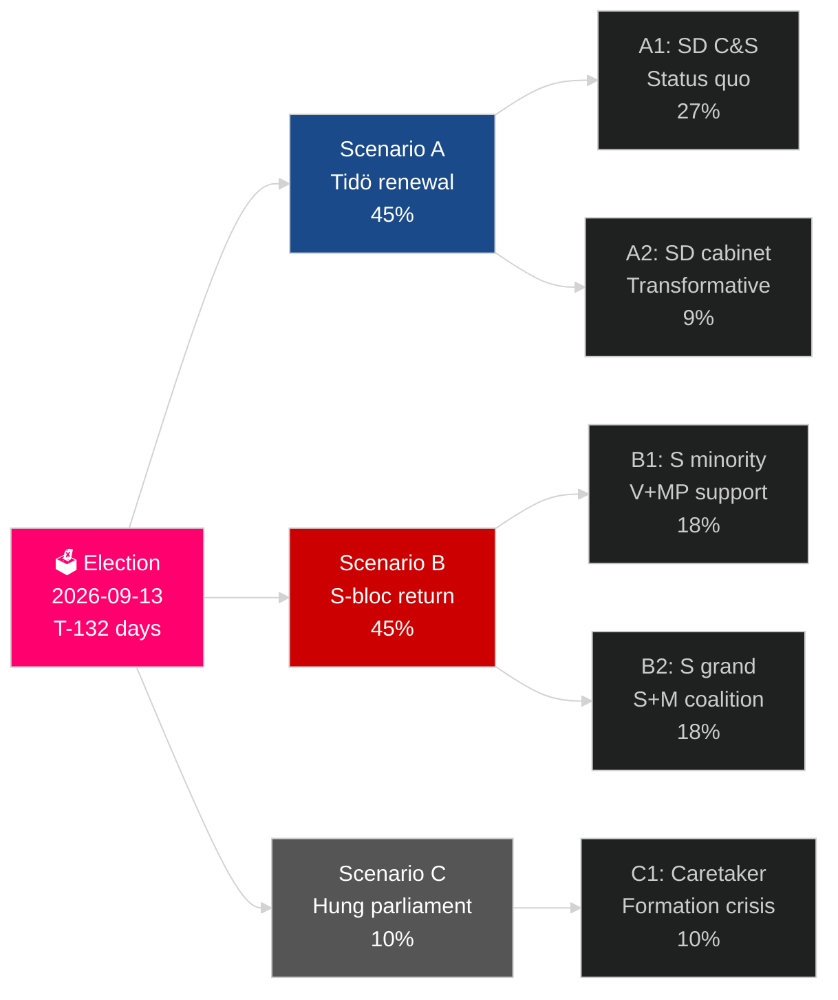

# Sweden's Current Election Cycle (2022–2026): The Reckoning Mandate

**Author**: James Pether Sörling
**Date**: 2026-05-04
**Classification**: PUBLIC — GDPR Art 9(2)(e)(g)
**Analysis depth**: comprehensive (2.5× Tier-C election-cycle)
**Confidence**: HIGH [Admiralty B2]

---

## BLUF

Sweden's 2022–2026 mandate is entering its final 132 days: a Tidö coalition of M+KD+L has governed with SD confidence-and-supply support, delivering the deepest shift in Swedish migration policy in a generation (HD03262), reactivating nuclear energy (HD01NU19), and committing to 2.4% GDP defence (NATO 2028 target). The coalition stands at 175 seats — a bare majority — with L at critical threshold risk (32% probability of failing 4%) and MP also facing elimination (38%). Economic recovery is underway: IMF WEO Apr-2026 projects 2.4% GDP growth for 2026, up from the 2024 recession low. The September 2026 election is statistically a coin-flip.

## Decisions This Brief Supports

1. **Election scenario planning**: Which of 12 post-election scenarios materialises? Coalition arithmetic, formation timeline, SD cabinet question.
2. **Policy legacy assessment**: Has the Tidö mandate delivered on its 2022 promises? Migration, nuclear, defence, crime, economy.
3. **Risk identification**: What are the top 5 risks in the remaining 132 days (judicial challenges, economic shocks, coalition fragility)?
4. **Next mandate preparation**: What structural conditions does the winner inherit in September 2026?
5. **Democratic resilience assessment**: Is Sweden's institutional resilience adequate to the SD normalisation challenge?

## 60-Second Intelligence Read

- **Election**: SD at 20-22% (largest right-wing bloc party); S at 31-33%; both blocs near 175-seat parity. **Too close to call** — within polling margin of error.
- **Migration**: HD03262 enacted; Lagrådet opinion pending on ECHR Art 8 provisions; CJEU challenge possible.
- **Nuclear**: HD01NU19 enacted; site selection and construction investment decision required 2027–2028.
- **Defence**: 2.4% GDP commitment confirmed; SAAB Gripen E, Bofors, Nammo all ramping.
- **Economy**: Recovery accelerating; IMF GDP 2.4% (2026); household debt risk normalising; property market recovering.
- **Coalition fragility**: L at 32% failure risk; coalition arithmetic depends on L surpassing 4% threshold.

## Top Forward Trigger

**L party polling threshold**: If L falls below 4% in final SVT/Ipsos polls, Tidö coalition loses its arithmetic base and the formation calculus shifts dramatically toward S-led alternatives.

## Mandate Scorecard

| Priority | Status | Assessment |
|---|---|---|
| Migration restriction | ✅ Enacted | HD03262 delivered; legal challenges pending |
| Nuclear reactivation | ✅ Law enacted | HD01NU19 enacted; construction decision deferred |
| Defence 2.4% GDP | ⚠️ On track | Commitment confirmed; 2028 milestone ahead |
| Gang crime reduction | ⚠️ Mixed | Legislation enacted; results partial |
| Economic recovery | ✅ Underway | IMF 2.4% GDP growth 2026 |
| Coalition stability | ⚠️ Fragile | 175 seats; L threshold risk |

## Confidence Label

HIGH confidence on structural analysis (mandate legacy, coalition arithmetic); MEDIUM on election outcome and next-mandate formation.

