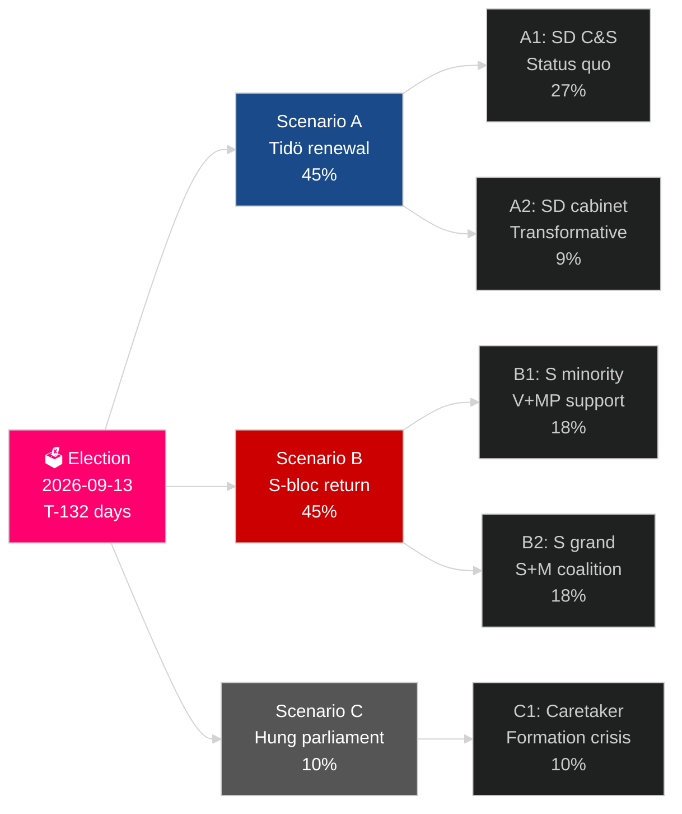

<!-- dir: rtl -->
# دورة الانتخابات الحالية للسويد (2022–2026): تصويت على إرث الولاية

**المؤلف**: James Pether Sörling
**التاريخ**: 2026-05-04
**التصنيف**: عام — GDPR Art 9(2)(e)(g)
**عمق التحليل**: comprehensive (2.5× Tier-C election-cycle)
**مستوى الثقة**: HIGH [Admiralty B2]

---

## BLUF

تدخل الولاية السويدية 2022–2026 أيامها الـ 132 الأخيرة: حكمت ائتلاف تيدو M+KD+L مع دعم الثقة والإمداد من SD، منفّذةً أعمق تحول في سياسة الهجرة السويدية في جيل (HD03262)، وأعادت تنشيط الطاقة النووية (HD01NU19)، وتعهّدت بـ 2.4% من الناتج المحلي الإجمالي للدفاع (هدف الناتو 2028). تمتلك الائتلاف 175 مقعداً — أغلبية ضيقة — مع تعرّض حزب L لخطر حرج عند العتبة (32% احتمال التراجع تحت 4%)، وكذلك مواجهة MP خطر الاستبعاد (38%). التعافي الاقتصادي في مساره: توقّعات صندوق النقد الدولي WEO أبريل-2026 تُسجّل نمواً في الناتج المحلي بنسبة 2.4% لعام 2026، ارتفاعاً من أدنى مستويات الركود عام 2024. انتخابات سبتمبر 2026 هي إحصائياً قرعة.

## القرارات التي يدعمها هذا التقرير

1. **تخطيط سيناريوهات الانتخابات**: أيّ من 12 سيناريو ما بعد الانتخابات سيتحقق؟ حسابات الائتلاف، جدول التشكيل، مسألة خزانة SD.
2. **تقييم الإرث السياسي**: هل أوفى حكم تيدو بوعوده لعام 2022؟ الهجرة، الطاقة النووية، الدفاع، الجريمة، الاقتصاد.
3. **تحديد المخاطر**: ما هي أبرز 5 مخاطر في الـ 132 يوماً المتبقية (التحديات القانونية، الصدمات الاقتصادية، هشاشة الائتلاف)؟
4. **الاستعداد للولاية القادمة**: ما الشروط الهيكلية التي يرثها الفائز في سبتمبر 2026؟
5. **تقييم الصمود الديمقراطي**: هل الصمود المؤسسي للسويد كافٍ لمواجهة تحدي تطبيع SD؟

## القراءة الاستخباراتية في 60 ثانية

- **الانتخابات**: SD ~20–22% (أكبر أحزاب الكتلة اليمينية)؛ S ~31–33%؛ كلا الكتلتين قريبتان من التعادل عند 175 مقعداً. **متقاربة جداً للحسم** — داخل هامش خطأ استطلاعات الرأي.
- **الهجرة**: HD03262 مُقرَّة؛ رأي لاغرود ينتظر بشأن أحكام ECHR المادة 8؛ الطعن أمام CJEU ممكن.
- **الطاقة النووية**: HD01NU19 مُقرَّة؛ اختيار الموقع وقرار الاستثمار في البناء مطلوبان بين 2027–2028.
- **الدفاع**: تأكيد التزام 2.4% من الناتج المحلي؛ SAAB Gripen E وBofors وNammo جميعها تزيد طاقتها.
- **الاقتصاد**: التعافي يتسارع؛ IMF الناتج المحلي 2.4% (2026)؛ مخاطر ديون الأسر تتطبيع؛ سوق العقارات في تعافٍ.
- **هشاشة الائتلاف**: L عند خطر عتبة 32%؛ الحسابات الائتلافية تعتمد على تجاوز L عتبة 4%.

## المحفّز الاستراتيجي الرئيسي

**عتبة استطلاعات حزب L**: إذا هبط L دون 4% في استطلاعات SVT/Ipsos الأخيرة، فإن ائتلاف تيدو يفقد قاعدته الحسابية وتتحول حسابات تشكيل الائتلاف بشكل جذري نحو بدائل بقيادة S.

## بطاقة أداء الولاية

| الأولوية | الحالة | التقييم |
|---|---|---|
| تقييد الهجرة | ✅ مُقرَّة | HD03262 مُنجَزة؛ طعون قانونية معلقة |
| إعادة تنشيط الطاقة النووية | ✅ القانون مُقرَّ | HD01NU19 مُقرَّة؛ قرار البناء مؤجل |
| الدفاع 2.4% من الناتج المحلي | ⚠️ في المسار | الالتزام مؤكد؛ المعلم 2028 قادم |
| الحد من جرائم العصابات | ⚠️ مختلط | التشريع مُقرَّ؛ النتائج جزئية |
| التعافي الاقتصادي | ✅ جارٍ | IMF نمو 2.4% في الناتج المحلي 2026 |
| استقرار الائتلاف | ⚠️ هش | 175 مقعداً؛ خطر عتبة L |

## تصنيف الثقة

ثقة عالية في التحليل الهيكلي (إرث الولاية، حسابات الائتلاف)؛ متوسطة في نتائج الانتخابات وتشكيل الولاية القادمة.

<!-- source-sha: a07cdf9a7bb470fd04a51b2f65b33c4561d82496 -->
