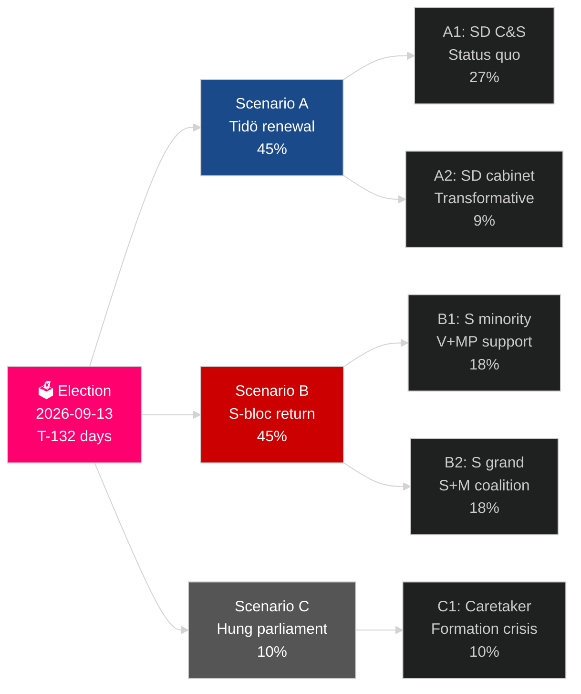

# Sveriges aktuelle valgcyklus (2022–2026): Mandatets afstemning

**Forfatter**: James Pether Sörling
**Dato**: 2026-05-04
**Klassifikation**: OFFENTLIG — GDPR Art 9(2)(e)(g)
**Analysedybde**: comprehensive (2.5× Tier-C election-cycle)
**Konfidens**: HIGH [Admiralty B2]

---

## BLUF

Sveriges mandat 2022–2026 er ved at nå sine sidste 132 dage: Tidø-koalitionen M+KD+L har regeret med SD's tillids- og forsyningsstøtte og gennemført det mest vidtgående skift i svensk migrationspolitik i en generation (HD03262), genaktiveret atomkraft (HD01NU19) og forpligtet sig til 2,4 % af BNP til forsvar (NATO 2028-mål). Koalitionen har 175 mandater — et knebent flertal — med L ved kritisk tærskelrisiko (32 % sandsynlighed for at falde under 4 %) og MP der også risikerer elimination (38 %). Genopretning er i gang: IMF WEO apr-2026 forventer 2,4 % BNP-vækst for 2026, op fra recessionslavpunktet i 2024. Valget i september 2026 er statistisk set et møntkast.

## Beslutninger dette briefing understøtter

1. **Valgscenarieplanlægning**: Hvilket af 12 post-valscenarier realiseres? Koalitionsarithmetic, formeringstidslinje, SD-kabinetsspørgsmål.
2. **Vurdering af politisk arv**: Har Tidø-mandatet leveret på dets 2022-løfter? Migration, atomkraft, forsvar, kriminalitet, økonomi.
3. **Risikoidentifikation**: Hvad er de 5 største risici i de resterende 132 dage (retssager, økonomiske chok, koalitionsskrøbelighed)?
4. **Forberedelse af næste mandat**: Hvilke strukturelle betingelser arver vinderen i september 2026?
5. **Vurdering af demokratisk modstandsdygtighed**: Er Sveriges institutionelle modstandsdygtighed tilstrækkelig i lyset af SD-normaliseringsudfordringen?

## 60-sekunders efterretningsoversigt

- **Valg**: SD ~20–22 % (det største parti i højrefløjsblokken); S ~31–33 %; begge blokke tæt på 175-mandats-paritet. **For tæt til afgørelse** — inden for meningsmålingers fejlmargen.
- **Migration**: HD03262 vedtaget; Lagrådets udtalelse afventes vedr. ECHR Art 8-bestemmelserne; CJEU-udfordring mulig.
- **Atomkraft**: HD01NU19 vedtaget; placeringsvalg og investeringsbeslutning til konstruktion påkrævet 2027–2028.
- **Forsvar**: 2,4 % BNP-forpligtelse bekræftet; SAAB Gripen E, Bofors, Nammo øger alle kapaciteten.
- **Økonomi**: Genopretning accelererer; IMF BNP 2,4 % (2026); husholdningsgæld-risiko normaliseres; ejendomsmarkedet i bedring.
- **Koalitionsskrøbelighed**: L ved 32 % tærskelrisiko; koalitionsarithmetik afhænger af at L overstiger 4 %-spærren.

## Primær fremadrettet trigger

**L-partiets valgundersøgelsestærskel**: Hvis L falder under 4 % i de endelige SVT/Ipsos-målinger, mister Tidø-koalitionen sit arithmetiske grundlag, og koalitionsberegningen skifter dramatisk mod S-ledede alternativer.

## Mandatscorecard

| Prioritet | Status | Vurdering |
|---|---|---|
| Migrationsbegrænsning | ✅ Vedtaget | HD03262 leveret; retssager under behandling |
| Atomkraftgenaktivering | ✅ Lov vedtaget | HD01NU19 vedtaget; konstruktionsbeslutning udskudt |
| Forsvar 2,4 % BNP | ⚠️ På sporet | Forpligtelse bekræftet; 2028-milepæl foran |
| Reduktion af bandekriminalitet | ⚠️ Blandet | Lovgivning vedtaget; resultater delvist |
| Genopretning af økonomi | ✅ I gang | IMF 2,4 % BNP-vækst 2026 |
| Koalitionsstabilitet | ⚠️ Skrøbelig | 175 mandater; L-tærskelrisiko |

## Konfidensmærke

HØJ konfidens på strukturel analyse (mandatarv, koalitionsarithmetic); MEDIUM på valgresultat og næste mandatformering.

<!-- source-sha: a07cdf9a7bb470fd04a51b2f65b33c4561d82496 -->
