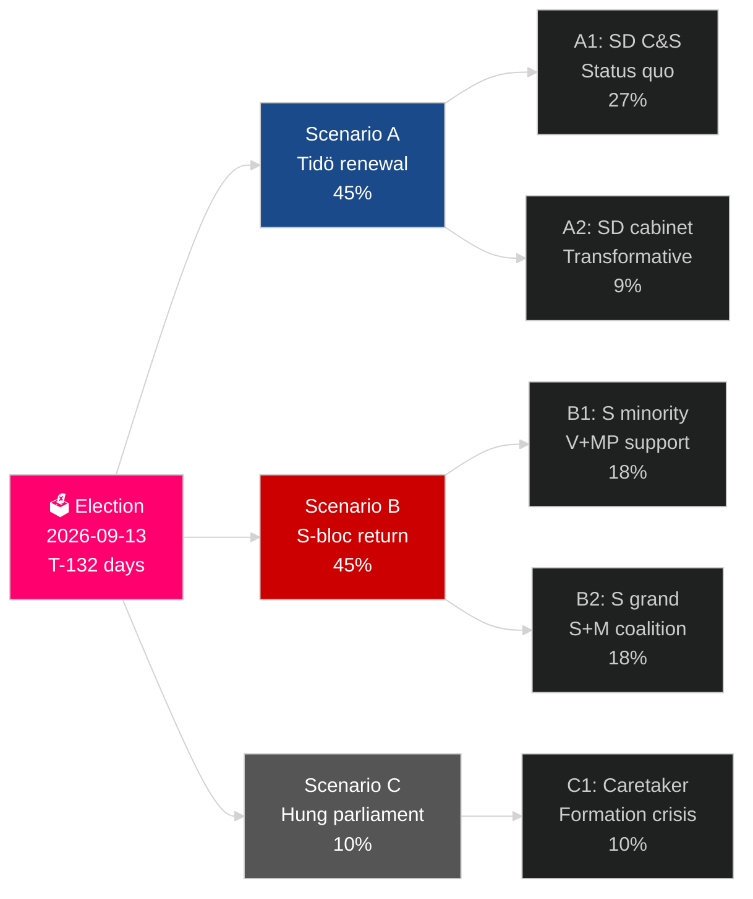

# Schwedens aktueller Wahlzyklus (2022–2026): Das Mandat vor dem Votum

**Autor**: James Pether Sörling
**Datum**: 2026-05-04
**Klassifizierung**: ÖFFENTLICH — GDPR Art 9(2)(e)(g)
**Analysetiefe**: comprehensive (2.5× Tier-C election-cycle)
**Konfidenz**: HIGH [Admiralty B2]

---

## BLUF

Schwedens Mandat 2022–2026 tritt in seine letzten 132 Tage: Die Tidö-Koalition M+KD+L hat mit SDs Unterstützung durch Vertrauen und Duldung regiert und den tiefgreifendsten Wandel in der schwedischen Migrationspolitik einer Generation durchgesetzt (HD03262), Kernenergie reaktiviert (HD01NU19) und 2,4 % des BIP für die Verteidigung zugesagt (NATO-Ziel 2028). Die Koalition hält 175 Sitze — eine knappe Mehrheit — wobei L an der kritischen Schwellenrisiko steht (32 % Wahrscheinlichkeit, unter 4 % zu fallen) und MP ebenfalls mit Eliminierung konfrontiert ist (38 %). Die wirtschaftliche Erholung ist im Gange: der IWF WEO Apr-2026 prognostiziert 2,4 % BIP-Wachstum für 2026, ein Anstieg vom Rezessionstief 2024. Die Wahl im September 2026 ist statistisch ein Münzwurf.

## Entscheidungen, die dieser Bericht unterstützt

1. **Wahlszenarioplanung**: Welches von 12 Nachwahlszenarien realisiert sich? Koalitionsarithmetik, Bildungszeitplan, SD-Kabinetsfrage.
2. **Bewertung des politischen Erbes**: Hat das Tidö-Mandat seine Versprechen von 2022 eingelöst? Migration, Kernenergie, Verteidigung, Kriminalität, Wirtschaft.
3. **Risikoidentifikation**: Was sind die 5 größten Risiken in den verbleibenden 132 Tagen (Gerichtsverfahren, Wirtschaftsschocks, Koalitionszerbrechlichkeit)?
4. **Vorbereitung des nächsten Mandats**: Welche Strukturbedingungen erbt der Gewinner im September 2026?
5. **Bewertung der demokratischen Widerstandsfähigkeit**: Ist Schwedens institutionelle Widerstandsfähigkeit gegenüber der SD-Normalisierungsherausforderung ausreichend?

## 60-Sekunden-Geheimdienstüberblick

- **Wahl**: SD ~20–22 % (größte Partei im rechten Block); S ~31–33 %; beide Blöcke nahe an 175-Sitz-Parität. **Zu eng für eine Entscheidung** — innerhalb der Umfrage-Fehlermarge.
- **Migration**: HD03262 verabschiedet; Lagrådets Stellungnahme zu ECHR Art 8-Bestimmungen ausstehend; CJEU-Herausforderung möglich.
- **Kernenergie**: HD01NU19 verabschiedet; Standortauswahl und Bau-Investitionsentscheidung bis 2027–2028 erforderlich.
- **Verteidigung**: 2,4 % BIP-Zusage bestätigt; SAAB Gripen E, Bofors, Nammo alle ausgebaut.
- **Wirtschaft**: Erholung beschleunigt; IWF BIP 2,4 % (2026); Haushaltsverschuldungsrisiko normalisiert sich; Immobilienmarkt erholt sich.
- **Koalitionszerbrechlichkeit**: L an 32 % Schwellenrisiko; Koalitionsarithmetik hängt davon ab, dass L die 4 %-Hürde übersteigt.

## Primärer Vorwärts-Auslöser

**L-Partei Umfrageschwell**: Wenn L in den abschließenden SVT/Ipsos-Umfragen unter 4 % fällt, verliert die Tidö-Koalition ihre arithmetische Basis, und die Koalitionsberechnung verschiebt sich dramatisch in Richtung S-geführter Alternativen.

## Mandat-Scorecard

| Priorität | Status | Bewertung |
|---|---|---|
| Migrationsbeschränkung | ✅ Verabschiedet | HD03262 umgesetzt; Rechtsverfahren laufen |
| Kernenergie-Reaktivierung | ✅ Gesetz verabschiedet | HD01NU19 verabschiedet; Bau-Entscheidung verschoben |
| Verteidigung 2,4 % BIP | ⚠️ Auf Kurs | Zusage bestätigt; Meilenstein 2028 steht aus |
| Reduktion der Bandenkriminalität | ⚠️ Gemischt | Gesetzgebung verabschiedet; Ergebnisse teilweise |
| Wirtschaftliche Erholung | ✅ Im Gange | IWF 2,4 % BIP-Wachstum 2026 |
| Koalitionsstabilität | ⚠️ Zerbrechlich | 175 Sitze; L-Schwellenrisiko |

## Konfidenz-Label

HOHE Konfidenz bei struktureller Analyse (Mandatserbe, Koalitionsarithmetik); MITTEL bei Wahlergebnis und nächster Mandatsbildung.

<!-- source-sha: a07cdf9a7bb470fd04a51b2f65b33c4561d82496 -->
