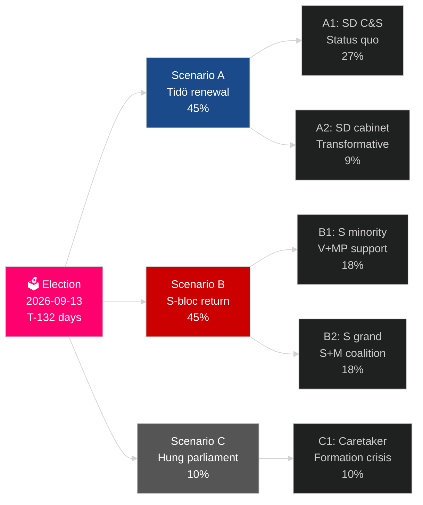

# El ciclo electoral actual de Suecia (2022–2026): El mandato ante el veredicto

**Autor**: James Pether Sörling
**Fecha**: 2026-05-04
**Clasificación**: PÚBLICA — GDPR Art 9(2)(e)(g)
**Profundidad de análisis**: comprehensive (2.5× Tier-C election-cycle)
**Confianza**: HIGH [Admiralty B2]

---

## BLUF

El mandato 2022–2026 de Suecia entra en sus últimos 132 días: la coalición Tidö M+KD+L ha gobernado con el apoyo de confianza y suministro de SD, ejecutando el cambio más profundo en la política migratoria sueca en una generación (HD03262), reactivando la energía nuclear (HD01NU19) y comprometiéndose con el 2,4 % del PIB para defensa (objetivo OTAN 2028). La coalición mantiene 175 escaños — una mayoría ajustada — con L en riesgo umbral crítico (32 % de probabilidad de caer por debajo del 4 %) y MP también ante el riesgo de eliminación (38 %). La recuperación económica está en marcha: el IMF WEO abr-2026 proyecta un crecimiento del PIB del 2,4 % para 2026, al alza respecto al mínimo de la recesión de 2024. La elección de septiembre de 2026 es estadísticamente un lanzamiento de moneda.

## Decisiones que este informe apoya

1. **Planificación de escenarios electorales**: ¿Cuál de los 12 escenarios post-electorales se materializará? Aritmética de coalición, cronograma de formación, pregunta del gabinete SD.
2. **Evaluación del legado político**: ¿Ha cumplido el mandato Tidö sus promesas de 2022? Migración, nuclear, defensa, crimen, economía.
3. **Identificación de riesgos**: ¿Cuáles son los 5 principales riesgos en los 132 días restantes (desafíos legales, choques económicos, fragilidad de la coalición)?
4. **Preparación del próximo mandato**: ¿Qué condiciones estructurales hereda el ganador en septiembre de 2026?
5. **Evaluación de la resiliencia democrática**: ¿Es suficiente la resiliencia institucional de Suecia ante el desafío de la normalización de SD?

## Inteligencia en 60 segundos

- **Elección**: SD ~20–22 % (el mayor partido del bloque de derecha); S ~31–33 %; ambos bloques cerca de la paridad en 175 escaños. **Demasiado ajustado para decidir** — dentro del margen de error de las encuestas.
- **Migración**: HD03262 promulgada; dictamen del Lagrådet pendiente sobre las disposiciones del ECHR Art 8; impugnación ante el CJEU posible.
- **Nuclear**: HD01NU19 promulgada; selección de emplazamiento y decisión de inversión de construcción requeridas 2027–2028.
- **Defensa**: compromiso del 2,4 % del PIB confirmado; SAAB Gripen E, Bofors, Nammo todos en aumento.
- **Economía**: recuperación acelerando; IMF PIB 2,4 % (2026); riesgo de deuda de hogares normalizándose; mercado inmobiliario recuperándose.
- **Fragilidad de la coalición**: L en 32 % de riesgo umbral; la aritmética de coalición depende de que L supere el umbral del 4 %.

## Detonante prospectivo principal

**Umbral de encuesta del partido L**: Si L cae por debajo del 4 % en las últimas encuestas de SVT/Ipsos, la coalición Tidö pierde su base aritmética y el cálculo de coalición se desplaza dramáticamente hacia alternativas lideradas por S.

## Scorecard del mandato

| Prioridad | Estado | Evaluación |
|---|---|---|
| Restricción migratoria | ✅ Promulgada | HD03262 entregado; recursos legales pendientes |
| Reactivación nuclear | ✅ Ley promulgada | HD01NU19 promulgada; decisión de construcción aplazada |
| Defensa 2,4 % PIB | ⚠️ En camino | Compromiso confirmado; hito 2028 por delante |
| Reducción de criminalidad organizada | ⚠️ Mixto | Legislación promulgada; resultados parciales |
| Recuperación económica | ✅ En curso | IMF 2,4 % crecimiento PIB 2026 |
| Estabilidad de coalición | ⚠️ Frágil | 175 escaños; riesgo umbral L |

## Etiqueta de confianza

ALTA confianza en el análisis estructural (legado del mandato, aritmética de coalición); MEDIA en resultado electoral y formación del próximo mandato.

<!-- source-sha: a07cdf9a7bb470fd04a51b2f65b33c4561d82496 -->
