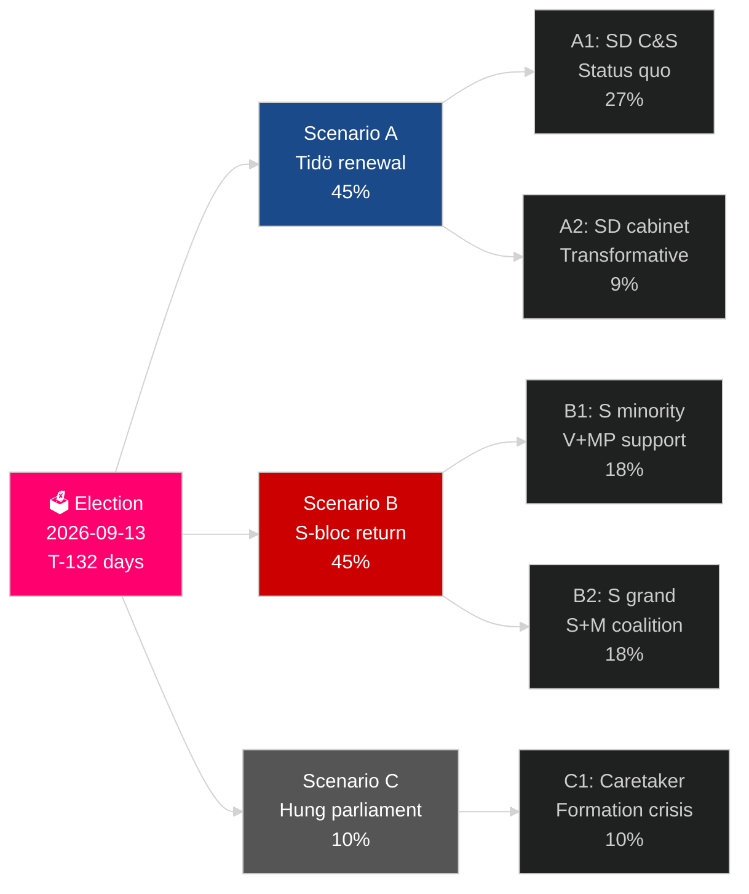

# Ruotsin nykyinen vaalisykli (2022–2026): Toimikauden tuomio

**Kirjoittaja**: James Pether Sörling
**Päiväys**: 2026-05-04
**Luokittelu**: JULKINEN — GDPR Art 9(2)(e)(g)
**Analyysin syvyys**: comprehensive (2.5× Tier-C election-cycle)
**Luottamustaso**: HIGH [Admiralty B2]

---

## BLUF

Ruotsin vuoden 2022–2026 toimikausi on viimeisissä 132 päivässään: Tidö-koalitio M+KD+L on hallitut SD:n luottamus- ja toimitustukeen nojautuen ja toteuttanut sukupolven merkittävimmän muutoksen Ruotsin maahanmuuttopolitiikassa (HD03262), reaktivoinut ydinvoiman (HD01NU19) ja sitoutunut 2,4 % BKT:stä puolustukseen (NATO:n 2028-tavoite). Koalitiolla on 175 paikkaa — niukka enemmistö — L kriittisen kynnyksen riskillä (32 % todennäköisyys jäädä alle 4 %) ja MP myös eliminoitumisen vaarassa (38 %). Taloudellinen elpyminen on käynnissä: IMF WEO huhtikuu-2026 ennustaa 2,4 % BKT-kasvun vuodelle 2026, nousua vuoden 2024 taantuman pohjasta. Syyskuun 2026 vaalit ovat tilastollisesti kolikonheitto.

## Päätökset, joita tämä briefing tukee

1. **Vaaliskenaariosuunnittelu**: Mitkä 12 vaalinjälkeisestä skenaariosta toteutuu? Koalitioaritmetiikka, muodostamisen aikajana, SD:n kabinettikysymys.
2. **Poliittisen perinnön arviointi**: Onko Tidö-toimikausi toimittanut vuoden 2022 lupauksensa? Maahanmuutto, ydinvoima, puolustus, rikollisuus, talous.
3. **Riskien tunnistaminen**: Mitkä ovat 5 suurinta riskiä jäljellä olevissa 132 päivässä (oikeudelliset haasteet, taloudelliset shokit, koalition hauraudes)?
4. **Seuraavan toimikauden valmistelu**: Mitkä rakenteelliset olosuhteet voittaja perii syyskuussa 2026?
5. **Demokratian häiriönsietokyvyn arviointi**: Onko Ruotsin institutionaalinen häiriönsietokyky riittävä SD:n normalisaatiohaasteen edessä?

## 60 sekunnin tiedustelutiivistelmä

- **Vaalit**: SD ~20–22 % (suurin oikean puolen puolue); S ~31–33 %; molemmat blokit lähellä 175 paikan tasa-arvoa. **Liian tasainen arvioitavaksi** — mielipidetutkimusten virhemarginaalin sisällä.
- **Maahanmuutto**: HD03262 hyväksytty; Lagradin lausunto odottaa ECHR Art 8 -säännöksistä; CJEU-haaste mahdollinen.
- **Ydinvoima**: HD01NU19 hyväksytty; sijainninvalinta ja rakentamisen investointipäätös tarvitaan 2027–2028.
- **Puolustus**: 2,4 % BKT-sitoumus vahvistettu; SAAB Gripen E, Bofors, Nammo kaikki kasvattavat kapasiteettia.
- **Talous**: Elpyminen kiihtyy; IMF BKT 2,4 % (2026); kotitalouksien velkariskit normalisoituvat; kiinteistömarkkinat elpyvät.
- **Koalition hauraus**: L 32 % kynnysriskillä; koalitioaritmetiikka riippuu L:n ylityksestä 4 % kynnyksellä.

## Ensisijainen tulevaisuuden laukaisin

**L-puolueen gallupin kynnys**: Jos L putoaa alle 4 % viimeisessä SVT/Ipsos-mittauksessa, Tidö-koalitio menettää aritmeettisen perustansa ja koalitiolaskenta siirtyy dramaattisesti kohti S-johtoisisa vaihtoehtoja.

## Toimikauden tuloskortti

| Prioriteetti | Status | Arvio |
|---|---|---|
| Maahanmuuton rajoittaminen | ✅ Hyväksytty | HD03262 toimitettu; oikeudelliset haasteet vireillä |
| Ydinvoiman reaktivointi | ✅ Laki hyväksytty | HD01NU19 hyväksytty; rakennuspäätös lykätty |
| Puolustus 2,4 % BKT | ⚠️ Oikealla tiellä | Sitoumus vahvistettu; 2028 virstanpylväs edessä |
| Jengirikollisuuden vähentäminen | ⚠️ Sekainen | Lainsäädäntö hyväksytty; osittaiset tulokset |
| Taloudellinen elpyminen | ✅ Käynnissä | IMF 2,4 % BKT-kasvu 2026 |
| Koalition vakaus | ⚠️ Hauras | 175 paikkaa; L-kynnysriski |

## Luottamusmerkintä

KORKEA luottamus rakenteellisessa analyysissä (toimikauden perintö, koalitioaritmetiikka); KESKITASO vaaliulostulossa ja seuraavan toimikauden muodostamisessa.

<!-- source-sha: a07cdf9a7bb470fd04a51b2f65b33c4561d82496 -->
