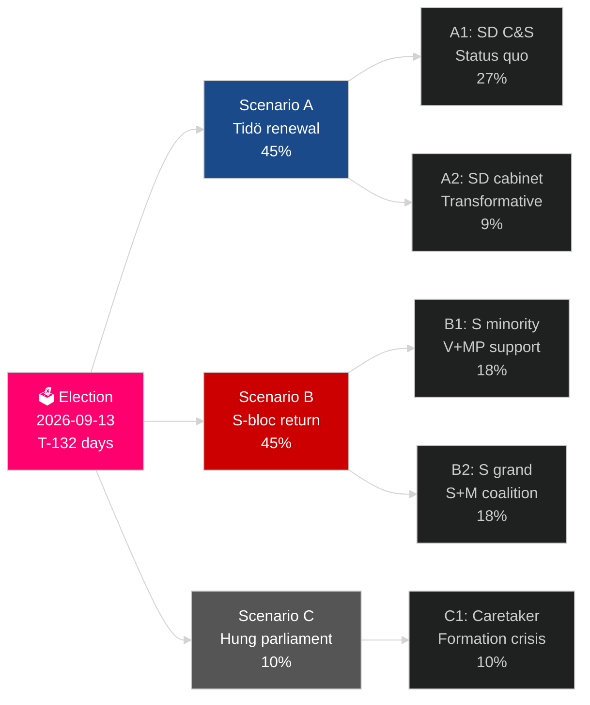

# Le cycle électoral actuel de la Suède (2022–2026) : Le mandat devant le verdict

**Auteur** : James Pether Sörling
**Date** : 2026-05-04
**Classification** : PUBLIQUE — GDPR Art 9(2)(e)(g)
**Profondeur d'analyse** : comprehensive (2.5× Tier-C election-cycle)
**Confiance** : HIGH [Admiralty B2]

---

## BLUF

Le mandat 2022–2026 de la Suède entre dans ses 132 derniers jours : la coalition Tidö M+KD+L a gouverné avec le soutien de confiance et d'approvisionnement de SD, réalisant le changement le plus profond de la politique migratoire suédoise en une génération (HD03262), réactivant l'énergie nucléaire (HD01NU19) et s'engageant à 2,4 % du PIB pour la défense (objectif OTAN 2028). La coalition détient 175 sièges — une majorité étroite — L étant à risque seuil critique (32 % de probabilité de tomber sous 4 %) et MP également menacé d'élimination (38 %). La reprise économique est en cours : l'IMF WEO avr-2026 projette une croissance du PIB de 2,4 % pour 2026, en hausse par rapport au creux de la récession 2024. L'élection de septembre 2026 est statistiquement un pile ou face.

## Décisions que ce briefing soutient

1. **Planification de scénarios électoraux** : Lequel des 12 scénarios post-électoraux se matérialisera ? Arithmétique de coalition, calendrier de formation, question du cabinet SD.
2. **Évaluation de l'héritage politique** : Le mandat Tidö a-t-il tenu ses promesses de 2022 ? Migration, nucléaire, défense, criminalité, économie.
3. **Identification des risques** : Quels sont les 5 principaux risques dans les 132 jours restants (défis juridiques, chocs économiques, fragilité de la coalition) ?
4. **Préparation du prochain mandat** : Quelles conditions structurelles le gagnant hérite-t-il en septembre 2026 ?
5. **Évaluation de la résilience démocratique** : La résilience institutionnelle de la Suède est-elle suffisante face au défi de la normalisation de SD ?

## Intelligence en 60 secondes

- **Élection** : SD ~20–22 % (le plus grand parti du bloc de droite) ; S ~31–33 % ; les deux blocs proches de la parité à 175 sièges. **Trop serré pour trancher** — dans la marge d'erreur des sondages.
- **Migration** : HD03262 adopté ; avis du Lagrådet attendu sur les dispositions de l'ECHR Art 8 ; défi CJEU possible.
- **Nucléaire** : HD01NU19 adopté ; sélection du site et décision d'investissement de construction requises 2027–2028.
- **Défense** : engagement à 2,4 % du PIB confirmé ; SAAB Gripen E, Bofors, Nammo augmentent tous leur capacité.
- **Économie** : reprise s'accélère ; IMF PIB 2,4 % (2026) ; risque d'endettement des ménages normalisé ; marché immobilier en convalescence.
- **Fragilité de la coalition** : L à 32 % de risque seuil ; l'arithmétique de coalition dépend de L dépassant le seuil de 4 %.

## Principal déclencheur prospectif

**Seuil de sondage du parti L** : Si L tombe sous les 4 % dans les derniers sondages SVT/Ipsos, la coalition Tidö perd sa base arithmétique et le calcul de coalition se déplace dramatiquement vers des alternatives dirigées par S.

## Scorecard du mandat

| Priorité | Statut | Évaluation |
|---|---|---|
| Restriction migratoire | ✅ Adoptée | HD03262 livré ; recours juridiques en cours |
| Réactivation du nucléaire | ✅ Loi adoptée | HD01NU19 adopté ; décision de construction reportée |
| Défense 2,4 % PIB | ⚠️ En bonne voie | Engagement confirmé ; jalon 2028 à venir |
| Réduction de la criminalité des gangs | ⚠️ Mitigé | Législation adoptée ; résultats partiels |
| Reprise économique | ✅ En cours | IMF 2,4 % croissance PIB 2026 |
| Stabilité de coalition | ⚠️ Fragile | 175 sièges ; risque seuil L |

## Label de confiance

HAUTE confiance sur l'analyse structurelle (héritage du mandat, arithmétique de coalition) ; MOYEN sur le résultat électoral et la formation du prochain mandat.

<!-- source-sha: a07cdf9a7bb470fd04a51b2f65b33c4561d82496 -->
