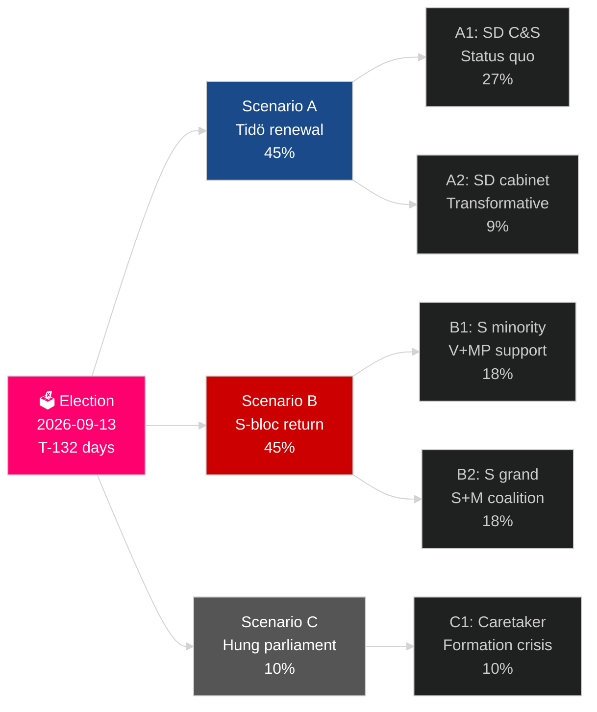

<!-- dir: rtl -->
# מחזור הבחירות הנוכחי בשבדיה (2022–2026): המנדט לפני הכרעה

**מחבר**: James Pether Sörling
**תאריך**: 2026-05-04
**סיווג**: ציבורי — GDPR Art 9(2)(e)(g)
**עומק ניתוח**: comprehensive (2.5× Tier-C election-cycle)
**ביטחון**: HIGH [Admiralty B2]

---

## BLUF

המנדט השבדי 2022–2026 נכנס ל-132 ימיו האחרונים: ממשלת טידו M+KD+L שלטה עם תמיכת הסמכה ואספקה של SD, וביצעה את השינוי העמוק ביותר במדיניות ההגירה השבדית בדור (HD03262), הפעילה מחדש אנרגיה גרעינית (HD01NU19) והתחייבה ל-2.4% מהתמ"ג עבור הגנה (יעד נאט"ו 2028). לקואליציה 175 מושבים — רוב דחוק — כאשר L נמצאת בסיכון קריטי של סף (32% סבירות לנפילה מתחת ל-4%), וגם MP עומדת בפני חיסול (38%). ההתאוששות הכלכלית מתקדמת: IMF WEO אפר-2026 מקרינה 2.4% צמיחה בתמ"ג ל-2026, עלייה ממינימום המיתון ב-2024. בחירות ספטמבר 2026 הן מבחינה סטטיסטית הטלת מטבע.

## החלטות שתדריך זה תומך בהן

1. **תכנון תרחישי בחירות**: איזה מ-12 תרחישים שלאחר הבחירות יתממש? אריתמטיקה קואליציונית, ציר הזמן לגיבוש, שאלת קבינט SD.
2. **הערכת מורשת פוליטית**: האם מנדט טידו עמד בהבטחותיו מ-2022? הגירה, גרעין, הגנה, פשיעה, כלכלה.
3. **זיהוי סיכונים**: מה 5 הסיכונים העיקריים ב-132 הימים הנותרים (אתגרים משפטיים, זעזועים כלכליים, שבירות הקואליציה)?
4. **הכנה למנדט הבא**: אילו תנאים מבניים הזוכה יורש בספטמבר 2026?
5. **הערכת חוסן דמוקרטי**: האם החוסן המוסדי של שבדיה מספיק בפני אתגר נורמליזציית SD?

## קריאת מודיעין ב-60 שניות

- **בחירות**: SD ~20–22% (הגדול שבמפלגות הגוש הימני); S ~31–33%; שני הגושים קרובים לשוויון ב-175 מושבים. **צמוד מדי להכרעה** — בתוך שולי שגיאת הסקרים.
- **הגירה**: HD03262 נחקקה; חוות דעת לאגרוד ממתינה לגבי הוראות ECHR סעיף 8; ערעור CJEU אפשרי.
- **גרעין**: HD01NU19 נחקקה; בחירת אתר והחלטת השקעה בבנייה נדרשות 2027–2028.
- **הגנה**: התחייבות 2.4% מהתמ"ג אושרה; SAAB Gripen E, Bofors, Nammo כולם מגדילים קיבולת.
- **כלכלה**: ההתאוששות מואצת; IMF תמ"ג 2.4% (2026); סיכון חוב משקי בית מתנרמל; שוק הנדל"ן מתאושש.
- **שבירות הקואליציה**: L בסיכון סף 32%; אריתמטיקה קואליציונית תלויה ב-L חוצה 4%.

## הגורם המניע העיקרי

**סף סקרי מפלגת L**: אם L נופלת מתחת ל-4% בסקרי SVT/Ipsos האחרונים, קואליציית טידו מאבדת את בסיסה האריתמטי וחישוב הקואליציה עובר באופן דרמטי לעבר חלופות בהובלת S.

## כרטיס ניקוד המנדט

| עדיפות | סטטוס | הערכה |
|---|---|---|
| הגבלת הגירה | ✅ נחקק | HD03262 הושג; ערעורים משפטיים בתהליך |
| הפעלה מחדש של גרעין | ✅ חוק נחקק | HD01NU19 נחקק; החלטת בנייה נדחתה |
| הגנה 2.4% מהתמ"ג | ⚠️ בנתיב | התחייבות אושרה; אבן דרך 2028 לפנינו |
| הפחתת פשיעת כנופיות | ⚠️ מעורב | חקיקה נחקקה; תוצאות חלקיות |
| התאוששות כלכלית | ✅ מתקדם | IMF 2.4% צמיחת תמ"ג 2026 |
| יציבות קואליציה | ⚠️ שברירי | 175 מושבים; סיכון סף L |

## תווית ביטחון

ביטחון גבוה בניתוח המבני (מורשת מנדט, אריתמטיקה קואליציונית); בינוני לגבי תוצאת הבחירות וגיבוש המנדט הבא.

<!-- source-sha: a07cdf9a7bb470fd04a51b2f65b33c4561d82496 -->
