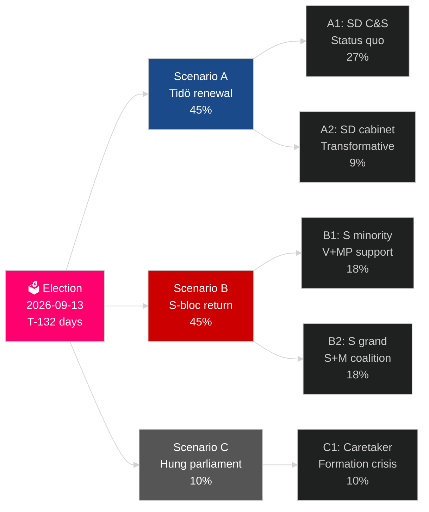

# スウェーデンの現在の選挙サイクル（2022–2026）：審判のマンデート

**著者**：James Pether Sörling
**日付**：2026-05-04
**分類**：公開 — GDPR Art 9(2)(e)(g)
**分析深度**：comprehensive（2.5× Tier-C election-cycle）
**信頼度**：HIGH [Admiralty B2]

---

## BLUF

スウェーデンの2022–2026年マンデートは最後の132日を迎えている。ティドー連立M+KD+LはSDの信任・閣外協力支持のもとで統治し、一世代で最も大きな移民政策の転換（HD03262）、原子力再活性化（HD01NU19）、GDP2.4%の防衛公約（NATO2028目標）を実現した。連立は175議席を保有 — 辛うじての過半数 — Lが閾値リスク（4%を下回る確率32%）、MPも排除リスク（38%）に晒されている。経済回復は進行中：IMF WEO 2026年4月は2026年のGDP成長を2.4%と予測、2024年の不況底から上向き。2026年9月の選挙は統計的にコイントスだ。

## このブリーフィングが支援する決定

1. **選挙後シナリオ計画**：12の選挙後シナリオのどれが実現するか？連立算術、組閣スケジュール、SD入閣問題。
2. **政治的遺産の評価**：ティドー政権は2022年の公約を果たしたか？移民、原子力、防衛、犯罪、経済。
3. **リスク特定**：残り132日間の最大5つのリスクは何か（法的課題、経済的ショック、連立の脆弱性）？
4. **次のマンデートへの準備**：2026年9月の勝者はどのような構造的条件を引き継ぐか？
5. **民主的レジリエンスの評価**：SDの正常化の課題に対して、スウェーデンの制度的レジリエンスは十分か？

## 60秒インテリジェンス概要

- **選挙**：SD ~20–22%（右派ブロック最大政党）; S ~31–33%; 両ブロック175議席のパリティに接近。**判断不能の僅差** — 世論調査の誤差範囲内。
- **移民**：HD03262制定済み; ECHR第8条規定についてのラグロードの意見待ち; CJEU異議の可能性あり。
- **原子力**：HD01NU19制定済み; 建設の敷地選定と投資決定が2027–2028に必要。
- **防衛**：GDP2.4%公約確認; SAAB グリペンE、ボフォース、ナムモはいずれも能力増強中。
- **経済**：回復加速; IMF GDP 2.4%（2026）; 家計負債リスク正常化; 不動産市場回復中。
- **連立の脆弱性**：Lは閾値リスク32%; 連立算術はLが4%を超えることが前提。

## 最優先の先行指標

**L党の世論調査閾値**：最終SVT/Ipsos世論調査でLが4%を下回った場合、ティドー連立はその算術的基盤を失い、組閣計算は劇的にS主導の代替案へシフトする。

## マンデートスコアカード

| 優先事項 | 状況 | 評価 |
|---|---|---|
| 移民制限 | ✅ 制定済み | HD03262 実現；法的異議申立て継続中 |
| 原子力再活性化 | ✅ 法律制定済み | HD01NU19 制定済み；建設決定は延期 |
| 防衛 GDP2.4% | ⚠️ 順調 | 公約確認；2028マイルストーン待ち |
| 暴力団犯罪削減 | ⚠️ 混在 | 立法済み；結果は部分的 |
| 経済回復 | ✅ 進行中 | IMF 2.4% GDP成長 2026 |
| 連立安定 | ⚠️ 脆弱 | 175議席；L閾値リスク |

## 信頼度ラベル

構造的分析（マンデートの遺産、連立算術）は高信頼度；選挙結果と次のマンデート形成は中程度。

<!-- source-sha: a07cdf9a7bb470fd04a51b2f65b33c4561d82496 -->
