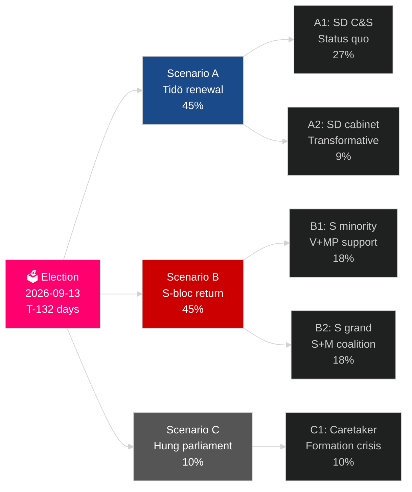

# 스웨덴의 현재 선거 주기 (2022–2026): 심판받는 임기

**저자**: James Pether Sörling
**날짜**: 2026-05-04
**분류**: 공개 — GDPR Art 9(2)(e)(g)
**분석 깊이**: comprehensive (2.5× Tier-C election-cycle)
**신뢰도**: HIGH [Admiralty B2]

---

## BLUF

스웨덴의 2022–2026년 임기는 마지막 132일에 접어들었다: 티되 연립 M+KD+L은 SD의 신임 및 공급 지원으로 통치하며, 한 세대에서 가장 심층적인 스웨덴 이민 정책 전환(HD03262), 핵에너지 재활성화(HD01NU19), GDP의 2.4%를 국방에 약속(NATO 2028 목표)을 달성했다. 연립은 175석을 보유 — 간신히 과반수 — L이 임계 위험 수준(4% 미만 가능성 32%)에, MP도 탈락 위험(38%)에 처해 있다. 경제 회복이 진행 중: IMF WEO 2026년 4월은 2026년 GDP 2.4% 성장을 전망, 2024년 불황 바닥에서 상승. 2026년 9월 선거는 통계적으로 동전 던지기다.

## 이 브리핑이 지원하는 결정

1. **선거 후 시나리오 계획**: 12가지 선거 후 시나리오 중 어떤 것이 실현될까? 연립 계산, 구성 일정, SD 입각 문제.
2. **정치적 유산 평가**: 티되 임기가 2022년 약속을 이행했는가? 이민, 원자력, 국방, 범죄, 경제.
3. **위험 식별**: 남은 132일간 5대 위험은 무엇인가 (법적 도전, 경제적 충격, 연립 취약성)?
4. **다음 임기 준비**: 2026년 9월 승자는 어떤 구조적 조건을 물려받는가?
5. **민주적 회복력 평가**: SD 정상화 도전에 대한 스웨덴의 제도적 회복력이 충분한가?

## 60초 정보 개요

- **선거**: SD ~20–22% (우익 블록 최대 정당); S ~31–33%; 양 블록 175석 균형에 근접. **결정하기에 너무 접전** — 여론조사 오차 범위 내.
- **이민**: HD03262 제정; ECHR 제8조 규정에 관한 라그로드 의견 대기 중; CJEU 이의 제기 가능.
- **원자력**: HD01NU19 제정; 부지 선정과 건설 투자 결정 2027–2028 필요.
- **국방**: GDP 2.4% 약속 확인; SAAB 그리펜 E, 보포스, 남모 모두 능력 증강 중.
- **경제**: 회복 가속; IMF GDP 2.4% (2026); 가계 부채 위험 정상화; 부동산 시장 회복.
- **연립 취약성**: L 임계 위험 32%; 연립 계산은 L이 4% 초과하는 데 의존.

## 최우선 선행 지표

**L당 여론조사 임계점**: L이 최종 SVT/Ipsos 여론조사에서 4% 미만으로 떨어지면 티되 연립은 산술적 기반을 잃고, 연립 계산이 S 주도 대안으로 극적으로 이동한다.

## 임기 성과표

| 우선순위 | 상태 | 평가 |
|---|---|---|
| 이민 제한 | ✅ 제정 | HD03262 실현; 법적 이의 제기 진행 중 |
| 원자력 재활성화 | ✅ 법률 제정 | HD01NU19 제정; 건설 결정 연기 |
| 국방 GDP 2.4% | ⚠️ 순조 | 약속 확인; 2028 이정표 앞으로 |
| 조직 범죄 감소 | ⚠️ 혼재 | 법제화 완료; 결과 부분적 |
| 경제 회복 | ✅ 진행 중 | IMF 2.4% GDP 성장 2026 |
| 연립 안정 | ⚠️ 취약 | 175석; L 임계 위험 |

## 신뢰도 라벨

구조 분석(임기 유산, 연립 계산)은 높은 신뢰도; 선거 결과와 다음 임기 구성은 중간 신뢰도.

<!-- source-sha: a07cdf9a7bb470fd04a51b2f65b33c4561d82496 -->
