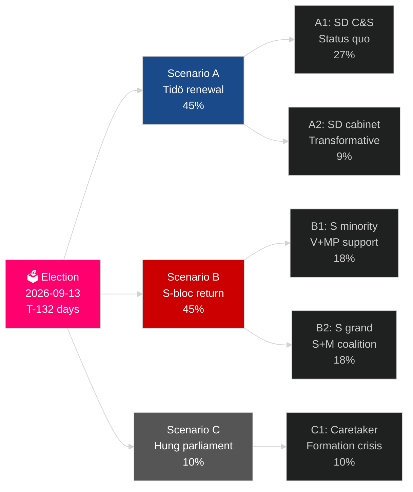

# De huidige verkiezingscyclus van Zweden (2022–2026): Het mandaat voor het verdict

**Auteur**: James Pether Sörling
**Datum**: 2026-05-04
**Classificatie**: OPENBAAR — GDPR Art 9(2)(e)(g)
**Analysediepte**: comprehensive (2.5× Tier-C election-cycle)
**Betrouwbaarheid**: HIGH [Admiralty B2]

---

## BLUF

Het Zweedse mandaat 2022–2026 treedt zijn laatste 132 dagen in: de Tidö-coalitie M+KD+L heeft geregeerd met de steun van SDs vertrouwen-en-gedoogakkoord, en heeft het meest ingrijpende wijziging van het Zweedse migratiebeleid in een generatie doorgevoerd (HD03262), kernenergie geheractiveerd (HD01NU19) en 2,4 % van het BBP voor defensie toegezegd (NAVO-doel 2028). De coalitie beschikt over 175 zetels — een krappe meerderheid — met L aan kritische drempelrisico (32 % kans om onder 4 % te vallen) en MP ook voor eliminatie (38 %). Het economisch herstel is op gang: het IMF WEO apr-2026 projecteert 2,4 % BBP-groei voor 2026, gestegen van het recessiedieptepunt in 2024. De verkiezing van september 2026 is statistisch een muntgooiing.

## Beslissingen die dit briefing ondersteunt

1. **Verkiezingsscenarioplanning**: Welk van de 12 post-verkiezingsscenario's realiseert zich? Coalitie-arithmetiek, formeringstijdlijn, SD-kabinethsvraag.
2. **Beoordeling van politieke erfenis**: Heeft het Tidö-mandaat zijn beloftes van 2022 ingelost? Migratie, kernenergie, defensie, criminaliteit, economie.
3. **Risicoidentificatie**: Wat zijn de 5 grootste risico's in de resterende 132 dagen (juridische uitdagingen, economische schokken, coalitiekwetsbaarheid)?
4. **Voorbereiding volgend mandaat**: Welke structurele omstandigheden erft de winnaar in september 2026?
5. **Beoordeling van democratische weerbaarheid**: Is Zwedens institutionele weerbaarheid voldoende voor de SD-normaliseringsuitdaging?

## 60-seconden inlichtingenoverzicht

- **Verkiezing**: SD ~20–22 % (het grootste partij in het rechtse blok); S ~31–33 %; beide blokken dicht bij 175-zetel-pariteit. **Te krap voor een beslissing** — binnen de foutmarge van peilingen.
- **Migratie**: HD03262 aangenomen; advies van de Lagrådet afwachtend inzake ECHR Art 8-bepalingen; CJEU-aanvechting mogelijk.
- **Kernenergie**: HD01NU19 aangenomen; locatieselectie en bouw-investeringsbeslissing vereist 2027–2028.
- **Defensie**: toezegging 2,4 % BBP bevestigd; SAAB Gripen E, Bofors, Nammo allen verhogen capaciteit.
- **Economie**: herstel versnelt; IMF BBP 2,4 % (2026); huishoudelijk schuldrisico normaliseert; vastgoedmarkt herstelt.
- **Coalitiekwetsbaarheid**: L aan 32 % drempelrisico; coalitie-arithmetiek hangt af van L die de 4%-drempel overstijgt.

## Primaire voorwaartse trigger

**Drempel van de peilingen voor partij L**: Als L onder 4 % daalt in de afsluitende SVT/Ipsos-peilingen, verliest de Tidö-coalitie haar arithmetische basis en verschuift de coalitieberekening dramatisch naar S-geleide alternatieven.

## Mandaat-scorecard

| Prioriteit | Status | Beoordeling |
|---|---|---|
| Migratiebeperking | ✅ Aangenomen | HD03262 geleverd; rechtszaken lopende |
| Heractivering kernenergie | ✅ Wet aangenomen | HD01NU19 aangenomen; bouwbeslissing uitgesteld |
| Defensie 2,4 % BBP | ⚠️ Op koers | Toezegging bevestigd; mijlpaal 2028 voor de boeg |
| Vermindering bandecriminaliteit | ⚠️ Gemengd | Wetgeving aangenomen; resultaten gedeeltelijk |
| Economisch herstel | ✅ In gang | IMF 2,4 % BBP-groei 2026 |
| Coalitiesstabiliteit | ⚠️ Kwetsbaar | 175 zetels; L-drempelrisico |

## Betrouwbaarheidslabel

HOGE betrouwbaarheid bij structurele analyse (mandaaterfenis, coalitie-arithmetiek); MEDIUM bij verkiezingsuitslag en formatie van het volgende mandaat.

<!-- source-sha: a07cdf9a7bb470fd04a51b2f65b33c4561d82496 -->
