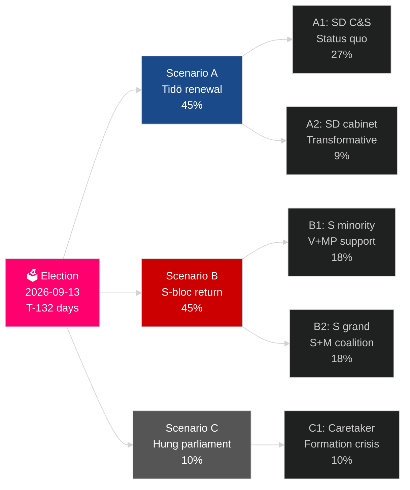

# Sveriges gjeldende valgyklus (2022–2026): Mandatets oppgjør

**Forfatter**: James Pether Sörling
**Dato**: 2026-05-04
**Klassifisering**: OFFENTLIG — GDPR Art 9(2)(e)(g)
**Analysedybde**: comprehensive (2.5× Tier-C election-cycle)
**Konfidens**: HIGH [Admiralty B2]

---

## BLUF

Sveriges mandat 2022–2026 nærmer seg sine siste 132 dager: Tidø-koalisjonen M+KD+L har styrt med SD sin tillits- og forsyningsstøtte, og gjennomført det mest gjennomgripende skiftet i svensk migrasjonspolitikk på en generasjon (HD03262), reaktivert atomkraft (HD01NU19) og forpliktet seg til 2,4 % av BNP til forsvar (NATO 2028-mål). Koalisjonen har 175 mandater — et knapp flertall — med L ved kritisk terskelsrisiko (32 % sannsynlighet for å falle under 4 %) og MP som også risikerer eliminasjon (38 %). Økonomisk bedring er i gang: IMF WEO apr-2026 projiserer 2,4 % BNP-vekst for 2026, opp fra resesjonsbunn i 2024. Valget i september 2026 er statistisk sett et myntkast.

## Beslutninger dette brifingen støtter

1. **Valgscenarioplanlegging**: Hvilket av 12 scenarier etter valget realiseres? Koalisjonsaritmetikk, formeringstidslinje, SD-kabinettsspørsmål.
2. **Vurdering av politisk arv**: Har Tidø-mandatet levert på sine 2022-løfter? Migrasjon, atomkraft, forsvar, kriminalitet, økonomi.
3. **Risikoidentifikasjon**: Hva er de 5 største risikoene i de gjenstående 132 dagene (rettssaker, økonomiske sjokk, koalisjonsskjørhet)?
4. **Forberedelse til neste mandat**: Hvilke strukturelle betingelser arver vinneren i september 2026?
5. **Vurdering av demokratisk motstandsdyktighet**: Er Sveriges institusjonelle motstandsdyktighet tilstrekkelig overfor SD-normaliseringsutfordringen?

## 60-sekunders etterretningsoversikt

- **Valg**: SD ~20–22 % (det største partiet i høyreblokken); S ~31–33 %; begge blokker nær 175-mandats-paritet. **For jevnt til å avgjøre** — innenfor meningsmålingers feilmargin.
- **Migrasjon**: HD03262 vedtatt; Lagrådets uttalelse avventes vedr. ECHR Art 8-bestemmelsene; CJEU-utfordring mulig.
- **Atomkraft**: HD01NU19 vedtatt; valg av tomt og investeringsbeslutning for bygging kreves 2027–2028.
- **Forsvar**: 2,4 % BNP-forpliktelse bekreftet; SAAB Gripen E, Bofors, Nammo øker alle kapasiteten.
- **Økonomi**: Bedring akselererer; IMF BNP 2,4 % (2026); husholdningsgjeldsrisiko normaliseres; eiendomsmarkedet bedrer seg.
- **Koalisjonsskjørhet**: L ved 32 % terskelsrisiko; koalisjonsaritmetikk avhenger av at L overstiger 4%-sperregrensen.

## Primær fremadrettet triggermekanisme

**L-partiets valgmålingsterskel**: Hvis L faller under 4 % i de siste SVT/Ipsos-målingene, mister Tidø-koalisjonen sitt aritmetiske grunnlag, og koalisjonsberegningen skifter dramatisk mot S-ledede alternativer.

## Mandatscorecard

| Prioritet | Status | Vurdering |
|---|---|---|
| Migrasjonsbegrensninge | ✅ Vedtatt | HD03262 levert; rettssaker pågår |
| Reaktivering av atomkraft | ✅ Lov vedtatt | HD01NU19 vedtatt; byggebeslutning utsatt |
| Forsvar 2,4 % BNP | ⚠️ I rute | Forpliktelse bekreftet; 2028-milepæl gjenstår |
| Reduksjon av gjengkriminalitet | ⚠️ Blandet | Lovgivning vedtatt; resultater delvis |
| Ekonomisk bedring | ✅ Pågår | IMF 2,4 % BNP-vekst 2026 |
| Koalisjonsstabilitet | ⚠️ Skjør | 175 mandater; L-terskelsrisiko |

## Konfidensmerknad

HØY konfidens på strukturell analyse (mandatarv, koalisjonsaritmetikk); MEDIUM på valgresultat og neste mandatformering.

<!-- source-sha: a07cdf9a7bb470fd04a51b2f65b33c4561d82496 -->
