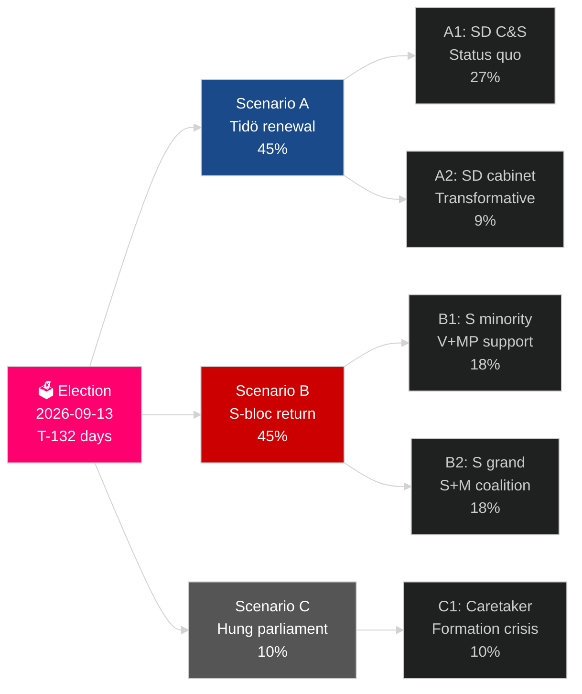

# Sveriges aktuella valcykel (2022–2026): Mandatets uppgörelse

**Författare**: James Pether Sörling
**Datum**: 2026-05-04
**Klassificering**: OFFENTLIG — GDPR Art 9(2)(e)(g)
**Analysdjup**: comprehensive (2.5× Tier-C election-cycle)
**Konfidensgrad**: HIGH [Admiralty B2]

---

## BLUF

Sveriges mandatperiod 2022–2026 befinner sig i sina sista 132 dagar: Tidökoalitionen M+KD+L har styrt med SD:s förtroende- och sakpolitikstöd och genomfört den mest genomgripande förändringen av svensk migrationspolitik på en generation (HD03262), återaktiverat kärnkraft (HD01NU19) och åtagit sig 2,4 % av BNP i försvar (NATO:s mål till 2028). Koalitionen har 175 mandat — en knapp majoritet — med L vid kritisk tröskelrisk (32 % sannolikhet att falla under 4 %) och MP som också riskerar utslängning (38 %). Ekonomisk återhämtning pågår: IMF WEO apr-2026 prognostiserar 2,4 % BNP-tillväxt för 2026, upp från recessionsbutten 2024. Valet i september 2026 är statistiskt ett mynt som kastas.

## Beslut som detta briefing stödjer

1. **Valscenarioplanering**: Vilket av 12 scenarier efter valet realiseras? Koalitionsaritmetik, formeringstid, SD-kabinetsfråga.
2. **Bedömning av politisk legacy**: Har Tidömandatet levererat på sina löften från 2022? Migration, kärnkraft, försvar, brottslighet, ekonomi.
3. **Riskidentifiering**: Vilka är de 5 viktigaste riskerna under de återstående 132 dagarna (juridiska utmaningar, ekonomiska chocker, koalitionssplittring)?
4. **Förberedelse för nästa mandatperiod**: Vilka strukturella förutsättningar ärver vinnaren i september 2026?
5. **Bedömning av demokratisk motståndskraft**: Är Sveriges institutionella motståndskraft tillräcklig för utmaningen med SD:s normalisering?

## 60-sekundersintelligens

- **Val**: SD ~20–22 % (störst högerblockparti); S ~31–33 %; båda blocken nära 175-mandat-paritet. **Alltför jämnt att avgöra** — inom opinionsundersökningarnas felmarginal.
- **Migration**: HD03262 antagen; Lagrådets yttrande inväntas gällande ECHR Art 8-bestämmelserna; CJEU-utmaning möjlig.
- **Kärnkraft**: HD01NU19 antagen; platsvalsoch investeringsbeslut för konstruktion krävs 2027–2028.
- **Försvar**: 2,4 % BNP-åtagande bekräftat; SAAB Gripen E, Bofors, Nammo ökar alla kapacitet.
- **Ekonomi**: Återhämtning accelererar; IMF BNP 2,4 % (2026); hushållsrisk för skulder normaliseras; fastighetsmarknaden återhämtar sig.
- **Koalitionsbräcklighet**: L vid 32 % tröskelrisk; koalitionsaritmetiken beror på att L överstiger 4 %-spärren.

## Främsta framåtriktat utlösande faktor

**L-partiets opinionsundersökningstryckel**: Om L sjunker under 4 % i de sista SVT/Ipsos-mätningarna förlorar Tidökoalitionen sin aritmetiska bas och koalitionsberäkningen skiftar dramatiskt mot S-ledda alternativ.

## Mandatscorecard

| Prioritet | Status | Bedömning |
|---|---|---|
| Migrationsbegränsning | ✅ Antagen | HD03262 levererad; juridiska utmaningar pågår |
| Kärnkraftsåterstart | ✅ Lag antagen | HD01NU19 antagen; konstruktionsbeslut uppskjutet |
| Försvar 2,4 % BNP | ⚠️ I rätt riktning | Åtagande bekräftat; milstolpe 2028 återstår |
| Minskning av gängrelaterad brottslighet | ⚠️ Blandad | Lagstiftning antagen; delvis genomfört |
| Ekonomisk återhämtning | ✅ Pågår | IMF 2,4 % BNP-tillväxt 2026 |
| Koalitionsstabilitet | ⚠️ Skör | 175 mandat; L-tröskelrisk |

## Konfidensgradering

HÖG konfidensgrad på strukturell analys (mandatlegacy, koalitionsaritmetik); MEDEL på valresultat och nästa mandatformering.

<!-- source-sha: a07cdf9a7bb470fd04a51b2f65b33c4561d82496 -->
