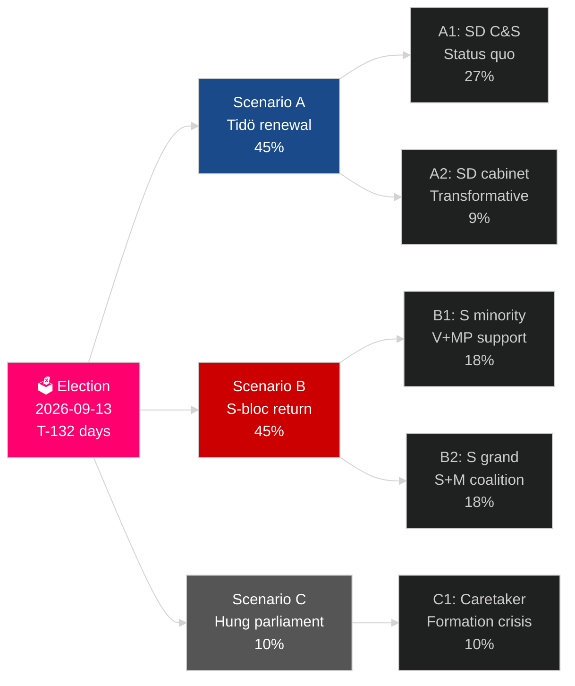

# 瑞典当前选举周期（2022–2026）：任期的裁决

**作者**：James Pether Sörling
**日期**：2026-05-04
**分类**：公开 — GDPR Art 9(2)(e)(g)
**分析深度**：comprehensive（2.5× Tier-C election-cycle）
**信心**：HIGH [Admiralty B2]

---

## BLUF

瑞典2022–2026年任期进入最后132天：蒂德联合政府M+KD+L在SD的信任与供给支持下施政，实现了一代人中瑞典移民政策最深刻的转变（HD03262）、重新激活核能（HD01NU19）并承诺将GDP的2.4%用于国防（NATO 2028目标）。联合政府拥有175个席位——勉强过半——L党处于关键门槛风险（32%的概率跌破4%），MP也面临出局风险（38%）。经济复苏进行中：IMF WEO 2026年4月预测2026年GDP增长2.4%，从2024年经济衰退低谷回升。2026年9月的选举在统计上是一枚硬币的两面。

## 本简报支持的决策

1. **选举后情景规划**：12个选举后情景中哪个会成真？联合政府算术、组阁时间线、SD入阁问题。
2. **政治遗产评估**：蒂德任期是否兑现了2022年的承诺？移民、核能、国防、犯罪、经济。
3. **风险识别**：剩余132天内5大风险是什么（法律挑战、经济冲击、联合政府脆弱性）？
4. **下届任期准备**：2026年9月的胜者继承怎样的结构性条件？
5. **民主韧性评估**：面对SD正常化挑战，瑞典的制度韧性是否充分？

## 60秒情报速览

- **选举**：SD ~20–22%（右翼阵营最大政党）; S ~31–33%; 两大阵营接近175席均势。**过于接近难以判断** — 在民调误差范围内。
- **移民**：HD03262已颁布；Lagrådet意见待发，涉及ECHR第8条条款；CJEU挑战可能出现。
- **核能**：HD01NU19已颁布；选址和建设投资决定于2027–2028年需要作出。
- **国防**：2.4%GDP承诺已确认；SAAB鹰狮E、博福斯、纳姆莫均在扩大产能。
- **经济**：复苏加速；IMF GDP 2.4%（2026）；家庭负债风险正常化；房地产市场恢复。
- **联合政府脆弱性**：L党处于32%门槛风险；联合政府算术依赖L超过4%门槛。

## 主要前向触发因素

**L党民调门槛**：如果L在最终SVT/Ipsos民调中跌破4%，蒂德联合政府将失去其算术基础，组阁计算将急剧转向以S为主导的替代方案。

## 任期评分卡

| 优先事项 | 状态 | 评估 |
|---|---|---|
| 移民限制 | ✅ 已颁布 | HD03262已落地；法律挑战进行中 |
| 核能重新激活 | ✅ 法律已颁布 | HD01NU19已颁布；建设决定推迟 |
| 国防GDP 2.4% | ⚠️ 进展顺利 | 承诺已确认；2028里程碑待达 |
| 减少帮派犯罪 | ⚠️ 参差不齐 | 立法完成；结果部分实现 |
| 经济复苏 | ✅ 进行中 | IMF 2.4% GDP增长2026 |
| 联合政府稳定性 | ⚠️ 脆弱 | 175席；L门槛风险 |

## 信心标签

结构性分析（任期遗产、联合政府算术）置信度高；选举结果和下届任期组建置信度中等。

<!-- source-sha: a07cdf9a7bb470fd04a51b2f65b33c4561d82496 -->
