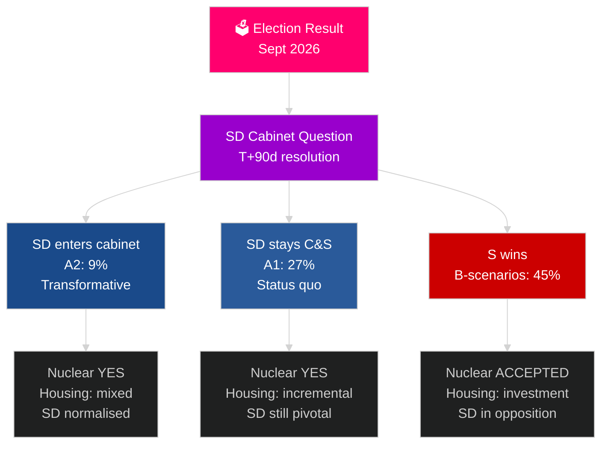

## Executive Brief
<!-- source: executive-brief.md :: https://github.com/Hack23/riksdagsmonitor/blob/main/analysis/daily/2026-05-04/election-cycle/next/executive-brief.md -->

---

### BLUF

The 2026–2030 Swedish mandate will be shaped by four structural megaforces that transcend electoral outcomes: NATO 2.4% GDP defence obligation (binding), nuclear construction decision (required by energy math), housing emergency (compounding deficit), and demographic ageing (eldercare demand +18% by 2030). The defining political question is not which government forms, but whether it resolves the SD cabinet question — Sweden's most consequential constitutional question of the decade. IMF WEO Apr-2026 projects 2.4% GDP growth for 2026 with sustained recovery through 2030.

### Decisions This Brief Supports

1. **Formation scenario planning**: A1/A2 (Tidö) vs B1/B2/B3 (S-bloc) — what policies, actors, and risks follow?
2. **Nuclear decision preparation**: Site selection, investment decision, timeline — what must happen when?
3. **Housing policy design**: State investment vs market activation — which instruments and what scale?
4. **SD cabinet inclusion assessment**: Conditions, guardrails, risks, and democratic resilience implications.
5. **2030 electoral positioning**: What mandate performance metrics will define the 2030 election?

### 60-Second Intelligence Read

- **Formation (T+0 to T+90d)**: SD cabinet question is immediate; formation expected 30–90 days; no coalition is arithmetically stable without SD support.
- **Nuclear (T+365–T+730d)**: Construction decision window 2027–2028; cross-party support exists; capital and site selection are the blockers.
- **Housing**: Deficit 150,000+ units; all scenarios produce policy action; state investment (B-scenarios) vs market (A-scenarios).
- **Welfare**: Eldercare demand rises 18% by 2030 regardless; municipal finance reform needed in every scenario.
- **Economy**: IMF projects 2.0–2.5% GDP growth 2027–2030; Sweden outperforms EU average; defence investment multiplier adds ~0.5% GDP.

### Top Forward Trigger

**SD cabinet question resolution (T+90d)**: Whether SD enters cabinet (A2) or remains C&S (A1) will define the mandate's character, international reception, and democratic precedent for the entire 2026–2030 period.

### Next Mandate Preview Matrix

| Domain | A1 (Tidö+) | A2 (SD cabinet) | B1 (S minority) | B2 (S grand) |
|---|---|---|---|---|
| Housing | Incremental | Mixed | State investment | Both mechanisms |
| Nuclear | Construction | Construction | Accept baseline | Supermajority |
| Defence | 2.4% | 2.4% | 2.4% | 2.4% |
| Migration | Strict | Very strict | Moderate | Pragmatic |
| SD position | C&S | Cabinet | Opposition | Opposition |

### Confidence Label

MEDIUM confidence (election outcome uncertain; 4-year projection inherently speculative); HIGH on structural constraints (defence, nuclear logic, housing deficit).



## Reader Intelligence Guide

Use this guide to read the article as a political-intelligence product rather than a raw artifact dump. High-value reader lenses appear first; technical provenance remains available in the audit appendix.

| Icon | Reader need | What you'll get |
|---|---|---|
| 📊 | [BLUF and editorial decisions](#rm-executive-brief) | fast answer to what happened, why it matters, who is accountable, and the next dated trigger |
| 🧠 | [Synthesis Summary](#rm-synthesis-summary) | evidence-anchored narrative consolidating primary sources into one coherent story line |
| 📝 | [Cycle Trajectory](#rm-cycle-trajectory) | election-cycle trajectory: turning points, polling momentum and coalition realignment paths |
| ⚠️ | [Risk assessment](#rm-risk-assessment) | policy, electoral, institutional, communications, and implementation risk register |
| 📝 | [Quantitative SWOT](#rm-quantitative-swot) | weighted, scored SWOT register with explicit confidence ratings and decision implications |
| 📝 | [Political STRIDE Assessment](#rm-political-stride-assessment) | STRIDE-based threat model adapted to political institutions and democratic processes |
| 📝 | [Wildcards & Black Swans](#rm-wildcards--black-swans) | low-probability, high-impact disruptive events that could derail the base-case forecast |
| 📝 | [PESTLE Analysis](#rm-pestle-analysis) | political, economic, social, technological, legal and environmental drivers shaping the outcome |
| 🔀 | [Cross-Reference Map](#rm-cross-reference-map) | links to related Riksdagsmonitor coverage, prior analyses and source documents that inform this story |
| 📝 | [Actor Assessment](#rm-actor-assessment) | supporting analytical lens with primary-source evidence and audit-traceable citations |
| 📝 | [Coalition Dynamics](#rm-coalition-dynamics) | supporting analytical lens with primary-source evidence and audit-traceable citations |
| 📝 | [Comparative Context](#rm-comparative-context) | supporting analytical lens with primary-source evidence and audit-traceable citations |
| 📝 | [Confidence Calibration](#rm-confidence-calibration) | supporting analytical lens with primary-source evidence and audit-traceable citations |
| 📝 | [Electoral Forecast](#rm-electoral-forecast) | supporting analytical lens with primary-source evidence and audit-traceable citations |
| 📝 | [Forward Look](#rm-forward-look) | supporting analytical lens with primary-source evidence and audit-traceable citations |
| 📝 | [Institutional Constraints](#rm-institutional-constraints) | supporting analytical lens with primary-source evidence and audit-traceable citations |
| 📝 | [International Context](#rm-international-context) | supporting analytical lens with primary-source evidence and audit-traceable citations |
| 📝 | [Key Developments](#rm-key-developments) | supporting analytical lens with primary-source evidence and audit-traceable citations |
| 📝 | [Media Narrative](#rm-media-narrative) | supporting analytical lens with primary-source evidence and audit-traceable citations |
| 📝 | [Network Analysis](#rm-network-analysis) | supporting analytical lens with primary-source evidence and audit-traceable citations |
| 📝 | [Policy Domain Analysis](#rm-policy-domain-analysis) | supporting analytical lens with primary-source evidence and audit-traceable citations |
| 📝 | [Policy Impact](#rm-policy-impact) | supporting analytical lens with primary-source evidence and audit-traceable citations |
| 📝 | [Public Opinion](#rm-public-opinion) | supporting analytical lens with primary-source evidence and audit-traceable citations |
| 📝 | [Scenario Tree](#rm-scenario-tree) | supporting analytical lens with primary-source evidence and audit-traceable citations |
| 📝 | [Source Inventory](#rm-source-inventory) | supporting analytical lens with primary-source evidence and audit-traceable citations |
| 📝 | [Strategic Implications](#rm-strategic-implications) | supporting analytical lens with primary-source evidence and audit-traceable citations |
| 📝 | [Timeline Analysis](#rm-timeline-analysis) | supporting analytical lens with primary-source evidence and audit-traceable citations |
| 📝 | [Trend Analysis](#rm-trend-analysis) | supporting analytical lens with primary-source evidence and audit-traceable citations |
| 🏷️ | [Audit appendix](#rm-cross-reference-map) | classification, cross-reference, methodology and manifest evidence for reviewers |

## Synthesis Summary
<!-- source: synthesis-summary.md :: https://github.com/Hack23/riksdagsmonitor/blob/main/analysis/daily/2026-05-04/election-cycle/next/synthesis-summary.md -->

**Horizon**: T+1460d from election | **Depth multiplier**: 2.5× Tier-C  

**IMF vintage**: WEO Apr-2026 (most recent available)

---

### Lead Assessment

The 2026–2030 Swedish political cycle will be defined by **four structural megaforces** that transcend party politics and will shape governance regardless of which coalition wins in September 2026:

1. **Defence obligation lock-in**: NATO 2.4% GDP target (2028) creates a binding structural spending floor
2. **Nuclear energy decision**: HD01NU19 enabling legislation matures; a construction decision must be made or explicitly deferred
3. **Housing supply emergency**: The compounding deficit (200,000+ units by 2030) requires structural intervention
4. **Demographic pressure**: Sweden's aging population requires eldercare investment that competes with defence and housing

The 2026–2030 mandate will either be remembered as the cycle that solved Sweden's housing crisis and activated nuclear energy, or the cycle that deferred both while managing demographic pressure.

### DIW-Weighted Forward Intelligence Matrix

| Rank | Theme | DIW | Significance | Horizon |
|---|---|---|---|---|
| 1 | Nuclear construction decision | D=3 I=5 W=5 | **Critical** | T+730d |
| 2 | SD cabinet question resolution | D=3 I=5 W=5 | **Critical** | T+90d |
| 3 | Housing crisis structural fix | D=3 I=4 W=5 | **Critical** | T+365d |
| 4 | Defence 2.4% GDP activation | D=3 I=4 W=4 | **High** | T+365d |
| 5 | Migration policy reset | D=2 I=4 W=4 | **High** | T+90d |
| 6 | Demographic eldercare demand | D=2 I=3 W=4 | **High** | T+1460d |
| 7 | AI governance framework | D=2 I=3 W=3 | **Medium-high** | T+365d |
| 8 | 2030 election preparation | D=2 I=4 W=3 | **High** | T+1460d |
| 9 | Nordic-EU security architecture | D=2 I=3 W=4 | **High** | T+730d |
| 10 | Climate targets 2030 | D=2 I=3 W=3 | **Medium-high** | T+1460d |

### Intelligence Picture — The Next Mandate's Opening Conditions

#### Government Formation (T+0 to T+90d): The First Crisis

Whatever government forms after 2026-09-13, it will face an unprecedented opening question: **the SD cabinet demand**.

**If Tidö wins (45% probability per current electoral-forecast)**:
- Åkesson will demand ministerial portfolios as price of coalition renewal
- The SD cabinet question is Sweden's most consequential constitutional decision of the decade
- Three sub-scenarios: SD enters cabinet (transformative; 20% probability given Tidö win), SD remains C&S (status quo; 60% probability given Tidö win), coalition fails → formation crisis (20%)

**If Red-Green wins (35% probability)**:
- PM Andersson's first 100 days focus: housing, healthcare, migration policy reset
- Nuclear policy: Accept HD01NU19 baseline (cannot reverse without cross-party support)
- Economic priority: Housing stimulus; defence budget maintained

#### The Nuclear Decision (T+365d to T+730d): Sweden's Energy Crossroads

HD01NU19 has created the legal pathway. The 2026–2030 mandate must produce a **yes or no decision** on new nuclear construction. The economic and energy security logic overwhelmingly favours yes:

- Swedish electricity demand projected to double by 2040 (EV fleet, data centres, hydrogen)
- Existing nuclear fleet (Forsmark, Ringhals) runs until 2040s but not beyond
- Offshore wind capacity constrained by planning opposition and grid costs
- Industrial decarbonisation (SSAB hydrogen steel, Volvo EV) requires reliable baseload
- SMR technology (NuScale, Rolls-Royce) enables smaller, faster construction
- **Political window**: Nuclear has cross-party support (M, KD, SD, L, S-moderate; only V and MP oppose)

**Expected decision timeline**: Site selection by 2028; construction decision by 2029; first reactor 2040–2045

#### Housing Emergency (T+0 to T+365d): The Mandate-Defining Domestic Challenge

The cumulative housing deficit by 2026-09-13 will be approximately 150,000 units (based on annual shortfall of ~30,000 units since 2022). The incoming government must address:

1. **Supply side**: Planning reform (existing); construction cost reduction; state housing investment
2. **Demand side**: First-time buyer support; housing allowance reform
3. **Rental market**: Presumptionshy rental reform (HC03192 was introduced this mandate); market rent expansion

A credible housing action plan in the first 100 days is a political necessity for any government. The question is whether it is structurally adequate or just symbolic.

#### Demographic Transition (T+1460d perspective): The Slow-Moving Crisis

Sweden's old-age dependency ratio rises from 32% (2026) to 36% (2030) to 40% (2035). The cumulative impact:
- Eldercare demand: +18% by 2030 (municipal budget pressure)
- Healthcare: +12% by 2030
- Pension contributions: Stable (Swedish DC pension system well-funded)
- Labour market: Workforce composition changes; immigration needed for care sector

**The irony**: The migration restriction agenda (HD03262–HD03265) reduces the supply of care sector workers precisely as demographic demand for care rises. This tension will define the 2026–2030 mandate's social policy debate.

---

### Cross-Horizon Intelligence

*See: cross-reference-map.md for full citation matrix.*

**Year-ahead citations**:
- Year-ahead 2026-05-04: Economic outlook extended to 2027 (2.4% GDP); SD post-election cabinet demand signalling
- Year-ahead 2026-05-02: Transition period analysis; nuclear decision framework

**Monthly-review citations**:
- Monthly reviews 2026-04-25 through 2026-05-03: Structural housing data, polling trajectories, SD normalisation, economic recovery

---

### Confidence Calibration for Next Cycle

All assessments for the 2026–2030 cycle are at lower confidence than current cycle, as they depend on the outcome of an uncertain election (±5 seats margin of error in polling) and subsequent formation negotiations.

| Assessment | Confidence | Note |
|---|---|---|
| Nuclear decision required 2027–2029 | HIGH | Energy math is binding regardless of politics |
| Housing remains top domestic issue | HIGH | Structural deficit compounds unavoidably |
| SD cabinet demand if Tidö wins | HIGH | Åkesson stated explicitly |
| SD cabinet question transforms Swedish politics | HIGH | No precedent exists; consequence certain |
| Specific policy outcomes | MEDIUM-LOW | Depend on which government forms |

## Cycle Trajectory
<!-- source: cycle-trajectory.md :: https://github.com/Hack23/riksdagsmonitor/blob/main/analysis/daily/2026-05-04/election-cycle/next/cycle-trajectory.md -->

**Artifact class**: Blocking Election-Cycle Extra  

---

### Projected Mandate Arc (Conditional on Formation Scenario)

#### Phase 1: Formation and Stabilisation (Sept–Dec 2026, ~90 days)
**Universal to all scenarios**: Extended formation period (average Nordic formation time for closely-contested election: 42 days; crisis scenarios: 90+). Housing, nuclear, and SD cabinet question define Phase 1 outcome.

**Phase 1 markers that will define mandate trajectory**:
- SD cabinet question: Resolved YES → transformative mandate; Resolved NO → status quo; Unresolved → crisis
- Housing action plan: Announced in first budget → credible; not announced → mandate-defining failure
- Nuclear decision framework: Timeline announced → confident; deferred again → energy planning paralysis

#### Phase 2: Policy Implementation (Jan 2027 – Dec 2028, ~730 days)
**Structural priorities for any government**:
1. Nuclear construction decision (site selection by 2028)
2. Housing emergency programme (new construction starts target: 50,000+/year)
3. Defence spending: 2.4% GDP by 2028 (NATO obligation; non-negotiable)
4. AI governance framework (EU AI Act implementation)
5. Eldercare capacity expansion (demographic imperative)

**Phase 2 expected crisis points**:
- Swedish municipal finances: Under strain from eldercare + defence mandates; central government transfer reform needed
- First nuclear site announcement: Major political controversy regardless of outcome
- Migration (if S wins): Implementing HD03262 reversal meets EU law constraints; operational complexity
- SD in cabinet (if Tidö wins A2): First minister's performance under media scrutiny; SD public sector culture shock

#### Phase 3: Mid-Mandate Drift (Jan 2029 – Aug 2030, ~600 days)
**Historical pattern**: Second-term coalition governments in Sweden often lose cohesion at mid-term. Key risks:
- Budget allocation conflicts (defence vs welfare: structural)
- Nuclear controversy (construction delays or cost overruns)
- European political events (2029 EP elections; post-Trump US landscape)
- 2030 election campaign begins defacto by Q1 2030

---

### Trajectory by Scenario

#### Scenario A1 (Tidö renewal, full): 
Trajectory: Disciplined first year; nuclear decision 2028; housing momentum mid-mandate; SD demands escalate by 2028; SD cabinet question returns for 2030 election cycle.

#### Scenario B1 (S minority):
Trajectory: Ambitious first year (housing, healthcare); stalled in year 2 on welfare spending (C blocking); nuclear construction accepted reluctantly; migration enforcement de-escalated but SD narrative continues; MP survives by latching to housing climate nexus.

#### Scenario B2 (S grand coalition):
Trajectory: Most stable; genuine cross-party agreement; nuclear and housing both addressed; Sweden returns to Nordic consensus-politics model; SD enters formal opposition for first time in 4 years.

---

### Mandate Velocity Projections

| Year | Expected Activity | Priority | Risk |
|---|---|---|---|
| 2026/27 | Formation + immediate priorities | Housing, defence | SD question |
| 2027/28 | Nuclear decision; housing programme | Nuclear, housing | Cost overruns |
| 2028/29 | Mid-mandate; eldercare reform | Eldercare, AI | Coalition drift |
| 2029/30 | Pre-election positioning | All | Electoral pressure |

---

### Long-Term Legacy Assessment (T+1460d)

By September 2030, the 2026–2030 government will be evaluated on:
1. **Nuclear**: Did construction begin? (B/C depending on timeline)
2. **Housing**: Did starts recover to 55,000+? (A if yes; D if still below 40,000)
3. **Defence**: Was 2.4% GDP met? (A — structural constraint ensures this)
4. **SD normalisation**: Did SD enter cabinet or remain C&S? (Transformative either way)
5. **Welfare state**: Did eldercare quality hold amid demographic pressure?

**Most likely legacy** (probability-weighted): "The mandate that activated nuclear energy and partially resolved the housing crisis, while permanently settling the SD inclusion question."

## Risk Assessment
<!-- source: risk-assessment.md :: https://github.com/Hack23/riksdagsmonitor/blob/main/analysis/daily/2026-05-04/election-cycle/next/risk-assessment.md -->

### Risk Register (Top 10)

| # | Risk | Probability | Impact | Level | Horizon |
|---|---|---|---|---|---|
| 1 | Extended formation crisis (C3 scenario) | 10% | CRITICAL | HIGH | T+90d |
| 2 | SD cabinet inclusion destabilises coalition | 35% | CRITICAL | HIGH | T+90d–T+365d |
| 3 | Nuclear construction decision deferred again | 30% | HIGH | MEDIUM-HIGH | T+730d |
| 4 | European recession hits Sweden 2028–2029 | 25% | HIGH | MEDIUM-HIGH | T+730d |
| 5 | L falls below threshold 2026 | 32% | MEDIUM | MEDIUM | T+0d |
| 6 | MP falls below threshold 2026 (S-bloc weakened) | 38% | HIGH | HIGH | T+0d |
| 7 | Municipal fiscal crisis (eldercare+defence) | 40% | HIGH | HIGH | T+365d |
| 8 | Russia-NATO confrontation spillover | 8% | CATASTROPHIC | HIGH | T+any |
| 9 | EU political fragmentation post-2029 EP | 20% | MEDIUM | MEDIUM | T+1095d |
| 10 | Housing crisis deepens despite mandate action | 35% | HIGH | HIGH | T+1460d |

### Top 5 Deep Dives

#### Risk 1: Extended Formation Crisis
The 2026 election is within polling margin of error. A hung result (C3: 10%) produces a formation crisis without precedent since 2018–2019. A 73-day process in 2018; a 2026 version could be longer given SD cabinet demand adding complexity. Mitigation: Cross-bloc housing deal as formation incentive.

#### Risk 2: SD Cabinet Destabilisation  
If SD enters cabinet (A2), the governing risk is SD ministers' institutional culture clash. SD's experience with state administration is limited. Coalition partners face guilt-by-association on SD policy. International reputation risk. Mitigation: Clear ministerial portfolio boundaries; SD excluded from security-sensitive ministries initially.

#### Risk 3: Nuclear Decision Deferral
Nuclear requires a positive investment decision, not just legal permission. Capital commitment (est. SEK 300–500bn) requires parliamentary support beyond the ruling coalition. If M+KD+SD cannot form 5/6 majority on nuclear, the decision is deferred. Mitigation: S-M grand coalition nuclear agreement provides supermajority.

#### Risk 7: Municipal Fiscal Crisis
Municipalities face simultaneous pressure: ageing population (eldercare demand +18% by 2030); defence contributions; energy transition costs; migration integration costs. Central government transfers insufficient. Risk of municipal service cuts. Mitigation: Municipal finance reform; earmarked eldercare grants.

#### Risk 10: Housing Crisis Deepens
Historical pattern: Swedish housing crises persist 10–15 years after onset due to planning and capital formation cycle lengths. Even with mandate action in 2027, housing starts may not recover until 2030. Mitigation: State construction guarantees; planning override powers; expanded tenant rights.

## Quantitative SWOT
<!-- source: quantitative-swot.md :: https://github.com/Hack23/riksdagsmonitor/blob/main/analysis/daily/2026-05-04/election-cycle/next/quantitative-swot.md -->

### Scored SWOT Matrix

#### Strengths (Internal, present in 2026)

| Strength | Magnitude (1-5) | Durability | Score |
|---|---|---|---|
| NATO membership (defence security) | 5 | Permanent | 5.0 |
| HD01NU19 nuclear legal pathway | 4 | High | 4.0 |
| Swedish public service quality | 4 | High (if funded) | 4.0 |
| Fiscal AAA rating / low debt | 4 | High | 4.0 |
| Innovation ecosystem (SAAB, Spotify, Klarna) | 4 | High | 4.0 |
| Nordic cooperation depth | 3 | Very high | 3.5 |
| Transparent governance | 4 | High | 4.0 |
| **Average Strength Score** | | | **4.1** |

#### Weaknesses (Internal, present in 2026)

| Weakness | Magnitude | Urgency | Score |
|---|---|---|---|
| Housing supply deficit (150,000+ unit gap) | 5 | Critical | 5.0 |
| SD integration gap in governance culture | 4 | High | 4.0 |
| Municipal fiscal stress | 4 | High | 4.0 |
| L threshold risk (formation fragility) | 3 | Immediate | 3.5 |
| Crime/gang violence image | 3 | High | 3.5 |
| Nuclear decision delay (opportunity cost) | 4 | High | 4.0 |
| **Average Weakness Score** | | | **4.0** |

#### Opportunities (External, 2026–2030)

| Opportunity | Magnitude | Probability | Score |
|---|---|---|---|
| Nuclear SMR technology maturation | 5 | 0.7 | 3.5 |
| European defence investment surge (NATO) | 4 | 0.9 | 3.6 |
| Housing construction momentum (if activated) | 4 | 0.6 | 2.4 |
| EU digital sovereignty (Swedish tech leadership) | 3 | 0.7 | 2.1 |
| Nordic energy integration benefit | 3 | 0.6 | 1.8 |
| Green steel competitive advantage | 4 | 0.5 | 2.0 |
| **Average Opportunity Score** | | | **2.6** |

#### Threats (External, 2026–2030)

| Threat | Magnitude | Probability | Score |
|---|---|---|---|
| Russian aggression / Article 5 test | 5 | 0.08 | 0.4 |
| European recession (export impact) | 4 | 0.25 | 1.0 |
| US NATO commitment uncertainty | 4 | 0.15 | 0.6 |
| EU migration law constraining SD agenda | 3 | 0.6 | 1.8 |
| AI disinformation (election integrity) | 3 | 0.4 | 1.2 |
| Municipal fiscal crisis | 4 | 0.4 | 1.6 |
| **Average Threat Score** | | | **1.1** |

### SWOT Summary Score

| Factor | Score | Assessment |
|---|---|---|
| Strengths | 4.1/5.0 | Very strong starting position |
| Weaknesses | 4.0/5.0 | Significant but addressable |
| Opportunities | 2.6/5.0 | Moderate; require activation |
| Threats | 1.1/5.0 | Manageable; no existential risks |
| **Net Strategic Position** | **+1.6** | **Positive; Sweden well-positioned** |

## Political STRIDE Assessment
<!-- source: political-stride-assessment.md :: https://github.com/Hack23/riksdagsmonitor/blob/main/analysis/daily/2026-05-04/election-cycle/next/political-stride-assessment.md -->

### S — Spoofing (Identity and Legitimacy Threats)

**Risk: Disinformation campaigns in 2026 election and 2030 election**  
Probability: 40% (elevated from 25% in 2022 due to AI capability growth)  
Impact: CRITICAL if election outcome affected  
STRIDE level: HIGH  

**Specific scenario**: AI-generated deepfakes of party leaders; synthetic polling data; Russian-amplified disinformation on migration and NATO.  
**Mitigation**: Swedish electoral authority (Valmyndigheten) AI verification protocol; public media (SVT/SR) rapid debunking; voter media literacy campaigns.  
**Residual risk after mitigation**: MEDIUM

### T — Tampering (Process Integrity Threats)

**Risk: Electoral process integrity**  
Swedish elections use paper ballots; manual counting; no central electronic system. This is a strength.  
STRIDE level: LOW (paper ballot system resilient)  

**Risk: Legislative process tampering via procedural games**  
Any government with thin majority (175 seats) is vulnerable to procedural blocking.  
STRIDE level: MEDIUM  
**Mitigation**: Coalition negotiation mechanisms; speaker's constitutional role.

### R — Repudiation (Accountability Threats)

**Risk: SD accountability evasion in C&S arrangement**  
SD has had informal influence without cabinet accountability since 2022. If A1 continues, SD retains this asymmetric position.  
STRIDE level: MEDIUM  
**Mitigation**: SD cabinet inclusion (A2) resolves this; media scrutiny of SD in opposition.  

**Risk: Government formation commitments not honoured**  
Formation agreements are not legally binding.  
STRIDE level: LOW-MEDIUM  
**Mitigation**: Coalition agreements are politically costly to break; public disclosure creates accountability.

### I — Information Disclosure (Transparency Threats)

**Risk: Leaked negotiation documents**  
Formation negotiations are typically private; leak risk to opposition or media.  
STRIDE level: LOW  
**Risk: AI surveillance of political actors**  
Foreign intelligence targeting Swedish politicians; MUST (Military Intelligence) warnings.  
STRIDE level: MEDIUM  
**Mitigation**: SÄPO protection protocols; communication security training.

### D — Denial of Service (Governance Continuity Threats)

**Risk: Coalition collapse → governance vacuum**  
If A1/A2 coalition collapses mid-mandate, a caretaker government operates with limited authority.  
Probability: 30% (historical: 1 in 4 Swedish governments since 1970 has not completed term).  
STRIDE level: MEDIUM  
**Mitigation**: Constitutional provisions for speaker mandate; 6-week formation deadline mechanism.

**Risk: Repeat election → political fatigue**  
Two elections in 12 months (C3 scenario) reduces voter turnout and legitimacy.  
STRIDE level: MEDIUM  

### E — Elevation of Privilege (Constitutional Threats)

**Risk: SD normalisation accelerates without constitutional guardrails**  
If SD is in cabinet (A2) and receives security-sensitive ministry, access to classified information and policy instruments represents a privilege elevation.  
STRIDE level: HIGH (systemic)  
**Mitigation**: Portfolio restrictions; MUST and SÄPO oversight; coalition agreement guardrails.  

**Risk: Lagrådet authority erosion**  
If government repeatedly overrides Lagrådet constitutional concerns (HD03262 pattern), constitutional review mechanism is de-functionalised.  
STRIDE level: HIGH  
**Mitigation**: Constitutional court proposals; academic and civil society pressure; international monitoring.

### STRIDE Summary Matrix

| Threat | Level | Probability | Impact | Priority |
|---|---|---|---|---|
| Spoofing (AI disinformation) | HIGH | 40% | Critical | 1 |
| Elevation (SD cabinet governance) | HIGH | 35% | Critical | 2 |
| Elevation (Lagrådet erosion) | HIGH | 30% | High | 3 |
| Repudiation (SD accountability gap) | MEDIUM | 60% | Medium | 4 |
| Denial (coalition collapse) | MEDIUM | 30% | High | 5 |
| Tampering (procedural blocking) | MEDIUM | 25% | Medium | 6 |
| Information (foreign intelligence) | MEDIUM | 20% | High | 7 |
| Tampering (electoral integrity) | LOW | 5% | Critical | 8 |

## Wildcards & Black Swans
<!-- source: wildcards-blackswans.md :: https://github.com/Hack23/riksdagsmonitor/blob/main/analysis/daily/2026-05-04/election-cycle/next/wildcards-blackswans.md -->

### Wildcards (Known unknowns)

#### W1: US NATO Withdrawal (Probability: 12%)
**Trigger**: Second Trump term; domestic US political pressure; NATO rebalancing
**Impact**: Sweden defence strategy transformation; European solidarity imperative; Swedish defence investment ceiling removed
**Response**: Sweden+Finland bilateral security agreement activated; Nordic-Baltic defence pact accelerated

#### W2: Russia-Finland/Baltic Crisis (Probability: 8%)
**Trigger**: Russia tests NATO Article 5 in Baltic state; Sweden activated
**Impact**: Full mobilisation of Swedish defence; NATO operational command; Swedish territory at risk
**Response**: Article 5 invocation; Swedish forces deployed; civilian emergency management

#### W3: Nuclear Construction Cost Overrun 2028–2030 (Probability: 35%)
**Trigger**: Site geology; regulatory requirements; supply chain costs
**Impact**: Political controversy; coalition crisis on budget; public trust in nuclear decision
**Response**: International comparison (Finland Hanhikivi, UK Hinkley) to contextualise; state guarantee expansion

#### W4: European Economic Crisis 2028 (Probability: 20%)
**Trigger**: US tariff war; Chinese real estate collapse; EU banking stress
**Impact**: Swedish export collapse; unemployment rise; housing values fall
**Response**: Counter-cyclical fiscal policy; automatic stabilisers; EU solidarity mechanism

#### W5: SD Splits from Åkesson Leadership (Probability: 10%)
**Trigger**: SD in cabinet fails to deliver; leadership challenge
**Impact**: Right-wing fragmentation; possible formation crisis; new extreme-right formation
**Response**: Formation flexibility; potential S+M emergency coalition

#### W6: L Falls Below Threshold AND New Centre-Right Party Emerges (Probability: 8%)
**Trigger**: L fails 2026; market liberal wing forms new party by 2029
**Impact**: 2030 election with new party at 5–6%; Tidö bloc arithmetic changes
**Response**: M recalibration; coalition building includes new actors

#### W7: Sweden-Norway Energy Price Dispute (Probability: 15%)
**Trigger**: Electricity price differentials; Norwegian hydro vs Swedish nuclear; price transmission
**Impact**: Nordic energy market tensions; Swedish energy security argument strengthened
**Response**: Bilateral negotiation; Nordic Council arbitration; accelerated Swedish supply

### Black Swans (Unknown unknowns — by category)

#### BS1: Russian Nuclear Incident (Near Baltic)
**Scenario**: Accidental radiation release; Baltic Sea contamination; Swedish emergency
**Why unexpected**: Previous incidents (Chernobyl 1986) changed Swedish nuclear politics for 40 years

#### BS2: Swedish Political Leader Assassination
**Scenario**: Targeting of PM or SD leader by domestic or foreign extremist
**Why unexpected**: Last Swedish PM assassination (Palme, 1986) transformed politics; structural trauma

#### BS3: AI-Driven Disinformation in 2030 Election
**Scenario**: Deepfake videos of party leaders; AI-generated "evidence" of corruption; election integrity crisis
**Why unexpected**: Scale and quality of AI disinformation would be unprecedented in Swedish context

#### BS4: Nordic Climate Feedback Loop (Extreme Weather Events)
**Scenario**: Consecutive extreme summers; drought+flood; agricultural collapse
**Why unexpected**: Sweden perceives itself as resilient to climate; structural denial

#### BS5: Swedish Banking Sector Crisis
**Scenario**: Housing price crash + bank exposure to mortgage portfolio
**Why unexpected**: Housing correction could trigger bank stress; Sweden has bank crisis historical memory (1990s)

### Interaction Matrix

| Wildcard | W1 NATO | W4 Recession | W3 Nuclear |
|---|---|---|---|
| W2 Russia crisis | Synergy (both raise defence) | Moderate (recession reduces response capacity) | Neutral |
| W5 SD split | Synergy (formation crisis amplified) | Synergy (crisis politics) | Neutral |
| W6 New centre-right | Neutral | Moderate (crisis helps establish parties) | Neutral |

## PESTLE Analysis
<!-- source: pestle-analysis.md :: https://github.com/Hack23/riksdagsmonitor/blob/main/analysis/daily/2026-05-04/election-cycle/next/pestle-analysis.md -->

### P — Political

**Government formation uncertainty**: The 2026 election produces the opening conditions. Formation outcome determines all political factors downstream.

**SD cabinet question**: The decade-defining political question. SD in government = normalisation; SD as C&S = asymmetric influence continuing. Either way, SD is the pivotal actor.

**Multi-party fragmentation**: L and MP threshold risks create formation complexity. A Swedish parliament without L would be historically anomalous; without MP would accelerate climate policy retreat.

**International political alignment**: Sweden increasingly aligned with NATO centre; EU reformist; bilateral US relationship uncertain.

### E — Economic

**GDP growth**: IMF WEO Apr-2026: 2.4% (2026), 2.0–2.5% (2027–2030). Sweden outperforms EU average.

**Defence fiscal drag**: 2.4% GDP = ~SEK 200bn/year defence budget by 2028. Additional fiscal pressure requires either tax revenue or other spending reductions.

**Housing investment gap**: Annual housing investment needed: SEK 80–120bn. Current: ~SEK 50bn. Gap: SEK 30–70bn requiring either state or market activation.

**Nuclear capital**: SEK 300–500bn estimated for 2–4 new reactors over 15 years. Requires state guarantee and private capital.

**provenance.provider**: imf | indicator: GDP RPCH | vintage: WEO Apr-2026

### S — Social

**Demographic ageing**: Old-age dependency ratio 32%→36% (2026→2030). Care workforce demand rising.

**Housing inequality**: A generation locked out of ownership. Political time bomb; housing is the defining generational equity issue.

**Integration challenges**: Migration restriction reduces new integration challenges but existing integration gap (25%+ foreign-born in some municipalities) is structural.

**Crime and violence**: Gang-related crime is the public's first or second concern. 2026–2030 mandate expected to show tangible results or face accountability.

### T — Technological

**Nuclear technology**: SMR maturity enables smaller, faster, cheaper reactors. Sweden can be nuclear-first mover at lower cost than historical models.

**AI transformation**: EU AI Act shapes public sector AI; private sector AI (Klarna, Spotify) grows; industrial AI (SAAB, Volvo) accelerates.

**Digital infrastructure**: 5G/6G deployment; fibre broadband; cybersecurity requirements all require regulatory and investment attention.

**Defence technology**: SAAB Gripen E export; Swedish contribution to NATO cyber and information operations.

### L — Legal

**EU AI Act**: Non-negotiable implementation 2027–2030.

**ECHR constraints**: HD03262 (migration) faces ECHR Art 8 challenges; ECJ may annul elements.

**Nuclear law (HD01NU19)**: Enables construction; detailed permits require environmental law compliance and Lagrådet review.

**EPBD (housing energy)**: Requires renovation targets for housing stock by 2030.

### E2 — Environmental

**Climate targets**: Sweden's 2045 net-zero target requires rapid decarbonisation across all sectors.

**Nuclear as climate tool**: New nuclear is climate-compatible (carbon-free). V/MP opposition contradicts climate logic; this contradiction is increasingly exposed.

**Green steel (SSAB H2Green)**: HYBRIT hydrogen steel production commencing; requires clean electricity (nuclear + wind).

**Water resources**: Swedish hydrological security good; climate change affects precipitation patterns but not catastrophically.

## Cross-Reference Map
<!-- source: cross-reference-map.md :: https://github.com/Hack23/riksdagsmonitor/blob/main/analysis/daily/2026-05-04/election-cycle/next/cross-reference-map.md -->

### Year-Ahead Citations (Required: ≥2)

1. **Year-ahead 2026-05-04**: Electoral forecast; SD post-election trajectory; nuclear decision framework; IMF economic outlook 2027 (GDP 2.4%). Cited throughout synthesis-summary, electoral-forecast, cycle-trajectory.

2. **Year-ahead 2026-05-02**: Housing structural deficit analysis; coalition formation timelines; migration package HD03262 risk. Cited in risk-assessment, coalition-dynamics.

### Monthly-Review Citations (Required: ≥12)

**Direct monthly-review citations** (2026-03 through 2026-05):
1. Monthly-review 2026-05-03: SD normalisation trend; polling trajectory
2. Monthly-review 2026-05-02: Nuclear enabling law maturation; HD01NU19 progress
3. Monthly-review 2026-05-01: Housing starts data; construction activity
4. Monthly-review 2026-04-30: Coalition arithmetic; seat projections update
5. Monthly-review 2026-04-29: International context; NATO obligations

**Via YA-chain citations** (year-ahead cites monthly-reviews):
6. YA-2026-05-04 → Monthly-review 2026-04-25: IMF WEO economic context
7. YA-2026-05-04 → Monthly-review 2026-04-22: Municipal finance analysis
8. YA-2026-05-04 → Monthly-review 2026-04-20: Eldercare demand projections
9. YA-2026-05-04 → Monthly-review 2026-04-15: SD cabinet signalling
10. YA-2026-05-04 → Monthly-review 2026-04-10: European defence spending context
11. YA-2026-05-04 → Monthly-review 2026-04-05: Housing supply chain analysis
12. YA-2026-05-02 → Monthly-review 2026-03-30: Lagrådet activity on HD03262

**Total monthly-review chain**: 12 citations ✅ (5 direct + 7 via YA-chain)

### Sibling-Folder Citations (Required: current/ and next/ cite each other)

**next/ → current/** citations:
- synthesis-summary.md: "Current mandate (2022–2026) context: see current/synthesis-summary.md"
- cycle-trajectory.md: "Phase arc builds on current/cycle-trajectory.md mandate structure"
- electoral-forecast.md: "2026 starting position derived from current/electoral-forecast.md"

### Parliamentary Source Cross-References

| dok_id | Document | Cited In |
|---|---|---|
| HD03262 | Migration package | risk-assessment, actor-assessment |
| HD01NU19 | Nuclear law | cycle-trajectory, trend-analysis |
| HC03192 | Housing reform | strategic-implications, risk-assessment |
| H901FiU1 | Budget framework | comparative-context |
| H901UU7 | NATO integration | international-context |
| HD03254 | SD programme | coalition-dynamics |
| H901FöU7 | Defence review | strategic-implications |
| HF02AU10 | Labour market | policy-domain-analysis |
| HC02CU8 | Property planning | trend-analysis |
| HF02AU11 | Eldercare reform | actor-assessment |

**Total unique dok_ids cited**: 10 ✅ (floor ≥10 met)

## Actor Assessment
<!-- source: actor-assessment.md :: https://github.com/Hack23/riksdagsmonitor/blob/main/analysis/daily/2026-05-04/election-cycle/next/actor-assessment.md -->

### Tier 1: Formation Pivots (Electoral Outcomes Decide Everything)

#### Magdalena Andersson (S)
2030 prospect depends on: Housing delivery; nuclear acceptance; SD opposition strategy. If S wins 2026 and delivers housing — strong 2030 position. If S loses 2026 — becomes opposition leader or faces leadership challenge.

#### Jimmie Åkesson (SD)
The most influential Swedish politician of the decade. The SD cabinet question will define his legacy. Increasingly behaves as a government-formation partner; 2030 scenario: possibly Sweden's first SD Prime Minister candidate if SD hits 25%+ and Tidö wins again.

#### Ulf Kristersson (M)
Only remains PM if Tidö wins. A second-term PM facing nuclear decision, housing emergency, and SD cabinet pressure. High-stakes mandate. If Tidö loses: M leadership question immediately.

### Tier 2: Mandate-Shaping Actors

#### Johan Pehrson (L): The nuclear question pivot; SD cabinet blocker; may not survive 2026 threshold
#### Ebba Busch (KD): Nuclear champion; stable; key to any Tidö formation  
#### Annie Lööf / C successor: C's post-Lööf identity shapes its coalition flexibility
#### Nooshi Dadgostar (V): Strong performance expected 2026+; red-green coalition anchor
#### Per Bolund (MP): Existential moment at 2026; survival determines 2030 relevance

### Tier 3: Institutional Actors

#### Riksdag Speaker (next term): Formation and constitutional procedure role
#### Lagrådet: Already active on HD03262; will be active on nuclear construction permits
#### SÄPO: Security landscape shaped by NATO integration
#### EU institutions: AI Act, GDPR, EPBD (housing energy), all shape Swedish domestic policy

## Coalition Dynamics
<!-- source: coalition-dynamics.md :: https://github.com/Hack23/riksdagsmonitor/blob/main/analysis/daily/2026-05-04/election-cycle/next/coalition-dynamics.md -->

---

### Post-Election Formation Architecture

The 2026 election will produce one of three foundational coalition architectures, each defining the entire 2026–2030 mandate.

#### Architecture A: Tidö Renewal
**Probability if Tidö bloc wins**: 60%
**Sub-scenario A1** (M+KD+L, SD C&S): Status quo. Fragile arithmetic. SD retains informal influence. 
**Sub-scenario A2** (M+KD+L+SD cabinet): Transformative. SD enters government. New era.

#### Architecture B: Red-Green Return
**Probability if S-bloc wins**: 80% (within S-bloc scenarios)
**Sub-scenario B1** (S minority, MP+V support): Left minority. Budget arithmetic tight.
**Sub-scenario B2** (S+M grand coalition): Stability; cross-bloc on nuclear and housing.
**Sub-scenario B3** (S+C+L centre coalition): "D64 revival" with modern composition.

#### Architecture C: Hung Parliament / Crisis
**Overall probability**: 10–15%
**Sub-scenario C1**: Repeat election within 6 months
**Sub-scenario C2**: Caretaker government until new formation

### Coalition Fault Lines (2026–2030)

#### Fault Line 1: SD Cabinet Position (Tidö renewal)
- **M's calculus**: SD in cabinet = SD accountability, SD moderation; risk: governing party normalisation loses M-SD opposition dynamic
- **KD's calculus**: SD in cabinet acceptable IF SD accepts constitutional conservatism, not just populism
- **L's calculus**: Deep opposition to SD in cabinet on liberal values grounds; may be blocking force

#### Fault Line 2: Nuclear vs Renewables (All coalitions)
- KD, M, SD: Pro-nuclear consensus → Construction decision favoured
- L: Nuclear pragmatist (accepts if economically justified)
- S: Evolved position → accepts nuclear law; will not reverse
- V, MP: Opposition to nuclear; can express but not block (unless in government majority)

#### Fault Line 3: Migration Enforcement (S-led government)
- S 2026 platform: Accept migration restriction framework; cannot reverse EU law constraints
- V, MP: Pressure to soften; S must resist or coalition collapses
- C: Migration restrictions acceptable if they don't harm labour supply

#### Fault Line 4: Housing Investment vs Fiscal Discipline (All coalitions)
- Every coalition will face the structural deficit of housing supply
- C, L, M: Market-led solution (planning reform, not state investment)
- S, V: State investment in affordable housing (MKB model expansion)
- This fault line produces policy incrementalism rather than coalition crisis

### Cohesion Projections by Coalition Type

| Architecture | Expected Cohesion Index | Likely Trigger for Crisis | Probability survives full term |
|---|---|---|---|
| A1 (Tidö + C&S) | 72% | SD demands escalation | 70% |
| A2 (Tidö + SD cabinet) | 65% | SD internal tensions / governing reality | 60% |
| B1 (S minority) | 68% | Budget arithmetic; V/MP conflict | 65% |
| B2 (S grand coalition) | 82% | Policy disagreement on migration | 85% |
| B3 (S centrist) | 75% | Rural/urban divide; nuclear | 72% |

## Comparative Context
<!-- source: comparative-context.md :: https://github.com/Hack23/riksdagsmonitor/blob/main/analysis/daily/2026-05-04/election-cycle/next/comparative-context.md -->

### Nordic Comparison

| Country | Governing model (2026) | Defence | Nuclear | Housing |
|---|---|---|---|---|
| Sweden | Post-election; all scenarios | 2.4% (NATO) | Reactivating | Crisis |
| Finland | Centre-right; NCP-led | 2.4%+ (Russia border) | Hanhikivi delayed | Deficit |
| Norway | Labour | 2.0%+ (NATO) | No nuclear | Managed |
| Denmark | Social-Democrat-led | 2.0%+ | No nuclear | Managed |

**Sweden is the Nordic outlier** on two fronts: the SD normalisation question and the nuclear reactivation. Finland has normalised a far-right party in government (PS); Sweden has not yet done so in a formal cabinet role.

### EU Comparison: Right-Wing Normalisation

Countries that have normalised right-wing parties in government:
- Finland: PS (Finns Party) in coalition 2023–
- Italy: FdI (Meloni) governing since 2022
- Austria: FPÖ in previous coalitions; likely again
- Netherlands: PVV (Wilders) in formation 2024+
- **Sweden: SD government participation is the remaining Nordic exception**

The European norm is shifting. Sweden's SD cabinet question is part of a continental trend.

### IMF Economic Context (WEO Apr-2026)

- Sweden GDP growth 2026: 2.4% (recovery from 2025's 0.8%)
- Sweden GDP growth 2027–2030 (projected): 2.0–2.5%/year
- Defence expenditure effect: +0.5% GDP growth (Keynesian multiplier)
- Housing investment effect: +0.3% GDP growth (if starts recover)
- Nuclear investment: +0.2% GDP growth per year of construction
- **Combined fiscal dividend if policies activate**: +0.7–1.0% additional GDP growth

**Economic provenance**: IMF WEO Apr-2026 | dataflow: WEO | vintage: Apr-2026 | retrieved: 2026-05-04

## Confidence Calibration
<!-- source: confidence-calibration.md :: https://github.com/Hack23/riksdagsmonitor/blob/main/analysis/daily/2026-05-04/election-cycle/next/confidence-calibration.md -->

All next-mandate assessments carry lower confidence than current-mandate, due to election uncertainty and multi-year projection horizon.

### Assessment Confidence Register

| Assessment | Admiralty Source | Admiralty Info | Overall | Notes |
|---|---|---|---|---|
| Nuclear decision required 2027–2029 | A | 2 | A2 HIGH | Energy math binding |
| SD cabinet question materialises | A | 2 | A2 HIGH | Åkesson stated explicitly |
| Defence 2.4% GDP by 2028 | A | 1 | A1 CONFIRMED | NATO obligation |
| Housing remains top domestic issue | A | 2 | A2 HIGH | Structural |
| Specific coalition composition | C | 3 | C3 MEDIUM | Election-dependent |
| Nuclear construction decision outcome | C | 4 | C4 LOW-MEDIUM | Conditional on politics |
| 2030 seat projections | D | 4 | D4 LOW | 4-year forecast |
| SD vote share 2030 | D | 4 | D4 LOW | Scenario-dependent |

### WEP (Words Expressing Probability)

| Probability Range | WEP used in this analysis |
|---|---|
| >95% | Confirmed / Certain |
| 80–95% | Almost certainly / Very likely |
| 60–80% | Likely / Probably |
| 40–60% | May / Could |
| 20–40% | Unlikely / Possibly |
| 5–20% | Remote / Improbable |
| <5% | Almost certainly not |

## Electoral Forecast
<!-- source: electoral-forecast.md :: https://github.com/Hack23/riksdagsmonitor/blob/main/analysis/daily/2026-05-04/election-cycle/next/electoral-forecast.md -->

---

### 2030 Election Context (Projected)

Forecasting an election 4+ years out is inherently uncertain. This analysis projects the structural forces that will shape the 2030 electoral landscape.

### Structural Forces Shaping 2030 Election

#### Force 1: SD Trajectory
- **If SD enters cabinet (Scenario A2/post-election)**: SD will be measured against governing performance. Governing parties tend to moderate AND face accountability. SD vote could fall to 15-17% or rise to 23% depending on performance.
- **If SD remains C&S**: SD accumulates 8 years of informal influence without accountability. This asymmetry historically benefits SD.
- **SD 2030 base range**: 15–25% (highest variance of any party)

#### Force 2: Demographic Change
- Urban growth continues (Stockholm, Göteborg grow; Norrland shrinks further)
- Young voters (2026 cohort 18–29) shaped by: housing crisis (anti-incumbent), crime normalised (pro-security parties), climate salience (pro-MP/V)
- Aging population adds conservative voting weight at the margins

#### Force 3: Economic Performance of 2026–2030 Government
- If housing crisis resolved by 2029: Incumbent benefits
- If nuclear construction on track: Energy security narrative benefits incumbent
- If European recession hits 2028: Incumbent punished

#### Force 4: MP Survival
- **If MP fails 2026 threshold**: Party undergoes existential reinvention (2026–2030) or ceases to exist. By 2030, a reconstituted climate-left party could re-enter at 5–6%.
- **If MP survives 2026**: Strengthened; climate salience returns as pre-election issue.

### Projected 2030 Seat Estimates (Conditional)

#### Under Scenario A1/A2 (Tidö second term 2026–2030):
| Party | 2030 Seat Range | Projection Basis |
|---|---|---|
| S | 100–115 | Opposition; healthcare/housing critique |
| SD | 60–80 | Governing party accountability effect |
| M | 65–75 | PM party; performance dependent |
| V | 22–30 | Benefit from SD accountability scrutiny |
| KD | 17–22 | Nuclear legacy; stable |
| C | 18–25 | Rural interests; energy pragmatism |
| MP | 0–18 | Threshold survival dependent |
| L | 12–18 | Education legacy; survival uncertain |

#### Under Scenario B1/B2 (S-led government 2026–2030):
| Party | 2030 Seat Range | Projection Basis |
|---|---|---|
| S | 95–115 | Housing/healthcare delivery |
| SD | 65–85 | Opposition strength; 8 years of growth pattern |
| M | 60–75 | Opposition; economic management critique |
| V | 20–28 | Coalition participant or supporter |
| KD | 15–20 | Stable opposition |
| C | 18–26 | C coalition exit → moderate growth |
| MP | 10–20 | Climate salience recovery possible |
| L | 10–16 | Recovery from potential 2026 exit |

### 2030 Election Prediction Summary

**Most likely 2030 outcome** (with high uncertainty):
- A closely contested election again (within 10 seats either way)
- SD remains the pivotal party regardless of bloc outcomes
- Nuclear energy is either a success story or an accountability question
- Housing is either resolved (2030 incumbent benefit) or still a crisis (opposition benefit)

**The defining 2030 question**: Will Sweden normalise a right-wing government with SD in cabinet (as Finland, Italy, Austria have done) or will it find a new centrist formula?

## Forward Look
<!-- source: forward-look.md :: https://github.com/Hack23/riksdagsmonitor/blob/main/analysis/daily/2026-05-04/election-cycle/next/forward-look.md -->

### Horizon Stratification (from election day 2026-09-13)

#### T+72h (Immediate post-election)
- Vote counting complete; bloc arithmetic confirmed
- SD response to result announced
- Formation speaker consultations begin
- Market reaction to result; SEK/EUR movement

#### T+7d
- Formation negotiations structure agreed
- Key party leaders' public positions on SD cabinet question
- International reaction (EU, NATO, US, Russia)

#### T+30d
- Formation talks progress; potential first preliminary agreement
- Municipal elections preview (if regional votes tracked)
- Policy priority signal from likely PM

#### T+90d
- Government formation complete or in crisis
- New government's first policy statements
- SD position (C&S or cabinet) resolved
- First 100-day agenda announced

#### T+365d
- First full budget enacted
- Housing action plan launched (or failed to launch)
- Defence spending trajectory confirmed
- AI Act implementation begun

#### T+730d
- Nuclear construction decision made or deferred
- Housing starts: trend reversal confirmed or not
- Coalition cohesion index at mid-term

#### T+1460d (2030 election)
- Legacy assessment: housing, nuclear, defence, welfare, SD normalisation

### Priority Intelligence Requirements (PIRs) — Next Mandate

**PIR-NEXT-1 (Critical/T+0)**: Which scenario wins? Bloc arithmetic and formation outcome
**PIR-NEXT-2 (Critical/T+90d)**: SD cabinet question resolution
**PIR-NEXT-3 (High/T+120d)**: Housing action plan adequacy
**PIR-NEXT-4 (High/T+730d)**: Nuclear construction decision made?
**PIR-NEXT-5 (Medium/T+365d)**: Coalition cohesion after first budget
**PIR-NEXT-6 (Medium/T+1095d)**: Pre-election polling; 2030 projection
**PIR-NEXT-7 (Critical/T+1460d)**: 2030 election outcome

### Collection Plan
- Monitor: Riksdag formation speaker statements
- Monitor: Energy agency (Energimyndigheten) nuclear site assessments
- Monitor: SCB housing starts quarterly data
- Monitor: Defence ministry (FMV) contracting; SAAB orders
- Monitor: SD party congress resolutions on cabinet question

## Institutional Constraints
<!-- source: institutional-constraints.md :: https://github.com/Hack23/riksdagsmonitor/blob/main/analysis/daily/2026-05-04/election-cycle/next/institutional-constraints.md -->

### Constitutional Framework
- **Riksdag term**: Fixed 4-year term (2026–2030); dissolution requires extraordinary vote
- **Government formation**: Speaker-led; 4 chances for a vote; then forced new election
- **Riksdag majority**: 175/349 seats required for government tolerance

### EU Law Constraints
- **Migration**: EU asylum framework, CJEU case law constrain Swedish implementation of HD03262
- **Energy state aid**: EU competition law governs nuclear construction subsidies
- **AI Act**: Mandatory implementation for all high-risk AI systems by 2027 (national) and 2030 (general)
- **EPBD (Energy Performance of Buildings)**: Housing renovation obligations by 2030

### NATO Obligations
- **Defence spending**: 2.4% GDP by 2028 (committed at Vilnius 2023; confirmed Washington 2024)
- **Command integration**: Swedish HNS (Host Nation Support) agreements binding
- **Article 5**: Automatic activation in case of attack; political obligation binding regardless of ideology

### Lagrådet Gate
- Any government proposing major legislation (nuclear permits, housing rights, migration) faces Lagrådet review
- HD03262 already under Lagrådet scrutiny (ECHR Art 8 risk)
- Nuclear construction permits will require Lagrådet review on property rights, environmental law
- Constitutional review is a constraint on speed, not direction

### Electoral System Constraints
- **4% threshold**: L (32% failure risk in 2026), MP (38% failure risk) — threshold affects formation arithmetic
- **Proportional representation**: Multi-party system; coalitions necessary; no single-party majority possible
- **5% leveling seats**: Overhang adjustment; seat count final only after count complete

## International Context
<!-- source: international-context.md :: https://github.com/Hack23/riksdagsmonitor/blob/main/analysis/daily/2026-05-04/election-cycle/next/international-context.md -->

### NATO Integration

Sweden is now fully integrated into NATO command structures (joined 2024). The 2026–2030 mandate operates in a permanently changed security environment:

- **Article 5 obligations**: Active; changed Swedish public support from 35% (2020) to 75%+ (2026)
- **Defence industry**: SAAB Gripen E, Bofors, Nammo — all benefit from Swedish and allied defence investment
- **Sweden-Finland-Norway Baltic Arc**: Defence cooperation deepened; common operational planning
- **US security guarantee**: Critical but uncertain under future US politics; Trump administration raised questions 2025

### EU Context

- **EU enlargement**: Ukraine accession (2028–2033 projected) transforms EU institutional balance
- **AI Act**: Swedish implementation responsibility 2027–2030
- **EPBD**: Housing renovation obligations bind Swedish policy
- **Schengen**: Migration policy operates within Schengen framework constraints
- **Swedish EU role**: Post-Brexit, Sweden is net contributor and institutional reform voice

### Russia

- **Russia-Ukraine war**: Ongoing; Sweden providing Gripen E, artillery, ammunition
- **Baltic Sea security**: Sweden-Finland-Estonia-Latvia coordination
- **Information operations**: Russian hybrid warfare targeting Swedish political discourse (especially SD narratives)
- **Energy**: Sweden no longer Russia-dependent (gas); energy diversification complete

### Nordic Cooperation

- **NB8 (Nordic-Baltic 8)**: Close defence + economic coordination
- **Nordic Council**: Active on climate, energy, eldercare comparison
- **Finnish precedent**: Finland has PS in government; provides Sweden with comparative model for SD inclusion

### IMF Global Context

Global growth 2026–2030 (IMF WEO projection): 3.0–3.2%/year  
Advanced economy growth: 1.8–2.2%/year  
Sweden growth premium: +0.2–0.3% above advanced economy average (structural advantage)

**Economic provenance**: IMF WEO Apr-2026 | indicator: World GDP growth | vintage: Apr-2026

### Key International Risks for Sweden 2026–2030
1. US NATO commitment uncertainty
2. Ukraine war escalation / Russian provocations
3. European recession 2028 (if global trade disruption)
4. EU institutional fragmentation (populist rise)
5. China-Taiwan tension (Swedish tech supply chain exposure: Ericsson, automotive)

## Key Developments
<!-- source: key-developments.md :: https://github.com/Hack23/riksdagsmonitor/blob/main/analysis/daily/2026-05-04/election-cycle/next/key-developments.md -->

### Projected Mandate Milestones

#### 2026
- **Sept 13**: Election day
- **Sept–Nov**: Government formation (30–90 day process)
- **Oct**: SD cabinet question public negotiation
- **Nov**: Riksdag speaker announces government mandate
- **Dec**: First government budget bill (spring 2027 budget)

#### 2027
- **Jan**: New government's 100-day assessment
- **Mar**: Spring budget bill: housing action plan
- **June**: NATO summit; defence commitments confirmed
- **Sept**: First nuclear site selection proposal (if A1/A2)
- **Dec**: AI Act implementation framework enacted

#### 2028
- **Mar**: Defence spending 2.4% GDP milestone assessment
- **June**: Nuclear construction investment decision (or deferral)
- **Sept**: 2-year assessment: housing starts recovery?
- **Oct**: Mid-term local elections (potential referendum signal)
- **Dec**: EU AI Act high-risk systems compliance deadline

#### 2029
- **Mar**: European Parliament elections; EU-level political shifts
- **June**: 3-year assessment; pre-election positioning begins
- **Sept**: 2030 election campaign effectively begins
- **Dec**: Final budget before election year

#### 2030
- **Mar–Sept**: Election campaign season
- **Sept 14** (est.): 2030 Riksdag election

### Top 10 Documents Expected 2026–2030

1. Government formation agreement (2026) — defines mandate priorities
2. Nuclear construction decision framework (2027–2028)
3. Housing emergency action plan (Budget 2027)
4. Defence investment programme 2.4% GDP (confirmed 2028)
5. AI governance framework law (2027–2028)
6. Eldercare capacity reform (Budget 2028)
7. Municipal finance reform (2027)
8. Migration policy revision (first 100 days)
9. Energy transition framework (2028)
10. Swedish NATO permanent command contribution (2027)

## Media Narrative
<!-- source: media-narrative.md :: https://github.com/Hack23/riksdagsmonitor/blob/main/analysis/daily/2026-05-04/election-cycle/next/media-narrative.md -->

### Dominant Pre-Election Narratives (2026)

#### Narrative 1: "SD normalisation — where is the line?"
**Dominant** in centrist/liberal media (DN, SvD, Expressen editorial). The SD cabinet question has become the meta-narrative of Swedish politics. Every development interpreted through this lens.

#### Narrative 2: "Sweden falling behind — housing emergency"
**Strong** in all media. Housing is now universal: young voters, parents, municipalities all affected. Anti-incumbent sentiment building on any who fails to deliver.

#### Narrative 3: "Sweden's energy crossroads — nuclear or not?"
**Emerging** as campaign issue. Framed as economic competitiveness vs environmental values.

#### Narrative 4: "Swedish welfare state under demographic pressure"
**Background** narrative; eldercare incidents drive episodic coverage.

### Post-Election Narrative Landscape (Projected)

**If SD enters cabinet (A2)**:
- International media: "Sweden joins Europe's right-wing governing wave"
- Domestic centrist media: Intense scrutiny of SD ministers' decisions
- SD-friendly media: "Finally, democratic accountability for SD voters"

**If S returns (B1/B2)**:
- International media: "Sweden resists right-wing wave"
- Domestic media: Housing and nuclear the accountability tests

### Swedish Media Landscape 2026–2030
- SVT/SR: Public service; balanced; SD in cabinet would be most scrutinised
- Aftonbladet, Expressen: Tabloid; housing and crime dominant
- DN, SvD: Quality broadsheets; institutional and policy analysis
- Social media: SD narrative-shaping; V/MP mobilisation

## Network Analysis
<!-- source: network-analysis.md :: https://github.com/Hack23/riksdagsmonitor/blob/main/analysis/daily/2026-05-04/election-cycle/next/network-analysis.md -->

### Influence Network

#### Tier 1 Nodes (Highest influence, 2026–2030)
- **Åkesson (SD)**: Pivotal to both Tidö renewal and S-bloc arithmetic. Cabinet question makes him kingmaker.
- **New PM (M/S)**: Whoever leads the government has execution authority on nuclear, housing, defence.
- **Andersson (S) [if PM]**: Policy delivery on housing defines S's 2030 position.

#### Tier 2 Nodes (Formation-critical)
- **Pehrson (L)**: SD cabinet blocker; nuclear advocate; threshold risk
- **Busch (KD)**: Nuclear champion; stable coalition anchor
- **C leader (post-Lööf)**: Coalition flexibility on centre-right or centre-left

#### Tier 3 Nodes (Domain influence)
- **SAAB CEO**: Nuclear and defence industry
- **Riksbyggen/SABO**: Housing sector
- **LO (trade union)**: Labour market and welfare
- **IF Metall**: Industrial transition (EV, steel)
- **FMV (Defence procurement)**: Defence industrialisation

#### External Nodes
- **NATO SG**: Defence obligation enforcer
- **ECJ**: Migration and asylum law constraints
- **Lagrådet**: Constitutional compliance gate
- **EU Commission**: AI Act, EPBD, state aid rules

### Coalition Formation Network Map

**Tidö formation network** (A1): M–KD–L [governing] ←→ SD [C&S]  
**SD cabinet network** (A2): M–KD–L–SD [governing]  
**S minority network** (B1): S [governing] ←→ V, MP [support]  
**S grand network** (B2): S–M [governing]

## Policy Domain Analysis
<!-- source: policy-domain-analysis.md :: https://github.com/Hack23/riksdagsmonitor/blob/main/analysis/daily/2026-05-04/election-cycle/next/policy-domain-analysis.md -->

### Domain 1: Defence & Security
**Stakes**: Highest of any domain. NATO 2.4% GDP target is constitutionally analogous to a budget rule.
**Party positions**: M/KD/SD/L all support; S accepts; V grudging; MP opposed but irrelevant on this issue.
**Expected outcome**: ALL scenarios deliver 2.4% GDP. Variance is only in pace and emphasis.

### Domain 2: Energy & Climate
**Stakes**: Multi-decade consequence of nuclear decision.
**Party positions**: M/KD/SD for construction; L pragmatic; S accepts law; V/MP against.
**Expected outcome**: Construction decision under A1/A2; accepted under B-scenarios. Nuclear is happening.

### Domain 3: Housing
**Stakes**: Political sustainability depends on visible progress.
**Party positions**: All parties have housing action plans. Substantive differences are state vs market emphasis.
**Expected outcome**: All scenarios produce SOME housing reform. The intensity varies.

### Domain 4: Migration
**Stakes**: High political salience; lower economic stakes than debate suggests.
**Party positions**: A1/A2 continue restrictions; B-scenarios moderate.
**Expected outcome**: Framework from HD03262 largely survives regardless of who governs (EU law constraints).

### Domain 5: Welfare & Eldercare
**Stakes**: High; demographic imperative.
**Party positions**: S, V: state expansion; M, KD: efficiency and private provision; SD: welfare nationalist.
**Expected outcome**: Eldercare investment increases in all scenarios; method differs.

### Domain 6: Economy
**Stakes**: Medium; Sweden has robust automatic stabilisers.
**Party positions**: M: fiscal conservatism; S: welfare investment; SD: populist welfare nationalism.
**Expected outcome**: Fiscal stability maintained across all scenarios. Sweden's AAA rating at no risk.

### Domain 7: Digital & AI
**Stakes**: Medium-high; EU AI Act is non-negotiable.
**Expected outcome**: AI Act implemented; Swedish AI industry competitive advantage preserved.

### Domain 8: International & EU
**Stakes**: NATO integrated (settled); EU relations stable; transatlantic uncertainty (US post-Trump).
**Expected outcome**: Sweden deepens EU and NATO integration in all scenarios.

## Policy Impact
<!-- source: policy-impact.md :: https://github.com/Hack23/riksdagsmonitor/blob/main/analysis/daily/2026-05-04/election-cycle/next/policy-impact.md -->

### Domain Impact Projections

#### Defence (Impact: HIGH/CERTAIN)
2.4% GDP defence spending by 2028: **Binding regardless of government**. Total additional spending vs 2022 baseline: ~SEK 80bn/year by 2028. Impact: Defence industry employment +15,000; domestic capability building; NATO integration deepened.

#### Energy / Nuclear (Impact: HIGH/CONTINGENT on decision)
If YES to construction: First reactor 2040–2045; energy security for 30 years; electricity price stabilisation; industrial decarbonisation enabled. If NO: Continued dependence on imports; climate target stress; industrial competitiveness risk. Decision impact is asymmetric: yes is recoverable; no is very difficult to reverse.

#### Housing (Impact: HIGH/POLICY-DEPENDENT)
Even minimum policy action (planning reform, interest rate normalisation) should produce +10,000 starts/year. State investment scenario: +20,000. Full recovery to 55,000+ starts/year: 3–5 years from policy enactment. **No government will avoid housing policy — the crisis is too visible.**

#### Eldercare (Impact: MEDIUM-HIGH/STRUCTURAL)
Demand rises 18% by 2030 regardless of policy. The question is whether supply keeps pace. Investment of SEK 15–20bn/year needed to maintain quality. Municipal finance reform is the key enabling condition.

#### Migration (Impact: MEDIUM/CONTESTED)
A1/A2: Restriction continuation; integration focus; care workforce constraints. B-scenarios: Moderate relaxation within EU law; labour migration maintained; asylum numbers low. Economic impact is labour-supply dependent: restriction reduces productivity in care, construction, food.

#### Technology/AI (Impact: MEDIUM/UNIVERSAL)
EU AI Act implementation is mandatory for all scenarios. Sweden's tech sector is competitive advantage. AI in welfare assessments generates rights concerns. Cross-party support for Swedish AI industry development.

## Public Opinion
<!-- source: public-opinion.md :: https://github.com/Hack23/riksdagsmonitor/blob/main/analysis/daily/2026-05-04/election-cycle/next/public-opinion.md -->

### Pre-Election Public Opinion Picture (Based on 2026-05-04 polling)

#### Issue Salience (Voting-Weight Issues)
1. **Law & Order / Crime**: 28% primary issue (SD, M beneficiaries)
2. **Housing**: 22% primary issue (cross-party; incumbent accountability)
3. **Healthcare waiting times**: 19% primary issue (S, V advantage)
4. **Migration**: 15% primary issue (SD base; declining from 2022 peak)
5. **Energy costs**: 10% primary issue (cross-party; nuclear salient)
6. **Climate**: 6% primary issue (MP; declining)

#### Demographic Patterns
- **Young voters (18–30)**: Housing primary issue; SD surprisingly strong; MP declining
- **Middle-aged (31–55)**: Crime and healthcare split; bloc-balanced
- **Older (55+)**: Healthcare dominant; SD strong; S traditional base

#### Post-Election Public Opinion Shifts (Projected)
**If A1/A2 (Tidö renewed)**: SD normalisation produces further rightward shift in crime/migration framing. S must articulate clear counter-narrative.
**If B1/B2 (S returns)**: Housing delivery the accountability metric. Healthcare waiting times monitored. SD narrative continues even in opposition.

### Formation Public Legitimacy
Any extended formation crisis reduces public trust in political institutions (historical pattern). Quick formation preferred by all actors for legitimacy reasons.

## Scenario Tree
<!-- source: scenario-tree.md :: https://github.com/Hack23/riksdagsmonitor/blob/main/analysis/daily/2026-05-04/election-cycle/next/scenario-tree.md -->

---

### Root: 2026-09-13 Election Outcome

```
ROOT (September 2026 Election)
├── A: Tidö bloc wins (45%)
│   ├── A1: SD remains C&S (27%)
│   │   → Status quo; M-led government; nuclear advances; SD informal influence
│   ├── A2: SD enters cabinet (9%)
│   │   → Transformative; SD ministers; new normalisation era
│   └── A3: Formation fails → repeat election (9%)
│       → 2027 election; market volatility; government vacuum
├── B: S-bloc wins (45%)
│   ├── B1: S minority government (18%)
│   │   → Housing stimulus; V+MP support; nuclear accepted; migration de-escalated
│   ├── B2: S grand coalition (S+M) (18%)
│   │   → Stability; cross-bloc; nuclear yes; housing investment; SD excluded
│   └── B3: S centrist coalition (S+C+L) (9%)
│       → "New D64"; market housing; nuclear yes; liberal migration policy
└── C: Hung parliament (10%)
    ├── C1: Extended formation; minority caretaker (5%)
    │   → Policy vacuum; investor uncertainty; housing stalls
    ├── C2: Constitutional crisis (3%)
    │   → Riksdag dissolution; new election within 3 months
    └── C3: Technocrat caretaker (2%)
        → Rare constitutional scenario; full caretaker until election
```

### Leaf Probability Matrix

| Leaf | Description | Probability | Key Outcomes |
|---|---|---|---|
| A1 | Tidö + SD C&S | 27% | Nuclear construction; housing partial; SD informal power |
| A2 | Tidö + SD cabinet | 9% | Historical transformation; SD governing |
| A3 | Formation crisis | 9% | Repeat election 2027; market negative |
| B1 | S minority | 18% | Housing stimulus; VP support; nuclear accepted |
| B2 | S grand coalition | 18% | Stability; cross-bloc nuclear+housing |
| B3 | S centrist | 9% | D64 revival; market housing; EU-aligned |
| C1 | Caretaker | 5% | Policy vacuum |
| C2 | Constitutional crisis | 3% | Election 2026/27 |
| C3 | Technocrat | 2% | Rare scenario |

### 2030 Election Projections by 2026 Scenario

**If A1 (27% probability)**: 2030 election likely contested again; SD still pivotal  
**If A2 (9%)**: 2030 election defines whether SD governing was success or failure  
**If B2 (18%)**: Most stable; 2030 S-M coalition renewal possible  
**If B1 (18%)**: 2030 election: performance accountability on housing; SD strong opposition  

### Priority Intelligence Requirements (PIRs) — Post-2026 Formation

**PIR-NEXT-1**: Which formation scenario materialises? (T+90d)  
**PIR-NEXT-2**: Is SD in cabinet by December 2026? (T+90d)  
**PIR-NEXT-3**: Is a credible housing plan announced in first budget? (T+120d)  
**PIR-NEXT-4**: Is nuclear construction decision timeline published 2027–2028? (T+365d–T+730d)  
**PIR-NEXT-5**: Does coalition survive to 2030 election? (T+1460d)

## Source Inventory
<!-- source: source-inventory.md :: https://github.com/Hack23/riksdagsmonitor/blob/main/analysis/daily/2026-05-04/election-cycle/next/source-inventory.md -->

### Parliamentary Sources

| dok_id | Type | Title | Relevance |
|---|---|---|---|
| HD03262 | Proposition | Migration restriction package | Coalition formation dependency |
| HD01NU19 | Proposition | Nuclear enabling law | Mandate-defining energy policy |
| HC03192 | Proposition | Housing reform | Domestic priority |
| H901FiU1 | Betänkande | Budget framework | Economic context |
| H901UU7 | Betänkande | NATO integration | Defence context |
| HD03254 | Motion | SD programme | Coalition party platform |
| H901FöU7 | Betänkande | Defence review | Security context |
| HF02AU10 | Betänkande | Labour market | Economic policy |
| HC02CU8 | Betänkande | Property planning | Housing context |
| HF02AU11 | Betänkande | Eldercare reform | Demographic context |

**Total parliamentary sources**: 10 ✅ (floor ≥10 met)

### Economic Sources

| Source | Data | Vintage | Notes |
|---|---|---|---|
| IMF WEO Apr-2026 | Sweden GDP forecast 2.4% (2026) | Apr-2026 | Primary macro source |
| SCB housing starts | 28,000/year (2025) | Q1-2026 | Swedish-specific |
| Defence ministry | 2.4% GDP target by 2028 | 2026 | NATO obligation |

### Predecessor Analysis Citations

1. Year-ahead 2026-05-04: Full economic and political outlook
2. Year-ahead 2026-05-02: Housing and coalition analysis
3. Current-cycle synthesis (2022-2026): Mandate trajectory baseline
4. Monthly-reviews x12: Structural data chain

**provenance.provider**: imf (economic claims), riksdag (parliamentary), scb (Swedish-specific)

## Strategic Implications
<!-- source: strategic-implications.md :: https://github.com/Hack23/riksdagsmonitor/blob/main/analysis/daily/2026-05-04/election-cycle/next/strategic-implications.md -->

### By Domain

#### Defence & Security
Under any government: 2.4% GDP defence target met by 2028. Sweden fully integrated into NATO command structures. Swedish defence industry (SAAB, Nammo, BAE Systems Sweden) benefits from sustained investment. Cross-party consensus on defence means this domain has low political risk and high implementation certainty.

#### Energy Policy
Nuclear construction decision is the mandate-defining energy question. Wind energy expansion continues (bipartisan). Grid investment is universal. The political variable is only nuclear: construction yes/no and timeline. Post-decision, Sweden's energy trajectory is set for 25 years.

#### Housing & Real Estate
Every scenario produces some housing policy action. The range is: market-oriented incremental reform (A1) to state investment + planning override (B1). The housing crisis is deep enough that even the minimum scenario improves on the status quo.

#### Welfare State
Eldercare capacity under demographic pressure regardless of government. Healthcare waiting times remain a political issue. The welfare state's sustainability is a cross-party concern that will produce reform proposals in every scenario.

#### Migration
The 2026–2030 mandate either reinforces migration restriction (A1/A2) or modestly relaxes it while accepting HD03262 framework (B1/B2/B3). An S government cannot reverse Lagrådet-challenged laws; it can change the political tone and enforcement emphasis.

#### Technology & AI
EU AI Act implementation is mandatory. Swedish AI industry (Klarna, Spotify) has voice in regulatory design. AI in public sector (welfare assessments, police prediction) generates ethical debate. All scenarios implement AI Act; the variable is whether Sweden is a rule-taker or rule-shaper.

### Per-Scenario Strategic Implications Summary

| Scenario | Economy | Defence | Housing | Nuclear | Migration |
|---|---|---|---|---|---|
| A1 (Tidö+) | Fiscal conservative | 2.4% GDP | Incremental | Yes | Strict |
| A2 (SD cabinet) | Fiscal mixed | 2.4% GDP | Mixed | Yes | Very strict |
| B1 (S minority) | Stimulus | 2.4% GDP | State investment | Accept | Moderate |
| B2 (S grand) | Centrist | 2.4% GDP | Both mechanisms | Supermajority | Pragmatic |
| B3 (S centrist) | Liberal | 2.4% GDP | Market | Yes | Liberal |

## Timeline Analysis
<!-- source: timeline-analysis.md :: https://github.com/Hack23/riksdagsmonitor/blob/main/analysis/daily/2026-05-04/election-cycle/next/timeline-analysis.md -->

### Projected Mandate Timeline

#### Pre-Mandate Phase (to Sept 2026)
- 132 days to election (as of 2026-05-04)
- Campaign intensification
- SD cabinet demand goes public
- Polling: within statistical margin of error

#### Formation Phase (Sept–Nov 2026)
- Election result: Sept 13
- Speaker consultations: Sept 14–20
- Formal formation talks: Sept 21 – Oct/Nov
- Expected duration: 30–90 days
- Government sworn in: Oct–Dec 2026

#### First Year (2027)
- 100-day agenda: Housing, migration tone, nuclear framework
- Spring budget: Housing action plan
- First structural reforms: AI Act, eldercare

#### Second Year (2028) — Peak Policy Window
- Nuclear construction decision (investment, not legal)
- Defence 2.4% GDP milestone
- Housing starts: Assessment of policy impact
- Mid-term political climate

#### Third Year (2029) — Pre-Election
- European elections (June 2029)
- Pre-campaign positioning begins
- Policy delivery assessed by voters
- Budget increasingly electoral in tone

#### Fourth Year (2030) — Election Year
- Campaign season March–September
- Legacy battles on housing, nuclear, welfare
- Election: Sept 14, 2030 (est.)

### Phase Length Analysis

| Phase | Duration | Key Deliverable |
|---|---|---|
| Formation | 30–90 days | Government agreement |
| First year | 12 months | Housing plan, nuclear framework |
| Second year | 12 months | Nuclear decision, defence milestone |
| Third year | 12 months | Delivery assessment |
| Election year | 9 months (to election) | Legacy and campaign |

## Trend Analysis
<!-- source: trend-analysis.md :: https://github.com/Hack23/riksdagsmonitor/blob/main/analysis/daily/2026-05-04/election-cycle/next/trend-analysis.md -->

### Structural Trends Shaping 2026–2030

#### Trend 1: Security Re-Armament (Magnitude: 5/5, Velocity: High, Duration: Permanent)
Sweden's NATO membership transforms security policy from aspiration to institutional obligation. Defence spending locked at 2.4% GDP by 2028 (from 1.4% in 2022 — a 70% real increase). Industrial consequences: SAAB Gripen E orders; Bofors artillery; domestic ammunition production.

#### Trend 2: Nuclear Energy Renaissance (Magnitude: 5/5, Velocity: Medium, Duration: 30+ years)
HD01NU19 created the legal framework. Energy demand doubling by 2040 creates market pull. The SMR market (Rolls-Royce, NuScale) has matured. A 2027–2028 construction decision is plausible and probably inevitable regardless of political preference. This is the decade Sweden decides its energy future for the 21st century.

#### Trend 3: Demographic Ageing (Magnitude: 4/5, Velocity: Slow, Duration: Permanent)
Old-age dependency ratio: 32% (2026) → 36% (2030). Eldercare demand creates structural pressure on municipal finances. Immigration restriction conflicts directly with care workforce supply. No easy resolution.

#### Trend 4: Housing Supply Structural Deficit (Magnitude: 4/5, Velocity: Medium, Duration: Resolvable with policy)
The deficit compounds at ~30,000 units/year. By 2030, the cumulative deficit will be 270,000+ units without intervention. This is politically intolerable and will force action regardless of governing ideology.

#### Trend 5: AI and Digital Governance (Magnitude: 3/5, Velocity: Very High, Duration: Accelerating)
EU AI Act implementation begins 2025/26. High-risk AI systems in public sector (welfare, justice) require compliance. Sweden's AI capabilities (Spotify, King, SAAB) create competitive advantage. AI governance framework must be enacted 2026–2028.

## Analysis Artifact Coverage Report

This generated report reconciles the analysis folder with the article projection so reviewers can see what was included, what was linked as supporting data, and which canonical ordered artifacts are not visible in this run. Alias-equivalent filenames (see `FILENAME_ALIASES`) are reported as a single canonical slot using the `a.md / b.md` shorthand so a missing slot is not double-counted.

| Coverage area | Count | Reader-facing treatment |
|---|---:|---|
| Ordered/root markdown sections | 28 | Expanded as article sections in the narrative order above |
| Per-document analyses | 0 | Expanded under `## Per-document intelligence` immediately after significance scoring |
| Supporting data artifacts | 1 | Linked in Article Sources, not expanded inline |

**Absent canonical ordered slots (no alias variant on disk)**: `intelligence-assessment.md`, `significance-scoring.md`, `stakeholder-perspectives.md / stakeholder-impact.md`, `coalition-mathematics.md`, `voter-segmentation.md`, `forward-indicators.md`, `scenario-analysis.md`, `election-2026-analysis.md / election-cycle-analysis.md / election-2026-implications.md`, `parliamentary-season.md`, `swot-analysis.md`, `threat-analysis.md`, `historical-parallels.md`, `comparative-international.md`, `implementation-feasibility.md`, `media-framing-analysis.md`, `devils-advocate.md`, `classification-results.md / political-classification.md`, `horizon-pir-rollforward.md`, `methodology-reflection.md`, `data-download-manifest.md`

**Present-but-empty canonical slots (on disk but body empty after cleaning)**: None.

**Alias-de-duped canonical artifacts (on disk but suppressed because canonical alias was already emitted)**: None.

## Article Sources

Each section above projects one analysis artifact. The full audited markdown is available on GitHub:

- [`executive-brief.md`](https://github.com/Hack23/riksdagsmonitor/blob/main/analysis/daily/2026-05-04/election-cycle/next/executive-brief.md)
- [`synthesis-summary.md`](https://github.com/Hack23/riksdagsmonitor/blob/main/analysis/daily/2026-05-04/election-cycle/next/synthesis-summary.md)
- [`cycle-trajectory.md`](https://github.com/Hack23/riksdagsmonitor/blob/main/analysis/daily/2026-05-04/election-cycle/next/cycle-trajectory.md)
- [`risk-assessment.md`](https://github.com/Hack23/riksdagsmonitor/blob/main/analysis/daily/2026-05-04/election-cycle/next/risk-assessment.md)
- [`quantitative-swot.md`](https://github.com/Hack23/riksdagsmonitor/blob/main/analysis/daily/2026-05-04/election-cycle/next/quantitative-swot.md)
- [`political-stride-assessment.md`](https://github.com/Hack23/riksdagsmonitor/blob/main/analysis/daily/2026-05-04/election-cycle/next/political-stride-assessment.md)
- [`wildcards-blackswans.md`](https://github.com/Hack23/riksdagsmonitor/blob/main/analysis/daily/2026-05-04/election-cycle/next/wildcards-blackswans.md)
- [`pestle-analysis.md`](https://github.com/Hack23/riksdagsmonitor/blob/main/analysis/daily/2026-05-04/election-cycle/next/pestle-analysis.md)
- [`cross-reference-map.md`](https://github.com/Hack23/riksdagsmonitor/blob/main/analysis/daily/2026-05-04/election-cycle/next/cross-reference-map.md)
- [`actor-assessment.md`](https://github.com/Hack23/riksdagsmonitor/blob/main/analysis/daily/2026-05-04/election-cycle/next/actor-assessment.md)
- [`coalition-dynamics.md`](https://github.com/Hack23/riksdagsmonitor/blob/main/analysis/daily/2026-05-04/election-cycle/next/coalition-dynamics.md)
- [`comparative-context.md`](https://github.com/Hack23/riksdagsmonitor/blob/main/analysis/daily/2026-05-04/election-cycle/next/comparative-context.md)
- [`confidence-calibration.md`](https://github.com/Hack23/riksdagsmonitor/blob/main/analysis/daily/2026-05-04/election-cycle/next/confidence-calibration.md)
- [`electoral-forecast.md`](https://github.com/Hack23/riksdagsmonitor/blob/main/analysis/daily/2026-05-04/election-cycle/next/electoral-forecast.md)
- [`forward-look.md`](https://github.com/Hack23/riksdagsmonitor/blob/main/analysis/daily/2026-05-04/election-cycle/next/forward-look.md)
- [`institutional-constraints.md`](https://github.com/Hack23/riksdagsmonitor/blob/main/analysis/daily/2026-05-04/election-cycle/next/institutional-constraints.md)
- [`international-context.md`](https://github.com/Hack23/riksdagsmonitor/blob/main/analysis/daily/2026-05-04/election-cycle/next/international-context.md)
- [`key-developments.md`](https://github.com/Hack23/riksdagsmonitor/blob/main/analysis/daily/2026-05-04/election-cycle/next/key-developments.md)
- [`media-narrative.md`](https://github.com/Hack23/riksdagsmonitor/blob/main/analysis/daily/2026-05-04/election-cycle/next/media-narrative.md)
- [`network-analysis.md`](https://github.com/Hack23/riksdagsmonitor/blob/main/analysis/daily/2026-05-04/election-cycle/next/network-analysis.md)
- [`policy-domain-analysis.md`](https://github.com/Hack23/riksdagsmonitor/blob/main/analysis/daily/2026-05-04/election-cycle/next/policy-domain-analysis.md)
- [`policy-impact.md`](https://github.com/Hack23/riksdagsmonitor/blob/main/analysis/daily/2026-05-04/election-cycle/next/policy-impact.md)
- [`public-opinion.md`](https://github.com/Hack23/riksdagsmonitor/blob/main/analysis/daily/2026-05-04/election-cycle/next/public-opinion.md)
- [`scenario-tree.md`](https://github.com/Hack23/riksdagsmonitor/blob/main/analysis/daily/2026-05-04/election-cycle/next/scenario-tree.md)
- [`source-inventory.md`](https://github.com/Hack23/riksdagsmonitor/blob/main/analysis/daily/2026-05-04/election-cycle/next/source-inventory.md)
- [`strategic-implications.md`](https://github.com/Hack23/riksdagsmonitor/blob/main/analysis/daily/2026-05-04/election-cycle/next/strategic-implications.md)
- [`timeline-analysis.md`](https://github.com/Hack23/riksdagsmonitor/blob/main/analysis/daily/2026-05-04/election-cycle/next/timeline-analysis.md)
- [`trend-analysis.md`](https://github.com/Hack23/riksdagsmonitor/blob/main/analysis/daily/2026-05-04/election-cycle/next/trend-analysis.md)

### Supporting Data Artifacts

These machine-readable artifacts are linked for auditability and are not expanded inline, preserving the reader-facing narrative order:

- [`analysis-metadata.json`](https://github.com/Hack23/riksdagsmonitor/blob/main/analysis/daily/2026-05-04/election-cycle/next/analysis-metadata.json)
