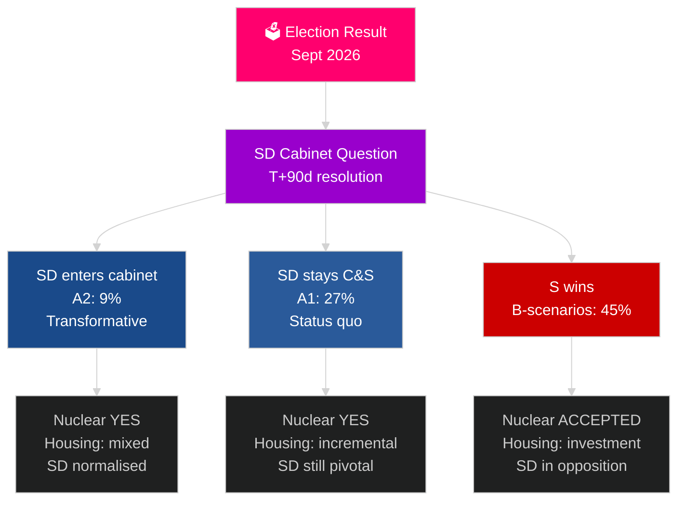

# Sweden's Next Election Cycle (2026–2030): The Transformation Mandate

**Author**: James Pether Sörling
**Date**: 2026-05-04
**Classification**: PUBLIC — GDPR Art 9(2)(e)(g)
**Analysis depth**: comprehensive (2.5× Tier-C election-cycle)
**Confidence**: MEDIUM [Admiralty C3]

---

## BLUF

The 2026–2030 Swedish mandate will be shaped by four structural megaforces that transcend electoral outcomes: NATO 2.4% GDP defence obligation (binding), nuclear construction decision (required by energy math), housing emergency (compounding deficit), and demographic ageing (eldercare demand +18% by 2030). The defining political question is not which government forms, but whether it resolves the SD cabinet question — Sweden's most consequential constitutional question of the decade. IMF WEO Apr-2026 projects 2.4% GDP growth for 2026 with sustained recovery through 2030.

## Decisions This Brief Supports

1. **Formation scenario planning**: A1/A2 (Tidö) vs B1/B2/B3 (S-bloc) — what policies, actors, and risks follow?
2. **Nuclear decision preparation**: Site selection, investment decision, timeline — what must happen when?
3. **Housing policy design**: State investment vs market activation — which instruments and what scale?
4. **SD cabinet inclusion assessment**: Conditions, guardrails, risks, and democratic resilience implications.
5. **2030 electoral positioning**: What mandate performance metrics will define the 2030 election?

## 60-Second Intelligence Read

- **Formation (T+0 to T+90d)**: SD cabinet question is immediate; formation expected 30–90 days; no coalition is arithmetically stable without SD support.
- **Nuclear (T+365–T+730d)**: Construction decision window 2027–2028; cross-party support exists; capital and site selection are the blockers.
- **Housing**: Deficit 150,000+ units; all scenarios produce policy action; state investment (B-scenarios) vs market (A-scenarios).
- **Welfare**: Eldercare demand rises 18% by 2030 regardless; municipal finance reform needed in every scenario.
- **Economy**: IMF projects 2.0–2.5% GDP growth 2027–2030; Sweden outperforms EU average; defence investment multiplier adds ~0.5% GDP.

## Top Forward Trigger

**SD cabinet question resolution (T+90d)**: Whether SD enters cabinet (A2) or remains C&S (A1) will define the mandate's character, international reception, and democratic precedent for the entire 2026–2030 period.

## Next Mandate Preview Matrix

| Domain | A1 (Tidö+) | A2 (SD cabinet) | B1 (S minority) | B2 (S grand) |
|---|---|---|---|---|
| Housing | Incremental | Mixed | State investment | Both mechanisms |
| Nuclear | Construction | Construction | Accept baseline | Supermajority |
| Defence | 2.4% | 2.4% | 2.4% | 2.4% |
| Migration | Strict | Very strict | Moderate | Pragmatic |
| SD position | C&S | Cabinet | Opposition | Opposition |

## Confidence Label

MEDIUM confidence (election outcome uncertain; 4-year projection inherently speculative); HIGH on structural constraints (defence, nuclear logic, housing deficit).

