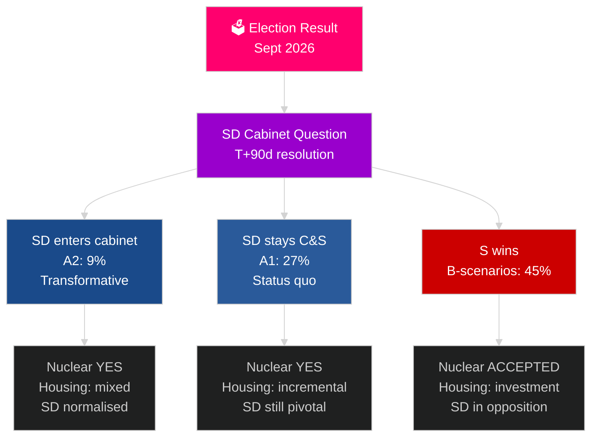

&#x200F;# دورة الانتخابات السويدية القادمة (2026–2030): تفويض التحول

**المؤلف**: James Pether Sörling
**التاريخ**: 2026-05-04
**التصنيف**: عام — المادة 9(2)(ه)(و) من اللائحة العامة لحماية البيانات
**عمق التحليل**: شامل (2.5× Tier-C دورة انتخابية)
**مستوى الثقة**: متوسط [Admiralty C3]

---

## الخلاصة التنفيذية

ستتشكل الفترة الانتدابية 2026–2030 بفعل أربع قوى هيكلية عملاقة تتجاوز نتائج الانتخابات: التزام الناتو الملزم بالإنفاق الدفاعي بنسبة 2.4% من الناتج المحلي الإجمالي، وقرار بناء محطات الطاقة النووية (ضرورة فرضتها حسابات الطاقة)، وأزمة الإسكان (عجز متراكم)، والشيخوخة الديموغرافية (ارتفاع الطلب على رعاية المسنين بنسبة 18% بحلول عام 2030). السؤال السياسي الحاسم ليس أي حكومة ستتشكل، بل هل ستحل مسألة انضمام SD إلى الحكومة — وهي أهم سؤال دستوري في السويد خلال هذا العقد. يتوقع صندوق النقد الدولي (آفاق الاقتصاد العالمي أبريل 2026) نموًا اقتصاديًا بنسبة 2.4% عام 2026 مع تعافٍ مستدام حتى 2030.

## القرارات التي يدعمها هذا التقرير

1. **التخطيط لسيناريوهات تشكيل الحكومة**: A1/A2 (Tidö) مقابل B1/B2/B3 (تكتل S) — ما السياسات والفاعلون والمخاطر المترتبة؟
2. **التحضير لقرار الطاقة النووية**: اختيار الموقع، قرار الاستثمار، الجدول الزمني — ماذا يجب أن يحدث ومتى؟
3. **تصميم سياسة الإسكان**: الاستثمار الحكومي مقابل تنشيط السوق — ما الأدوات وبأي حجم؟
4. **تقييم انضمام SD إلى الحكومة**: الشروط والضمانات والمخاطر وتداعيات الصمود الديمقراطي.
5. **التموضع الانتخابي لعام 2030**: ما مؤشرات أداء الانتداب التي ستحدد انتخابات 2030؟

## قراءة استخباراتية في 60 ثانية

- **تشكيل الحكومة (T+0 إلى T+90 يومًا)**: مسألة حكومة SD فورية؛ يُتوقع التشكيل خلال 30–90 يومًا؛ لا ائتلاف مستقر رياضيًا دون دعم SD.
- **الطاقة النووية (T+365–T+730 يومًا)**: نافذة القرار 2027–2028؛ دعم حزبي واسع موجود؛ رأس المال واختيار الموقع هما العائقان.
- **الإسكان**: عجز يتجاوز 150,000 وحدة؛ جميع السيناريوهات تستلزم تدخلًا سياسيًا؛ استثمار حكومي (سيناريوهات B) مقابل سوق (سيناريوهات A).
- **الرعاية الاجتماعية**: الطلب على رعاية المسنين يرتفع 18% بحلول 2030 بغض النظر عن النتيجة؛ إصلاح مالي بلدي مطلوب في كل سيناريو.
- **الاقتصاد**: يتوقع صندوق النقد الدولي نموًا بين 2.0–2.5% في الناتج المحلي الإجمالي 2027–2030؛ تتفوق السويد على متوسط الاتحاد الأوروبي؛ مضاعف استثمارات الدفاع يضيف ~0.5% من الناتج المحلي الإجمالي.

## المحفز الأبرز على المدى المنظور

**حل مسألة الحكومة SD (T+90 يومًا)**: ما إذا كان SD سيدخل الحكومة (A2) أم يبقى حزبًا داعمًا (A1) سيحدد طابع فترة الانتداب وتلقيها الدولي والسابقة الديمقراطية طوال الفترة 2026–2030.

## مصفوفة المعاينة للانتداب القادم

| المجال | A1 (Tidö+) | A2 (SD في الحكومة) | B1 (S أقلية) | B2 (S ائتلاف كبير) |
|---|---|---|---|---|
| الإسكان | تدريجي | مختلط | استثمار حكومي | كلا الآليتين |
| الطاقة النووية | بناء | بناء | قبول خط الأساس | أغلبية موسعة |
| الدفاع | 2.4% | 2.4% | 2.4% | 2.4% |
| الهجرة | صارمة | صارمة جدًا | معتدلة | براغماتية |
| موقع SD | حزب داعم | حكومة | معارضة | معارضة |

## علامة الثقة

ثقة متوسطة (نتيجة الانتخابات غير مؤكدة؛ التوقعات لأربع سنوات ذات طبيعة تكهنية بطبيعتها)؛ ثقة عالية في القيود الهيكلية (الدفاع، منطق الطاقة النووية، عجز الإسكان).

<!-- source-sha: 5d8da0c335b7b753c6fbbb72731875bcfd25910e -->
