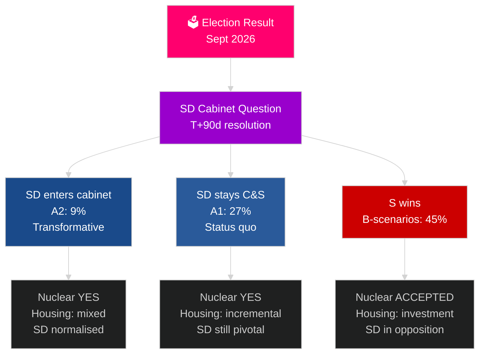

# Sveriges næste valgcyklus (2026–2030): Transformationsmandatet

**Forfatter**: James Pether Sörling
**Dato**: 2026-05-04
**Klassificering**: OFFENTLIG — GDPR Art 9(2)(e)(g)
**Analyseniveau**: omfattende (2,5× Tier-C valgcyklus)
**Konfidens**: MIDDEL [Admiralty C3]

---

## KONKLUSION

Mandatperioden 2026–2030 vil blive formet af fire strukturelle megakræfter, der overskrider valgresultater: NATO's bindende forsvarsforpligtelse på 2,4 % af BNP, beslutning om kernekraft (krævet af energimæssige hensyn), boligkrise (eskalerende underskud) og demografisk aldring (efterspørgsel på ældrepleje +18 % inden 2030). Det afgørende politiske spørgsmål er ikke hvilken regering der dannes, men om den løser SD's kabinetsspørgsmål — årtiers vigtigste konstitutionelle spørgsmål i Sverige. IMF WEO apr-2026 forudsiger 2,4 % BNP-vækst for 2026 med vedvarende genopretning frem til 2030.

## Beslutninger dette underlag understøtter

1. **Koalitionsscenarieplanlægning**: A1/A2 (Tidö) mod B1/B2/B3 (S-blokken) — hvilke politikker, aktører og risici følger?
2. **Forberedelse af kernekraftbeslutning**: Lokaliseringsvalg, investeringsbeslutning, tidslinje — hvad skal ske hvornår?
3. **Boligpolitisk udformning**: Statslige investeringer mod markedsaktivering — hvilke instrumenter og i hvilken skala?
4. **Vurdering af SD i kabinettet**: Betingelser, sikkerhedsforanstaltninger, risici og implikationer for demokratisk resiliens.
5. **Valpositionering frem mod 2030**: Hvilke mandatpræstationsmål vil definere valget i 2030?

## 60-sekunders efterretningslæsning

- **Regeringsdannelse (T+0 til T+90d)**: SD's kabinetsspørgsmål er umiddelbart; dannelse forventes inden 30–90 dage; ingen koalition er aritmetisk stabil uden SD's støtte.
- **Kernekraft (T+365–T+730d)**: Beslutningsvindue 2027–2028; bred partilig opbakning eksisterer; kapital og lokalisering er blokaderne.
- **Boliger**: Underskud på 150.000+ enheder; alle scenarier medfører politisk handling; statslige investeringer (B-scenarier) mod marked (A-scenarier).
- **Velfærd**: Efterspørgsel på ældrepleje stiger 18 % inden 2030 uanset udfald; kommunal finansreform er nødvendig i hvert scenarie.
- **Økonomi**: IMF forudsiger 2,0–2,5 % BNP-vækst 2027–2030; Sverige overgår EU-gennemsnittet; forsvarsinvesteringernes multiplikatoreffekt tilføjer ~0,5 % BNP.

## Vigtigste fremadrettede udløser

**SD's kabinetsspørgsmåls løsning (T+90d)**: Om SD indtræder i kabinettet (A2) eller forbliver som støtteparti (A1) vil definere mandatperiodens karakter, internationale modtagelse og demokratiske præcedens for hele perioden 2026–2030.

## Næste mandatperiodes forhåndsmatrix

| Domæne | A1 (Tidö+) | A2 (SD i kabinet) | B1 (S-mindretal) | B2 (S-stor koalition) |
|---|---|---|---|---|
| Boliger | Inkrementel | Blandet | Statslig investering | Begge mekanismer |
| Kernekraft | Bygning | Bygning | Acceptér baseline | Supermajoritet |
| Forsvar | 2,4 % | 2,4 % | 2,4 % | 2,4 % |
| Migration | Streng | Meget streng | Moderat | Pragmatisk |
| SD's position | Støtteparti | Kabinet | Opposition | Opposition |

## Konfidensmarkering

MIDDEL konfidens (valgresultat usikkert; 4-årig projektion er i sagens natur spekulativ); HØJ konfidens for strukturelle begrænsninger (forsvar, kernekraftlogik, boligunderskud).

<!-- source-sha: 5d8da0c335b7b753c6fbbb72731875bcfd25910e -->
