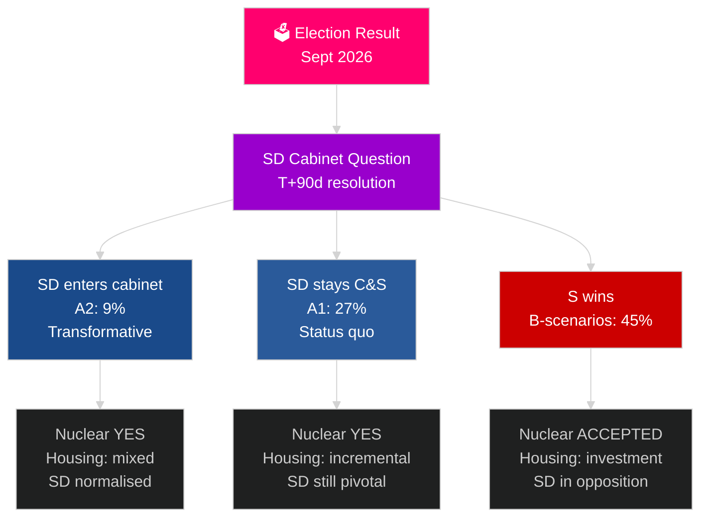

# Schwedens nächster Wahlzyklus (2026–2030): Das Transformationsmandat

**Autor**: James Pether Sörling
**Datum**: 2026-05-04
**Einstufung**: ÖFFENTLICH — DSGVO Art. 9(2)(e)(g)
**Analysetiefe**: umfassend (2,5× Tier-C Wahlzyklus)
**Konfidenz**: MITTEL [Admiralty C3]

---

## KERNAUSSAGE

Die Mandatsperiode 2026–2030 wird von vier strukturellen Megakräften geprägt, die Wahlergebnisse übersteigen: NATOs verbindliche Verteidigungspflicht von 2,4 % des BIP, Entscheidung zum Kernkraftbau (durch Energiemathematik erforderlich), Wohnungskrise (zunehmendes Defizit) und demografische Alterung (Nachfrage nach Altenpflege +18 % bis 2030). Die entscheidende politische Frage ist nicht, welche Regierung gebildet wird, sondern ob sie die SD-Kabinettsfrage löst — Schwedens folgenreichste Verfassungsfrage des Jahrzehnts. Der IWF WEO Apr-2026 prognostiziert 2,4 % BIP-Wachstum für 2026 mit anhaltender Erholung bis 2030.

## Von diesem Bericht unterstützte Entscheidungen

1. **Koalitionsszenarioplanung**: A1/A2 (Tidö) vs. B1/B2/B3 (S-Block) — welche Politiken, Akteure und Risiken folgen?
2. **Vorbereitung der Kernkraftentscheidung**: Standortwahl, Investitionsentscheidung, Zeitplan — was muss wann geschehen?
3. **Wohnungspolitische Gestaltung**: Staatliche Investitionen vs. Marktaktivierung — welche Instrumente und in welchem Umfang?
4. **Bewertung der SD-Kabinettsbeteiligung**: Bedingungen, Schutzmaßnahmen, Risiken und Auswirkungen auf die demokratische Resilienz.
5. **Wahlpositionierung für 2030**: Welche Mandatsleistungskennzahlen werden die Wahl 2030 definieren?

## 60-Sekunden-Nachrichtenüberblick

- **Regierungsbildung (T+0 bis T+90d)**: SD-Kabinettsfrage ist unmittelbar; Bildung wird innerhalb von 30–90 Tagen erwartet; keine Koalition ist ohne SD-Unterstützung arithmetisch stabil.
- **Kernkraft (T+365–T+730d)**: Entscheidungsfenster 2027–2028; breite Parteiunterstützung vorhanden; Kapital und Standortwahl sind die Blocker.
- **Wohnungen**: Defizit von 150.000+ Einheiten; alle Szenarien erfordern politische Maßnahmen; staatliche Investitionen (B-Szenarien) vs. Markt (A-Szenarien).
- **Wohlfahrt**: Nachfrage nach Altenpflege steigt bis 2030 um 18 % unabhängig vom Ausgang; kommunale Finanzreform in jedem Szenario notwendig.
- **Wirtschaft**: IWF prognostiziert 2,0–2,5 % BIP-Wachstum 2027–2030; Schweden übertrifft den EU-Durchschnitt; Multiplikatoreffekt der Verteidigungsinvestitionen fügt ~0,5 % BIP hinzu.

## Wichtigster vorausschauender Auslöser

**Lösung der SD-Kabinettsfrage (T+90d)**: Ob SD in das Kabinett eintritt (A2) oder als Stützpartei bleibt (A1), wird den Charakter der Mandatsperiode, die internationale Rezeption und den demokratischen Präzedenzfall für den gesamten Zeitraum 2026–2030 bestimmen.

## Vorschaumatrix für das nächste Mandat

| Bereich | A1 (Tidö+) | A2 (SD im Kabinett) | B1 (S-Minderheit) | B2 (S große Koalition) |
|---|---|---|---|---|
| Wohnungen | Inkrementell | Gemischt | Staatliche Investition | Beide Mechanismen |
| Kernkraft | Bau | Bau | Basislinie akzeptieren | Supermehrheit |
| Verteidigung | 2,4 % | 2,4 % | 2,4 % | 2,4 % |
| Migration | Streng | Sehr streng | Moderat | Pragmatisch |
| SD-Position | Stützpartei | Kabinett | Opposition | Opposition |

## Konfidenzmarkierung

MITTLERE Konfidenz (Wahlergebnis ungewiss; 4-Jahres-Projektion ist inhärent spekulativ); HOHE Konfidenz für strukturelle Einschränkungen (Verteidigung, Kernkraftlogik, Wohnungsdefizit).

<!-- source-sha: 5d8da0c335b7b753c6fbbb72731875bcfd25910e -->
