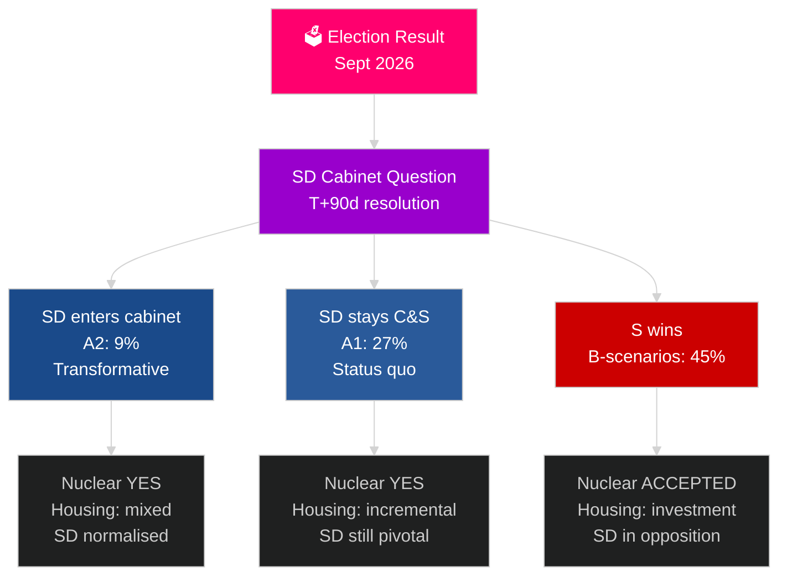

# El próximo ciclo electoral sueco (2026–2030): El Mandato de Transformación

**Autor**: James Pether Sörling
**Fecha**: 2026-05-04
**Clasificación**: PÚBLICO — RGPD Art. 9(2)(e)(g)
**Profundidad de análisis**: integral (2,5× Tier-C ciclo electoral)
**Confianza**: MEDIA [Admiralty C3]

---

## CONCLUSIÓN CLAVE

El mandato 2026–2030 estará determinado por cuatro megafuerzas estructurales que trascienden los resultados electorales: la obligación de defensa vinculante de la OTAN del 2,4 % del PIB, la decisión sobre energía nuclear (requerida por la lógica energética), la crisis de vivienda (déficit creciente) y el envejecimiento demográfico (demanda de atención a mayores +18 % para 2030). La pregunta política determinante no es qué gobierno se forma, sino si resuelve la cuestión del Gabinete SD — la pregunta constitucional más consecuente de la década en Suecia. El FMI WEO abr-2026 proyecta un crecimiento del PIB del 2,4 % para 2026 con recuperación sostenida hasta 2030.

## Decisiones que este informe apoya

1. **Planificación de escenarios de formación**: A1/A2 (Tidö) frente a B1/B2/B3 (bloque S) — ¿qué políticas, actores y riesgos se derivan?
2. **Preparación de la decisión nuclear**: Selección del emplazamiento, decisión de inversión, cronograma — ¿qué debe ocurrir cuándo?
3. **Diseño de política de vivienda**: Inversión estatal frente a activación del mercado — ¿qué instrumentos y a qué escala?
4. **Evaluación de la inclusión del SD en el Gabinete**: Condiciones, salvaguardas, riesgos e implicaciones para la resiliencia democrática.
5. **Posicionamiento electoral para 2030**: ¿Qué métricas de desempeño del mandato definirán las elecciones de 2030?

## Lectura de inteligencia de 60 segundos

- **Formación de gobierno (T+0 a T+90d)**: La cuestión del Gabinete SD es inmediata; se espera formación en 30–90 días; ninguna coalición es aritméticamente estable sin el apoyo del SD.
- **Nuclear (T+365–T+730d)**: Ventana de decisión 2027–2028; existe amplio apoyo multipartidista; el capital y la selección del emplazamiento son los bloqueadores.
- **Vivienda**: Déficit de 150.000+ unidades; todos los escenarios generan acción política; inversión estatal (escenarios B) frente a mercado (escenarios A).
- **Bienestar**: La demanda de atención a mayores crece un 18 % para 2030 independientemente del resultado; reforma de las finanzas municipales necesaria en cada escenario.
- **Economía**: El FMI proyecta un crecimiento del PIB del 2,0–2,5 % de 2027 a 2030; Suecia supera la media de la UE; el efecto multiplicador de las inversiones en defensa añade ~0,5 % del PIB.

## Principal desencadenante prospectivo

**Resolución de la cuestión del Gabinete SD (T+90d)**: Si el SD entra en el Gabinete (A2) o permanece como partido de apoyo (A1) definirá el carácter del mandato, la recepción internacional y el precedente democrático para todo el período 2026–2030.

## Matriz de previsión del próximo mandato

| Dominio | A1 (Tidö+) | A2 (SD en Gabinete) | B1 (S minoría) | B2 (S gran coalición) |
|---|---|---|---|---|
| Vivienda | Incremental | Mixta | Inversión estatal | Ambos mecanismos |
| Nuclear | Construcción | Construcción | Aceptar línea base | Supermayoría |
| Defensa | 2,4 % | 2,4 % | 2,4 % | 2,4 % |
| Migración | Estricta | Muy estricta | Moderada | Pragmática |
| Posición SD | Partido de apoyo | Gabinete | Oposición | Oposición |

## Etiqueta de confianza

Confianza MEDIA (resultado electoral incierto; proyección a 4 años inherentemente especulativa); ALTA para restricciones estructurales (defensa, lógica nuclear, déficit de vivienda).

<!-- source-sha: 5d8da0c335b7b753c6fbbb72731875bcfd25910e -->
